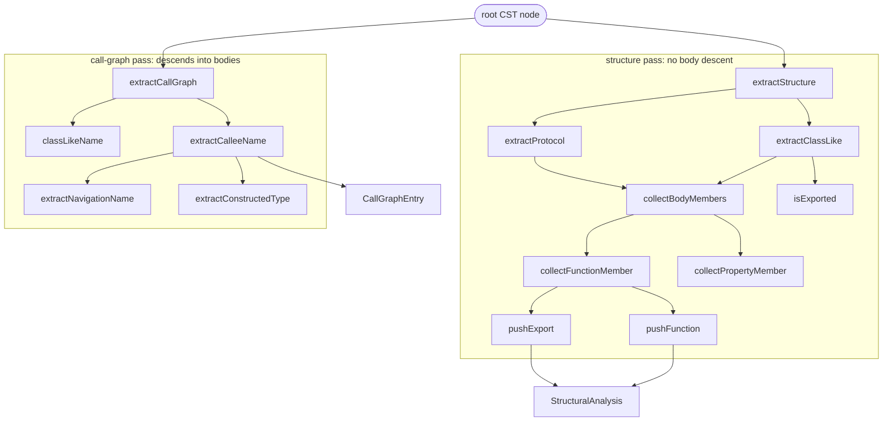

# Swift extractor — tree-sitter structure & call-graph extraction

<!-- connect:up:begin -->
> **Cross-repo concept:** part of [multi-language-extraction](../../../concepts/multi-language-extraction.md), [symbol-graph](../../../concepts/symbol-graph.md) across this wiki's repos.
<!-- connect:up:end -->
## Overview
`SwiftExtractor` is Understand-Anything's concrete `LanguageExtractor` for Swift: it turns one file's
web-tree-sitter concrete syntax tree into two products the rest of the tool consumes — a
[`StructuralAnalysis`](../catalog/understand-anything-plugin/packages/core/src/types.ts.md#StructuralAnalysis)
(the file's functions, classes/structs/enums/actors/extensions, imports, exports) via
[`extractStructure`](../catalog/understand-anything-plugin/packages/core/src/plugins/extractors/swift-extractor.ts.md#SwiftExtractor.extractStructure),
and a name-level call graph — a list of
[`CallGraphEntry`](../catalog/understand-anything-plugin/packages/core/src/types.ts.md#CallGraphEntry)
`{caller, callee, lineNumber}` — via
[`extractCallGraph`](../catalog/understand-anything-plugin/packages/core/src/plugins/extractors/swift-extractor.ts.md#SwiftExtractor.extractCallGraph).
The single key idea, and the thing that most distinguishes this substrate from wikify-repo/graphify, is
that **all of this is purely syntactic**: there is no compiler, no type checker, no cross-file symbol
resolution. Everything is a heuristic walk over CST node types (`class_declaration`, `call_expression`,
`navigation_expression`, …), so a "callee" is just a *string name* recovered from the call site, not a
resolved definition. That trade buys speed and zero build setup, at the cost of the precision a SCIP index
would give.

## Diagram

## Design rationale (why it's built this way)
The two public methods deliberately walk the *same* tree with **opposite descent policies**, and that is
the most important design decision to internalise. The structure pass
([`extractStructure`](../catalog/understand-anything-plugin/packages/core/src/plugins/extractors/swift-extractor.ts.md#SwiftExtractor.extractStructure))
early-`return`s the moment it reaches a body node (`function_body`, `computed_property`, `class_body`,
`protocol_body`, `enum_class_body`), because for "what declarations live here" you never want to recurse
into executable bodies — nested types are instead re-fed to the walker explicitly through the `processNode`
callback threaded into
[`extractClassLike`](../catalog/understand-anything-plugin/packages/core/src/plugins/extractors/swift-extractor.ts.md#SwiftExtractor.extractClassLike).
The call-graph pass does the reverse: it *must* descend into bodies, because call sites live there.

Swift has no `export` keyword, so exportedness is inferred by *absence*:
[`isExported`](../catalog/understand-anything-plugin/packages/core/src/plugins/extractors/swift-extractor.ts.md#isExported)
is `parentExported && !isPrivateOrFileprivate(node)`, with the recursion seeded `parentExported = true` at
the file root. A declaration is "exported" unless it (or an ancestor) is `private`/`fileprivate` — a
pragmatic reading of Swift access control that treats `internal`/`public`/`open` alike.

> [!inferred]
> Modelling every Swift type declaration (class, struct, enum, actor, extension) as one tree-sitter
> `class_declaration` node type — disambiguated only by
> [`declarationKind`](../catalog/understand-anything-plugin/packages/core/src/plugins/extractors/swift-extractor.ts.md#declarationKind)
> against [`TYPE_DECLARATION_KINDS`](../catalog/understand-anything-plugin/packages/core/src/plugins/extractors/swift-extractor.ts.md#TYPE_DECLARATION_KINDS) —
> appears to reflect tree-sitter-swift's own grammar rather than a choice by this author; the code adapts to
> that grammar rather than imposing its own taxonomy.

## Entry points
- [`extractStructure`](../catalog/understand-anything-plugin/packages/core/src/plugins/extractors/swift-extractor.ts.md#SwiftExtractor.extractStructure) —
  the structure half of the `LanguageExtractor` contract ("Extract functions, classes, imports, exports from
  the root AST node"). Reached once per Swift file with that file's parsed root node; returns the file's
  [`StructuralAnalysis`](../catalog/understand-anything-plugin/packages/core/src/types.ts.md#StructuralAnalysis).
  It owns the four accumulator arrays and the recursive `processNode` dispatcher that routes each node type
  to the right collector.
- [`extractCallGraph`](../catalog/understand-anything-plugin/packages/core/src/plugins/extractors/swift-extractor.ts.md#SwiftExtractor.extractCallGraph) —
  the call-graph half of the same contract ("Extract caller→callee relationships from the root AST node"),
  the interface method being
  [`LanguageExtractor.extractCallGraph`](../catalog/understand-anything-plugin/packages/core/src/plugins/extractors/types.ts.md#LanguageExtractor.extractCallGraph).
  Reached per file to produce the edge list; the test helper
  [`withCalls`](../catalog/understand-anything-plugin/packages/core/src/plugins/extractors/__tests__/swift-extractor.test.ts.md#withCalls)
  drives it over parsed snippets, confirming this is a standalone, pure entry point.

## Mechanism (step-by-step)
1. **Structure walk with type-directed dispatch.**
   [`extractStructure`](../catalog/understand-anything-plugin/packages/core/src/plugins/extractors/swift-extractor.ts.md#SwiftExtractor.extractStructure)
   defines a closure `processNode(node, parentExported)` that `switch`es on `node.type`: imports, top-level
   functions, `class_declaration` → [`extractClassLike`](../catalog/understand-anything-plugin/packages/core/src/plugins/extractors/swift-extractor.ts.md#SwiftExtractor.extractClassLike),
   `protocol_declaration` → [`extractProtocol`](../catalog/understand-anything-plugin/packages/core/src/plugins/extractors/swift-extractor.ts.md#SwiftExtractor.extractProtocol).
   For any other node it recurses into every child; for body nodes it returns immediately, so the structure
   view stops at declaration boundaries and never mistakes local variables for members.
2. **Type declarations resolve their own name and export status.**
   [`extractClassLike`](../catalog/understand-anything-plugin/packages/core/src/plugins/extractors/swift-extractor.ts.md#SwiftExtractor.extractClassLike)
   names the node via [`classLikeName`](../catalog/understand-anything-plugin/packages/core/src/plugins/extractors/swift-extractor.ts.md#SwiftExtractor.classLikeName)
   (which prefixes `extension ` for extensions and otherwise delegates to
   [`extractTypeName`](../catalog/understand-anything-plugin/packages/core/src/plugins/extractors/swift-extractor.ts.md#extractTypeName)),
   computes exportedness through [`isExported`](../catalog/understand-anything-plugin/packages/core/src/plugins/extractors/swift-extractor.ts.md#isExported),
   then records a `{name, lineRange, methods, properties}` entry into
   [`classes`](../catalog/understand-anything-plugin/packages/core/src/types.ts.md#StructuralAnalysis.classes).
   Crucially it does *not* emit an export for extensions (`kind !== "extension"`), since an extension has no
   fresh identity to export. [`extractProtocol`](../catalog/understand-anything-plugin/packages/core/src/plugins/extractors/swift-extractor.ts.md#SwiftExtractor.extractProtocol)
   mirrors this but always exports when visible.
3. **Members are gathered by a wrapper-transparent body scan.**
   [`collectBodyMembers`](../catalog/understand-anything-plugin/packages/core/src/plugins/extractors/swift-extractor.ts.md#SwiftExtractor.collectBodyMembers)
   loops over `body`'s named children and `switch`es on member type — routing functions to
   [`collectFunctionMember`](../catalog/understand-anything-plugin/packages/core/src/plugins/extractors/swift-extractor.ts.md#SwiftExtractor.collectFunctionMember),
   initializers/deinitializers/subscripts to
   [`collectInitMember`](../catalog/understand-anything-plugin/packages/core/src/plugins/extractors/swift-extractor.ts.md#SwiftExtractor.collectInitMember)/[`collectDeinitMember`](../catalog/understand-anything-plugin/packages/core/src/plugins/extractors/swift-extractor.ts.md#SwiftExtractor.collectDeinitMember)/[`collectSubscriptMember`](../catalog/understand-anything-plugin/packages/core/src/plugins/extractors/swift-extractor.ts.md#SwiftExtractor.collectSubscriptMember),
   and properties/associated types to
   [`collectPropertyMember`](../catalog/understand-anything-plugin/packages/core/src/plugins/extractors/swift-extractor.ts.md#SwiftExtractor.collectPropertyMember)/[`collectAssociatedType`](../catalog/understand-anything-plugin/packages/core/src/plugins/extractors/swift-extractor.ts.md#SwiftExtractor.collectAssociatedType).
   When a child's type is in [`WRAPPER_NODES`](../catalog/understand-anything-plugin/packages/core/src/plugins/extractors/swift-extractor.ts.md#WRAPPER_NODES)
   (`ERROR`, `if_config_declaration`) it recurses *through* it — so `#if` conditional-compilation blocks and
   partial parse errors don't hide the members inside them. Nested type nodes are collected into a `nested`
   list and later re-processed via the `processNode` callback, keeping nested types visible at file scope.
4. **Every member becomes a flat function/property record.**
   [`collectFunctionMember`](../catalog/understand-anything-plugin/packages/core/src/plugins/extractors/swift-extractor.ts.md#SwiftExtractor.collectFunctionMember)
   pushes the bare name into the class's [`methods`](../catalog/understand-anything-plugin/packages/core/src/types.ts.md#StructuralAnalysis.classes.Array.typeLiteral1.methods)
   *and* a full record into the flat [`functions`](../catalog/understand-anything-plugin/packages/core/src/types.ts.md#StructuralAnalysis.functions)
   list through [`pushFunction`](../catalog/understand-anything-plugin/packages/core/src/plugins/extractors/swift-extractor.ts.md#pushFunction),
   which fills [`params`](../catalog/understand-anything-plugin/packages/core/src/types.ts.md#StructuralAnalysis.functions.Array.typeLiteral0.params)
   and [`returnType`](../catalog/understand-anything-plugin/packages/core/src/types.ts.md#StructuralAnalysis.functions.Array.typeLiteral0.returnType)
   via [`extractParams`](../catalog/understand-anything-plugin/packages/core/src/plugins/extractors/swift-extractor.ts.md#extractParams)
   and [`extractReturnType`](../catalog/understand-anything-plugin/packages/core/src/plugins/extractors/swift-extractor.ts.md#extractReturnType).
   Init/deinit are synthesised names (`Type.init`, `Type.deinit`) built with
   [`containerBaseName`](../catalog/understand-anything-plugin/packages/core/src/plugins/extractors/swift-extractor.ts.md#containerBaseName)
   (which strips the `extension ` prefix so members of an extension attribute to the underlying type). If the
   member is visible, [`pushExport`](../catalog/understand-anything-plugin/packages/core/src/plugins/extractors/swift-extractor.ts.md#pushExport)
   records it into [`exports`](../catalog/understand-anything-plugin/packages/core/src/types.ts.md#StructuralAnalysis.exports).
5. **Name recovery leans entirely on syntactic heuristics.** Because there is no symbol table, names come
   from small CST helpers: [`extractTypeName`](../catalog/understand-anything-plugin/packages/core/src/plugins/extractors/swift-extractor.ts.md#extractTypeName)
   reads the `name` field, [`extractPropertyNames`](../catalog/understand-anything-plugin/packages/core/src/plugins/extractors/swift-extractor.ts.md#extractPropertyNames)
   walks `pattern` descendants (handling tuple/destructured bindings) via
   [`extractPatternName`](../catalog/understand-anything-plugin/packages/core/src/plugins/extractors/swift-extractor.ts.md#extractPatternName),
   and enum cases come from [`extractEnumCaseNames`](../catalog/understand-anything-plugin/packages/core/src/plugins/extractors/swift-extractor.ts.md#extractEnumCaseNames).
   These sit on generic CST utilities —
   [`findChild`](../catalog/understand-anything-plugin/packages/core/src/plugins/extractors/base-extractor.ts.md#findChild),
   [`findFirstIdentifier`](../catalog/understand-anything-plugin/packages/core/src/plugins/extractors/swift-extractor.ts.md#findFirstIdentifier),
   [`namedChildren`](../catalog/understand-anything-plugin/packages/core/src/plugins/extractors/swift-extractor.ts.md#namedChildren),
   [`childrenForFieldName`](../catalog/understand-anything-plugin/packages/core/src/plugins/extractors/swift-extractor.ts.md#childrenForFieldName),
   [`collectDescendants`](../catalog/understand-anything-plugin/packages/core/src/plugins/extractors/swift-extractor.ts.md#collectDescendants) —
   and [`normalizeWhitespace`](../catalog/understand-anything-plugin/packages/core/src/plugins/extractors/swift-extractor.ts.md#normalizeWhitespace)
   collapses multi-line type text into single-line strings.
6. **The call-graph pass tracks a caller stack, not a resolved scope.**
   [`extractCallGraph`](../catalog/understand-anything-plugin/packages/core/src/plugins/extractors/swift-extractor.ts.md#SwiftExtractor.extractCallGraph)
   runs its own recursive `walk` that pushes the current function/init/deinit/computed-property name onto a
   `callerStack` on entry and pops on exit; each `call_expression`/`constructor_expression` emits a
   [`CallGraphEntry`](../catalog/understand-anything-plugin/packages/core/src/types.ts.md#CallGraphEntry)
   pairing the stack top ([`caller`](../catalog/understand-anything-plugin/packages/core/src/types.ts.md#CallGraphEntry.caller))
   with the recovered [`callee`](../catalog/understand-anything-plugin/packages/core/src/types.ts.md#CallGraphEntry.callee)
   at that [`lineNumber`](../catalog/understand-anything-plugin/packages/core/src/types.ts.md#CallGraphEntry.lineNumber).
   The container name propagates so methods attribute to their type; class names come from
   [`classLikeName`](../catalog/understand-anything-plugin/packages/core/src/plugins/extractors/swift-extractor.ts.md#SwiftExtractor.classLikeName)
   while protocol names come directly from
   [`extractTypeName`](../catalog/understand-anything-plugin/packages/core/src/plugins/extractors/swift-extractor.ts.md#extractTypeName).
7. **Callee resolution is a receiver heuristic — the sharpest contrast with SCIP grounding.**
   [`extractCalleeName`](../catalog/understand-anything-plugin/packages/core/src/plugins/extractors/swift-extractor.ts.md#SwiftExtractor.extractCalleeName)
   picks the first meaningful child before the `call_suffix`: a bare identifier is returned as-is, a
   constructor goes to [`extractConstructedType`](../catalog/understand-anything-plugin/packages/core/src/plugins/extractors/swift-extractor.ts.md#SwiftExtractor.extractConstructedType),
   and a `navigation_expression` (`a.b.c()`) goes to
   [`extractNavigationName`](../catalog/understand-anything-plugin/packages/core/src/plugins/extractors/swift-extractor.ts.md#SwiftExtractor.extractNavigationName).
   That last one encodes the whole "no type resolution" philosophy: it strips optional-chaining `?.`/`!.`,
   then decides by *lexical shape* — `super.*` and Capitalized receivers (assumed to be types) keep the full
   dotted path, `self.x` collapses to `x`, and any other receiver keeps only the trailing method name. It is
   an approximation of what a resolver would compute, made from spelling alone.

## Key data structures
- [`StructuralAnalysis`](../catalog/understand-anything-plugin/packages/core/src/types.ts.md#StructuralAnalysis) —
  the per-file structure record. The load-bearing fields here are
  [`functions`](../catalog/understand-anything-plugin/packages/core/src/types.ts.md#StructuralAnalysis.functions)
  (flat, with [`name`](../catalog/understand-anything-plugin/packages/core/src/types.ts.md#StructuralAnalysis.functions.Array.typeLiteral0.name)/params/returnType/[`lineRange`](../catalog/understand-anything-plugin/packages/core/src/types.ts.md#StructuralAnalysis.functions.Array.typeLiteral0.lineRange)),
  [`classes`](../catalog/understand-anything-plugin/packages/core/src/types.ts.md#StructuralAnalysis.classes)
  (with nested [`methods`](../catalog/understand-anything-plugin/packages/core/src/types.ts.md#StructuralAnalysis.classes.Array.typeLiteral1.methods)/[`properties`](../catalog/understand-anything-plugin/packages/core/src/types.ts.md#StructuralAnalysis.classes.Array.typeLiteral1.properties)
  name lists), and [`exports`](../catalog/understand-anything-plugin/packages/core/src/types.ts.md#StructuralAnalysis.exports).
  Note that a method appears **twice** — once as a name string under its class, once as a full record in the
  flat `functions` list — which is what lets the dashboard show both a per-type outline and a global symbol
  list.
- [`CallGraphEntry`](../catalog/understand-anything-plugin/packages/core/src/types.ts.md#CallGraphEntry) —
  one directed edge as `{caller, callee, lineNumber}`. Both endpoints are **strings**, not references; there
  is no node id, no target file, no resolved symbol. This is the substrate's defining limitation and its
  headline difference from a SCIP-backed symbol graph.
- [`TreeSitterNode`](../catalog/understand-anything-plugin/packages/core/src/plugins/extractors/types.ts.md#TreeSitterNode) —
  an alias for `web-tree-sitter`'s `Node`; the WASM parser is used (per repo notes) because native
  tree-sitter bindings fail on darwin/arm64 + Node 24. All extraction is reads over this CST.

## Dynamics (design intent)
Both entry points are pure, single-pass, single-threaded tree walks with no shared mutable state beyond the
local accumulators — the test helper
[`withCalls`](../catalog/understand-anything-plugin/packages/core/src/plugins/extractors/__tests__/swift-extractor.test.ts.md#withCalls)
constructs a parser, runs
[`extractCallGraph`](../catalog/understand-anything-plugin/packages/core/src/plugins/extractors/swift-extractor.ts.md#SwiftExtractor.extractCallGraph)
once, and disposes the tree, confirming each call is self-contained and per-file. There is no cross-file or
incremental behaviour in this module: reconciliation, if any, happens above the extractor, which always sees
one root node and returns one result.

## Edge cases
- **Extensions never export, but their members do** — the `kind !== "extension"` guard in
  [`extractClassLike`](../catalog/understand-anything-plugin/packages/core/src/plugins/extractors/swift-extractor.ts.md#SwiftExtractor.extractClassLike)
  keeps the extension itself out of [`exports`](../catalog/understand-anything-plugin/packages/core/src/types.ts.md#StructuralAnalysis.exports),
  while [`containerBaseName`](../catalog/understand-anything-plugin/packages/core/src/plugins/extractors/swift-extractor.ts.md#containerBaseName)
  ensures members attribute to the extended type.
- **`ERROR` nodes are treated as transparent wrappers** —
  [`WRAPPER_NODES`](../catalog/understand-anything-plugin/packages/core/src/plugins/extractors/swift-extractor.ts.md#WRAPPER_NODES)
  means partially-unparseable files still yield members from inside the broken region rather than dropping
  them, a deliberate robustness choice for a syntactic tool.
- **Ambiguous receivers are guessed** —
  [`extractNavigationName`](../catalog/understand-anything-plugin/packages/core/src/plugins/extractors/swift-extractor.ts.md#SwiftExtractor.extractNavigationName)'s
  Capitalized-means-type rule will misclassify a Capitalized *variable* as a type (keeping the full path) or a
  lowercase static access as an instance call (keeping only the tail); without type info these cannot be
  distinguished.
- **Underscore params/identifiers are skipped** —
  [`extractParams`](../catalog/understand-anything-plugin/packages/core/src/plugins/extractors/swift-extractor.ts.md#extractParams)
  and [`findLastSimpleIdentifier`](../catalog/understand-anything-plugin/packages/core/src/plugins/extractors/swift-extractor.ts.md#findLastSimpleIdentifier)
  explicitly drop `_`, so Swift's wildcard argument labels don't pollute the extracted names.

## Open questions
- How call-graph edges are stitched **across files** into a whole-project graph (dedup, cross-file callee
  resolution, node identity) is not visible in this module — the extractor emits string pairs only; the
  merging layer is out of this packet's subgraph.
- Whether/how any incremental reconcile applies to extractor output (re-run per changed file vs. whole
  project) is not decidable from this file alone.

## See also
- [base-extractor](./understand-anything-plugin-packages-core-src-plugins-extractors-base-extractor.ts.md) — shared CST utilities (e.g. `findChild`) this extractor builds on.
- [dart-extractor](./understand-anything-plugin-packages-core-src-plugins-extractors-dart-extractor.ts.md) — the sibling `LanguageExtractor` for Dart; the parallel structure shows the multi-language pattern.
- [extractors-types](./understand-anything-plugin-packages-core-src-plugins-extractors-types.ts.md) — the `LanguageExtractor` interface and `TreeSitterNode` alias that define the contract.
