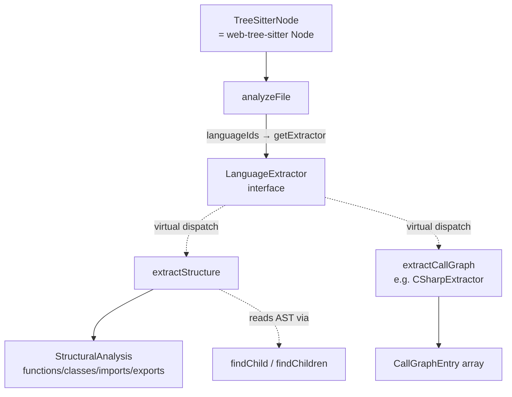

# The LanguageExtractor contract — one AST-to-StructuralAnalysis shape for every language

<!-- connect:up:begin -->
> **Cross-repo concept:** part of [multi-language-extraction](../../../concepts/multi-language-extraction.md) across this wiki's repos.
<!-- connect:up:end -->
## Overview
This ~20-line file is the *pivot* of Understand-Anything's multi-language comprehension. It declares a single interface, [`LanguageExtractor`](../catalog/understand-anything-plugin/packages/core/src/plugins/extractors/types.ts.md#LanguageExtractor), whose docstring states its whole job: "Language-specific extractor that maps a tree-sitter AST to the common `StructuralAnalysis` / `CallGraphEntry` types." The key design idea is a **narrow waist**: on one side, twelve grammars produce twelve wildly different concrete syntax trees; on the other side, the rest of the engine (search, graph-building, the dashboard) only ever sees one flat, language-neutral shape — [`StructuralAnalysis`](../catalog/understand-anything-plugin/packages/core/src/types.ts.md#StructuralAnalysis) (functions/classes/imports/exports) and [`CallGraphEntry`](../catalog/understand-anything-plugin/packages/core/src/types.ts.md#CallGraphEntry) (caller→callee). Every per-language extractor — [`DartExtractor.extractStructure`](../catalog/understand-anything-plugin/packages/core/src/plugins/extractors/dart-extractor.ts.md#DartExtractor.extractStructure), [`RustExtractor.extractStructure`](../catalog/understand-anything-plugin/packages/core/src/plugins/extractors/rust-extractor.ts.md#RustExtractor.extractStructure), [`SwiftExtractor.extractStructure`](../catalog/understand-anything-plugin/packages/core/src/plugins/extractors/swift-extractor.ts.md#SwiftExtractor.extractStructure), and nine more — is an *implementation of this one contract*, invisibly interchangeable behind it.

For the survey: this is Understand-Anything's answer to the same problem wikify-repo solves with SCIP and graphify solves with a graph schema. UA does **not** ground on a language-server / SCIP index; its grounding substrate is the tree-sitter AST reduced to `StructuralAnalysis`, where every entity carries a `lineRange`/`lineNumber` back to source. The comparability axis is exactly this contract: *what does UA extract, and how uniformly across languages*.

## Diagram

## Design rationale (why it's built this way)
The interface is deliberately tiny and the abstraction is deliberately *lossy*. Rather than expose a rich cross-language symbol model (the SCIP route), UA picks four buckets — functions, classes, imports, exports — that map cleanly onto almost every language, and forces each extractor to project its grammar down to them. This is why [`StructuralAnalysis`](../catalog/understand-anything-plugin/packages/core/src/types.ts.md#StructuralAnalysis) uses inline object arrays instead of named symbol types: it is a *report format*, not a symbol table. The cost is that language-specific nuance (Ruby's `singleton_method`, Dart's `mixin`, Rust's `impl`) all collapses into "a function" or "a class"; the benefit is that everything downstream is genuinely language-agnostic and the dashboard never branches on language.

> [!inferred]
> The `StructuralAnalysis` interface carries six *optional* trailing arrays (`sections`, `definitions`, `services`, `endpoints`, `steps`, `resources`) marked "all optional for backward compat". That signals the contract was widened after the fact to let non-code sources (docs, configs, API specs) reuse the same extraction pipeline without breaking the twelve existing code extractors — the four required arrays stay the stable core, and new source types bolt on optional fields.

A second decision worth naming: [`TreeSitterNode`](../catalog/understand-anything-plugin/packages/core/src/plugins/extractors/types.ts.md#TreeSitterNode) is a bare `type` alias to `web-tree-sitter`'s `Node`, not a wrapper. Per the repo's own notes UA uses the WASM `web-tree-sitter` because native bindings fail on darwin/arm64 + Node 24. Aliasing (rather than wrapping) keeps the extractor code writing directly against tree-sitter's cursor API while giving the codebase one import site to swap if the parser ever changes.

## Entry points
- [`analyzeFile`](../catalog/understand-anything-plugin/packages/core/src/plugins/tree-sitter-plugin.ts.md#TreeSitterPlugin.analyzeFile) is where control reaches this contract at runtime. Given a file path and content, the plugin parses to a tree-sitter tree, looks up the extractor registered for the file's language, and calls its `extractStructure(tree.rootNode)`. Crucially, when no grammar or no extractor matches, it returns an empty `{ functions, classes, imports, exports }` — the contract's shape is honored even on failure, so callers never special-case "unsupported language." This is the single funnel through which all twelve implementations of [`extractStructure`](../catalog/understand-anything-plugin/packages/core/src/plugins/extractors/types.ts.md#LanguageExtractor.extractStructure) are invoked.
- `builtinExtractors` (the extractors barrel, `index.ts`) is the *registration* entry point: it instantiates all twelve concrete extractors into one `LanguageExtractor[]`. The plugin iterates this list and indexes each by its [`languageIds`](../catalog/understand-anything-plugin/packages/core/src/plugins/extractors/types.ts.md#LanguageExtractor.languageIds), turning the array into the language→extractor dispatch table. Adding a language is a two-line diff here plus one new file — the contract is the only thing a new extractor must satisfy.

## Mechanism (step-by-step)
1. **Registration builds the dispatch table.** At plugin construction, each extractor in `builtinExtractors` is registered by walking its [`languageIds`](../catalog/understand-anything-plugin/packages/core/src/plugins/extractors/types.ts.md#LanguageExtractor.languageIds) and mapping every id to that instance. Because `languageIds` is a `string[]`, one extractor can claim several ids (the docstring notes they "must match `LanguageConfig.id`") — this is what lets `javascript` fold into the TypeScript extractor (whose `languageIds` is `["typescript", "javascript"]`) without a second class.
2. **A file is routed to exactly one extractor.** When [`analyzeFile`](../catalog/understand-anything-plugin/packages/core/src/plugins/tree-sitter-plugin.ts.md#TreeSitterPlugin.analyzeFile) runs, it derives the language key from the path and resolves it against that table. No parser or no extractor → an empty `StructuralAnalysis`; a match → the tree is parsed once and its `rootNode` handed off. The [`TreeSitterNode`](../catalog/understand-anything-plugin/packages/core/src/plugins/extractors/types.ts.md#TreeSitterNode) alias is the only type crossing this boundary.
3. **Virtual dispatch selects the language's projection.** The call `extractor.extractStructure(rootNode)` is dispatched to the concrete override — [`PythonExtractor.extractStructure`](../catalog/understand-anything-plugin/packages/core/src/plugins/extractors/python-extractor.ts.md#PythonExtractor.extractStructure), [`GoExtractor.extractStructure`](../catalog/understand-anything-plugin/packages/core/src/plugins/extractors/go-extractor.ts.md#GoExtractor.extractStructure), [`JavaExtractor.extractStructure`](../catalog/understand-anything-plugin/packages/core/src/plugins/extractors/java-extractor.ts.md#JavaExtractor.extractStructure), etc. The subgraph records these as `(virtual)` edges from the interface method [`extractStructure`](../catalog/understand-anything-plugin/packages/core/src/plugins/extractors/types.ts.md#LanguageExtractor.extractStructure) — recovered by class-hierarchy analysis, since no static call site names them.
4. **Each override walks the grammar's own node types into the shared buckets.** The bodies are `switch (node.type)` loops over the root's children. [`RubyExtractor.extractStructure`](../catalog/understand-anything-plugin/packages/core/src/plugins/extractors/ruby-extractor.ts.md#RubyExtractor.extractStructure) branches on `method` / `singleton_method` / `class` / `module`; [`DartExtractor.extractStructure`](../catalog/understand-anything-plugin/packages/core/src/plugins/extractors/dart-extractor.ts.md#DartExtractor.extractStructure) on `function_signature` / `class_definition` / `mixin_declaration`. They diverge entirely in *which* grammar nodes they recognize but converge on pushing into the same four arrays, then `return { functions, classes, imports, exports }`.
5. **The AST walk is done through shared, grammar-neutral helpers.** Rather than re-implement child iteration per language, every extractor leans on [`findChild`](../catalog/understand-anything-plugin/packages/core/src/plugins/extractors/base-extractor.ts.md#findChild) and [`findChildren`](../catalog/understand-anything-plugin/packages/core/src/plugins/extractors/base-extractor.ts.md#findChildren), which linear-scan a node's typed children. These operate purely on `TreeSitterNode.type` strings, so the *traversal* is fully generic and only the *type names* passed in are language-specific — the seam that keeps twelve extractors from each reinventing tree walking.
6. **Call-graph extraction is the parallel path with the same contract.** Alongside structure, [`analyzeFile`](../catalog/understand-anything-plugin/packages/core/src/plugins/tree-sitter-plugin.ts.md#TreeSitterPlugin.analyzeFile)'s sibling routes to `extractCallGraph`, dispatched to per-language overrides such as [`SwiftExtractor.extractCallGraph`](../catalog/understand-anything-plugin/packages/core/src/plugins/extractors/swift-extractor.ts.md#SwiftExtractor.extractCallGraph), [`CppExtractor.extractCallGraph`](../catalog/understand-anything-plugin/packages/core/src/plugins/extractors/cpp-extractor.ts.md#CppExtractor.extractCallGraph), and [`CSharpExtractor.extractCallGraph`](../catalog/understand-anything-plugin/packages/core/src/plugins/extractors/csharp-extractor.ts.md#CSharpExtractor.extractCallGraph). Each returns a flat [`CallGraphEntry`](../catalog/understand-anything-plugin/packages/core/src/types.ts.md#CallGraphEntry) list of `{caller, callee, lineNumber}` — the caller→callee edges the downstream symbol/graph layer stitches into a project-wide call graph.

## Key data structures
- [`StructuralAnalysis`](../catalog/understand-anything-plugin/packages/core/src/types.ts.md#StructuralAnalysis) — the language-neutral output. The four load-bearing arrays: [`functions`](../catalog/understand-anything-plugin/packages/core/src/types.ts.md#StructuralAnalysis.functions) (`name`, `lineRange`, `params`, optional `returnType`), [`classes`](../catalog/understand-anything-plugin/packages/core/src/types.ts.md#StructuralAnalysis.classes) (`name`, `lineRange`, `methods`, `properties`), [`imports`](../catalog/understand-anything-plugin/packages/core/src/types.ts.md#StructuralAnalysis.imports) (`source`, `specifiers`, `lineNumber`), and [`exports`](../catalog/understand-anything-plugin/packages/core/src/types.ts.md#StructuralAnalysis.exports) (`name`, `lineNumber`, optional `isDefault`). Note that every entity carries a line locator ([`lineRange`](../catalog/understand-anything-plugin/packages/core/src/types.ts.md#StructuralAnalysis.functions.Array.typeLiteral0.lineRange) / [`lineNumber`](../catalog/understand-anything-plugin/packages/core/src/types.ts.md#StructuralAnalysis.exports.Array.typeLiteral3.lineNumber)) — that is UA's grounding: everything traces back to a source span.
- [`CallGraphEntry`](../catalog/understand-anything-plugin/packages/core/src/types.ts.md#CallGraphEntry) — the second output shape, a single `{caller, callee, lineNumber}` edge, kept intentionally flat so a document is just a list of edges.
- [`TreeSitterNode`](../catalog/understand-anything-plugin/packages/core/src/plugins/extractors/types.ts.md#TreeSitterNode) — the input shape, an alias for `web-tree-sitter`'s `Node`. Everything an extractor reads (child count, `type`, `text`, `startPosition`) is a property of this one type.

## Dynamics (design intent)
The contract is deliberately **stateless and per-file**: `extractStructure`/`extractCallGraph` take a root node and return a value, holding no cross-file state. That makes extraction embarrassingly parallel and, more importantly, makes incremental re-analysis trivial — re-run one file's extractor and you get a fresh `StructuralAnalysis` for just that file, with no shared mutable index to invalidate. Note also that `params`/`methods`/`properties`/`specifiers` are all plain `string[]`, not typed references: the extractors record *names*, deferring any name→symbol resolution to a later graph-building stage rather than resolving inside the contract.

## Edge cases
- **No grammar / unsupported language.** [`analyzeFile`](../catalog/understand-anything-plugin/packages/core/src/plugins/tree-sitter-plugin.ts.md#TreeSitterPlugin.analyzeFile) never throws for an unknown language; it returns an empty-but-valid `StructuralAnalysis`. Consumers can assume the shape unconditionally.
- **Shared grammar keys.** The synthetic key `tsx` is normalized to `typescript` before lookup by a hardcoded special-case in the plugin's `getExtractor` (`langKey === "tsx" ? "typescript"`), so `.tsx` files reuse the TypeScript extractor without a second class. This is a *separate* mechanism from the [`languageIds`](../catalog/understand-anything-plugin/packages/core/src/plugins/extractors/types.ts.md#LanguageExtractor.languageIds) list (which is what folds `javascript` into that same extractor); `tsx` is not a member of any extractor's `languageIds`.
- **Optional structural fields.** The optional non-code arrays on `StructuralAnalysis` mean a consumer must treat everything past the four core arrays as possibly `undefined`; the twelve code extractors populate only the four required ones.

> [!inferred]
> The `extractCallGraph` method is *required* on the interface, yet the broader [`AnalyzerPlugin`](../catalog/understand-anything-plugin/packages/core/src/types.ts.md#StructuralAnalysis) shape (in core `types.ts`) makes call-graph/reference extraction optional. So call-graph support is mandatory *for a tree-sitter language extractor* but optional *for an analyzer plugin* — a language that can't express caller→callee cheaply would still have to return `[]` to satisfy this contract.

## Open questions
- Where does `analyzeFile`'s output get turned into the persisted knowledge graph, and is name→symbol resolution (linking a `callee` string to a defined `function`) done there or dropped? The graph-builder is outside this packet's subgraph.
- Do any extractors populate the optional `sections`/`services`/`endpoints` arrays, or are those reserved for non-tree-sitter (doc/config) sources? Not answerable from the contract alone.

## See also
- [base-extractor](./understand-anything-plugin-packages-core-src-plugins-extractors-base-extractor.ts.md) — the shared `findChild`/`findChildren`/`traverse` helpers every extractor walks the AST with.
- [dart-extractor](./understand-anything-plugin-packages-core-src-plugins-extractors-dart-extractor.ts.md) — a rich concrete implementation of this contract.
- [swift-extractor](./understand-anything-plugin-packages-core-src-plugins-extractors-swift-extractor.ts.md) — another concrete implementation, including `extractCallGraph`.
- [tree-sitter-plugin](./understand-anything-plugin-packages-core-src-plugins-tree-sitter-plugin.ts.md) — the dispatcher that parses, routes by `languageIds`, and invokes the contract.
- [core types](./understand-anything-plugin-packages-core-src-types.ts.md) — home of `StructuralAnalysis` and `CallGraphEntry`, the contract's output shapes.
