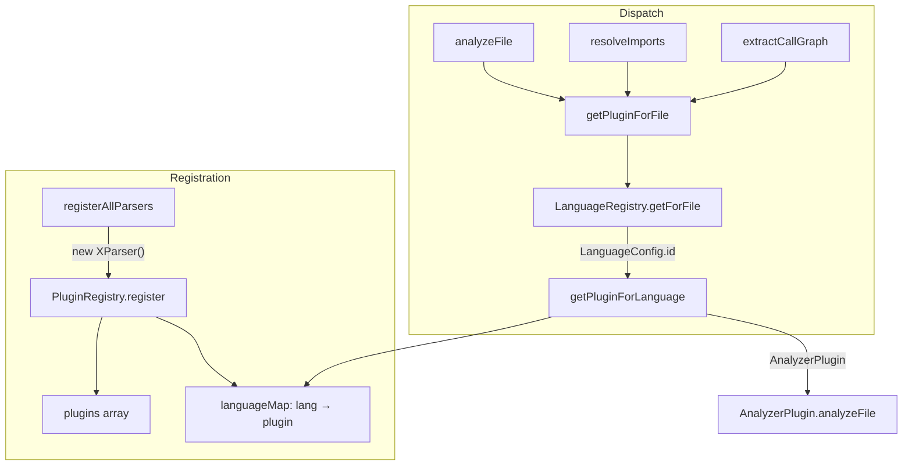

# Plugin registry — language dispatch for multi-language extraction

<!-- connect:up:begin -->
> **Cross-repo concept:** part of [multi-language-extraction](../../../concepts/multi-language-extraction.md) across this wiki's repos.
<!-- connect:up:end -->
## Overview
The `PluginRegistry` is Understand-Anything's dispatch fabric: the single place that turns a
file path into the right analyzer and then runs it. It sits on top of two decoupled ideas —
**detection** (what language is this file?) handled by a separate [`LanguageRegistry`](../catalog/understand-anything-plugin/packages/core/src/languages/language-registry.ts.md#LanguageRegistry),
and **analysis** (what can I extract from it?) handled by pluggable analyzers that all satisfy
the [`AnalyzerPlugin`](../catalog/understand-anything-plugin/packages/core/src/types.ts.md#AnalyzerPlugin)
contract. The registry keeps a `plugins` list and a `language → plugin` map, and exposes uniform
facade methods ([`analyzeFile`](../catalog/understand-anything-plugin/packages/core/src/plugins/registry.ts.md#PluginRegistry.analyzeFile),
[`resolveImports`](../catalog/understand-anything-plugin/packages/core/src/plugins/registry.ts.md#PluginRegistry.resolveImports),
[`extractCallGraph`](../catalog/understand-anything-plugin/packages/core/src/plugins/registry.ts.md#PluginRegistry.extractCallGraph))
so callers never branch on language — the registry routes. This is the seam that makes the tool
*multi-language*: code files route to a tree-sitter analyzer, while a dozen config/doc formats
route to lightweight regex parsers, all behind one interface.

## Diagram

## Design rationale (why it's built this way)
The class docstring states the core decision directly: it *"Maps languages to plugins and provides
a unified interface for analyzing files across languages"* and *"Uses LanguageRegistry for
extension-to-language mapping instead of a hardcoded lookup table"*
([`<constructor>`](../catalog/understand-anything-plugin/packages/core/src/plugins/registry.ts.md#PluginRegistry.-constructor)).
That single sentence encodes the whole shape: detection is data-driven (a config registry you can
extend) and kept *separate* from analysis (plugins you register), so adding a language is two
independent moves — teach `LanguageRegistry` the extension/filename, and register a plugin that
claims that language id.

The separation matters because detection and analysis have different granularities.
[`LanguageRegistry`](../catalog/understand-anything-plugin/packages/core/src/languages/language-registry.ts.md#LanguageRegistry)
keeps three indexes — `byId`, `byExtension`, `byFilename` — and
[`getForFile`](../catalog/understand-anything-plugin/packages/core/src/languages/language-registry.ts.md#LanguageRegistry.getForFile)
deliberately tries the **filename** map before the extension map, because names like `Makefile`
or `docker-compose.yml` are more specific than a bare extension. The plugin layer never sees any of
that; it only ever keys on the resolved language **id**.

> [!inferred]
> The `languageMap` in `PluginRegistry` is last-writer-wins: `register` overwrites the map entry
> for each language a plugin claims, but still appends the plugin to `plugins`. This makes
> registration *order* significant — the final plugin registered for a language is the one dispatch
> selects. The built-in ordering is fixed by `registerAllParsers`.

**Comparability to wikify-repo / graphify.** Where wikify-repo grounds everything in one universal
substrate (SCIP monikers from `scip-typescript`, a single symbol graph), Understand-Anything takes
the opposite tack: *no single index*. Extraction is federated across per-language plugins that each
return a `StructuralAnalysis`, and the registry is the router. Code goes through an AST-precise
tree-sitter analyzer ([`TreeSitterPlugin`](../catalog/understand-anything-plugin/packages/core/src/plugins/tree-sitter-plugin.ts.md#TreeSitterPlugin)),
while config and doc formats go through regex parsers registered by
[`registerAllParsers`](../catalog/understand-anything-plugin/packages/core/src/plugins/parsers/index.ts.md#registerAllParsers).
So "multi-language extraction" here means *dispatch to heterogeneous extractors*, not one indexer
covering many grammars — a looser but far more extensible grounding model than SCIP.

## Entry points
- [`<constructor>`](../catalog/understand-anything-plugin/packages/core/src/plugins/registry.ts.md#PluginRegistry.-constructor) — control reaches here when a pipeline builds a registry. If no `LanguageRegistry` is passed, it defaults to [`createDefault`](../catalog/understand-anything-plugin/packages/core/src/languages/language-registry.ts.md#LanguageRegistry.createDefault), which pre-populates detection from [`builtinLanguageConfigs`](../catalog/understand-anything-plugin/packages/core/src/languages/configs/index.ts.md#builtinLanguageConfigs). The registry starts with detection wired but *zero* analyzers — plugins are added separately.
- [`register`](../catalog/understand-anything-plugin/packages/core/src/plugins/registry.ts.md#PluginRegistry.register) — the population entry point. Callers (directly or via [`registerAllParsers`](../catalog/understand-anything-plugin/packages/core/src/plugins/parsers/index.ts.md#registerAllParsers)) hand it an [`AnalyzerPlugin`](../catalog/understand-anything-plugin/packages/core/src/types.ts.md#AnalyzerPlugin); it records the plugin and claims each language the plugin advertises.
- [`getPluginForFile`](../catalog/understand-anything-plugin/packages/core/src/plugins/registry.ts.md#PluginRegistry.getPluginForFile) and the facades [`analyzeFile`](../catalog/understand-anything-plugin/packages/core/src/plugins/registry.ts.md#PluginRegistry.analyzeFile) / [`resolveImports`](../catalog/understand-anything-plugin/packages/core/src/plugins/registry.ts.md#PluginRegistry.resolveImports) / [`extractCallGraph`](../catalog/understand-anything-plugin/packages/core/src/plugins/registry.ts.md#PluginRegistry.extractCallGraph) — the query surface the ingestion pipeline calls once per file. These are where a file path is turned into extracted structure.

## Mechanism (step-by-step)
1. **Build.** A pipeline constructs the registry; the [`<constructor>`](../catalog/understand-anything-plugin/packages/core/src/plugins/registry.ts.md#PluginRegistry.-constructor) resolves its language registry via `languageRegistry ?? LanguageRegistry.createDefault()`, so detection is always ready even with no argument. At this point [`languageMap`](../catalog/understand-anything-plugin/packages/core/src/plugins/registry.ts.md#PluginRegistry.languageMap) and [`plugins`](../catalog/understand-anything-plugin/packages/core/src/plugins/registry.ts.md#PluginRegistry.plugins) are empty.
2. **Register analyzers.** [`register`](../catalog/understand-anything-plugin/packages/core/src/plugins/registry.ts.md#PluginRegistry.register) pushes the plugin onto the `plugins` list, then iterates the plugin's [`languages`](../catalog/understand-anything-plugin/packages/core/src/types.ts.md#AnalyzerPlugin.languages) array and sets `languageMap[lang] = plugin` for each. [`registerAllParsers`](../catalog/understand-anything-plugin/packages/core/src/plugins/parsers/index.ts.md#registerAllParsers) drives this for the twelve built-in non-code parsers ([`MarkdownParser`](../catalog/understand-anything-plugin/packages/core/src/plugins/parsers/markdown-parser.ts.md#MarkdownParser), [`YAMLConfigParser`](../catalog/understand-anything-plugin/packages/core/src/plugins/parsers/yaml-parser.ts.md#YAMLConfigParser), [`SQLParser`](../catalog/understand-anything-plugin/packages/core/src/plugins/parsers/sql-parser.ts.md#SQLParser), and so on) in a fixed order.
3. **Path → language.** On a query, [`getPluginForFile`](../catalog/understand-anything-plugin/packages/core/src/plugins/registry.ts.md#PluginRegistry.getPluginForFile) delegates detection to [`getForFile`](../catalog/understand-anything-plugin/packages/core/src/languages/language-registry.ts.md#LanguageRegistry.getForFile), which tries the filename map first and falls back to [`getByExtension`](../catalog/understand-anything-plugin/packages/core/src/languages/language-registry.ts.md#LanguageRegistry.getByExtension) (leading dot normalized, lowercased). A miss returns `null` and the whole lookup short-circuits — an undetectable file yields no analysis.
4. **Language → plugin.** With a [`LanguageConfig`](../catalog/understand-anything-plugin/packages/core/src/languages/types.ts.md#LanguageConfig) in hand, `getPluginForFile` passes its `id` to [`getPluginForLanguage`](../catalog/understand-anything-plugin/packages/core/src/plugins/registry.ts.md#PluginRegistry.getPluginForLanguage), a single `languageMap.get(language) ?? null`. Note the asymmetry: detection can *succeed* (the language is known) while this step returns `null` because no plugin was registered for that id — a known language with no analyzer.
5. **Dispatch and extract.** The facades resolve the plugin through the same `getPluginForFile` path, then delegate. [`analyzeFile`](../catalog/understand-anything-plugin/packages/core/src/plugins/registry.ts.md#PluginRegistry.analyzeFile) calls the required `plugin.analyzeFile`; [`resolveImports`](../catalog/understand-anything-plugin/packages/core/src/plugins/registry.ts.md#PluginRegistry.resolveImports) and [`extractCallGraph`](../catalog/understand-anything-plugin/packages/core/src/plugins/registry.ts.md#PluginRegistry.extractCallGraph) additionally guard on the *optional* method existing (`!plugin.resolveImports` / `!plugin?.extractCallGraph`) and return `null` when a plugin doesn't implement that capability — the [`AnalyzerPlugin`](../catalog/understand-anything-plugin/packages/core/src/types.ts.md#AnalyzerPlugin) contract only mandates `analyzeFile`.
6. **Enumerate coverage.** [`getSupportedLanguages`](../catalog/understand-anything-plugin/packages/core/src/plugins/registry.ts.md#PluginRegistry.getSupportedLanguages) returns `[...languageMap.keys()]` — the set of languages that actually have an analyzer, which (per step 4) is a subset of what detection knows about.

## Key data structures
- [`plugins`](../catalog/understand-anything-plugin/packages/core/src/plugins/registry.ts.md#PluginRegistry.plugins) (`AnalyzerPlugin[]`) — the append-only registration record, in order. It is the source of truth from which `languageMap` can be rebuilt.
- [`languageMap`](../catalog/understand-anything-plugin/packages/core/src/plugins/registry.ts.md#PluginRegistry.languageMap) (`Map<string, AnalyzerPlugin>`) — the dispatch index, keyed by language id, last-writer-wins.
- [`AnalyzerPlugin`](../catalog/understand-anything-plugin/packages/core/src/types.ts.md#AnalyzerPlugin) — the plugin contract: a `name`, a [`languages`](../catalog/understand-anything-plugin/packages/core/src/types.ts.md#AnalyzerPlugin.languages) claim list, a required `analyzeFile`, and optional `resolveImports` / `extractCallGraph` / `extractReferences`. Every parser class and the tree-sitter plugin implement it (a virtual/class-hierarchy relationship, not a static call).
- [`LanguageConfig`](../catalog/understand-anything-plugin/packages/core/src/languages/types.ts.md#LanguageConfig) — the detection record ([`LanguageConfigSchema`](../catalog/understand-anything-plugin/packages/core/src/languages/types.ts.md#LanguageConfigSchema)): `id`, `extensions`, optional `filenames`, and the tree-sitter/pattern metadata that couples a language to how it should be parsed.
- [`ReferenceResolution`](../catalog/understand-anything-plugin/packages/core/src/types.ts.md#ReferenceResolution) — the shape emitted by `extractReferences` (source/target/`referenceType`), the cross-file edge a parser like Markdown or Shell can surface.

## Dynamics (design intent)
The tests in `plugin-registry.test.ts`
pin the intended behavior: registering a plugin that claims `["typescript","javascript"]` makes both
ids resolve to it; an unregistered id returns `null`; and `getPluginForFile("src/app.tsx")` resolves
through extension detection to the same plugin. That last case shows the two-registry handoff working
end to end — extension `.tsx` → language `typescript` → plugin — with the plugin never knowing about
extensions. `parsers.test.ts`
exercises the parsers behind the registry against real snippets, confirming each plugin's
[`languages`](../catalog/understand-anything-plugin/packages/core/src/types.ts.md#AnalyzerPlugin.languages)
claim and extraction independently of dispatch.

## Edge cases
- **Detection without analysis.** A file can resolve to a `LanguageConfig` yet return no plugin, because [`getPluginForLanguage`](../catalog/understand-anything-plugin/packages/core/src/plugins/registry.ts.md#PluginRegistry.getPluginForLanguage) misses. Some built-in configs (e.g. kubernetes, github-actions) intentionally carry no extension/filename and rely on future content-based detection, so [`getForFile`](../catalog/understand-anything-plugin/packages/core/src/languages/language-registry.ts.md#LanguageRegistry.getForFile) will not even reach the plugin step for them.
- **No plugin vs. no capability.** [`analyzeFile`](../catalog/understand-anything-plugin/packages/core/src/plugins/registry.ts.md#PluginRegistry.analyzeFile) returns `null` only when no plugin matches, whereas [`resolveImports`](../catalog/understand-anything-plugin/packages/core/src/plugins/registry.ts.md#PluginRegistry.resolveImports) and [`extractCallGraph`](../catalog/understand-anything-plugin/packages/core/src/plugins/registry.ts.md#PluginRegistry.extractCallGraph) also return `null` when the matched plugin lacks that optional method — the same `null` for two different reasons.
- **Overlapping language claims.** If two registered plugins claim the same language id, the later [`register`](../catalog/understand-anything-plugin/packages/core/src/plugins/registry.ts.md#PluginRegistry.register) silently wins in [`languageMap`](../catalog/understand-anything-plugin/packages/core/src/plugins/registry.ts.md#PluginRegistry.languageMap) while both stay in [`plugins`](../catalog/understand-anything-plugin/packages/core/src/plugins/registry.ts.md#PluginRegistry.plugins); there is no conflict warning.
- **Extensionless, unrecognized files.** When `getForFile` finds no filename match and the path has no dot, it returns `null` and [`getPluginForFile`](../catalog/understand-anything-plugin/packages/core/src/plugins/registry.ts.md#PluginRegistry.getPluginForFile) yields nothing.

## Open questions
- The registry has no incremental-reconcile notion at this layer — it maps files to extractors per call, with no caching or invalidation keyed on content hashes. Whether incremental behavior lives in a higher pipeline stage (vs. wikify-repo's delta rebuilds) is not visible from this file.
- `unregister` (present in source but outside the subgraph) rebuilds `languageMap` from the surviving `plugins`; whether it is used at runtime, and how it interacts with last-writer-wins ordering, isn't settled here.

## See also
- [`tree-sitter-plugin`](./understand-anything-plugin-packages-core-src-plugins-tree-sitter-plugin.ts.md) — the AST-based code analyzer this registry dispatches to.
- [`language-registry`](./understand-anything-plugin-packages-core-src-languages-language-registry.ts.md) — the detection half of the two-registry design.
