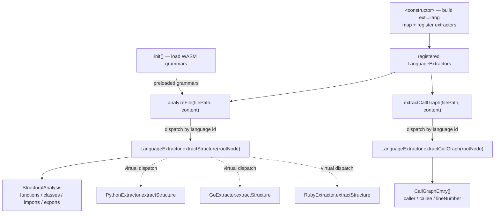

# TreeSitterPlugin — the syntactic grounding substrate

<!-- connect:up:begin -->
> **Cross-repo concept:** part of [multi-language-extraction](../../../concepts/multi-language-extraction.md) across this wiki's repos.
<!-- connect:up:end -->
## Overview
`TreeSitterPlugin` is the layer that turns raw source text into the *facts* everything
downstream in Understand-Anything reasons about. It parses a file with a tree-sitter WASM
grammar, then hands the resulting concrete syntax tree to a per-language *extractor* that
flattens it into two language-neutral shapes: a [`StructuralAnalysis`](../catalog/understand-anything-plugin/packages/core/src/types.ts.md#StructuralAnalysis)
(the functions, classes, imports, and exports in the file) and a list of
[`CallGraphEntry`](../catalog/understand-anything-plugin/packages/core/src/types.ts.md#CallGraphEntry)
edges (caller → callee, by name, with a line number). The single key idea is a **two-stage
split**: a generic, config-driven parsing shell that knows nothing about any language, and a
registry of interchangeable [`LanguageExtractor`](../catalog/understand-anything-plugin/packages/core/src/plugins/extractors/types.ts.md#LanguageExtractor)
implementations that each know exactly one grammar's node types. This is what lets one plugin
cover TypeScript, Python, Go, Rust, Java, Ruby, PHP, C/C++, C#, Swift, Dart, and Kotlin
without a single `if (language === …)` in the extraction path.

For the survey lens, this is the piece to compare against wikify-repo and graphify: it is
Understand-Anything's **grounding substrate**, and that substrate is *syntactic and per-file*.
Tree-sitter gives concrete syntax trees, not a resolved symbol table — so the structural facts
are shallow (names + line ranges) and the call graph is a **name-based heuristic**, not a
cross-file, type-resolved edge set. Where wikify-repo grounds on a SCIP index and graphify
fuses AST with SCIP monikers, Understand-Anything deliberately stops at the parse tree and
leans on an LLM agent for the deeper semantics (and for languages with no grammar).

## Diagram

## Design rationale (why it's built this way)
The plugin's docstring states the intent directly: it is a *"Config-driven tree-sitter
plugin"* that provides *"deep structural analysis (functions, classes, imports, exports, call
graphs) for all languages with registered extractors,"* and — crucially — *"Languages without
tree-sitter configs are gracefully skipped (the LLM agent handles analysis for those)"*
([`<constructor>`](../catalog/understand-anything-plugin/packages/core/src/plugins/tree-sitter-plugin.ts.md#TreeSitterPlugin.-constructor)).
That last clause is the whole philosophy: tree-sitter is treated as a *best-effort accelerator*,
not a hard dependency. Every failure path in the plugin degrades to "no structural facts" rather
than throwing, because the design assumes an LLM downstream can still reason about a file the
parser couldn't handle.

- **WASM over native.** The plugin loads `web-tree-sitter` (a WASM build) rather than the native
  `tree-sitter` bindings. Per the repo's own notes this is because native bindings fail on
  darwin/arm64 + Node 24. The cost is that grammars must be loaded asynchronously and parser
  memory must be freed by hand (see Edge cases); the benefit is a portable analyzer that runs
  the same in Node and — for the browser-safe subpaths — potentially the dashboard.
- **Two-stage split (shell vs. extractor).** The [`LanguageExtractor`](../catalog/understand-anything-plugin/packages/core/src/plugins/extractors/types.ts.md#LanguageExtractor)
  interface is deliberately tiny — just `extractStructure` and `extractCallGraph`, both taking a
  raw `rootNode`. All grammar-specific knowledge lives behind it, so adding a language is
  "write an extractor + a config," never a change to `analyzeFile`. The subgraph shows this as
  ~11 `extractStructure` overrides reached by virtual dispatch from one call site.
- **Config-driven with a legacy fallback.** The constructor filters incoming configs to those
  that actually declare a `treeSitter` grammar, and if it receives *none* it silently reconstructs
  the original TS/JS behavior. This keeps older callers (that constructed the plugin with no
  arguments) working unchanged while the config-driven path becomes the norm.

> [!inferred]
> The choice to return name-based `CallGraphEntry` strings (rather than resolved symbol IDs)
> reads as a conscious scope limit: resolving a callee to its definition across files is exactly
> the work tree-sitter cannot do alone, and the project pushes that resolution/semantic layer
> onto the graph-builder and the LLM agent instead.

## Entry points
- [`<constructor>`](../catalog/understand-anything-plugin/packages/core/src/plugins/tree-sitter-plugin.ts.md#TreeSitterPlugin.-constructor) —
  reached once, when the analysis engine instantiates the plugin. It builds the extension→language
  map from the supplied [`LanguageConfig`](../catalog/understand-anything-plugin/packages/core/src/languages/types.ts.md#LanguageConfig)
  list (or installs the TS/JS fallback), then registers extractors — the caller's own list if
  given, otherwise every builtin. After this the plugin knows *which* languages it can handle but
  has not yet loaded any grammar.
- [`init`](../catalog/understand-anything-plugin/packages/core/src/plugins/tree-sitter-plugin.ts.md#TreeSitterPlugin.init) —
  the async setup gate; its docstring: *"Initialize the plugin by loading the WASM module and all
  language grammars. Must be called (and awaited) before any synchronous methods."* Control reaches
  it once after construction and before the first file is analyzed. Everything after it is
  synchronous precisely because `init` front-loads all the async grammar loading.
- [`analyzeFile`](../catalog/understand-anything-plugin/packages/core/src/plugins/tree-sitter-plugin.ts.md#TreeSitterPlugin.analyzeFile) —
  the per-file structural entry point (it implements the [`AnalyzerPlugin.analyzeFile`](../catalog/understand-anything-plugin/packages/core/src/types.ts.md#AnalyzerPlugin.analyzeFile)
  contract). The pipeline calls it once per source file to get that file's
  [`StructuralAnalysis`](../catalog/understand-anything-plugin/packages/core/src/types.ts.md#StructuralAnalysis).
- [`extractCallGraph`](../catalog/understand-anything-plugin/packages/core/src/plugins/tree-sitter-plugin.ts.md#TreeSitterPlugin.extractCallGraph) —
  the parallel per-file entry point for call edges, returning
  [`CallGraphEntry`](../catalog/understand-anything-plugin/packages/core/src/types.ts.md#CallGraphEntry)`[]`.
  It mirrors `analyzeFile` step-for-step but dispatches to the extractor's call-graph method
  instead of its structure method.

## Mechanism (step-by-step)
1. **Construction wires up the routing tables.** The [`<constructor>`](../catalog/understand-anything-plugin/packages/core/src/plugins/tree-sitter-plugin.ts.md#TreeSitterPlugin.-constructor)
   iterates the configs, and for each pushes `config.id` onto the supported-language list and maps
   every one of its file extensions (normalizing a leading dot) to that id. If the list ends up
   empty it hard-codes the `.ts/.tsx/.js/.mjs/.cjs/.jsx` → `typescript`/`javascript` fallback.
   Then it registers extractors, defaulting to the full builtin set — this is what populates the
   `extractor` a later `analyzeFile` will look up. Note the map is *extension → language id*; the
   grammar itself is loaded later.
2. **`init` loads grammars in parallel and tolerates gaps.** [`init`](../catalog/understand-anything-plugin/packages/core/src/plugins/tree-sitter-plugin.ts.md#TreeSitterPlugin.init)
   first initializes the WASM `Parser` class, then for each config resolves its
   `wasmPackage`/`wasmFile`, `LanguageCls.load`s it, and stores it under `config.id`. Each grammar
   load is wrapped in its own `try/catch`: a missing `.wasm` is swallowed with a debug log, so one
   unavailable grammar never blocks the others. All loads are awaited together via `Promise.all`.
   TypeScript gets special treatment — the loader *also* tries to load a separate `tree-sitter-tsx`
   grammar under the synthetic key `"tsx"`, because TSX genuinely needs a different grammar even
   though (see step 3) it shares TypeScript's extractor.
3. **`analyzeFile` parses, dispatches, then frees.** [`analyzeFile`](../catalog/understand-anything-plugin/packages/core/src/plugins/tree-sitter-plugin.ts.md#TreeSitterPlugin.analyzeFile)
   asks for a parser bound to the file's language (synchronous, since grammars are preloaded); if
   there is none — unknown extension or ungraded grammar — it returns an *empty*
   [`StructuralAnalysis`](../catalog/understand-anything-plugin/packages/core/src/types.ts.md#StructuralAnalysis)
   rather than failing. It parses `content` into a tree, resolves the language key to a
   [`LanguageExtractor`](../catalog/understand-anything-plugin/packages/core/src/plugins/extractors/types.ts.md#LanguageExtractor)
   (mapping `tsx`→`typescript`, since extraction logic is identical even though the grammar differs),
   and calls the extractor's `extractStructure(tree.rootNode)`. It then explicitly calls
   `tree.delete()` and `parser.delete()` before returning — mandatory manual frees for WASM-backed
   objects.
4. **The extractor flattens the AST into the neutral shape.** Dispatch lands in a concrete
   override such as [`PythonExtractor.extractStructure`](../catalog/understand-anything-plugin/packages/core/src/plugins/extractors/python-extractor.ts.md#PythonExtractor.extractStructure)
   (whose docstring is the shared contract: *"Extract functions, classes, imports, exports from the
   root AST node"*). Each override walks the top-level children of `rootNode`, recognizes that
   grammar's declaration node types, and appends to four arrays — populating
   [`functions`](../catalog/understand-anything-plugin/packages/core/src/types.ts.md#StructuralAnalysis.functions)
   (name, [`lineRange`](../catalog/understand-anything-plugin/packages/core/src/types.ts.md#StructuralAnalysis.functions.Array.typeLiteral0.lineRange),
   [`params`](../catalog/understand-anything-plugin/packages/core/src/types.ts.md#StructuralAnalysis.functions.Array.typeLiteral0.params),
   [`returnType`](../catalog/understand-anything-plugin/packages/core/src/types.ts.md#StructuralAnalysis.functions.Array.typeLiteral0.returnType)),
   [`classes`](../catalog/understand-anything-plugin/packages/core/src/types.ts.md#StructuralAnalysis.classes)
   (with [`methods`](../catalog/understand-anything-plugin/packages/core/src/types.ts.md#StructuralAnalysis.classes.Array.typeLiteral1.methods)/[`properties`](../catalog/understand-anything-plugin/packages/core/src/types.ts.md#StructuralAnalysis.classes.Array.typeLiteral1.properties)
   as plain name strings, not nested symbols),
   [`imports`](../catalog/understand-anything-plugin/packages/core/src/types.ts.md#StructuralAnalysis.imports)
   ([`source`](../catalog/understand-anything-plugin/packages/core/src/types.ts.md#StructuralAnalysis.imports.Array.typeLiteral2.source)
   + [`specifiers`](../catalog/understand-anything-plugin/packages/core/src/types.ts.md#StructuralAnalysis.imports.Array.typeLiteral2.specifiers)),
   and [`exports`](../catalog/understand-anything-plugin/packages/core/src/types.ts.md#StructuralAnalysis.exports).
   Language quirks are absorbed here, not in the shell — e.g. Python has no export keyword, so its
   extractor treats every top-level def/class as an export.
5. **Shared AST helpers keep extractors small.** Rather than each extractor re-walking children,
   they lean on the base helpers — [`findChild`](../catalog/understand-anything-plugin/packages/core/src/plugins/extractors/base-extractor.ts.md#findChild)
   (*"Find the first child matching a type"*) and
   [`findChildren`](../catalog/understand-anything-plugin/packages/core/src/plugins/extractors/base-extractor.ts.md#findChildren)
   (*"Find all children matching a type"*) — which iterate a
   [`TreeSitterNode`](../catalog/understand-anything-plugin/packages/core/src/plugins/extractors/types.ts.md#TreeSitterNode)'s
   children by `type`. This is the vocabulary the per-language `extractStructure`/`extractClass…`
   methods (e.g. [`RustExtractor.extractImpl`](../catalog/understand-anything-plugin/packages/core/src/plugins/extractors/rust-extractor.ts.md#RustExtractor.extractImpl),
   [`GoExtractor.extractMethod`](../catalog/understand-anything-plugin/packages/core/src/plugins/extractors/go-extractor.ts.md#GoExtractor.extractMethod))
   are built on.
6. **`extractCallGraph` produces name-based edges.** [`extractCallGraph`](../catalog/understand-anything-plugin/packages/core/src/plugins/tree-sitter-plugin.ts.md#TreeSitterPlugin.extractCallGraph)
   repeats the parse-dispatch-free dance, calling the extractor's `extractCallGraph(rootNode)`.
   Inside an extractor (e.g. [`RubyExtractor.extractCallGraph`](../catalog/understand-anything-plugin/packages/core/src/plugins/extractors/ruby-extractor.ts.md#RubyExtractor.extractCallGraph)),
   a recursive walk maintains a *function stack*: entering a method definition pushes its name;
   every `call` node emits a [`CallGraphEntry`](../catalog/understand-anything-plugin/packages/core/src/types.ts.md#CallGraphEntry)
   whose [`caller`](../catalog/understand-anything-plugin/packages/core/src/types.ts.md#CallGraphEntry.caller)
   is the enclosing function on the stack and whose [`callee`](../catalog/understand-anything-plugin/packages/core/src/types.ts.md#CallGraphEntry.callee)
   is the *text* of the invoked identifier (plus a line number). This is the substrate's defining
   limitation: the callee is a syntactic name, never resolved to a definition, so cross-file linking
   is left to a later stage.

## Key data structures
- [`StructuralAnalysis`](../catalog/understand-anything-plugin/packages/core/src/types.ts.md#StructuralAnalysis) —
  the language-neutral output shape. Its four core arrays (functions/classes/imports/exports) are the
  common denominator every extractor must produce; the interface also carries optional non-code
  fields (`sections`, `definitions`, `services`, `endpoints`, `steps`, `resources`) for non-source
  formats, kept optional for backward compatibility. The shallowness is deliberate: methods and
  properties are `string[]`, not nested symbol objects.
- [`CallGraphEntry`](../catalog/understand-anything-plugin/packages/core/src/types.ts.md#CallGraphEntry) —
  a single edge: `caller`, `callee`, `lineNumber`. Because both endpoints are names, the "graph" is
  really a per-file edge list that only becomes a graph once a downstream assembler joins names to
  declarations.
- [`LanguageExtractor`](../catalog/understand-anything-plugin/packages/core/src/plugins/extractors/types.ts.md#LanguageExtractor) —
  the two-method plug (`extractStructure`, `extractCallGraph`) plus a `languageIds` list; the seam
  that makes the plugin polymorphic over grammars.
- [`TreeSitterNode`](../catalog/understand-anything-plugin/packages/core/src/plugins/extractors/types.ts.md#TreeSitterNode) —
  a re-export of `web-tree-sitter`'s `Node`; the raw currency the extractors consume. Everything
  above `analyzeFile` sees `StructuralAnalysis`; everything below sees `TreeSitterNode`.
- Internal routing state (not in the neutral types): the extension→language-id map, the
  language-id→grammar map, and the language-id→extractor map. These three tables are the entire
  dispatch mechanism.

## Dynamics (design intent)
The plugin has a strict phase order enforced in code: `getParser` throws `"TreeSitterPlugin.init()
must be called before use"` if invoked before [`init`](../catalog/understand-anything-plugin/packages/core/src/plugins/tree-sitter-plugin.ts.md#TreeSitterPlugin.init).
So the intended lifecycle is *construct → await init once → then call the synchronous
`analyzeFile`/`extractCallGraph` many times*. Making the hot path synchronous is the point of the
async init: grammar loading (the only genuinely async work) is amortized up front. Grammar loads
within `init` run concurrently under `Promise.all`, but each file analysis is independent and
stateless — a fresh parser is created and deleted per call, so there is no shared mutable parse
state to serialize. The test suite exercises exactly this contract: `beforeAll` constructs the
plugin and awaits `init`, then each case calls `analyzeFile` synchronously and asserts on the
extracted functions/params/return types (`tree-sitter-plugin.test.ts`).

## Edge cases
- **Unknown or unparseable input degrades to empty, never throws.** Both
  [`analyzeFile`](../catalog/understand-anything-plugin/packages/core/src/plugins/tree-sitter-plugin.ts.md#TreeSitterPlugin.analyzeFile)
  and [`extractCallGraph`](../catalog/understand-anything-plugin/packages/core/src/plugins/tree-sitter-plugin.ts.md#TreeSitterPlugin.extractCallGraph)
  return empty results when there is no parser for the extension, when the parse yields no tree, or
  when no extractor is registered for the language.
- **Missing grammar is silent.** In [`init`](../catalog/understand-anything-plugin/packages/core/src/plugins/tree-sitter-plugin.ts.md#TreeSitterPlugin.init),
  a grammar that fails to resolve/load is caught and logged at debug level only; that language is
  simply absent from the grammar map and its files later route to the empty path.
- **TSX is a grammar/extractor mismatch by design.** `.tsx` maps to the synthetic language key `tsx`
  (its own grammar) but shares the TypeScript extractor. If the separate TSX grammar failed to load,
  `.tsx` files fall through to the empty path even though a TypeScript extractor exists.
- **Manual WASM frees are load-bearing.** Every parse must `delete()` both the tree and the parser;
  the code does this on all return paths in `analyzeFile`, which is why the logic is written as
  early-return-then-free rather than a single `finally`. A missed `delete` would leak WASM heap.
- **`self`/`cls` filtering and similar are per-language.** The neutral shape hides that, e.g., the
  Python extractor drops implicit receiver params — a reminder that the "same" `params` array can
  mean subtly different things across languages.

## Open questions
- Where and how are the per-file `CallGraphEntry` name-edges resolved into a cross-file graph — is
  callee-name → definition matching done by the graph-builder, the LLM agent, or not at all? The
  plugin itself only emits names.
- Is `extractCallGraph` invoked for every file in the pipeline, or lazily/on demand? The plugin
  exposes it but the caller cadence is out of this packet's scope.
- How are configs sourced at construction time (who assembles the `LanguageConfig[]`), and does the
  fallback-to-TS/JS path ever fire in the real pipeline, or only in legacy/test callers?

## See also
- [base-extractor](./understand-anything-plugin-packages-core-src-plugins-extractors-base-extractor.ts.md) — the shared AST-walking helpers extractors are built on.
- [extractors/types](./understand-anything-plugin-packages-core-src-plugins-extractors-types.ts.md) — the `LanguageExtractor` interface and `TreeSitterNode`.
- [registry](./understand-anything-plugin-packages-core-src-plugins-registry.ts.md) — plugin registration/discovery.
- [graph-builder](./understand-anything-plugin-packages-core-src-analyzer-graph-builder.ts.md) — where extracted facts are assembled into the knowledge graph.
- [types](./understand-anything-plugin-packages-core-src-types.ts.md) — `StructuralAnalysis`, `CallGraphEntry`, `AnalyzerPlugin`.
- [languages/types](./understand-anything-plugin-packages-core-src-languages-types.ts.md) — `LanguageConfig` and the grammar/config schema.
- [swift-extractor](./understand-anything-plugin-packages-core-src-plugins-extractors-swift-extractor.ts.md) · [dart-extractor](./understand-anything-plugin-packages-core-src-plugins-extractors-dart-extractor.ts.md) — representative per-language extractor implementations.
