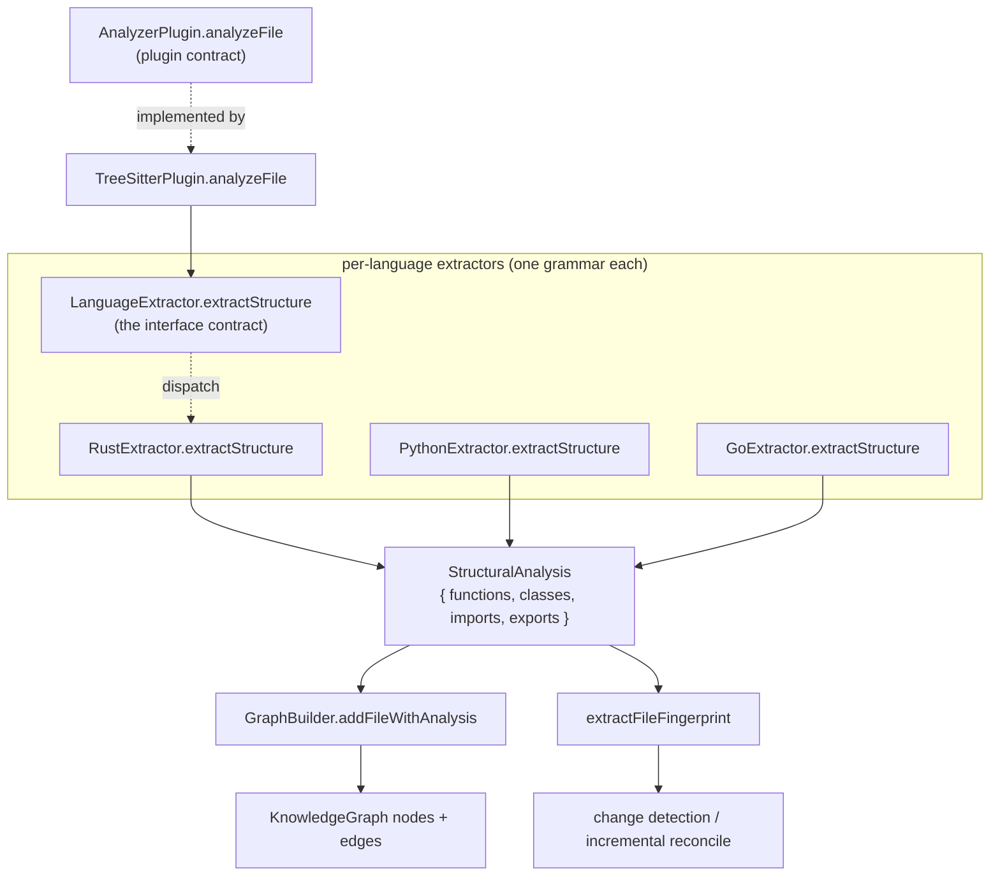

# The code model — StructuralAnalysis and the graph vocabulary

<!-- connect:up:begin -->
> **Cross-repo concept:** part of [incremental-reconcile](../../../concepts/incremental-reconcile.md), [multi-language-extraction](../../../concepts/multi-language-extraction.md), [symbol-graph](../../../concepts/symbol-graph.md) across this wiki's repos.
<!-- connect:up:end -->
## Overview
`types.ts` is Understand-Anything's *ontology*: the single TypeScript file that defines
what a codebase **is** to the rest of the tool. Two vocabularies live here. The first is
[`StructuralAnalysis`](../catalog/understand-anything-plugin/packages/core/src/types.ts.md#StructuralAnalysis) —
a deliberately flat, language-agnostic record of the `functions`, `classes`, `imports` and
`exports` a source file contains. The second is the `KnowledgeGraph` family (`GraphNode`,
`GraphEdge`, `NodeType`, `EdgeType`) — the typed graph the dashboard actually renders.
The key design idea is a **narrow waist**: every language extractor, no matter how
different its tree-sitter grammar, must reduce its AST to the *same* `StructuralAnalysis`
shape, and everything downstream (graph building, change-detection fingerprints, the React
Flow view) consumes only that shape. The AST diversity is quarantined behind one interface;
the code model is uniform.

## Diagram

## Design rationale (why it's built this way)
The most consequential decision is that `StructuralAnalysis` uses **inline anonymous
object types** rather than named `interface`s for its four core arrays — `functions:
Array<{ name; lineRange; params; returnType? }>`, and so on
([`functions`](../catalog/understand-anything-plugin/packages/core/src/types.ts.md#StructuralAnalysis.functions),
[`classes`](../catalog/understand-anything-plugin/packages/core/src/types.ts.md#StructuralAnalysis.classes),
[`imports`](../catalog/understand-anything-plugin/packages/core/src/types.ts.md#StructuralAnalysis.imports)).
This is why the SCIP index shows those field types splattered verbatim across dozens of
extractor method signatures: the shape is *structural*, not *nominal*, so any extractor that
builds an array of matching literals satisfies the contract without importing a named type.
The cost is verbosity in signatures; the benefit is that a language author writes plain
object literals and TypeScript's structural typing checks them for free.

A second deliberate choice is **optionality for forward-compat**. The comment in the source
is explicit — the non-code fields (`sections?`, `definitions?`, `services?`, `endpoints?`,
`steps?`, `resources?`) are "*all optional for backward compat*." Code extractors populate
only the four required arrays; a Markdown or Dockerfile parser fills in `sections` or
`services` instead. One type therefore spans both code files and config/doc/infra files
without versioning breaks — an old consumer that only reads `functions`/`classes` still works
against a `StructuralAnalysis` produced by a new parser.

> [!inferred]
> The `KnowledgeGraph` vocabulary is intentionally over-broad relative to what the code
> extractors produce: 21 `NodeType`s and 35 `EdgeType`s spanning code, domain, and
> "knowledge" (article/entity/topic/claim) categories. The code path in this packet only
> emits `file`/`function`/`class` nodes and `contains`/`imports`/`calls` edges; the rest of
> the vocabulary exists so the *same* graph type can hold LLM-synthesized concept nodes and
> prose-knowledge nodes. The type file is where the tool's ambition ("understand anything",
> not just code) is encoded, even though a given run exercises a slice of it.

## Entry points
- [`StructuralAnalysis`](../catalog/understand-anything-plugin/packages/core/src/types.ts.md#StructuralAnalysis) —
  the load-bearing type of the whole ingestion pipeline. Control reaches it as a **return
  value**: every extractor's `extractStructure` and every plugin's `analyzeFile` is typed to
  produce one. It is the boundary between "parse a file" and "do something with the file."
- [`analyzeFile`](../catalog/understand-anything-plugin/packages/core/src/types.ts.md#AnalyzerPlugin.analyzeFile) —
  the method on the `AnalyzerPlugin` contract that the orchestrator calls per file:
  `analyzeFile(filePath, content) => StructuralAnalysis`. This is the *outer* seam — the
  registry picks a plugin by language and calls this, without knowing whether the plugin is
  tree-sitter-backed or a hand-written config parser.
- [`extractStructure`](../catalog/understand-anything-plugin/packages/core/src/plugins/extractors/types.ts.md#LanguageExtractor.extractStructure) —
  the *inner* seam on `LanguageExtractor`, one level below the plugin. Its docstring states
  the job precisely: "*Extract functions, classes, imports, exports from the root AST node.*"
  Every concrete language extractor (Rust, Python, Go, Java, Kotlin, C++, C#, PHP, Ruby,
  Dart, Swift) implements this single method against its own grammar.

## Mechanism (step-by-step)
1. **A plugin is asked to analyze a file.** The orchestrator calls
   [`analyzeFile`](../catalog/understand-anything-plugin/packages/core/src/plugins/tree-sitter-plugin.ts.md#TreeSitterPlugin.analyzeFile)
   on `TreeSitterPlugin`. Reading the source: it selects a parser by file extension, and if
   no grammar is loaded it **degrades gracefully** — returning an *empty but valid*
   `StructuralAnalysis` (`{ functions: [], classes: [], imports: [], exports: [] }`) rather
   than throwing. The uniform empty shape is what lets every downstream consumer treat
   "unsupported language" as just "a file with no symbols."

2. **The AST is reduced to the code model.** With a parse tree in hand, `analyzeFile`
   delegates to the language-specific
   [`extractStructure`](../catalog/understand-anything-plugin/packages/core/src/plugins/extractors/types.ts.md#LanguageExtractor.extractStructure).
   This is dispatched dynamically per language — the subgraph records `extractStructure` as a
   `(virtual)` edge, i.e. the interface method resolving to a concrete override such as
   [`RustExtractor.extractStructure`](../catalog/understand-anything-plugin/packages/core/src/plugins/extractors/rust-extractor.ts.md#RustExtractor.extractStructure)
   or [`GoExtractor.extractStructure`](../catalog/understand-anything-plugin/packages/core/src/plugins/extractors/go-extractor.ts.md#GoExtractor.extractStructure).
   Each override walks *its* grammar's node kinds (Go's `extractMethod`/`extractStruct`,
   Rust's `extractImpl`, Kotlin's `collectClassBody`, …) but they all converge on the identical
   `StructuralAnalysis` return type. This convergence is the mechanism of
   multi-language extraction: N grammars, one output schema.

3. **The code model becomes graph nodes and edges.** The graph builder consumes the analysis
   through [`addFileWithAnalysis`](../catalog/understand-anything-plugin/packages/core/src/analyzer/graph-builder.ts.md#GraphBuilder.addFileWithAnalysis).
   Reading its body: it emits one `file` node, then iterates `analysis.functions` to emit a
   `function:<path>:<name>` node per entry and `analysis.classes` for `class:` nodes, wiring
   each to the file with a `contains` edge. The `lineRange` from the code model becomes the
   node's `lineRange`, the anchor the dashboard uses to open the exact source span. This is
   where an abstract "list of functions" turns into an addressable, renderable graph.

4. **The same model drives incremental reconcile.** Independently, the analysis is passed to
   [`extractFileFingerprint`](../catalog/understand-anything-plugin/packages/core/src/fingerprint.ts.md#extractFileFingerprint),
   whose docstring is "*Extract a structural fingerprint from a file using its tree-sitter
   analysis.*" Reading it: it hashes content, then projects `analysis.functions` and
   `analysis.classes` into signature-level fingerprints (name, params, returnType, method
   list, exported flag, line count). Because the fingerprint is derived from the *structural*
   shape rather than raw text, a later run can classify a changed file as NONE / COSMETIC /
   STRUCTURAL — only structural changes force the graph to be rebuilt. The code model is thus
   the unit of change detection, not just of rendering.

## Key data structures
- **`StructuralAnalysis`** — the narrow waist. Four required arrays (`functions`, `classes`,
  `imports`, `exports`) plus six optional non-code arrays. `functions` entries carry
  `name`/`lineRange`/`params`/`returnType?`; `classes` carry `name`/`lineRange`/`methods`/
  `properties`; `imports` carry `source`/`specifiers`/`lineNumber`. Note what is *absent*:
  no call edges (those come from the separate `extractCallGraph` / `CallGraphEntry` path),
  no bodies, no types beyond a bare `returnType` string. It is a symbol *inventory*, not a
  semantic model.
- **`GraphNode` / `GraphEdge` / `NodeType` / `EdgeType`** — the persisted graph vocabulary
  (21 node types, 35 edge types across 8 categories). Nodes carry `summary`, `tags`,
  `complexity`, and optional `domainMeta`/`knowledgeMeta`; edges carry a `direction` and a
  `weight` (0–1). This is the schema the dashboard validates on load.
- **`AnalyzerPlugin`** — the plugin contract: `name`, `languages`, a required
  [`analyzeFile`](../catalog/understand-anything-plugin/packages/core/src/types.ts.md#AnalyzerPlugin.analyzeFile),
  and *optional* `resolveImports` / `extractCallGraph` / `extractReferences`. Making the
  richer analyses optional means a minimal parser only owes structure; imports/calls/refs are
  progressive enhancement.

## Dynamics (design intent)
The tests pin the contract as an *empty-safe* one. `plugin-registry.test.ts` builds mock
plugins whose `analyzeFile` returns a shared `emptyAnalysis` with all four arrays empty, and
`graph-builder.test.ts` feeds a hand-written `StructuralAnalysis` straight into the builder —
confirming the two ends (extraction and graph-building) are decoupled and each testable in
isolation against the shared shape. `fingerprint.test.ts` constructs a `StructuralAnalysis`
literal and asserts the fingerprint it produces, locking in that fingerprints are a pure
function of the code model. Across these tests the invariant holds: the four required arrays
are always present (possibly empty), never undefined, so no consumer needs a null guard.

## Edge cases
- **Unsupported / unparseable files** yield a valid empty `StructuralAnalysis`, not an error
  or a missing value — visible in [`analyzeFile`](../catalog/understand-anything-plugin/packages/core/src/plugins/tree-sitter-plugin.ts.md#TreeSitterPlugin.analyzeFile)'s
  early returns. Downstream code never special-cases "no plugin."
- **Non-code sources** (Markdown, YAML, Dockerfile, SQL) return a `StructuralAnalysis` where
  the four code arrays are empty and an optional array like `sections` or `services` is
  populated instead; `parsers.test.ts` asserts exactly this (`result.sections` set,
  `result.imports` length 0). A consumer that only reads `functions`/`classes` silently sees
  such a file as empty.
- **Structural typing collisions:** because the arrays are anonymous literals, two extractors
  that both build a `{ name; lineRange; params; returnType? }[]` are interchangeable to the
  type checker even if conceptually distinct — the type gives no nominal safety, only shape
  safety.

## Open questions
- The graph vocabulary defines `implements`, `inherits`, `subscribes`, `transforms`, and many
  other edge types, but the code path in this packet only emits `contains`/`imports`/`calls`
  (via `addImportEdge`/`addCallEdge`, out of subgraph). Which producer populates the richer
  edge types — an LLM synthesis stage, or additional analyzers — is not settled by this file.
- `StructuralAnalysis` has no field for cross-file symbol resolution (a function's callee is a
  bare name + line via `CallGraphEntry`). How call edges are resolved to concrete target nodes
  across files is decided elsewhere, not in the code model here.

## See also
- [`types.ts` catalog](../catalog/understand-anything-plugin/packages/core/src/types.ts.md) — the full symbol home for `StructuralAnalysis`, `GraphNode`, `AnalyzerPlugin`.
- [`graph-builder.ts` catalog](../catalog/understand-anything-plugin/packages/core/src/analyzer/graph-builder.ts.md) — how the code model becomes graph nodes/edges.
- [`fingerprint.ts` catalog](../catalog/understand-anything-plugin/packages/core/src/fingerprint.ts.md) — the incremental-reconcile consumer.
- [extractors `types.ts` catalog](../catalog/understand-anything-plugin/packages/core/src/plugins/extractors/types.ts.md) — the `LanguageExtractor` contract every grammar implements.
