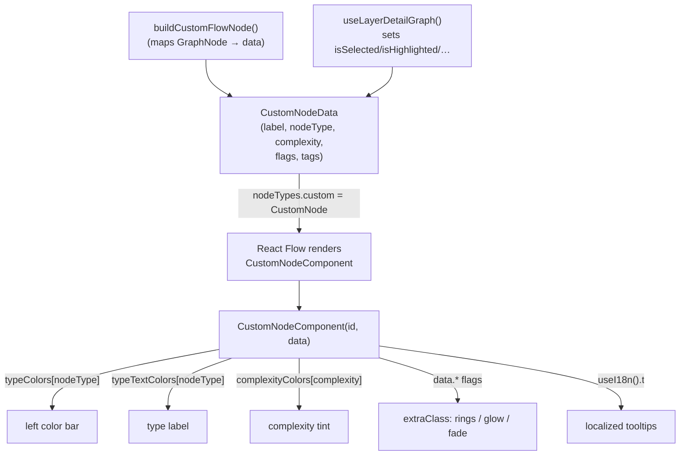

# CustomNode — rendering a code-graph node as a legible, annotated card

## Overview
`CustomNode` is the leaf of Understand-Anything's comprehension surface: the single
React Flow node type that turns one entry in the knowledge graph into a small card a
human reads at a glance. The whole file is presentation — it holds *no* analysis logic.
Everything it shows (type, one-line summary, complexity, tags, connection counts) was
already computed upstream by the analyzer and packed into a plain
[`CustomNodeData`](../catalog/understand-anything-plugin/packages/dashboard/src/components/CustomNode.tsx.md#CustomNodeData)
object; the component's job is purely to *encode that data as visual affordances* — a
color bar for kind, a monospace tint for complexity, a green dot for "has tests", and a
family of ring/glow/fade classes for the many transient UI states (selected, search hit,
tour step, diff changed/affected, neighbor, faded). The key design idea is a strict
split: the graph pipeline decides *what a node means*, and this component decides *how
that meaning looks*, driven entirely by boolean/scalar flags on `data`.

## Diagram

## Design rationale (why it's built this way)
The most load-bearing decision is that node styling is **data-driven, not
event-driven**. `CustomNodeComponent` reads only its `data` prop and derives every visual
from lookups and flag checks — the color maps
[`typeColors`](../catalog/understand-anything-plugin/packages/dashboard/src/components/CustomNode.tsx.md#typeColors),
[`typeTextColors`](../catalog/understand-anything-plugin/packages/dashboard/src/components/CustomNode.tsx.md#typeTextColors),
and
[`complexityColors`](../catalog/understand-anything-plugin/packages/dashboard/src/components/CustomNode.tsx.md#complexityColors)
are module-level constants. This is what lets the parent recompute overlay state cheaply
without relayout: the docstring on the overlay hook
[`useLayerDetailGraph`](../catalog/understand-anything-plugin/packages/dashboard/src/components/GraphView.tsx.md#useLayerDetailGraph)
calls itself a *"cheap O(n) pass that applies selection, search, and tour"* — it only
rewrites flags on `data`, and each `CustomNode` re-renders to match.

Wrapping the component in `memo` —
[`CustomNode`](../catalog/understand-anything-plugin/packages/dashboard/src/components/CustomNode.tsx.md#CustomNode)
is `memo(CustomNodeComponent)` — is the other half of that bargain: in a graph of
hundreds of nodes, only the nodes whose `data` object identity actually changed re-render.
The data-driven design and the memo boundary are complementary — cheap flag diffs upstream
plus reference-equality skipping here keep large graphs interactive.

> [!inferred]
> The color palette maps *twenty* node types onto CSS variables (`--color-node-*`), and
> several distinct semantic types deliberately collapse onto one color (`domain`→concept,
> `flow`→pipeline, `step`→function). The likely reason is visual economy: the human eye
> can only distinguish a handful of hues, so near-synonym kinds share a color rather than
> multiply the legend. The source comment "must be kept in sync with core `NodeType`
> union" confirms this is a hand-maintained mirror of the analyzer's type vocabulary.

## Entry points
- [`CustomNodeComponent`](../catalog/understand-anything-plugin/packages/dashboard/src/components/CustomNode.tsx.md#CustomNodeComponent)
  is the render function, reached once per visible node every time React Flow paints the
  canvas. It receives React Flow's `NodeProps<CustomFlowNode>` and pulls only `id` and
  `data` — `id` is used solely for the click callback, everything visible comes from
  `data`. It is registered under the `custom` key in
  [`nodeTypes`](../catalog/understand-anything-plugin/packages/dashboard/src/components/GraphView.tsx.md#nodeTypes)
  (and the knowledge-graph view's own
  [`nodeTypes`](../catalog/understand-anything-plugin/packages/dashboard/src/components/KnowledgeGraphView.tsx.md#nodeTypes)),
  which is how React Flow knows this component renders `type: "custom"` nodes.
- [`buildCustomFlowNode`](../catalog/understand-anything-plugin/packages/dashboard/src/components/GraphView.tsx.md#buildCustomFlowNode)
  is the upstream constructor that produces what this component consumes: its docstring is
  *"Build a CustomFlowNode from a GraphNode"*. Control reaches CustomNode only after this
  has mapped an analyzer `GraphNode` into a
  [`CustomFlowNode`](../catalog/understand-anything-plugin/packages/dashboard/src/components/CustomNode.tsx.md#CustomFlowNode)
  — note it defaults `label` to `node.name ?? filePath basename ?? id`, and pre-computes
  the diff flags (`isDiffChanged`/`isDiffAffected`/`isDiffFaded`) from the current diff
  mode, so the component never has to know about diff logic.

## Mechanism (step-by-step)
1. **Resolve kind → color, with a fallback.**
   [`CustomNodeComponent`](../catalog/understand-anything-plugin/packages/dashboard/src/components/CustomNode.tsx.md#CustomNodeComponent)
   casts `data.nodeType` to a `NodeType` and looks it up in
   [`typeColors`](../catalog/understand-anything-plugin/packages/dashboard/src/components/CustomNode.tsx.md#typeColors)
   and
   [`typeTextColors`](../catalog/understand-anything-plugin/packages/dashboard/src/components/CustomNode.tsx.md#typeTextColors),
   each guarded by `?? typeColors.file`. The cast is optimistic — `data.nodeType` is a
   plain `string` on `CustomNodeData`, so an unrecognized value silently degrades to the
   `file` palette rather than rendering an undefined color. In dev builds only, a mismatch
   also emits a `console.warn`, making the drift between the dashboard's palette and
   core's `NodeType` union visible during development but harmless in production.
2. **Tint complexity.** The complexity string is mapped through
   [`complexityColors`](../catalog/understand-anything-plugin/packages/dashboard/src/components/CustomNode.tsx.md#complexityColors)
   (`simple`→green, `moderate`→dim accent, `complex`→red), again with a `?? .simple`
   fallback. This is the component's one direct comprehension cue about *cost*: the reader
   sees at a glance whether a node is cheap or gnarly without opening it.
3. **Compose transient state into `extraClass`.** A cascade of `if/else` on the `data`
   flags of
   [`CustomNodeData`](../catalog/understand-anything-plugin/packages/dashboard/src/components/CustomNode.tsx.md#CustomNodeData)
   builds a Tailwind class string with clear precedence: selection (`isSelected` → glow
   ring) wins over tour highlight (`isTourHighlighted` → pulsing ring) over search hit
   (`isHighlighted`, whose ring *tightens* as `searchScore` drops toward 0 — a better
   match gets a brighter, thicker ring). Then diff styling *composes* (appends rather than
   replaces) so a changed node can be both selected and diff-highlighted, and finally
   selection-based dimming fades unrelated nodes (`isSelectionFaded` → `opacity-20`) or
   marks graph neighbors (`isNeighbor`). This single string is the entire visual language
   of "what is the user focused on right now."
4. **Truncate the label for the card.** `data.label` (defaulted to `"unnamed"`) is
   clipped to 24 chars with an ellipsis; the full name is preserved in the `title`
   attribute for hover. This keeps every card the same narrow width
   (`min-w-[180px] max-w-[220px]`) so the graph layout stays predictable regardless of
   symbol-name length —
   [`CustomNodeData`](../catalog/understand-anything-plugin/packages/dashboard/src/components/CustomNode.tsx.md#CustomNodeData)
   carries the untruncated `label` for that tooltip.
5. **Render the card with localized annotations and click wiring.** The JSX lays out a
   left color bar, source/target React Flow `Handle`s, the uppercase type label, the
   complexity tint, an optional green "tested" dot shown only when `data.tags` includes
   `"tested"`, the truncated name, and a two-line clamped `summary`. The tested-dot's
   `aria-label`/`title` come from
   [`useI18n`](../catalog/understand-anything-plugin/packages/dashboard/src/contexts/I18nContext.tsx.md#useI18n)
   via `t.customNode.*`, so even the accessibility text is translatable. The whole card's
   `onClick` invokes `data.onNodeClick?.(id)` — the callback wired up in
   [`buildCustomFlowNode`](../catalog/understand-anything-plugin/packages/dashboard/src/components/GraphView.tsx.md#buildCustomFlowNode)
   — which is how clicking a node drives selection in the store.

## Key data structures
- [`CustomNodeData`](../catalog/understand-anything-plugin/packages/dashboard/src/components/CustomNode.tsx.md#CustomNodeData)
  is the contract between the graph pipeline and the renderer. It splits cleanly into
  *content* fields the analyzer supplies (`label`, `nodeType`, `summary`, `complexity`,
  `tags`, `incomingCount`/`outgoingCount`) and *UI-state* flags the overlay pass sets
  (`isSelected`, `isHighlighted`+`searchScore`, `isTourHighlighted`, the three `isDiff*`
  flags, `isNeighbor`, `isSelectionFaded`) plus the `onNodeClick` handler. It extends
  `Record<string, unknown>` because React Flow requires node data to be an index-signature
  object.
- [`CustomFlowNode`](../catalog/understand-anything-plugin/packages/dashboard/src/components/CustomNode.tsx.md#CustomFlowNode)
  is the React Flow node type parameterized on that data: `Node<CustomNodeData,
  "custom">`. The `"custom"` literal is the discriminant that ties an instance back to the
  `custom` entry in
  [`nodeTypes`](../catalog/understand-anything-plugin/packages/dashboard/src/components/GraphView.tsx.md#nodeTypes).
- The three color maps
  ([`typeColors`](../catalog/understand-anything-plugin/packages/dashboard/src/components/CustomNode.tsx.md#typeColors),
  [`typeTextColors`](../catalog/understand-anything-plugin/packages/dashboard/src/components/CustomNode.tsx.md#typeTextColors),
  [`complexityColors`](../catalog/understand-anything-plugin/packages/dashboard/src/components/CustomNode.tsx.md#complexityColors))
  are the visual vocabulary; `typeColors`/`typeTextColors` are `Record<NodeType,...>`
  (exhaustive over the type union), while `complexityColors` is a looser
  `Record<string,...>` covering only the three known levels.

## Dynamics (design intent)
The `memo` wrapper on
[`CustomNode`](../catalog/understand-anything-plugin/packages/dashboard/src/components/CustomNode.tsx.md#CustomNode)
is a deliberate performance boundary: re-render is skipped unless the `data`/`id` props
change by reference. This intent is legible upstream — the overlay hook
[`useLayerDetailGraph`](../catalog/understand-anything-plugin/packages/dashboard/src/components/GraphView.tsx.md#useLayerDetailGraph)
documents itself as a *"cheap O(n) pass that applies selection, search, and tour"*
overlay that runs *without* re-layout, and the topology hook
[`useLayerDetailTopology`](../catalog/understand-anything-plugin/packages/dashboard/src/components/GraphView.tsx.md#useLayerDetailTopology)
carries a comment that a `useCallback` is *"Stable across renders so ContainerNode's
memo() actually short-circuits"* — the same memo-preservation discipline this component
relies on. The division of labor is: expensive structural build happens once
(topology/layout), a cheap flag-overlay pass runs per interaction, and memoized nodes
re-render only where flags actually flipped.

## Edge cases
- **Unknown node type.** A `data.nodeType` outside the `NodeType` union is not an error —
  the `?? typeColors.file` fallbacks in
  [`CustomNodeComponent`](../catalog/understand-anything-plugin/packages/dashboard/src/components/CustomNode.tsx.md#CustomNodeComponent)
  render it with `file` colors, and only a DEV-mode `console.warn` flags the drift. This
  is graceful degradation for when the dashboard palette lags a new core type.
- **Missing/empty label.** `data.label` defaults to `"unnamed"`; names longer than 24
  chars are ellipsized (full name kept in the `title` tooltip). Cards therefore stay
  fixed-width regardless of symbol length.
- **Composing state.** Diff styling *appends* to the selection/search ring class rather
  than replacing it, so a node can legitimately show two overlays at once (e.g. selected
  *and* diff-changed) — the cascade order in
  [`CustomNodeComponent`](../catalog/understand-anything-plugin/packages/dashboard/src/components/CustomNode.tsx.md#CustomNodeComponent)
  is the source of truth for which cue wins where they conflict.
- **Tested dot.** The green marker appears only when
  [`CustomNodeData`](../catalog/understand-anything-plugin/packages/dashboard/src/components/CustomNode.tsx.md#CustomNodeData)`.tags`
  contains the literal `"tested"`; absent tags simply render no dot.

## Open questions
- Where `data.tags` gets the `"tested"` entry set is outside this subgraph —
  [`buildCustomFlowNode`](../catalog/understand-anything-plugin/packages/dashboard/src/components/GraphView.tsx.md#buildCustomFlowNode)
  copies `node.tags` straight through, so the tagging happens earlier in the analyzer; the
  producing symbol is not in this packet.
- `data.incomingCount`/`outgoingCount` are declared on
  [`CustomNodeData`](../catalog/understand-anything-plugin/packages/dashboard/src/components/CustomNode.tsx.md#CustomNodeData)
  but not read inside `CustomNodeComponent`; they appear to be consumed by the sibling
  hover tooltip (`data` of
  [`NodeTooltip.tsx`](../catalog/understand-anything-plugin/packages/dashboard/src/components/NodeTooltip.tsx.md#NodeTooltipProps.data)
  is a `CustomNodeData`) rather than the card itself — confirming that requires the
  NodeTooltip page.

## See also
- [GraphView.tsx](understand-anything-plugin-packages-dashboard-src-components-GraphView.tsx.md) — builds `CustomFlowNode`s (`buildCustomFlowNode`), the overlay pass that sets the state flags, and the ELK layout that positions these cards.
- [KnowledgeGraphView.tsx](understand-anything-plugin-packages-dashboard-src-components-KnowledgeGraphView.tsx.md) — the other consumer that registers `CustomNode` under `nodeTypes.custom`.
- [NodeTooltip.tsx](understand-anything-plugin-packages-dashboard-src-components-NodeTooltip.tsx.md) — the hover companion that reads the same `CustomNodeData`, including the connection counts this card ignores.
- [graph-builder.ts](understand-anything-plugin-packages-core-src-analyzer-graph-builder.ts.md) — the analyzer stage that produces the `GraphNode`s (type, summary, complexity, tags) this component visualizes.
