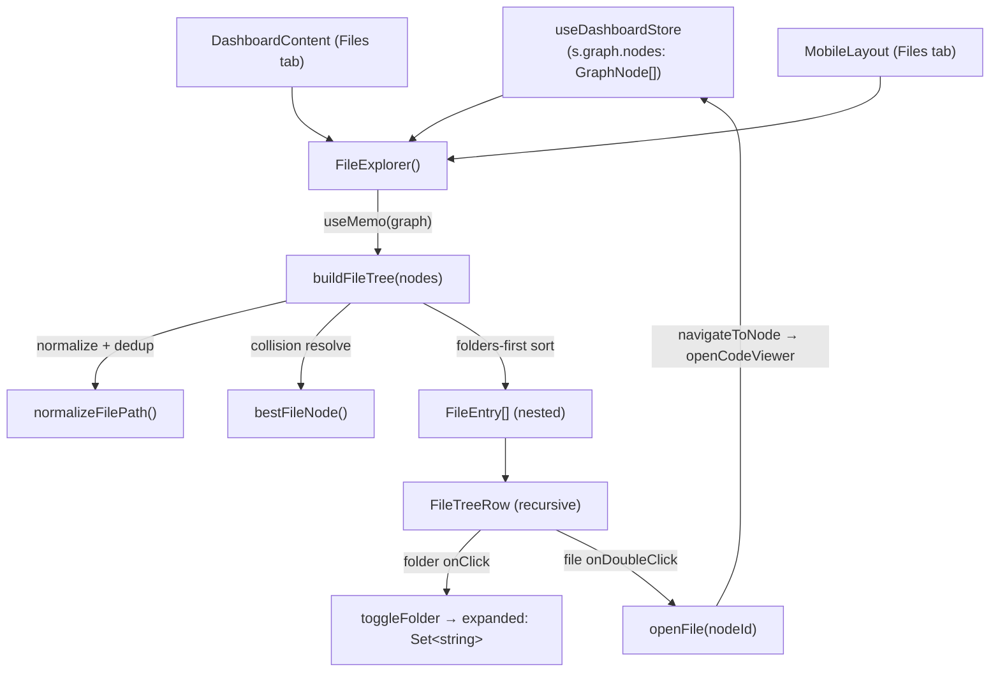

# FileExplorer — a filesystem view derived from the code graph

## Overview
Understand-Anything's primary representation of a codebase is a **flat knowledge graph** of nodes
(symbols, files, modules) linked by edges — not a directory tree. `FileExplorer` is the sidebar panel
that gives a user the other view they expect: a familiar collapsible **folder/file tree**, reconstructed
*entirely from the graph* by reading each node's `filePath`. Nothing on disk is scanned; the tree is a
pure projection of the same `graph` the visualization renders, so "browse by location" and "browse by
relationships" always describe the same corpus. The one non-decorative action a file row offers —
double-clicking to open source — is wired so the graph and the code viewer stay in sync rather than
fighting each other. This is the tool's "where does this live?" affordance, sitting beside the graph's
"what connects to what?".

## Diagram

## Design rationale (why it's built this way)
The central decision is that **the tree is derived, never stored**. `FileExplorer` recomputes it with
`useMemo` keyed on `graph`, so the file view can never drift from the graph — there is no second copy of
the corpus to keep in sync, and a graph reload rebuilds the tree for free. The graph is node-centric
because that is what the analysis pipeline produces; the folder hierarchy the user wants is a *view*
layered on top, not a competing source of truth.

Two subtleties in `buildFileTree` follow from that choice. First, many graph nodes can share one file — a
file node plus the functions/classes inside it all carry the same `filePath` — so the tree must
**collapse them to one leaf per file**. `bestFileNode` is the collision-resolution rule: when two nodes
map to the same path it keeps the one whose `type` is `"file"`, so the leaf's `nodeId` points at the
node the code viewer actually knows how to open, not at some symbol that happens to live there.

Second, `normalizeFilePath` is doing double duty — canonicalization *and* a security floor. It strips
backslashes, leading slashes and `./`, and it **rejects any path containing `..`, a null byte, or that
normalizes to empty/`.`**.

> [!inferred] The path allowlist matters because (per the repo's `CLAUDE.md`) the code viewer fetches
> source from a dev-server endpoint gated by a *graph-derived path allowlist*. Rejecting `..` traversal
> here keeps a poisoned `filePath` in the graph from later resolving into an arbitrary-file read. The
> subgraph doesn't include that fetch path, so this connection is a reading of the source + project docs,
> not a cited call edge.

## Entry points
- [`FileExplorer`](../catalog/understand-anything-plugin/packages/dashboard/src/components/FileExplorer.tsx.md#FileExplorer) —
  the default-exported panel. Control reaches it when the desktop shell
  [`DashboardContent`](../catalog/understand-anything-plugin/packages/dashboard/src/App.tsx.md#DashboardContent)
  renders its sidebar **Files** tab, and (on small screens) when
  [`MobileLayout`](../catalog/understand-anything-plugin/packages/dashboard/src/components/MobileLayout.tsx.md#MobileLayout)
  renders its Files tab. Both import the same component from `App.tsx` /
  `MobileLayout.tsx`,
  so desktop and mobile share one file-browsing implementation.
- [`FileTreeRow`](../catalog/understand-anything-plugin/packages/dashboard/src/components/FileExplorer.tsx.md#FileTreeRow) —
  the recursive row renderer. `FileExplorer` mounts one per top-level
  `entry`,
  and each folder row re-enters it for its
  [`children`](../catalog/understand-anything-plugin/packages/dashboard/src/components/FileExplorer.tsx.md#FileEntry.children);
  this is where a click actually turns into navigation.

## Mechanism (step-by-step)
1. **Read the graph, memoize the tree.** [`FileExplorer`](../catalog/understand-anything-plugin/packages/dashboard/src/components/FileExplorer.tsx.md#FileExplorer)
   subscribes to `s.graph` via [`useDashboardStore`](../catalog/understand-anything-plugin/packages/dashboard/src/store.ts.md#useDashboardStore)
   and computes `entries` with `useMemo(() => buildFileTree(graph?.nodes ?? []), [graph])`. Because the
   dependency is the graph itself, the tree is rebuilt only when the analyzed corpus changes. When
   `graph` is null it short-circuits to a "no graph loaded" placeholder (localized text via
   [`t`](../catalog/understand-anything-plugin/packages/dashboard/src/contexts/I18nContext.tsx.md#I18nContextValue.t)
   from [`useI18n`](../catalog/understand-anything-plugin/packages/dashboard/src/contexts/I18nContext.tsx.md#useI18n)),
   so the panel degrades gracefully before any project is loaded.
2. **Flatten graph nodes into one entry per file.** [`buildFileTree`](../catalog/understand-anything-plugin/packages/dashboard/src/components/FileExplorer.tsx.md#buildFileTree)
   first walks every node, skips those without a `filePath`, canonicalizes the path through
   [`normalizeFilePath`](../catalog/understand-anything-plugin/packages/dashboard/src/components/FileExplorer.tsx.md#normalizeFilePath)
   (dropping anything that fails the traversal/emptiness checks), and dedups into a
   `Map<string, GraphNode>` — resolving same-path collisions with
   [`bestFileNode`](../catalog/understand-anything-plugin/packages/dashboard/src/components/FileExplorer.tsx.md#bestFileNode)
   so the surviving node is the file-typed one. This is the step that turns a symbol-level graph into a
   file-level index.
3. **Grow the folder hierarchy from path segments.** Still inside
   [`buildFileTree`](../catalog/understand-anything-plugin/packages/dashboard/src/components/FileExplorer.tsx.md#buildFileTree),
   each deduped path is split on `/` and walked segment by segment against a `folders` map rooted at an
   empty-path node: intermediate segments become or reuse folder
   [`FileEntry`](../catalog/understand-anything-plugin/packages/dashboard/src/components/FileExplorer.tsx.md#FileEntry)
   objects, and the final segment becomes a file entry whose
   [`nodeId`](../catalog/understand-anything-plugin/packages/dashboard/src/components/FileExplorer.tsx.md#FileEntry.nodeId)
   is set to the surviving node's id — the handle that later opens the source. Each entry carries its
   full [`path`](../catalog/understand-anything-plugin/packages/dashboard/src/components/FileExplorer.tsx.md#FileEntry.path)
   (used as React key and as the expand/collapse identity), its display
   [`name`](../catalog/understand-anything-plugin/packages/dashboard/src/components/FileExplorer.tsx.md#FileEntry.name),
   and its [`type`](../catalog/understand-anything-plugin/packages/dashboard/src/components/FileExplorer.tsx.md#FileEntry.type).
4. **Sort for readability.** A recursive comparator in
   [`buildFileTree`](../catalog/understand-anything-plugin/packages/dashboard/src/components/FileExplorer.tsx.md#buildFileTree)
   orders every level **folders before files**, then alphabetically by
   [`name`](../catalog/understand-anything-plugin/packages/dashboard/src/components/FileExplorer.tsx.md#FileEntry.name)
   via `localeCompare`, descending through each entry's
   [`children`](../catalog/understand-anything-plugin/packages/dashboard/src/components/FileExplorer.tsx.md#FileEntry.children).
   The result reads like a conventional IDE tree even though it came from an unordered node list.
5. **Render rows and branch on kind.** [`FileTreeRow`](../catalog/understand-anything-plugin/packages/dashboard/src/components/FileExplorer.tsx.md#FileTreeRow)
   computes indentation from `depth`
   and checks membership in the `expanded`
   set. A folder row is a button that calls
   `toggleFolder`
   on click and, only when expanded, recurses over its children (so collapsed subtrees are never mounted).
   A file row does nothing on single click and calls
   `openFile`
   only on **double-click**, and only when it has a `nodeId`.
6. **Open source without losing graph context.** The `openFile` handler passed down from
   [`FileExplorer`](../catalog/understand-anything-plugin/packages/dashboard/src/components/FileExplorer.tsx.md#FileExplorer)
   runs `navigateToNode(nodeId)` **before** `openCodeViewer(nodeId)`. The inline comment states why:
   navigating drills into the node's layer and selects it — which *clears* the code viewer — so the
   viewer is re-opened afterward to keep the source panel visible. Ordering here is load-bearing; swapping
   the two lines would leave the viewer closed.

## Key data structures
- [`FileEntry`](../catalog/understand-anything-plugin/packages/dashboard/src/components/FileExplorer.tsx.md#FileEntry) —
  the recursive tree node: `name`, `path`, `type` (`"folder" | "file"`),
  [`children`](../catalog/understand-anything-plugin/packages/dashboard/src/components/FileExplorer.tsx.md#FileEntry.children),
  and an optional [`nodeId`](../catalog/understand-anything-plugin/packages/dashboard/src/components/FileExplorer.tsx.md#FileEntry.nodeId).
  Folders have empty `nodeId` (nothing to open); files carry the graph node id that bridges back to the
  graph and the code viewer. `path` is the stable identity used both as React key and as the expand set's
  member.
- `expanded: Set<string>` — the only mutable UI state, a set of folder
  [`path`](../catalog/understand-anything-plugin/packages/dashboard/src/components/FileExplorer.tsx.md#FileEntry.path)
  strings. Starts empty (all collapsed) and is updated immutably by
  `toggleFolder`,
  which copies the set before add/delete so React sees a new reference.
- The `files` / `folders` maps inside
  [`buildFileTree`](../catalog/understand-anything-plugin/packages/dashboard/src/components/FileExplorer.tsx.md#buildFileTree)
  are transient scaffolding: `files` enforces one-node-per-path, `folders` (keyed by cumulative path)
  lets a folder be created once and reused as later files reference it, giving the build O(nodes · path-depth)
  cost with no repeated tree searches.

## Dynamics (design intent)
The panel is deliberately **recompute-on-change, not incremental**. `entries` and the `totalFiles` count
are both `useMemo`-derived from the graph, so there is no manual invalidation: any store update that
replaces `graph` rebuilds the whole tree. Selection/navigation state lives in
[`useDashboardStore`](../catalog/understand-anything-plugin/packages/dashboard/src/store.ts.md#useDashboardStore),
not in this component, which is why the same `FileExplorer` can be dropped into both the desktop
[`DashboardContent`](../catalog/understand-anything-plugin/packages/dashboard/src/App.tsx.md#DashboardContent)
and [`MobileLayout`](../catalog/understand-anything-plugin/packages/dashboard/src/components/MobileLayout.tsx.md#MobileLayout)
and stay consistent with the graph view — opening a file from either surface drives the shared store and
the graph reacts. All user-facing strings are read through
[`useI18n`](../catalog/understand-anything-plugin/packages/dashboard/src/contexts/I18nContext.tsx.md#useI18n)/[`t`](../catalog/understand-anything-plugin/packages/dashboard/src/contexts/I18nContext.tsx.md#I18nContextValue.t),
so the panel is fully localizable.

> [!inferred] No tests in the configured paths reference this subgraph, so the above is read off the
> source structure and the store's role, not verified by an executed test.

## Edge cases
- **No graph / empty tree.** A null `graph` renders the "no graph loaded" placeholder;
  a non-null graph whose nodes yield zero file paths renders a distinct "no file paths found" message —
  both handled inside [`FileExplorer`](../catalog/understand-anything-plugin/packages/dashboard/src/components/FileExplorer.tsx.md#FileExplorer).
- **Malformed or hostile paths.** [`normalizeFilePath`](../catalog/understand-anything-plugin/packages/dashboard/src/components/FileExplorer.tsx.md#normalizeFilePath)
  silently drops nodes whose path is empty, `.`, contains a null byte, or includes a `..` segment, so
  such nodes simply never appear in the tree (and can't be opened).
- **Duplicate paths.** When several nodes share a path,
  [`bestFileNode`](../catalog/understand-anything-plugin/packages/dashboard/src/components/FileExplorer.tsx.md#bestFileNode)
  keeps a `"file"`-typed node if one exists, otherwise the first seen; the leaf's `nodeId` reflects that
  winner.
- **File node without an id.** A file
  `entry`
  whose [`nodeId`](../catalog/understand-anything-plugin/packages/dashboard/src/components/FileExplorer.tsx.md#FileEntry.nodeId)
  is undefined is rendered but its double-click is a no-op — the row is visible but not openable.
- **Discoverability of "open".** Files open only on **double-click**, not single click
  ([`FileTreeRow`](../catalog/understand-anything-plugin/packages/dashboard/src/components/FileExplorer.tsx.md#FileTreeRow));
  the title attribute hints this, but a user expecting single-click-to-open may find nothing happens.

## Open questions
- The `s.graph`, `navigateToNode`, `openCodeViewer` store members and the `GraphNode`/`node.id` shape
  are used here but are outside this packet's subgraph, so their exact contracts (what `navigateToNode`
  clears, how `openCodeViewer` resolves a `nodeId` to source) can't be cited from here — they belong to
  the store and code-viewer concept pages.
- Whether the graph-derived path allowlist that gates source fetching is built from these same normalized
  paths is not visible in this file's subgraph.

## See also
- [graph-builder](./understand-anything-plugin-packages-core-src-analyzer-graph-builder.ts.md) — assembles the `graph.nodes` this panel projects into a tree.
- [types](./understand-anything-plugin-packages-core-src-types.ts.md) — defines the `GraphNode` shape (`filePath`, `type`, `id`) `buildFileTree` reads.
- [normalize-graph](./understand-anything-plugin-packages-core-src-analyzer-normalize-graph.ts.md) — upstream normalization of the graph the file view consumes.
