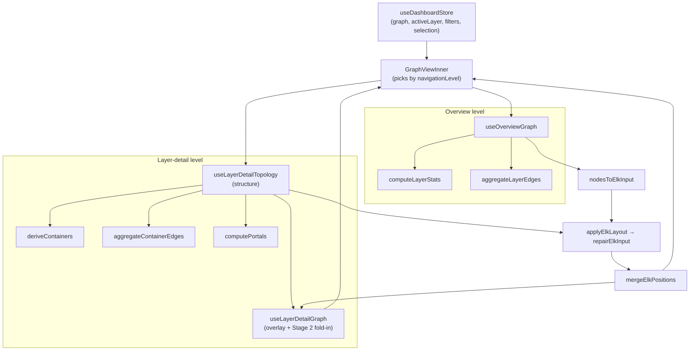

# GraphView — the dashboard's interactive comprehension canvas

## Overview
`GraphView.tsx` is where Understand-Anything's knowledge graph becomes something a human can
*read*. Everything upstream — tree-sitter extraction, the symbol/dependency graph, LLM summaries —
converges here into a React Flow canvas. Its whole design turns on one idea: **a codebase graph is
unreadable if you draw every node and every edge, so this component progressively abstracts.** It
shows the graph at two zoom levels (a coarse *overview* of architectural layers, and a *layer-detail*
view of the files/symbols inside one layer), and at the detail level it groups files into
**container atoms**, collapses cross-container edges into weighted aggregates, and only lays out a
container's interior when the user expands it. The second load-bearing idea is a strict separation
between **structure** (expensive: derive containers, aggregate edges, run async ELK layout to get
positions) and **presentation** (cheap: recolor nodes for selection/search/tour/diff without ever
re-running layout). Three hooks — [`useOverviewGraph`](../catalog/understand-anything-plugin/packages/dashboard/src/components/GraphView.tsx.md#useOverviewGraph),
[`useLayerDetailTopology`](../catalog/understand-anything-plugin/packages/dashboard/src/components/GraphView.tsx.md#useLayerDetailTopology),
and [`useLayerDetailGraph`](../catalog/understand-anything-plugin/packages/dashboard/src/components/GraphView.tsx.md#useLayerDetailGraph) — feed
[`GraphViewInner`](../catalog/understand-anything-plugin/packages/dashboard/src/components/GraphView.tsx.md#GraphViewInner), which owns the React Flow instance.

## Diagram

## Design rationale (why it's built this way)
The dominant decision is **structure/overlay separation**, stated in the author's docstring for the
overlay hook: a "cheap O(n) pass that applies selection, search, and tour state onto
already-positioned nodes … Avoids triggering ELK relayout" ([`useLayerDetailGraph`](../catalog/understand-anything-plugin/packages/dashboard/src/components/GraphView.tsx.md#useLayerDetailGraph)).
Graph layout is the expensive step, so positions are computed once in a `useMemo` + async effect and
then frozen; clicking a node, typing a search, or entering diff mode only rewrites node `data` flags,
never geometry. The structural hook is deliberately *not* subscribed to `selectedNodeId`,
`searchResults`, or `expandedContainers` (see its docstring on [`useLayerDetailTopology`](../catalog/understand-anything-plugin/packages/dashboard/src/components/GraphView.tsx.md#useLayerDetailTopology))
precisely so those high-frequency interactions can't invalidate the layout.

The second decision is **two-stage progressive layout**. Stage 1 lays out containers as opaque boxes
sized by an estimate; Stage 2 lays out a container's *interior* only when it is expanded, caches the
result, and — if the real interior size deviates >20% from the Stage 1 estimate — bumps a tick to
reflow the surrounding atoms. The >20% gate exists to break an otherwise infinite Stage 1 → Stage 2 →
bump → Stage 1 loop, as the inline comment explains: after one re-layout the memorized size makes the
next Stage 2 see 0% deviation and the loop terminates.

Third, **edge aggregation is the core comprehension move**. Instead of drawing hundreds of file→file
edges, the detail view buckets them via [`aggregateContainerEdges`](../catalog/understand-anything-plugin/packages/dashboard/src/utils/edgeAggregation.ts.md#aggregateContainerEdges)
into intra-container (kept, drawn only when expanded) and inter-container (collapsed into one weighted
edge per pair), whose docstring is exactly "Bucket edges into intra-container (preserved) and
inter-container". Stroke width is `1 + log2(count+1)` capped at 5, so a thick edge reads as "these two
groups are heavily coupled" at a glance.

> [!inferred]
> The `log2`-scaled stroke and the `count` label on aggregated edges are a legibility choice — linear
> width would let one hot pair dominate the canvas. This reading is from the edge-style code in
> `useLayerDetailTopology`, not a stated rationale.

## Entry points
- [`GraphViewInner`](../catalog/understand-anything-plugin/packages/dashboard/src/components/GraphView.tsx.md#GraphViewInner) is the
  React component that owns the React Flow instance. On every render it reads `navigationLevel` from
  [`useDashboardStore`](../catalog/understand-anything-plugin/packages/dashboard/src/store.ts.md#useDashboardStore) and
  chooses between the overview graph and the detail graph, feeding the chosen `nodes`/`edges` into
  React Flow state and driving fit-view on level/layer transitions. This is the single mount point for
  the whole canvas.
- [`useOverviewGraph`](../catalog/understand-anything-plugin/packages/dashboard/src/components/GraphView.tsx.md#useOverviewGraph) is
  reached when `navigationLevel === "overview"`. It turns each architectural layer into one
  [`LayerClusterFlowNode`](../catalog/understand-anything-plugin/packages/dashboard/src/components/LayerClusterNode.tsx.md#LayerClusterFlowNode)
  card and each cross-layer coupling into an aggregated edge — the "10,000-foot map" a reader sees first.
- [`useLayerDetailTopology`](../catalog/understand-anything-plugin/packages/dashboard/src/components/GraphView.tsx.md#useLayerDetailTopology)
  is reached when the user drills into a layer. It does all the *structural* work — filtering, container
  derivation, edge aggregation, portal computation, and Stage 1 ELK — returning positioned atoms plus
  the raw material Stage 2 needs. Its empty-state sentinel is
  [`EMPTY_TOPOLOGY`](../catalog/understand-anything-plugin/packages/dashboard/src/components/GraphView.tsx.md#EMPTY_TOPOLOGY).
- [`useLayerDetailGraph`](../catalog/understand-anything-plugin/packages/dashboard/src/components/GraphView.tsx.md#useLayerDetailGraph)
  wraps the topology hook and is what `GraphViewInner` actually consumes at the detail level: it folds
  in expanded-container children and applies the interactive visual overlay.

## Mechanism (step-by-step)
1. **Level selection.** [`GraphViewInner`](../catalog/understand-anything-plugin/packages/dashboard/src/components/GraphView.tsx.md#GraphViewInner)
   calls both graph hooks unconditionally (React rules-of-hooks) but destructures from only one based
   on `navigationLevel`; overview supplies `nodeToContainer`/`containerIds` as `undefined`. The result
   flows into `useNodesState`/`useEdgesState`, and effects re-`setNodes` when the hook's `initialNodes`
   identity changes — so a structural rebuild swaps the whole node set atomically.
2. **Overview build.** [`useOverviewGraph`](../catalog/understand-anything-plugin/packages/dashboard/src/components/GraphView.tsx.md#useOverviewGraph)
   maps each layer to a cluster card, computing its complexity badge with
   [`computeLayerStats`](../catalog/understand-anything-plugin/packages/dashboard/src/utils/layerStats.ts.md#computeLayerStats)
   — an O(layer size) pass over the `nodesById` index rather than an O(N) `Array.filter` (issue #102),
   reading its [`aggregateComplexity`](../catalog/understand-anything-plugin/packages/dashboard/src/utils/layerStats.ts.md#LayerStats.aggregateComplexity)
   result. Cross-layer edges come from [`aggregateLayerEdges`](../catalog/understand-anything-plugin/packages/dashboard/src/utils/edgeAggregation.ts.md#aggregateLayerEdges),
   which canonicalizes each pair (A|B sorted) so A→B and B→A merge into one bucket with a
   [`count`](../catalog/understand-anything-plugin/packages/dashboard/src/utils/edgeAggregation.ts.md#LayerEdgeAggregation.count).
3. **Container derivation.** At the detail level, [`useLayerDetailTopology`](../catalog/understand-anything-plugin/packages/dashboard/src/components/GraphView.tsx.md#useLayerDetailTopology)
   filters the active layer's nodes (expanding to sub-file symbols via "contains" edges when detail
   level isn't "file"), then calls [`deriveContainers`](../catalog/understand-anything-plugin/packages/dashboard/src/utils/containers.ts.md#deriveContainers).
   That groups files by folder segment into [`DerivedContainer`](../catalog/understand-anything-plugin/packages/dashboard/src/utils/containers.ts.md#DerivedContainer)s
   (each carrying `id`/`name`/`nodeIds`/`strategy`), but consults
   [`shouldFallbackToCommunity`](../catalog/understand-anything-plugin/packages/dashboard/src/utils/containers.ts.md#shouldFallbackToCommunity)
   first: if there are too few folder buckets or one bucket holds too large a fraction of nodes, it
   discards the folder grouping and runs graph community detection instead (`strategy: "community"`).
   The `nodeToContainer` map ([`nodeToContainer`](../catalog/understand-anything-plugin/packages/dashboard/src/components/GraphView.tsx.md#LayerDetailTopology.nodeToContainer))
   is the inverse index every later step uses to ask "which atom does this file live in?".
4. **Detail edge bucketing + portals.** [`aggregateContainerEdges`](../catalog/understand-anything-plugin/packages/dashboard/src/utils/edgeAggregation.ts.md#aggregateContainerEdges)
   splits edges into [`intraContainer`](../catalog/understand-anything-plugin/packages/dashboard/src/utils/edgeAggregation.ts.md#ContainerEdgeBuckets.intraContainer)
   (held aside, rendered only on expand) and [`interContainerAggregated`](../catalog/understand-anything-plugin/packages/dashboard/src/utils/edgeAggregation.ts.md#ContainerEdgeBuckets.interContainerAggregated)
   (one weighted edge per container pair; the key is length-prefixed to avoid separator collisions).
   Edges to *other* layers become navigable portal nodes via
   [`computePortals`](../catalog/understand-anything-plugin/packages/dashboard/src/utils/edgeAggregation.ts.md#computePortals),
   which sums per-neighbor connection counts using [`aggregateLayerEdges`](../catalog/understand-anything-plugin/packages/dashboard/src/utils/edgeAggregation.ts.md#aggregateLayerEdges)
   and produces a [`PortalFlowNode`](../catalog/understand-anything-plugin/packages/dashboard/src/components/PortalNode.tsx.md#PortalFlowNode)
   per connected layer, keyed by [`layerId`](../catalog/understand-anything-plugin/packages/dashboard/src/utils/edgeAggregation.ts.md#PortalInfo.layerId).
5. **Stage 1 layout (atoms as opaque boxes).** The structural memo emits
   [`ContainerFlowNode`](../catalog/understand-anything-plugin/packages/dashboard/src/components/ContainerNode.tsx.md#ContainerFlowNode)s
   plus ungrouped files and portals; an effect packs them into an
   [`ElkInput`](../catalog/understand-anything-plugin/packages/dashboard/src/utils/elk-layout.ts.md#ElkInput)
   ([`children`](../catalog/understand-anything-plugin/packages/dashboard/src/utils/elk-layout.ts.md#ElkInput.children) +
   [`edges`](../catalog/understand-anything-plugin/packages/dashboard/src/utils/elk-layout.ts.md#ElkInput.edges)) sized by
   memorized/estimated widths (defaulting to [`NODE_WIDTH`](../catalog/understand-anything-plugin/packages/dashboard/src/utils/layout.ts.md#NODE_WIDTH)/[`NODE_HEIGHT`](../catalog/understand-anything-plugin/packages/dashboard/src/utils/layout.ts.md#NODE_HEIGHT))
   with [`ELK_DEFAULT_LAYOUT_OPTIONS`](../catalog/understand-anything-plugin/packages/dashboard/src/utils/layout.ts.md#ELK_DEFAULT_LAYOUT_OPTIONS).
   The overview level assembles its input through the helper
   [`nodesToElkInput`](../catalog/understand-anything-plugin/packages/dashboard/src/utils/layout.ts.md#nodesToElkInput) instead.
6. **Async ELK + repair.** [`applyElkLayout`](../catalog/understand-anything-plugin/packages/dashboard/src/utils/elk-layout.ts.md#applyElkLayout)
   first runs [`repairElkInput`](../catalog/understand-anything-plugin/packages/dashboard/src/utils/elk-layout.ts.md#repairElkInput)
   — which fills missing [`width`](../catalog/understand-anything-plugin/packages/dashboard/src/utils/elk-layout.ts.md#ElkChild.width)/[`height`](../catalog/understand-anything-plugin/packages/dashboard/src/utils/elk-layout.ts.md#ElkChild.height)
   on any [`ElkChild`](../catalog/understand-anything-plugin/packages/dashboard/src/utils/elk-layout.ts.md#ElkChild)
   and dedupes duplicate [`id`](../catalog/understand-anything-plugin/packages/dashboard/src/utils/elk-layout.ts.md#ElkChild.id)s
   per parent — then awaits the ELK engine, returning [`positioned`](../catalog/understand-anything-plugin/packages/dashboard/src/utils/elk-layout.ts.md#ElkLayoutResult.positioned)
   plus any [`issues`](../catalog/understand-anything-plugin/packages/dashboard/src/utils/elk-layout.ts.md#ElkLayoutResult.issues).
   On failure it returns an empty-children layout with a fatal issue rather than throwing (outside DEV
   strict mode), so a layout bug degrades to an empty canvas instead of a crash.
7. **Merge positions back.** [`mergeElkPositions`](../catalog/understand-anything-plugin/packages/dashboard/src/utils/layout.ts.md#mergeElkPositions)
   copies ELK's `x`/`y` (and, for containers, the echoed width/height) from the
   [`ElkInput`](../catalog/understand-anything-plugin/packages/dashboard/src/utils/elk-layout.ts.md#ElkInput)
   onto the React Flow nodes by matching [`id`](../catalog/understand-anything-plugin/packages/dashboard/src/utils/elk-layout.ts.md#ElkInput.id).
   Nodes ELK didn't position keep a `{0,0}` fallback. The positioned set is committed to component
   state and the layout status flips to `ready`.
8. **Stage 2 lazy interior layout.** A separate effect in
   [`useLayerDetailTopology`](../catalog/understand-anything-plugin/packages/dashboard/src/components/GraphView.tsx.md#useLayerDetailTopology)
   watches expanded [`containers`](../catalog/understand-anything-plugin/packages/dashboard/src/components/GraphView.tsx.md#LayerDetailTopology.containers),
   lays out each newly-expanded container's children (its
   [`nodeIds`](../catalog/understand-anything-plugin/packages/dashboard/src/utils/containers.ts.md#DerivedContainer.nodeIds)
   filtered against [`intraContainer`](../catalog/understand-anything-plugin/packages/dashboard/src/utils/edgeAggregation.ts.md#ContainerEdgeBuckets.intraContainer)
   edges) via [`applyElkLayout`](../catalog/understand-anything-plugin/packages/dashboard/src/utils/elk-layout.ts.md#applyElkLayout),
   caches child positions + actual size, and bumps the Stage 1 tick only when size deviated >20%.
9. **Fold-in + visual overlay.** [`useLayerDetailGraph`](../catalog/understand-anything-plugin/packages/dashboard/src/components/GraphView.tsx.md#useLayerDetailGraph)
   rebuilds each expanded container's cached children as React Flow child nodes (`parentId` +
   `extent: "parent"`) using [`buildCustomFlowNode`](../catalog/understand-anything-plugin/packages/dashboard/src/components/GraphView.tsx.md#buildCustomFlowNode),
   then runs the O(n) overlay: for every [`CustomFlowNode`](../catalog/understand-anything-plugin/packages/dashboard/src/components/CustomNode.tsx.md#CustomFlowNode)
   it recomputes selection/neighbor/search/tour/diff flags on its
   [`CustomNodeData`](../catalog/understand-anything-plugin/packages/dashboard/src/components/CustomNode.tsx.md#CustomNodeData),
   returning the *same object* when nothing changed so React Flow's memoized nodes don't re-render.
   Neighbor sets are computed against [`filteredEdges`](../catalog/understand-anything-plugin/packages/dashboard/src/components/GraphView.tsx.md#LayerDetailTopology.filteredEdges)
   and mapped through `nodeToContainer` so a collapsed atom still lights up when one of its files is a
   neighbor.

## Key data structures
- **`LayerDetailTopology`** — the structural contract between the two detail hooks: positioned `nodes`,
  aggregated [`edges`](../catalog/understand-anything-plugin/packages/dashboard/src/components/GraphView.tsx.md#LayerDetailTopology.edges),
  portal nodes/edges, plus the raw [`filteredEdges`](../catalog/understand-anything-plugin/packages/dashboard/src/components/GraphView.tsx.md#LayerDetailTopology.filteredEdges),
  the [`containers`](../catalog/understand-anything-plugin/packages/dashboard/src/components/GraphView.tsx.md#LayerDetailTopology.containers),
  the [`nodeToContainer`](../catalog/understand-anything-plugin/packages/dashboard/src/components/GraphView.tsx.md#LayerDetailTopology.nodeToContainer)
  inverse index, and the held-aside intra-container edges. Its zero value is
  [`EMPTY_TOPOLOGY`](../catalog/understand-anything-plugin/packages/dashboard/src/components/GraphView.tsx.md#EMPTY_TOPOLOGY).
- **`ElkInput`/`ElkChild`/`ElkEdge`** — the layout-engine interchange format
  ([`ElkInput`](../catalog/understand-anything-plugin/packages/dashboard/src/utils/elk-layout.ts.md#ElkInput),
  [`ElkChild`](../catalog/understand-anything-plugin/packages/dashboard/src/utils/elk-layout.ts.md#ElkChild),
  [`ElkEdge`](../catalog/understand-anything-plugin/packages/dashboard/src/utils/elk-layout.ts.md#ElkEdge)):
  a flat `id`/`children`/`edges`/`layoutOptions` shape ELK understands; `x`/`y` are absent on input and
  filled after layout.
- **`DerivedContainer`** — a comprehension grouping: [`id`](../catalog/understand-anything-plugin/packages/dashboard/src/utils/containers.ts.md#DerivedContainer.id),
  [`name`](../catalog/understand-anything-plugin/packages/dashboard/src/utils/containers.ts.md#DerivedContainer.name),
  member [`nodeIds`](../catalog/understand-anything-plugin/packages/dashboard/src/utils/containers.ts.md#DerivedContainer.nodeIds),
  and a [`strategy`](../catalog/understand-anything-plugin/packages/dashboard/src/utils/containers.ts.md#DerivedContainer.strategy)
  tag recording whether it came from folders or community detection. `DeriveResult` also returns
  [`ungrouped`](../catalog/understand-anything-plugin/packages/dashboard/src/utils/containers.ts.md#DeriveResult.ungrouped)
  files placed directly on the canvas.
- **The React Flow node union** — [`LayerClusterFlowNode`](../catalog/understand-anything-plugin/packages/dashboard/src/components/LayerClusterNode.tsx.md#LayerClusterFlowNode)
  (overview), [`ContainerFlowNode`](../catalog/understand-anything-plugin/packages/dashboard/src/components/ContainerNode.tsx.md#ContainerFlowNode),
  [`PortalFlowNode`](../catalog/understand-anything-plugin/packages/dashboard/src/components/PortalNode.tsx.md#PortalFlowNode),
  and [`CustomFlowNode`](../catalog/understand-anything-plugin/packages/dashboard/src/components/CustomNode.tsx.md#CustomFlowNode)
  (individual files/symbols) — discriminated by `type`, each with its own renderer component.

## Dynamics (design intent)
All layout is asynchronous: the structural memo builds synchronously, but the ELK call in
[`applyElkLayout`](../catalog/understand-anything-plugin/packages/dashboard/src/utils/elk-layout.ts.md#applyElkLayout)
is a promise, and each effect guards a `cancelled` flag in its cleanup so a rapid layer switch can't let
a stale layout commit over a newer one. The Stage 1 and Stage 2 effects are deliberately decoupled by
dependency array — Stage 2 (expand) does *not* depend on `built`, and the topology memo does *not*
depend on `expandedContainers` — so expanding a container never triggers a full-layer relayout. The
only channel from Stage 2 back to Stage 1 is the >20%-deviation tick, whose comment documents that the
gate is what makes the feedback loop converge.

## Edge cases
- **Empty / missing graph.** With no `graph` or no `activeLayerId` the structural memo returns `null`
  and the hooks settle to [`EMPTY_TOPOLOGY`](../catalog/understand-anything-plugin/packages/dashboard/src/components/GraphView.tsx.md#EMPTY_TOPOLOGY)
  / an empty overview with status `ready`.
- **Folder grouping too coarse.** [`shouldFallbackToCommunity`](../catalog/understand-anything-plugin/packages/dashboard/src/utils/containers.ts.md#shouldFallbackToCommunity)
  flips [`deriveContainers`](../catalog/understand-anything-plugin/packages/dashboard/src/utils/containers.ts.md#deriveContainers)
  to community detection when there are fewer than the minimum buckets or one bucket is over the
  concentration cap — otherwise the "grouping" would be a single giant box.
- **Layout engine failure.** [`applyElkLayout`](../catalog/understand-anything-plugin/packages/dashboard/src/utils/elk-layout.ts.md#applyElkLayout)
  swallows the error (non-strict) and returns an empty-children layout plus a fatal
  [`issue`](../catalog/understand-anything-plugin/packages/dashboard/src/utils/elk-layout.ts.md#ElkLayoutResult.issues)
  surfaced in the warning banner; malformed input (missing dims, duplicate ids) is silently repaired by
  [`repairElkInput`](../catalog/understand-anything-plugin/packages/dashboard/src/utils/elk-layout.ts.md#repairElkInput).
- **Partial expand edges.** When only one side of an aggregated edge is expanded, the collapsed side
  keeps its container-atom id as the endpoint (see source comment in
  [`useLayerDetailGraph`](../catalog/understand-anything-plugin/packages/dashboard/src/components/GraphView.tsx.md#useLayerDetailGraph))
  — otherwise React Flow would reference file ids that aren't rendered and the edge would vanish.

## Open questions
- The exact **community-detection algorithm** behind the fallback (`detectCommunities`) lives outside
  this packet's subgraph, so its clustering quality vs. folder grouping isn't documented here.
- The **fit-view / focus / tour** orchestration inside
  [`GraphViewInner`](../catalog/understand-anything-plugin/packages/dashboard/src/components/GraphView.tsx.md#GraphViewInner)
  (pending-fit refs, `setCenter`, portal navigation) is only partially in the subgraph; the full
  camera-control flow would need the React Flow instance methods, which aren't cited symbols here.

## See also
- [store.ts — dashboard state (`useDashboardStore`)](understand-anything-plugin-packages-dashboard-src-store.ts.md)
- [CustomNode.tsx — the file/symbol node renderer](understand-anything-plugin-packages-dashboard-src-components-CustomNode.tsx.md)
- [elk-layout.ts — async ELK layout + repair](understand-anything-plugin-packages-dashboard-src-utils-elk-layout.ts.md)
- [edgeAggregation.ts — layer/container edge bucketing + portals](understand-anything-plugin-packages-dashboard-src-utils-edgeAggregation.ts.md)
- [containers.ts — folder/community container derivation](understand-anything-plugin-packages-dashboard-src-utils-containers.ts.md)
- [layout.ts — ELK input helpers + position merge](understand-anything-plugin-packages-dashboard-src-utils-layout.ts.md)
- [graph-builder.ts — how the knowledge graph this view renders is assembled](understand-anything-plugin-packages-core-src-analyzer-graph-builder.ts.md)
