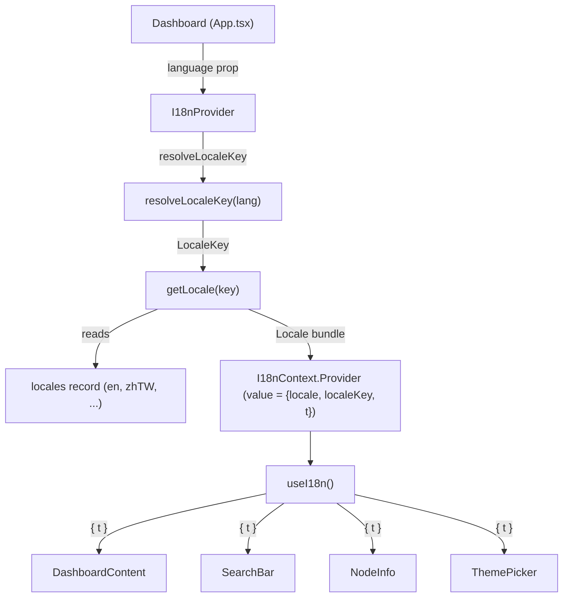

# I18nContext — dashboard localization provider

## Overview
`I18nContext` is the dashboard's internationalization seam: a single React context that
resolves a requested language into a fully-populated locale bundle once and hands it to every
component through a hook. The key design idea is that there is **no runtime translation
function** — `t` is not `t("key")`, it is the locale object itself, a deeply-nested record of
pre-written strings. A component reaches in with dotted paths like `t.common.loading`. The
provider does the resolution (fuzzy language string → canonical key → bundle) exactly once and
memoizes the result; consumers just read fields. This is peripheral to Understand-Anything's
code-comprehension engine (it localizes the *chrome* around the graph, not the analysis), but
it is the mechanism by which every UI label in the dashboard becomes translatable.

## Diagram

## Design rationale (why it's built this way)
The most surprising decision is that the translation "function" `t` is aliased directly to the
locale object — [`t`](../catalog/understand-anything-plugin/packages/dashboard/src/contexts/I18nContext.tsx.md#I18nContextValue.t)
is typed `Locale`, and the provider sets `t: locale`. There is no interpolation layer, no key
lookup, no missing-key fallback at read time. The payoff is that TypeScript's structural typing
becomes the i18n safety net: because [`Locale`](../catalog/understand-anything-plugin/packages/dashboard/src/locales/index.ts.md#Locale)
is derived as `typeof en`, every non-English bundle must be structurally identical to English or
the code that writes the `locales` record fails to compile. A typo like `t.common.lodaing` is a
compile error, not a blank string in production. That is a deliberate trade: it forbids runtime
pluralization/interpolation, but for a dashboard whose strings are mostly static labels it buys
exhaustive, statically-checked coverage for free.

> [!inferred]
> The `?? locales.en` fallback in `getLocale` and the `return "en"` default in
> `resolveLocaleKey` together mean the UI never renders untranslated — an unknown language
> degrades silently to English rather than crashing or showing keys. This reads as a
> "graceful degradation" choice, though no test in the packet pins it.

## Entry points
- [`I18nProvider`](../catalog/understand-anything-plugin/packages/dashboard/src/contexts/I18nContext.tsx.md#I18nProvider)
  is where control enters this subsystem. It is mounted by
  [`Dashboard`](../catalog/understand-anything-plugin/packages/dashboard/src/App.tsx.md#Dashboard),
  which passes a `language`
  prop and the app subtree as `children`.
  The provider is the only place the locale is resolved; everything below it just consumes.
- [`useI18n`](../catalog/understand-anything-plugin/packages/dashboard/src/contexts/I18nContext.tsx.md#useI18n)
  is the consumer entry point — the single hook every localized component calls. Control reaches
  it on each render of a subscribing component;
  [`DashboardContent`](../catalog/understand-anything-plugin/packages/dashboard/src/App.tsx.md#DashboardContent),
  [`SearchBar`](../catalog/understand-anything-plugin/packages/dashboard/src/components/SearchBar.tsx.md#SearchBar),
  [`NodeInfo`](../catalog/understand-anything-plugin/packages/dashboard/src/components/NodeInfo.tsx.md#NodeInfo),
  [`ThemePicker`](../catalog/understand-anything-plugin/packages/dashboard/src/components/ThemePicker.tsx.md#ThemePicker),
  [`FilterPanel`](../catalog/understand-anything-plugin/packages/dashboard/src/components/FilterPanel.tsx.md#FilterPanel),
  [`MobileLayout`](../catalog/understand-anything-plugin/packages/dashboard/src/components/MobileLayout.tsx.md#MobileLayout)
  and roughly two dozen more all destructure `{ t }` from it.

## Mechanism (step-by-step)
1. **Resolve the fuzzy language string to a canonical key.** When
   [`I18nProvider`](../catalog/understand-anything-plugin/packages/dashboard/src/contexts/I18nContext.tsx.md#I18nProvider)
   renders, it calls [`resolveLocaleKey`](../catalog/understand-anything-plugin/packages/dashboard/src/locales/index.ts.md#resolveLocaleKey)
   inside a `useMemo` keyed on `language`. This function is the tolerance layer: it lowercases
   and normalizes separators (`_`/space → `-`), then maps a spread of aliases — `"chinese"`,
   `"zh-cn"`, `"traditional-chinese"`, `"japanese"`, `"russian"`, etc. — onto one of the six
   canonical [`LocaleKey`](../catalog/understand-anything-plugin/packages/dashboard/src/locales/index.ts.md#LocaleKey)
   values, defaulting to `"en"` for anything unrecognized or absent.
2. **Look up the bundle for that key.** A second `useMemo` (keyed on the resolved key) calls
   [`getLocale`](../catalog/understand-anything-plugin/packages/dashboard/src/locales/index.ts.md#getLocale),
   which indexes the [`locales`](../catalog/understand-anything-plugin/packages/dashboard/src/locales/index.ts.md#locales)
   record — a `Record<LocaleKey, Locale>` assembled from the per-language modules
   [`en`](../catalog/understand-anything-plugin/packages/dashboard/src/locales/en.ts.md#en),
   [`zhTW`](../catalog/understand-anything-plugin/packages/dashboard/src/locales/zh-TW.ts.md#zhTW),
   and their siblings — and returns the matching bundle, or `locales.en` if the key is somehow
   absent. Splitting resolution (step 1) from lookup (step 2) means only the string→key step
   reruns when the `language` prop changes but resolves to the same key.
3. **Publish the value object and alias `t`.** A third `useMemo` builds the
   [`I18nContextValue`](../catalog/understand-anything-plugin/packages/dashboard/src/contexts/I18nContext.tsx.md#I18nContextValue)
   `{ locale, localeKey, t: locale }` and feeds it to the context Provider wrapping `children`.
   Because the value is memoized on `[locale, localeKey]`, its identity is stable across
   unrelated re-renders, so consumers don't re-render just because the parent did. Note `t` and
   `locale` are the *same* object under two names — `locale` is the honest name, `t` the
   ergonomic one for JSX.
4. **Consume via the hook, guarded against misuse.**
   [`useI18n`](../catalog/understand-anything-plugin/packages/dashboard/src/contexts/I18nContext.tsx.md#useI18n)
   reads [`I18nContext`](../catalog/understand-anything-plugin/packages/dashboard/src/contexts/I18nContext.tsx.md#I18nContext)
   with `useContext` and **throws** `"useI18n must be used within an I18nProvider"` if the
   context is `null`. Since the context's default value is `null`, any component rendered outside
   the provider fails loudly at first render rather than silently reading undefined strings — a
   fail-fast contract that turns a whole class of bugs into an immediate, named error.

## Key data structures
- [`I18nContextValue`](../catalog/understand-anything-plugin/packages/dashboard/src/contexts/I18nContext.tsx.md#I18nContextValue)
  — the context payload: `{ locale, localeKey, t }`. `locale` and `t` are the same `Locale`
  object; `localeKey` is the canonical key, exposed for components that need to branch on the
  active language rather than just read strings.
- [`Locale`](../catalog/understand-anything-plugin/packages/dashboard/src/locales/index.ts.md#Locale)
  / [`LocaleKey`](../catalog/understand-anything-plugin/packages/dashboard/src/locales/index.ts.md#LocaleKey)
  — `Locale = typeof en` makes English the *schema of record*: every other bundle is type-checked
  against it. `LocaleKey` is the closed union of the six supported languages, so the `locales`
  record is exhaustive by construction.
- [`locales`](../catalog/understand-anything-plugin/packages/dashboard/src/locales/index.ts.md#locales)
  — the static registry mapping each key to its imported bundle
  ([`en`](../catalog/understand-anything-plugin/packages/dashboard/src/locales/en.ts.md#en),
  [`zhTW`](../catalog/understand-anything-plugin/packages/dashboard/src/locales/zh-TW.ts.md#zhTW),
  …). It is module-level and immutable — locales are compiled in, not fetched.

## Dynamics (design intent)
The whole subsystem is synchronous and render-time: no async loading, no network, no locale
switching machinery beyond re-rendering the provider with a different `language` prop. The three
stacked `useMemo`s in
[`I18nProvider`](../catalog/understand-anything-plugin/packages/dashboard/src/contexts/I18nContext.tsx.md#I18nProvider)
exist purely to keep the published
[`I18nContextValue`](../catalog/understand-anything-plugin/packages/dashboard/src/contexts/I18nContext.tsx.md#I18nContextValue)
referentially stable, which is what prevents every `useI18n` consumer from re-rendering on each
parent render. Language change is modeled as prop change → memo invalidation → new value → normal
React propagation.

## Edge cases
- **Unknown / undefined language.**
  [`resolveLocaleKey`](../catalog/understand-anything-plugin/packages/dashboard/src/locales/index.ts.md#resolveLocaleKey)
  returns `"en"` for `undefined` or any unrecognized string, and
  [`getLocale`](../catalog/understand-anything-plugin/packages/dashboard/src/locales/index.ts.md#getLocale)
  has a belt-and-suspenders `?? locales.en`. English is the universal fallback.
- **Consumer outside the provider.**
  [`useI18n`](../catalog/understand-anything-plugin/packages/dashboard/src/contexts/I18nContext.tsx.md#useI18n)
  throws rather than returning a default — a deliberate hard failure.
- **Missing string keys.** There is no runtime guard; a missing nested field would be
  `undefined` in JSX. This is intentionally offloaded to the compiler via the
  [`Locale`](../catalog/understand-anything-plugin/packages/dashboard/src/locales/index.ts.md#Locale)
  `= typeof en` structural constraint, so it should be impossible in checked code.

## Open questions
- Where the `language` value ultimately originates (URL param, persisted setting, browser
  locale) is decided upstream in
  [`Dashboard`](../catalog/understand-anything-plugin/packages/dashboard/src/App.tsx.md#Dashboard);
  the resolution source is outside this packet's subgraph.
- The full set of locale modules (`zh`, `ja`, `ko`, `ru`) is referenced by the
  [`locales`](../catalog/understand-anything-plugin/packages/dashboard/src/locales/index.ts.md#locales)
  record but only [`en`](../catalog/understand-anything-plugin/packages/dashboard/src/locales/en.ts.md#en)
  and [`zhTW`](../catalog/understand-anything-plugin/packages/dashboard/src/locales/zh-TW.ts.md#zhTW)
  surface as cited symbols here, so bundle-level differences aren't documented on this page.

## See also
- [`locales/index.ts`](../catalog/understand-anything-plugin/packages/dashboard/src/locales/index.ts.md) — the locale registry, key resolution, and fallback that this context drives.
- [`App.tsx`](../catalog/understand-anything-plugin/packages/dashboard/src/App.tsx.md) — mounts `I18nProvider` and is the largest cluster of `useI18n` consumers.
