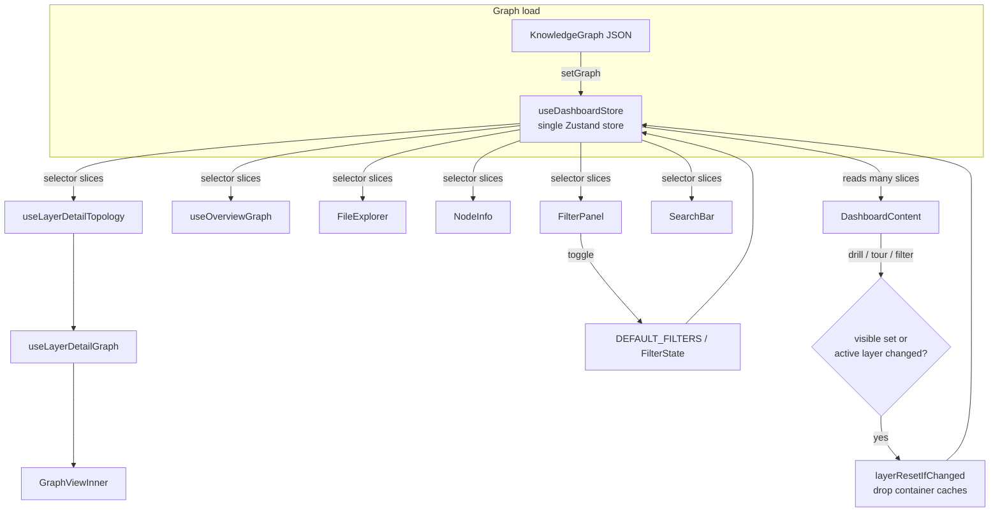

# Dashboard state store (Zustand) — the lens over the knowledge graph

## Overview
`store.ts` is the single Zustand store behind Understand-Anything's web dashboard: the
one shared, mutable place where the *analysis product* (the loaded `KnowledgeGraph`)
meets the *comprehension experience* (what the user is looking at). The graph itself is
produced offline by the analysis pipeline; this store is the **lens** through which a
person reads it — which layer they've drilled into, which node is selected, what's
filtered out, which of the three view modes (structural / domain / knowledge) is active,
whether a guided tour or a diff overlay is running. Every UI component subscribes to a
thin slice of it via [`useDashboardStore`](../catalog/understand-anything-plugin/packages/dashboard/src/store.ts.md#useDashboardStore)`(selector)` and re-renders only when
that slice changes. The one non-obvious invariant that recurs across almost every
action: **any change that alters which nodes are visible, or which layer is active, must
throw away the container layout caches** — a rule factored into
[`layerResetIfChanged`](../catalog/understand-anything-plugin/packages/dashboard/src/store.ts.md#layerResetIfChanged) and copy-pasted into a dozen sibling actions.

## Diagram

## Design rationale (why it's built this way)

**One store, selector subscriptions — not prop-drilling.** The dashboard has ~20
components (graph canvas, sidebar tabs, filter panel, export menu, path finder, mobile
drawer) that all need to read and mutate the same view state. Rather than lift state to
`App` and thread it down, everything reads from [`useDashboardStore`](../catalog/understand-anything-plugin/packages/dashboard/src/store.ts.md#useDashboardStore) with a narrow
selector, so [`FileExplorer`](../catalog/understand-anything-plugin/packages/dashboard/src/components/FileExplorer.tsx.md#FileExplorer), [`NodeInfo`](../catalog/understand-anything-plugin/packages/dashboard/src/components/NodeInfo.tsx.md#NodeInfo), and [`SearchBar`](../catalog/understand-anything-plugin/packages/dashboard/src/components/SearchBar.tsx.md#SearchBar) each subscribe to
exactly the fields they render and stay decoupled from each other.

**Derived indexes are built once at load, not per query.** When a graph is set, the
store precomputes `nodesById` plus *two distinct* layer indexes. The author's docstring
is explicit that this is intentional: `nodeIdToLayerId` is "first-matching-layer wins"
(one canonical layer, for navigation), while `nodeIdToLayerIds` records *every* layer a
node belongs to (for membership/filter queries where "any layer selected wins"). The
comment warns that collapsing the second into the first "would be a silent regression" —
a node in L1 and L2 with only L2 selected must still pass the filter. This is a
comprehension decision: navigation wants a single answer, filtering wants set semantics.

**The cache-invalidation invariant.** Layout of the graph canvas is expensive (an ELK
call, run inside [`useLayerDetailTopology`](../catalog/understand-anything-plugin/packages/dashboard/src/components/GraphView.tsx.md#useLayerDetailTopology)), so container positions and sizes are
memoized in `containerLayoutCache` / `containerSizeMemory`. But container *ids* are not
globally unique — [`layerResetIfChanged`](../catalog/understand-anything-plugin/packages/dashboard/src/store.ts.md#layerResetIfChanged)'s docstring spells out that they derive from
per-layer state (folder names, or community indices like `container:cluster-N`) and
therefore **collide across layers** ("API Contracts and Load Testing both produce
`container:cluster-0`"). So any action that switches layers or changes the visible node
set must clear those caches or the canvas would render stale positions keyed by a
colliding id.

## Entry points

- [`useDashboardStore`](../catalog/understand-anything-plugin/packages/dashboard/src/store.ts.md#useDashboardStore) — the store *is* the entry point. Created once via Zustand's
  `create<DashboardStore>()((set, get) => ({...}))`, it is imported by every component and
  every derivation hook. Control reaches it two ways: read-side, when a component calls it
  with a selector during render; write-side, when a UI event fires one of its actions
  (`selectNode`, `drillIntoLayer`, `setFilters`, `nextTourStep`, …).

- [`DashboardContent`](../catalog/understand-anything-plugin/packages/dashboard/src/App.tsx.md#DashboardContent) (and its parent [`Dashboard`](../catalog/understand-anything-plugin/packages/dashboard/src/App.tsx.md#Dashboard), plus the mobile twin
  [`MobileLayout`](../catalog/understand-anything-plugin/packages/dashboard/src/components/MobileLayout.tsx.md#MobileLayout)) — the top-level consumer. It pulls a wide cross-section of
  slices (`graph`, `selectedNodeId`, `viewMode`, `detailLevel`, `codeViewerOpen`,
  `pathFinderOpen`, `persona`, …) and wires them to the layout, so it's the clearest map
  of what the store actually drives.

- [`useLayerDetailTopology`](../catalog/understand-anything-plugin/packages/dashboard/src/components/GraphView.tsx.md#useLayerDetailTopology), [`useLayerDetailGraph`](../catalog/understand-anything-plugin/packages/dashboard/src/components/GraphView.tsx.md#useLayerDetailGraph), and
  [`useOverviewGraph`](../catalog/understand-anything-plugin/packages/dashboard/src/components/GraphView.tsx.md#useOverviewGraph) — the GraphView derivation hooks. These are where store
  state is turned into the actual rendered graph: they read `graph`, `activeLayerId`,
  `nodeTypeFilters`, `detailLevel`, `focusNodeId`, `diffMode`, etc. and derive containers,
  nodes, and edges. They are the reason the store's shape looks the way it does.

## Mechanism (step-by-step)

1. **Load and index.** `setGraph` (a property of [`useDashboardStore`](../catalog/understand-anything-plugin/packages/dashboard/src/store.ts.md#useDashboardStore)) constructs a
   fresh `SearchEngine` over the nodes, builds the three lookup maps, and resets the whole
   view (`navigationLevel: "overview"`, cleared selection/focus/history, emptied container
   caches). It deliberately *preserves* the domain view if one was already open. This is
   the only place the graph and its indexes are set, so every downstream selector can
   assume `nodesById` and the layer maps are consistent with `graph`.

2. **Read as slices.** Comprehension views subscribe to the store rather than receive
   props. [`useLayerDetailTopology`](../catalog/understand-anything-plugin/packages/dashboard/src/components/GraphView.tsx.md#useLayerDetailTopology) reads a dozen slices (`graph`, `nodesById`,
   `activeLayerId`, `persona`, `diffMode`, `detailLevel`, …) and — critically — pulls the
   `toggleContainer` action via `getState()` inside a `useCallback` *without subscribing to
   it*, with the comment "Stage 1 must not relayout on expand." That deliberate
   non-subscription is how the store lets a component invoke an action without re-rendering
   when unrelated state moves.

3. **Select and remember.** `selectNode` / `navigateToNodeInLayer` (on
   [`useDashboardStore`](../catalog/understand-anything-plugin/packages/dashboard/src/store.ts.md#useDashboardStore)) update `selectedNodeId` and push the previous selection onto a
   bounded `nodeHistory` stack (capped via `.slice(-MAX_HISTORY)`), which powers the
   sidebar back-button (`goBackNode`, `navigateToHistoryIndex`). `navigateToNodeInLayer`
   additionally consults `nodeIdToLayerId` (first-wins) to auto-drill into the node's
   canonical layer — the navigation path that wants a single answer, per the design above.

4. **Drill and invalidate.** `drillIntoLayer` sets `activeLayerId` and, in the same
   `set`, empties `containerLayoutCache`, `containerSizeMemory`, `expandedContainers`, and
   `pendingFocusContainer`. This is the invariant made concrete; [`layerResetIfChanged`](../catalog/understand-anything-plugin/packages/dashboard/src/store.ts.md#layerResetIfChanged)
   is the extracted, reusable version of exactly this block, invoked by the tour actions so
   a cross-layer tour step gets the same reset without duplicating the reasoning.

5. **Filter.** Filter state lives in two shapes: the fine-grained [`FilterState`](../catalog/understand-anything-plugin/packages/dashboard/src/store.ts.md#FilterState)
   (`Set`s of [`NodeType`](../catalog/understand-anything-plugin/packages/dashboard/src/store.ts.md#NodeType), [`Complexity`](../catalog/understand-anything-plugin/packages/dashboard/src/store.ts.md#Complexity), layer ids, and [`EdgeCategory`](../catalog/understand-anything-plugin/packages/dashboard/src/store.ts.md#EdgeCategory))
   initialised from [`DEFAULT_FILTERS`](../catalog/understand-anything-plugin/packages/dashboard/src/store.ts.md#DEFAULT_FILTERS) — which is itself "everything selected", built from
   [`ALL_NODE_TYPES`](../catalog/understand-anything-plugin/packages/dashboard/src/store.ts.md#ALL_NODE_TYPES) / [`ALL_COMPLEXITIES`](../catalog/understand-anything-plugin/packages/dashboard/src/store.ts.md#ALL_COMPLEXITIES) / [`ALL_EDGE_CATEGORIES`](../catalog/understand-anything-plugin/packages/dashboard/src/store.ts.md#ALL_EDGE_CATEGORIES) — and a
   coarse `nodeTypeFilters` record of category booleans driven by [`FilterPanel`](../catalog/understand-anything-plugin/packages/dashboard/src/components/FilterPanel.tsx.md#FilterPanel).
   `hasActiveFilters` reports "not default" by comparing set sizes against the `ALL_*`
   lengths, and `toggleNodeTypeFilter` again clears the container caches because a filter
   change shifts which children a container holds.

6. **Switch view mode.** `viewMode` selects among `structural`, `domain`, and `knowledge`
   presentations, each with its own consumers ([`GraphViewInner`](../catalog/understand-anything-plugin/packages/dashboard/src/components/GraphView.tsx.md#GraphViewInner),
   [`DomainGraphViewInner`](../catalog/understand-anything-plugin/packages/dashboard/src/components/DomainGraphView.tsx.md#DomainGraphViewInner), [`KnowledgeGraphViewInner`](../catalog/understand-anything-plugin/packages/dashboard/src/components/KnowledgeGraphView.tsx.md#KnowledgeGraphViewInner)). The eight
   [`EdgeCategory`](../catalog/understand-anything-plugin/packages/dashboard/src/store.ts.md#EdgeCategory) values (structural, behavioral, data-flow, dependencies, semantic,
   infrastructure, domain, knowledge) are how the store lets the user reason about *kinds*
   of relationships — the `EDGE_CATEGORY_MAP` groups concrete edge labels (`calls`,
   `imports`, `cites`, …) under each — so filtering by category is filtering the graph's
   semantics, not just its topology.

7. **Guided tour.** `startTour` / `setTourStep` / `nextTourStep` sort the graph's tour
   steps, set `tourHighlightedNodeIds`, use `navigateTourToLayer` to jump to the layer of
   the first highlighted node, and then spread `...layerResetIfChanged(layerNav, activeLayerId)`
   so that if the step crossed a layer boundary the container caches are dropped — the same
   invalidation invariant, reused so the guided-comprehension path can't leave stale layout
   behind. [`layerResetIfChanged`](../catalog/understand-anything-plugin/packages/dashboard/src/store.ts.md#layerResetIfChanged) also nulls `pendingFocusContainer` here specifically
   to avoid a scoped-focus id re-colliding with a same-id container in the new layer for
   the duration of the ~1.2s focus timer.

## Key data structures
The `DashboardStore` interface is the whole contract. The load-bearing groups:
- **The graph and its indexes** — `graph: KnowledgeGraph | null`, plus `nodesById`,
  `nodeIdToLayerId` (first-wins), and `nodeIdToLayerIds` (all layers). The comprehension
  substrate; everything else is view state over it.
- **Filter state** — [`FilterState`](../catalog/understand-anything-plugin/packages/dashboard/src/store.ts.md#FilterState) (four `Set`s), seeded from [`DEFAULT_FILTERS`](../catalog/understand-anything-plugin/packages/dashboard/src/store.ts.md#DEFAULT_FILTERS)
  and the enum universes [`ALL_NODE_TYPES`](../catalog/understand-anything-plugin/packages/dashboard/src/store.ts.md#ALL_NODE_TYPES) / [`ALL_EDGE_CATEGORIES`](../catalog/understand-anything-plugin/packages/dashboard/src/store.ts.md#ALL_EDGE_CATEGORIES); the vocabularies
  [`NodeType`](../catalog/understand-anything-plugin/packages/dashboard/src/store.ts.md#NodeType), [`Complexity`](../catalog/understand-anything-plugin/packages/dashboard/src/store.ts.md#Complexity), and [`EdgeCategory`](../catalog/understand-anything-plugin/packages/dashboard/src/store.ts.md#EdgeCategory) define what can be filtered.
- **Navigation & selection** — `navigationLevel`, `activeLayerId`, `selectedNodeId`,
  `focusNodeId`, and the bounded `nodeHistory` stack.
- **Layout memoization** — `containerLayoutCache`, `containerSizeMemory`,
  `expandedContainers`, `pendingFocusContainer`, `stage1Tick`; the caches the invariant
  protects.
- **Overlays & modes** — `viewMode` / `isKnowledgeGraph` / `domainGraph`, diff overlay
  (`diffMode`, `changedNodeIds`, `affectedNodeIds`), tour state, `codeViewer*`, `persona`,
  and `layoutIssues`.

## Dynamics (design intent)
Render minimization is the whole point of the selector pattern: because
[`FilterPanel`](../catalog/understand-anything-plugin/packages/dashboard/src/components/FilterPanel.tsx.md#FilterPanel), [`SearchBar`](../catalog/understand-anything-plugin/packages/dashboard/src/components/SearchBar.tsx.md#SearchBar), [`DiffToggle`](../catalog/understand-anything-plugin/packages/dashboard/src/components/DiffToggle.tsx.md#DiffToggle), [`PersonaSelector`](../catalog/understand-anything-plugin/packages/dashboard/src/components/PersonaSelector.tsx.md#PersonaSelector), and
[`LayerLegend`](../catalog/understand-anything-plugin/packages/dashboard/src/components/LayerLegend.tsx.md#LayerLegend) each subscribe to just their own slice, a toggle in one panel does not
re-render the graph canvas. [`useLayerDetailTopology`](../catalog/understand-anything-plugin/packages/dashboard/src/components/GraphView.tsx.md#useLayerDetailTopology) goes further, reading an action
through `getState()` so the expensive Stage-1 layout hook is *not* subscribed to
`expandedContainers` and won't relayout on expand. Ordering matters in the action bodies:
each `set(...)` writes the new focus/layer *and* the cache resets atomically, so a
consumer never observes a new `activeLayerId` against a stale cache within one render.

> [!inferred]
> Zustand actions run synchronously and the store is a plain singleton, so there is no
> concurrency to reason about beyond React's render batching; the "atomic" framing above is
> about single-`set` grouping, which is visible in the source, not about threads.

## Edge cases
- **Colliding container ids across layers** — the reason every layer/visibility change
  clears the caches; not clearing them renders stale positions ([`layerResetIfChanged`](../catalog/understand-anything-plugin/packages/dashboard/src/store.ts.md#layerResetIfChanged)).
- **Multi-layer node membership** — a node legally appears in several layers; filtering
  uses `nodeIdToLayerIds` (any-wins) while navigation uses `nodeIdToLayerId` (first-wins).
  Using the wrong one silently drops legitimately-visible nodes.
- **`pendingFocusContainer` timer collision** — dropped on layer change so a focus id
  scoped to the old layer can't re-collide during its ~1.2s timer.
- **Empty / missing graph** — actions guard on `graph`/`nodesById` being null (empty maps
  before first `setGraph`), so pre-load clicks are no-ops.
- **Duplicate layout issues** — `appendLayoutIssues` dedupes by `level|message` so a
  re-running effect doesn't pile up identical warnings.

## Open questions
- **Semantic search is stubbed.** `setSearchQuery` reads `searchMode` but `void mode`s it
  and always runs the same fuzzy [`SearchEngine`](../catalog/understand-anything-plugin/packages/dashboard/src/store.ts.md#useDashboardStore); the code comments a future
  `SemanticSearchEngine` "when embeddings are available." Whether embeddings are produced
  anywhere in the pipeline (and would plug in here) isn't decidable from this file — it
  bears on how the tool compares to embedding-based tools in the survey.
- **Where `domainGraph` / knowledge graphs are loaded.** The store exposes `setDomainGraph`
  and `isKnowledgeGraph`, but which pipeline stage populates them, and how the three graph
  variants relate, is outside this module.

## See also
- [Graph builder (core analyzer)](understand-anything-plugin-packages-core-src-analyzer-graph-builder.ts.md) — produces the `KnowledgeGraph` this store consumes.
- [GraphView (canvas + derivation hooks)](understand-anything-plugin-packages-dashboard-src-components-GraphView.tsx.md) — the primary consumer that turns store state into the rendered graph.
- [FileExplorer](understand-anything-plugin-packages-dashboard-src-components-FileExplorer.tsx.md) — sidebar tree built from the structural graph via store selectors.
