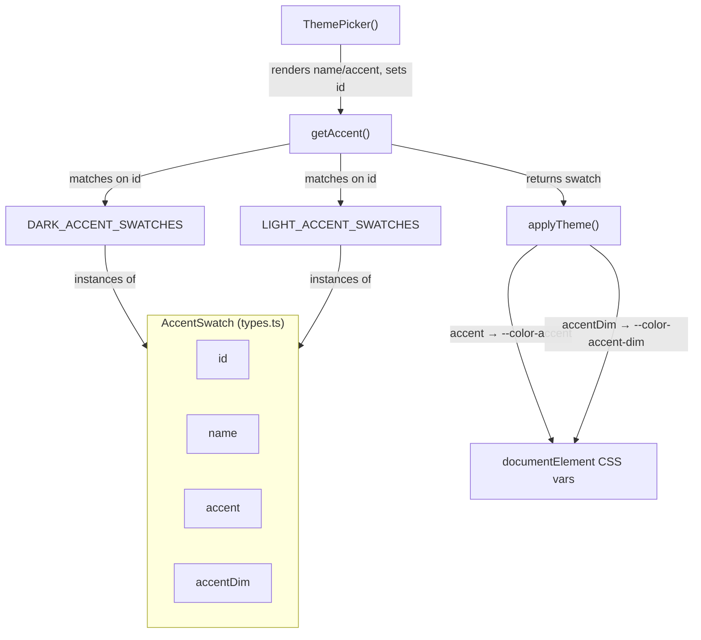

# Dashboard theme type contracts (AccentSwatch)

The dashboard's theming layer. `types.ts` declares the *data shapes* — most load-bearingly `AccentSwatch` — that the preset tables, the theme engine, and the theme picker all agree on. This is peripheral to Understand-Anything's code-comprehension engine (it colors the React Flow graph UI, not the analysis), but it is the small, static schema that turns a user's accent choice into CSS custom properties on `document.documentElement`.

## Overview

An `AccentSwatch` is a plain, closed record: an `id` (the machine key persisted in config), a human-readable `name` (the button tooltip), and a pair of accent colors — `accent` and `accentDim` (plus `accentBright`, outside this subgraph). The key design idea is that the *type* is the contract and the *presets* are the only data: swatch objects are authored once as constant arrays ([`DARK_ACCENT_SWATCHES`](../catalog/understand-anything-plugin/packages/dashboard/src/themes/presets.ts.md#DARK_ACCENT_SWATCHES), [`LIGHT_ACCENT_SWATCHES`](../catalog/understand-anything-plugin/packages/dashboard/src/themes/presets.ts.md#LIGHT_ACCENT_SWATCHES)), looked up by `id` at runtime ([`getAccent`](../catalog/understand-anything-plugin/packages/dashboard/src/themes/presets.ts.md#getAccent)), rendered as buttons ([`ThemePicker`](../catalog/understand-anything-plugin/packages/dashboard/src/components/ThemePicker.tsx.md#ThemePicker)), and written to CSS variables ([`applyTheme`](../catalog/understand-anything-plugin/packages/dashboard/src/themes/theme-engine.ts.md#applyTheme)). Nothing computes a swatch; they are declared, selected, and applied.

## Diagram

## Design rationale (why it's built this way)

The whole theming subsystem is a **data-plus-lookup** design rather than a class hierarchy or a color-math library, and the shape of `AccentSwatch` is what makes that cheap. Because `id` is a distinct field from the display `name`, the persisted config can store a stable key (e.g. `"gold"`) while the UI shows a translatable label — the palette can be re-skinned or renamed without breaking saved preferences ([`id`](../catalog/understand-anything-plugin/packages/dashboard/src/themes/types.ts.md#AccentSwatch.id), [`name`](../catalog/understand-anything-plugin/packages/dashboard/src/themes/types.ts.md#AccentSwatch.name)).

Splitting `accent` from `accentDim` (and `accentBright`) rather than deriving them at runtime is a deliberate authoring choice: each preset carries a hand-tuned triple so the light and dark palettes can diverge (the dark "gold" swatch and the light "indigo" swatch are unrelated colors, not one hue at different lightnesses). The engine still derives *further* values from `accent` at apply time, but the primary shades are fixed in the data ([`accent`](../catalog/understand-anything-plugin/packages/dashboard/src/themes/types.ts.md#AccentSwatch.accent), [`accentDim`](../catalog/understand-anything-plugin/packages/dashboard/src/themes/types.ts.md#AccentSwatch.accentDim)).

> [!inferred]
> `AccentSwatch` being an `interface` (structural type) rather than a class means the constant object literals in `presets.ts` *are* valid swatches with no constructor call — the type exists only at compile time and vanishes at runtime. This is why the "calls/refs" edges to `id`/`name`/`accent`/`accentDim` are property reads on plain objects, not method dispatch.

## Entry points

- [`getAccent`](../catalog/understand-anything-plugin/packages/dashboard/src/themes/presets.ts.md#getAccent) — the runtime resolver. Given a preset and an `accentId`, it searches the preset's swatch array for a matching [`id`](../catalog/understand-anything-plugin/packages/dashboard/src/themes/types.ts.md#AccentSwatch.id), falling back to the preset default and finally the first swatch. Control reaches it whenever a theme is applied or the accent changes.
- [`ThemePicker`](../catalog/understand-anything-plugin/packages/dashboard/src/components/ThemePicker.tsx.md#ThemePicker) — the React component reached when the user opens the theme menu. It maps over `preset.accentSwatches`, rendering each as a color dot whose background is the swatch [`accent`](../catalog/understand-anything-plugin/packages/dashboard/src/themes/types.ts.md#AccentSwatch.accent) and whose tooltip is [`name`](../catalog/understand-anything-plugin/packages/dashboard/src/themes/types.ts.md#AccentSwatch.name), calling `setAccent(swatch.id)` on click.

## Mechanism (step-by-step)

1. **Author the palette as typed constants.** Swatch data lives in two arrays, [`DARK_ACCENT_SWATCHES`](../catalog/understand-anything-plugin/packages/dashboard/src/themes/presets.ts.md#DARK_ACCENT_SWATCHES) and [`LIGHT_ACCENT_SWATCHES`](../catalog/understand-anything-plugin/packages/dashboard/src/themes/presets.ts.md#LIGHT_ACCENT_SWATCHES), each element an object literal that satisfies the `AccentSwatch` shape. This is the only place swatch colors exist; there is no generation step.

2. **Present and select by identity.** [`ThemePicker`](../catalog/understand-anything-plugin/packages/dashboard/src/components/ThemePicker.tsx.md#ThemePicker) reads each swatch's [`name`](../catalog/understand-anything-plugin/packages/dashboard/src/themes/types.ts.md#AccentSwatch.name) and [`accent`](../catalog/understand-anything-plugin/packages/dashboard/src/themes/types.ts.md#AccentSwatch.accent) to draw the picker, and persists only the chosen [`id`](../catalog/understand-anything-plugin/packages/dashboard/src/themes/types.ts.md#AccentSwatch.id) — the small, stable handle — into config.

3. **Resolve the id back to a swatch.** [`getAccent`](../catalog/understand-anything-plugin/packages/dashboard/src/themes/presets.ts.md#getAccent) turns the stored `accentId` back into a concrete swatch by matching on [`id`](../catalog/understand-anything-plugin/packages/dashboard/src/themes/types.ts.md#AccentSwatch.id), with a two-level fallback so a stale or unknown id never yields `undefined`.

4. **Write colors into the DOM.** [`applyTheme`](../catalog/understand-anything-plugin/packages/dashboard/src/themes/theme-engine.ts.md#applyTheme) takes the resolved swatch and sets CSS custom properties — the swatch's [`accent`](../catalog/understand-anything-plugin/packages/dashboard/src/themes/types.ts.md#AccentSwatch.accent) becomes `--color-accent` and [`accentDim`](../catalog/understand-anything-plugin/packages/dashboard/src/themes/types.ts.md#AccentSwatch.accentDim) becomes `--color-accent-dim` on `document.documentElement`, after which it derives additional values from the accent and toggles the `data-theme` attribute.

## Key data structures

`AccentSwatch` is the single structure here. The two fields that carry the most weight are the identity/label split — [`id`](../catalog/understand-anything-plugin/packages/dashboard/src/themes/types.ts.md#AccentSwatch.id) is the persisted, matched-on key while [`name`](../catalog/understand-anything-plugin/packages/dashboard/src/themes/types.ts.md#AccentSwatch.name) is purely presentational — and the color pair [`accent`](../catalog/understand-anything-plugin/packages/dashboard/src/themes/types.ts.md#AccentSwatch.accent)/[`accentDim`](../catalog/understand-anything-plugin/packages/dashboard/src/themes/types.ts.md#AccentSwatch.accentDim), the raw hex values fed to the CSS variables. Arrays of these ([`DARK_ACCENT_SWATCHES`](../catalog/understand-anything-plugin/packages/dashboard/src/themes/presets.ts.md#DARK_ACCENT_SWATCHES), [`LIGHT_ACCENT_SWATCHES`](../catalog/understand-anything-plugin/packages/dashboard/src/themes/presets.ts.md#LIGHT_ACCENT_SWATCHES)) are the palette; `ThemePreset.accentSwatches` (outside this subgraph) embeds one such array per preset.

## Dynamics (design intent)

There is no concurrency or ordering subtlety — this is synchronous UI state. The intended flow is one-directional: user selection in [`ThemePicker`](../catalog/understand-anything-plugin/packages/dashboard/src/components/ThemePicker.tsx.md#ThemePicker) → stored `id` → [`getAccent`](../catalog/understand-anything-plugin/packages/dashboard/src/themes/presets.ts.md#getAccent) resolution → [`applyTheme`](../catalog/understand-anything-plugin/packages/dashboard/src/themes/theme-engine.ts.md#applyTheme) DOM write. The design keeps the durable state as narrow as possible (an `id` string) and reconstitutes the full swatch on demand.

## Edge cases

The one that matters lives in [`getAccent`](../catalog/understand-anything-plugin/packages/dashboard/src/themes/presets.ts.md#getAccent): an `accentId` that no swatch matches falls back to the preset's `defaultAccentId`, and if *that* also fails, to the first swatch in the array. So a config referencing a since-removed accent (or a swatch id valid in one preset but not another) degrades gracefully to a sensible color rather than erroring — a real concern because the same `id` values (`"ocean"`, `"rose"`, `"emerald"`) appear in *both* [`DARK_ACCENT_SWATCHES`](../catalog/understand-anything-plugin/packages/dashboard/src/themes/presets.ts.md#DARK_ACCENT_SWATCHES) and [`LIGHT_ACCENT_SWATCHES`](../catalog/understand-anything-plugin/packages/dashboard/src/themes/presets.ts.md#LIGHT_ACCENT_SWATCHES) while `"gold"`/`"indigo"`/`"slate"`/`"silver"` do not, so switching preset can invalidate the stored accent.

## Open questions

- `accentBright` is part of the real `AccentSwatch` interface and is consumed by [`applyTheme`](../catalog/understand-anything-plugin/packages/dashboard/src/themes/theme-engine.ts.md#applyTheme) (as `--color-accent-bright`), but it is not in this packet's subgraph, so its downstream use is only visible in the source, not citable here.
- Where and how the chosen `id` is persisted across sessions (localStorage vs. in-memory Zustand store) is outside this subgraph — the `useTheme` hook that `ThemePicker` calls is not present here.

## See also

- [`understand-anything-plugin-packages-core-src-analyzer-graph-builder.ts`](./understand-anything-plugin-packages-core-src-analyzer-graph-builder.ts.md) — the actual code-comprehension engine this theming layer merely decorates.
- [`understand-anything-plugin-packages-core-src-persistence-index.ts`](./understand-anything-plugin-packages-core-src-persistence-index.ts.md) — how the analysis (not the theme) is persisted.
