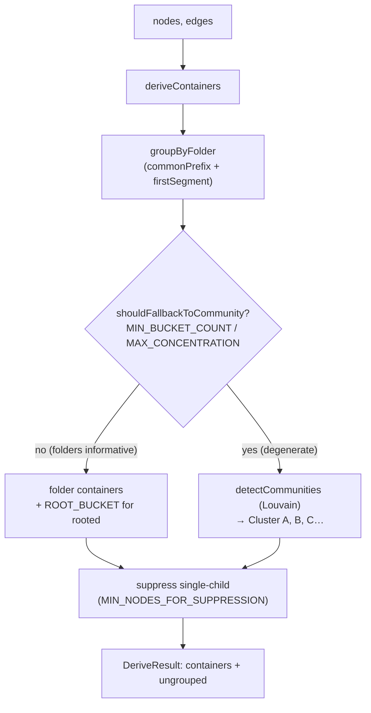

# Container derivation — grouping graph nodes into legible boxes

## Overview
When the dashboard draws a layer of the knowledge graph, it does not scatter bare nodes across the canvas — it first groups them into a handful of **containers** (the visual boxes that ELK later lays out). This file is the policy that decides *what those groups are*. The key idea is a two-tier strategy with a graceful fallback: group by **folder structure** because that is the organization a human already authored and usually the most legible one, but when folders turn out to be uninformative — a flat repo, or one mega-folder swallowing everything — fall back to **structural community detection** (Louvain) over the actual dependency edges to recover the graph's emergent clusters. [`deriveContainers`](../catalog/understand-anything-plugin/packages/dashboard/src/utils/containers.ts.md#deriveContainers) is the whole decision, packaged as one pure function from `(nodes, edges)` to a [`DeriveResult`](../catalog/understand-anything-plugin/packages/dashboard/src/utils/containers.ts.md#DeriveResult). For the code-comprehension lens, this is the mesoscale layer of the map: it turns a flat node soup into the "chapters" a reader navigates.

## Diagram

## Design rationale (why it's built this way)
The load-bearing decision is *when to distrust the folder tree*. Folders are used first because they encode intent for free, but they are only useful if they actually partition the graph. [`shouldFallbackToCommunity`](../catalog/understand-anything-plugin/packages/dashboard/src/utils/containers.ts.md#shouldFallbackToCommunity) encodes two failure modes: too few buckets (fewer than [`MIN_BUCKET_COUNT`](../catalog/understand-anything-plugin/packages/dashboard/src/utils/containers.ts.md#MIN_BUCKET_COUNT) = 2, i.e. everything landed in one box, which explains nothing) and over-concentration (any single bucket holding more than [`MAX_CONCENTRATION`](../catalog/understand-anything-plugin/packages/dashboard/src/utils/containers.ts.md#MAX_CONCENTRATION) = 70% of nodes, so the grouping is nearly trivial). Either way it hands off to [`detectCommunities`](../catalog/understand-anything-plugin/packages/dashboard/src/utils/louvain.ts.md#detectCommunities), which ignores paths entirely and clusters on the dependency topology.

A second subtle decision is how folders are turned into names. The author does not group by the *full* directory — they first strip the longest common prefix, so a monorepo at `monorepo/backend/src/auth/…` still groups on `auth`, not on the shared boilerplate. Crucially, [`commonPrefix`](../catalog/understand-anything-plugin/packages/dashboard/src/utils/containers.ts.md#commonPrefix) computes the LCP over the *directory* portion only, and its docstring calls out exactly why: "Using dirs (not full paths) avoids consuming the only folder segment when all paths sit directly under the same folder (e.g. `[auth/x, auth/y]` → LCP `""`, so we still group on `auth`)." Taking the LCP of full paths would eat the `auth/` segment and destroy the grouping.

> [!inferred]
> The naming code for community clusters (`Cluster A`, `Cluster B`, … then numeric past 26) exists because `String.fromCharCode(65 + i)` wraps into `[`, `\`, `]` once `i` exceeds 25 — the inline comment on [`deriveContainers`](../catalog/understand-anything-plugin/packages/dashboard/src/utils/containers.ts.md#deriveContainers) states this is deliberately avoided. This is a cosmetic robustness guard for large graphs, not part of the grouping logic.

## Entry points
- [`deriveContainers`](../catalog/understand-anything-plugin/packages/dashboard/src/utils/containers.ts.md#deriveContainers) — the single public function and the whole subsystem. It is reached during the dashboard's structural build: [`useLayerDetailTopology`](../catalog/understand-anything-plugin/packages/dashboard/src/components/GraphView.tsx.md#useLayerDetailTopology) calls it inside a synchronous `useMemo` whenever the inputs that drive grouping change (active layer, detail level, filters), *before* the async ELK layout. Its docstring names the pipeline: "Topology hook: derives containers, aggregates inter-container edges, then" lays out. It returns a [`DeriveResult`](../catalog/understand-anything-plugin/packages/dashboard/src/utils/containers.ts.md#DeriveResult) that downstream code turns into visual boxes.
- [`useLayerDetailGraph`](../catalog/understand-anything-plugin/packages/dashboard/src/components/GraphView.tsx.md#useLayerDetailGraph) — the consumer one layer up. It calls the topology hook and, for each *expanded* container, reads back the container's [`nodeIds`](../catalog/understand-anything-plugin/packages/dashboard/src/utils/containers.ts.md#DerivedContainer.nodeIds) to materialize child nodes from the layout cache. Its docstring frames it as a "Visual overlay: cheap O(n) pass that applies selection, search, and tour" state on top of the already-derived structure — i.e. containers are computed once by the topology hook and merely decorated here.

## Mechanism (step-by-step)
1. **Guard and bucket by folder.** With a non-empty node list, [`deriveContainers`](../catalog/understand-anything-plugin/packages/dashboard/src/utils/containers.ts.md#deriveContainers) first delegates to `groupByFolder`, which strips the shared directory prefix (via [`commonPrefix`](../catalog/understand-anything-plugin/packages/dashboard/src/utils/containers.ts.md#commonPrefix)) and assigns each node to its first path segment ([`firstSegment`](../catalog/understand-anything-plugin/packages/dashboard/src/utils/containers.ts.md#firstSegment)). Nodes with no `filePath`, or whose stripped path has no further `/` (they sit directly under the LCP), are set aside into the `rooted` list — these have no natural folder box.
2. **Decide whether folders are trustworthy.** The result feeds [`shouldFallbackToCommunity`](../catalog/understand-anything-plugin/packages/dashboard/src/utils/containers.ts.md#shouldFallbackToCommunity). It counts the effective buckets (folder [`groups`](../catalog/understand-anything-plugin/packages/dashboard/src/utils/containers.ts.md#groupByFolder.typeLiteral23.groups) plus one for [`rooted`](../catalog/understand-anything-plugin/packages/dashboard/src/utils/containers.ts.md#groupByFolder.typeLiteral23.rooted) if non-empty) and returns `true` if there are fewer than [`MIN_BUCKET_COUNT`](../catalog/understand-anything-plugin/packages/dashboard/src/utils/containers.ts.md#MIN_BUCKET_COUNT), or if any single bucket exceeds [`MAX_CONCENTRATION`](../catalog/understand-anything-plugin/packages/dashboard/src/utils/containers.ts.md#MAX_CONCENTRATION) of all nodes. This is the branch point between the two strategies.
3. **Community path (fallback).** When folders are degenerate, [`detectCommunities`](../catalog/understand-anything-plugin/packages/dashboard/src/utils/louvain.ts.md#detectCommunities) runs Louvain over the node set and the real edges, returning a node→community-id map. `deriveContainers` inverts that map into per-community node lists, sorts by community id for stable ordering, and emits one container each with a synthetic `id` (`container:cluster-<cid>`), a human [`name`](../catalog/understand-anything-plugin/packages/dashboard/src/utils/containers.ts.md#DerivedContainer.name) (`Cluster A…Z` then numeric), the member [`nodeIds`](../catalog/understand-anything-plugin/packages/dashboard/src/utils/containers.ts.md#DerivedContainer.nodeIds), and [`strategy`](../catalog/understand-anything-plugin/packages/dashboard/src/utils/containers.ts.md#DerivedContainer.strategy) `"community"`.
4. **Folder path (default).** Otherwise it emits one container per folder segment (`id` = `container:<seg>`, `name` = the segment, `strategy` `"folder"`), and if any `rooted` nodes exist, appends a catch-all container named [`ROOT_BUCKET`](../catalog/understand-anything-plugin/packages/dashboard/src/utils/containers.ts.md#ROOT_BUCKET) (`"~"`) holding them. This keeps the top-level/loose files visible instead of dropping them.
5. **Suppress single-child boxes.** Finally, unless the layer is tiny, any container with exactly one member is dissolved: its lone node is pushed into [`ungrouped`](../catalog/understand-anything-plugin/packages/dashboard/src/utils/containers.ts.md#DeriveResult.ungrouped) and the box removed. The tiny-layer skip is gated on [`MIN_NODES_FOR_SUPPRESSION`](../catalog/understand-anything-plugin/packages/dashboard/src/utils/containers.ts.md#MIN_NODES_FOR_SUPPRESSION) (3) — with only a couple of nodes, even a single-item box carries useful folder context worth keeping. The function returns the surviving [`containers`](../catalog/understand-anything-plugin/packages/dashboard/src/utils/containers.ts.md#DeriveResult.containers) plus the `ungrouped` list.

## Key data structures
[`DerivedContainer`](../catalog/understand-anything-plugin/packages/dashboard/src/utils/containers.ts.md#DerivedContainer) is the output unit — a visual box. Its [`id`](../catalog/understand-anything-plugin/packages/dashboard/src/utils/containers.ts.md#DerivedContainer.id) is a synthetic namespaced string (`container:…`) that later becomes a React Flow parent node id; its [`nodeIds`](../catalog/understand-anything-plugin/packages/dashboard/src/utils/containers.ts.md#DerivedContainer.nodeIds) list is what child-node materialization and edge aggregation read; and [`strategy`](../catalog/understand-anything-plugin/packages/dashboard/src/utils/containers.ts.md#DerivedContainer.strategy) records *how* the box was formed (`"folder"` vs `"community"`), which the UI can surface. [`DeriveResult`](../catalog/understand-anything-plugin/packages/dashboard/src/utils/containers.ts.md#DeriveResult) pairs the [`containers`](../catalog/understand-anything-plugin/packages/dashboard/src/utils/containers.ts.md#DeriveResult.containers) with an [`ungrouped`](../catalog/understand-anything-plugin/packages/dashboard/src/utils/containers.ts.md#DeriveResult.ungrouped) escape hatch so no node is ever silently lost. The intermediate `groupByFolder` shape — [`groups`](../catalog/understand-anything-plugin/packages/dashboard/src/utils/containers.ts.md#groupByFolder.typeLiteral23.groups) (segment → node ids) and [`rooted`](../catalog/understand-anything-plugin/packages/dashboard/src/utils/containers.ts.md#groupByFolder.typeLiteral23.rooted) — is the raw material both the fallback decision and the folder-container build consume.

## Dynamics (design intent)
The function is pure and synchronous by design: the consuming comment on [`useLayerDetailTopology`](../catalog/understand-anything-plugin/packages/dashboard/src/components/GraphView.tsx.md#useLayerDetailTopology) states the "Structural build (synchronous): filtering + containers + nodes/edges pre-layout … The only async piece is the ELK call below." So derivation always completes in one memoized pass before layout, and re-runs only when its driving inputs change. The test suite for the folder strategy (`containers.test.ts`) pins the intended behavior: nodes are grouped by the first folder segment after the LCP, a deep shared prefix like `monorepo/backend/src/` is stripped, and nested folders collapse into their first segment — confirming the "group on the segment that actually differentiates" intent rather than raw directory names.

## Edge cases
- **Empty input** short-circuits to `{ containers: [], ungrouped: [] }` before any grouping runs — see [`deriveContainers`](../catalog/understand-anything-plugin/packages/dashboard/src/utils/containers.ts.md#deriveContainers).
- **Flat / single-folder repos** trip the `bucketCount < MIN_BUCKET_COUNT` guard in [`shouldFallbackToCommunity`](../catalog/understand-anything-plugin/packages/dashboard/src/utils/containers.ts.md#shouldFallbackToCommunity) and are clustered structurally instead — folders that don't partition anything are abandoned in favor of edges.
- **One dominant folder** (>70% of nodes) also forces the community path via [`MAX_CONCENTRATION`](../catalog/understand-anything-plugin/packages/dashboard/src/utils/containers.ts.md#MAX_CONCENTRATION), even if there are several folders, so a single mega-directory can't reduce the map to one giant box plus scraps.
- **Nodes without a file path** never vanish: they fall into the [`ROOT_BUCKET`](../catalog/understand-anything-plugin/packages/dashboard/src/utils/containers.ts.md#ROOT_BUCKET) `"~"` container on the folder path.
- **Tiny layers** (< [`MIN_NODES_FOR_SUPPRESSION`](../catalog/understand-anything-plugin/packages/dashboard/src/utils/containers.ts.md#MIN_NODES_FOR_SUPPRESSION)) skip single-child suppression, keeping small boxes that would otherwise be dissolved into [`ungrouped`](../catalog/understand-anything-plugin/packages/dashboard/src/utils/containers.ts.md#DeriveResult.ungrouped).

## Open questions
- How ties in Louvain community ids interact with the `Cluster A/B/…` naming across re-renders is not settled in this file — the sort is by numeric community id, but whether ids are stable run-to-run lives inside [`detectCommunities`](../catalog/understand-anything-plugin/packages/dashboard/src/utils/louvain.ts.md#detectCommunities) / graphology, not here.
- Inter-container edge aggregation and how `ungrouped` nodes are ultimately placed on the canvas happen in the GraphView topology hook and layout utilities, outside this subgraph; the `aggregateContainerEdges` import seen in `GraphView.tsx` is the seam but is not cited here.

## See also
- [graph-builder](./understand-anything-plugin-packages-core-src-analyzer-graph-builder.ts.md) — builds the knowledge graph (nodes/edges) this util later groups for display.
- [normalize-graph](./understand-anything-plugin-packages-core-src-analyzer-normalize-graph.ts.md) — normalization of that same graph upstream of the dashboard.
