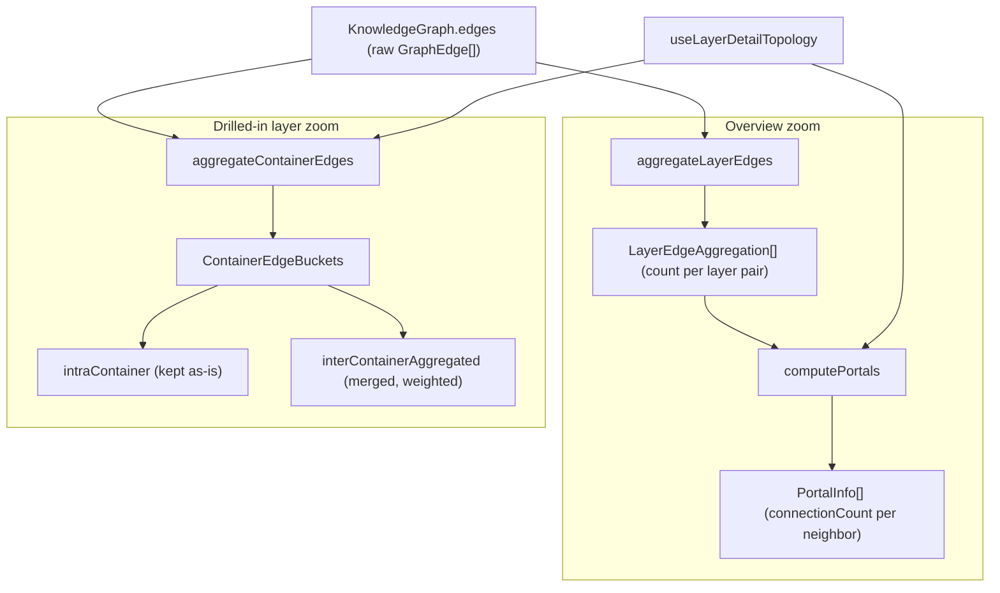

# Edge aggregation — collapsing the code graph into a legible dashboard

<!-- connect:up:begin -->
> **Cross-repo concept:** part of [symbol-graph](../../../concepts/symbol-graph.md) across this wiki's repos.
<!-- connect:up:end -->
## Overview
A real codebase graph has far too many edges to draw. A single "layer" (an
architectural cluster of files) can touch another layer through hundreds of
individual `calls`/`imports`/`contains` edges, and rendering each one produces a
hairball no human can read. This module is the dashboard's answer: it takes the
raw edge list of the [`KnowledgeGraph`](../catalog/understand-anything-plugin/packages/dashboard/src/components/GraphView.tsx.md#useLayerDetailTopology)
and **collapses many concrete edges into one weighted summary edge per group**,
carrying a `count` and the set of edge types that were merged. The key design
idea is *bucketing by containment*: an edge is either kept verbatim because it
stays inside one group (`intraContainer`), or merged into a single fat edge
because it crosses a boundary ([`interContainerAggregated`](../catalog/understand-anything-plugin/packages/dashboard/src/utils/edgeAggregation.ts.md#ContainerEdgeBuckets.interContainerAggregated)).
The same collapse-and-count pattern is applied at two zoom levels — between
*layers* (overview) via [`aggregateLayerEdges`](../catalog/understand-anything-plugin/packages/dashboard/src/utils/edgeAggregation.ts.md#aggregateLayerEdges),
and between *containers* inside a drilled-in layer via [`aggregateContainerEdges`](../catalog/understand-anything-plugin/packages/dashboard/src/utils/edgeAggregation.ts.md#aggregateContainerEdges) —
and [`computePortals`](../catalog/understand-anything-plugin/packages/dashboard/src/utils/edgeAggregation.ts.md#computePortals)
reuses the layer aggregation to show, from inside one layer, "which other layers
do I connect to and how strongly."

## Diagram

## Design rationale (why it's built this way)
The whole module exists to trade *edge fidelity* for *legibility*: the dashboard
never needs to draw every dependency, it needs to draw a picture an engineer can
reason about, so edges that would visually overlap are replaced by one edge whose
weight says "this connection is heavy." The `count` field on
[`LayerEdgeAggregation`](../catalog/understand-anything-plugin/packages/dashboard/src/utils/edgeAggregation.ts.md#LayerEdgeAggregation.count)
is exactly that weight — it lets the renderer size or label an edge by how many
concrete relationships it stands for, so information is *summarized*, not thrown
away.

The two aggregators make a deliberately different choice about **direction**, and
that difference is the most non-obvious thing here. `aggregateLayerEdges` builds a
*canonical* key by sorting the two layer ids (`sourceLayer < targetLayer ? [a,b] : [b,a]`),
so `A→B` and `B→A` **merge into one undirected pair** — appropriate for an
overview where you only want to know two layers are coupled. `aggregateContainerEdges`
does the opposite: its docstring states *"Direction is significant: A→B and B→A
produce two independent aggregated edges"*, so it keys on the ordered
`(source, target)` pair. The drilled-in view wants to show direction of
dependency; the overview does not. Same pattern, opposite invariant, chosen per
zoom level.

A small but telling detail is the key construction in
[`aggregateContainerEdges`](../catalog/understand-anything-plugin/packages/dashboard/src/utils/edgeAggregation.ts.md#aggregateContainerEdges):
the source id is **length-prefixed** (`${sc.length}:${sc} ${tc}`) with the inline
comment *"so container ids containing the separator can't produce key collisions
(\"X Y\" + \"Z\" vs \"X\" + \"Y Z\")."* Because container ids are arbitrary
strings that may themselves contain a space, a naive `` `${sc} ${tc}` `` key
would conflate distinct pairs; the length prefix makes the concatenation
unambiguously parseable. The layer aggregator does not need this because it joins
with `|` on ids it treats as opaque and never has to split them back apart — the
map value carries the ids explicitly.

## Entry points
- [`useLayerDetailTopology`](../catalog/understand-anything-plugin/packages/dashboard/src/components/GraphView.tsx.md#useLayerDetailTopology) —
  the React hook that drives the drilled-in view. Its own docstring says it
  *"derives containers, aggregates inter-container edges, then …"* lays out the
  result. This is where control reaches container aggregation: when a user drills
  into a layer, the hook resolves each node to its container and calls
  [`aggregateContainerEdges`](../catalog/understand-anything-plugin/packages/dashboard/src/utils/edgeAggregation.ts.md#aggregateContainerEdges)
  plus [`computePortals`](../catalog/understand-anything-plugin/packages/dashboard/src/utils/edgeAggregation.ts.md#computePortals)
  to build the visible topology.
- [`useOverviewGraph`](../catalog/understand-anything-plugin/packages/dashboard/src/components/GraphView.tsx.md#useOverviewGraph) —
  the top-level graph hook, reached when no layer is drilled into. It builds one
  cluster node per layer and calls [`aggregateLayerEdges`](../catalog/understand-anything-plugin/packages/dashboard/src/utils/edgeAggregation.ts.md#aggregateLayerEdges)
  to draw the weighted inter-layer connections; the module namespace
  `GraphView.tsx`
  imports all three aggregation functions, confirming this file is the graph
  component's edge-reduction toolkit.
- [`aggregateContainerEdges`](../catalog/understand-anything-plugin/packages/dashboard/src/utils/edgeAggregation.ts.md#aggregateContainerEdges) —
  also the direct entry point exercised by the unit test module
  `edgeAggregation.test.ts`,
  which pins its bucketing and merging contract.

## Mechanism (step-by-step)
1. **Build a node→group index once.** Both aggregators start by inverting the
   grouping. [`aggregateLayerEdges`](../catalog/understand-anything-plugin/packages/dashboard/src/utils/edgeAggregation.ts.md#aggregateLayerEdges)
   walks `graph.layers` and fills a `nodeToLayer` map so every subsequent edge can
   be classified by an O(1) lookup instead of a scan; `aggregateContainerEdges`
   receives the equivalent `nodeToContainer` map ready-made from its caller. This
   is the step that turns "which group is this node in?" from a search into a
   lookup, which is what makes aggregating a large edge list cheap.
2. **Classify each edge as intra- or inter-group.** Iterating the edge list, the
   aggregator resolves both endpoints' groups; if either endpoint is ungrouped it
   is *silently skipped* (`if (!sc || !tc) continue`). When both endpoints land in
   the **same** group, the layer aggregator drops the edge entirely (an internal
   edge is not an inter-layer connection), whereas the container aggregator keeps
   it verbatim in [`intraContainer`](../catalog/understand-anything-plugin/packages/dashboard/src/utils/edgeAggregation.ts.md#ContainerEdgeBuckets.intraContainer) —
   the test *"preserves intra-container edges as-is"* locks this in. Inside a
   drilled-in layer you still want to see the fine-grained wiring; at the overview
   level you don't.
3. **Merge crossing edges into one weighted bucket.** For a boundary-crossing
   edge, a map keyed by the group pair accumulates the summary: an existing bucket
   has its [`count`](../catalog/understand-anything-plugin/packages/dashboard/src/utils/edgeAggregation.ts.md#LayerEdgeAggregation.count)
   incremented and the edge's `type` added to an `edgeTypes` `Set`; a new pair
   seeds a bucket at count 1. The `Set` de-duplicates types so a pair that is
   connected by fifty `calls` and three `imports` reports `edgeTypes: ["calls","imports"]`
   — the merge remembers *what kinds* of relationship it collapsed, not just how
   many. The test *"merges multiple same-direction inter edges into one"* asserts
   exactly this (count 3, `["calls","imports"]`).
4. **Emit the collapsed edges.** The map values are materialized into the public
   shapes: `aggregateLayerEdges` returns [`LayerEdgeAggregation`](../catalog/understand-anything-plugin/packages/dashboard/src/utils/edgeAggregation.ts.md#LayerEdgeAggregation)
   rows with the `Set` converted to an array, and `aggregateContainerEdges`
   returns [`interContainerAggregated`](../catalog/understand-anything-plugin/packages/dashboard/src/utils/edgeAggregation.ts.md#ContainerEdgeBuckets.interContainerAggregated)
   alongside the preserved `intraContainer` list inside one [`ContainerEdgeBuckets`](../catalog/understand-anything-plugin/packages/dashboard/src/utils/edgeAggregation.ts.md#ContainerEdgeBuckets).
   From here the raw N edges have become a handful of weighted edges the layout
   engine can actually place.
5. **Project the layer aggregation into a per-layer "portal" view.**
   [`computePortals`](../catalog/understand-anything-plugin/packages/dashboard/src/utils/edgeAggregation.ts.md#computePortals)
   takes the already-computed [`LayerEdgeAggregation`](../catalog/understand-anything-plugin/packages/dashboard/src/utils/edgeAggregation.ts.md#LayerEdgeAggregation)
   list (accepting a `precomputed` argument to avoid recomputing it) and, for a
   given `activeLayerId`, folds every aggregation touching that layer into a
   `portalMap` keyed by the *other* layer. Because it checks both
   [`sourceLayerId`](../catalog/understand-anything-plugin/packages/dashboard/src/utils/edgeAggregation.ts.md#LayerEdgeAggregation.sourceLayerId)
   and [`targetLayerId`](../catalog/understand-anything-plugin/packages/dashboard/src/utils/edgeAggregation.ts.md#LayerEdgeAggregation.targetLayerId)
   against the active layer and sums the counts, it answers "from where I'm
   standing, which neighbors exist and how heavy is each door" — the `connectionCount`
   on each returned [`PortalInfo`](../catalog/understand-anything-plugin/packages/dashboard/src/utils/edgeAggregation.ts.md#PortalInfo).
   The `layerNameMap` resolves ids to human names, falling back to the id if a
   name is missing.

## Key data structures
- [`LayerEdgeAggregation`](../catalog/understand-anything-plugin/packages/dashboard/src/utils/edgeAggregation.ts.md#LayerEdgeAggregation) —
  one summarized undirected edge between two layers: the (canonically ordered)
  [`sourceLayerId`](../catalog/understand-anything-plugin/packages/dashboard/src/utils/edgeAggregation.ts.md#LayerEdgeAggregation.sourceLayerId)/[`targetLayerId`](../catalog/understand-anything-plugin/packages/dashboard/src/utils/edgeAggregation.ts.md#LayerEdgeAggregation.targetLayerId),
  a [`count`](../catalog/understand-anything-plugin/packages/dashboard/src/utils/edgeAggregation.ts.md#LayerEdgeAggregation.count)
  weight, and the merged `edgeTypes`.
- [`ContainerEdgeBuckets`](../catalog/understand-anything-plugin/packages/dashboard/src/utils/edgeAggregation.ts.md#ContainerEdgeBuckets) —
  the two-bucket result of container aggregation: `intraContainer` (untouched
  `GraphEdge[]`) plus [`interContainerAggregated`](../catalog/understand-anything-plugin/packages/dashboard/src/utils/edgeAggregation.ts.md#ContainerEdgeBuckets.interContainerAggregated)
  (a list of [`AggregatedContainerEdge`](../catalog/understand-anything-plugin/packages/dashboard/src/utils/edgeAggregation.ts.md#AggregatedContainerEdge),
  the directed counterpart of `LayerEdgeAggregation`).
- [`PortalInfo`](../catalog/understand-anything-plugin/packages/dashboard/src/utils/edgeAggregation.ts.md#PortalInfo) —
  the per-neighbor summary rendered as a "portal" node: which `layerId`/`layerName`
  is reachable from the active layer and its total `connectionCount`.

## Dynamics (design intent)
These are pure, synchronous functions over an in-memory graph — no I/O, no
concurrency. Their behavioral contract lives in
`edgeAggregation.test.ts`:
empty input yields empty buckets; same-container edges are preserved; cross-container
edges of any type merge by pair with a summed count and unioned type set; and
opposite directions are kept as *separate* aggregated edges. The direction
sensitivity of [`aggregateContainerEdges`](../catalog/understand-anything-plugin/packages/dashboard/src/utils/edgeAggregation.ts.md#aggregateContainerEdges)
is thus a tested invariant, not incidental.

> [!inferred]
> The `precomputed` parameter on `computePortals` plus the hook wiring in
> `useLayerDetailTopology` (which computes the aggregation and can pass it down)
> suggests the layer aggregation is intended to be computed once per render and
> shared between the overview edges and the portal projection, avoiding a second
> O(edges) pass. The source supports the *capability*; the exact call site that
> passes `precomputed` is outside this subgraph.

## Edge cases
- **Ungrouped endpoints are silently dropped.** The container aggregator's
  docstring is explicit: edges whose source or target has no `nodeToContainer`
  entry are skipped, and *"callers that need a strict mode should pre-filter."*
  This means the rendered edge weights can under-count if the grouping index is
  incomplete — an intentional lenience, documented on
  [`aggregateContainerEdges`](../catalog/understand-anything-plugin/packages/dashboard/src/utils/edgeAggregation.ts.md#aggregateContainerEdges).
- **Self-pairs never appear.** Same-group edges are removed from the inter-group
  output (dropped by the layer aggregator, diverted to `intraContainer` by the
  container aggregator), so no aggregated edge ever has equal source and target.
- **Separator collisions in container ids** are defused by the length-prefixed
  key; without it, ids containing a space could alias distinct pairs. The layer
  aggregator sidesteps the issue entirely by storing ids in the map value rather
  than parsing them back out of the key.
- **Missing layer names** degrade gracefully: `computePortals` falls back to the
  raw `layerId` as the display name rather than emitting `undefined`.

## Open questions
- The concrete `nodeToContainer` map and the container-derivation logic live in
  [`useLayerDetailTopology`](../catalog/understand-anything-plugin/packages/dashboard/src/components/GraphView.tsx.md#useLayerDetailTopology)
  (outside this file); how containers are defined (by directory, by class, by
  detail level) is not settled by this module's source alone.
- `findCrossLayerFileNodes` (present in the source file but not in this packet's
  subgraph) appears to complement the portals by drilling from an aggregated
  edge back to the individual crossing nodes; its exact UI role is out of scope
  here.

## See also
- [`understand-anything-plugin-packages-core-src-types.ts`](./understand-anything-plugin-packages-core-src-types.ts.md) — defines `GraphEdge`, `KnowledgeGraph`, and the edge `type` vocabulary these aggregators collapse.
- [`understand-anything-plugin-packages-core-src-analyzer-graph-builder.ts`](./understand-anything-plugin-packages-core-src-analyzer-graph-builder.ts.md) — builds the graph whose edges this module reduces for display.
