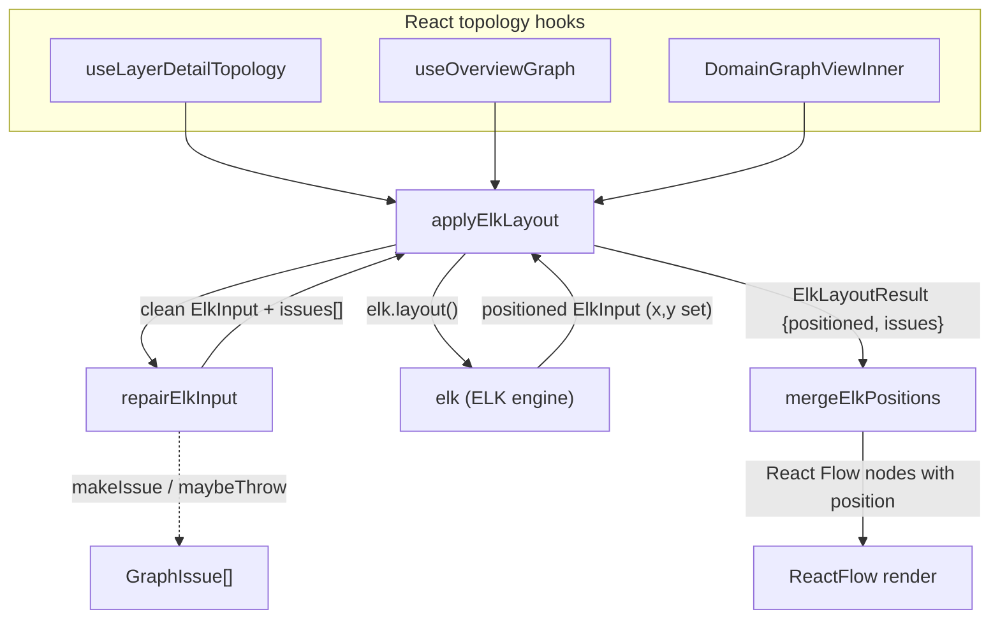

# ELK layout — defensive auto-layout for the code graph

The last hop between a knowledge graph and something a human can read. Understand-Anything turns a
codebase into a node/edge graph (files, classes, functions, layers, domains); this module takes that
graph — already shaped as a hierarchy of boxes — and asks the [elkjs](https://github.com/kieler/elkjs)
engine to compute *where every box goes*. Nobody hand-places nodes, so as a project scales from ten
files to three thousand, the picture stays legible without any human curation. That is the whole
comprehension-scaling bet of the dashboard: automatic layout is what lets the same UI survive a graph
that no person could arrange by hand.

## Overview

The module is deliberately thin and does exactly two things. First, [`repairElkInput`](../catalog/understand-anything-plugin/packages/dashboard/src/utils/elk-layout.ts.md#repairElkInput)
sanitizes an [`ElkInput`](../catalog/understand-anything-plugin/packages/dashboard/src/utils/elk-layout.ts.md#ElkInput)
graph — filling missing dimensions, removing duplicate ids, dropping orphan children/edges and
containment cycles — because a real code graph, assembled from static analysis, is *not* guaranteed to
satisfy ELK's structural preconditions. Second, [`applyElkLayout`](../catalog/understand-anything-plugin/packages/dashboard/src/utils/elk-layout.ts.md#applyElkLayout)
runs the repaired graph through the ELK engine to get `x`/`y` coordinates back, wrapping the whole thing
so a layout failure degrades to an empty-but-valid result instead of crashing the dashboard. The key
idea is **repair-then-layout with structured diagnostics**: every correction is recorded as a
`GraphIssue` rather than silently applied or fatally thrown, so the UI can surface "we cleaned up your
graph" warnings while still rendering.

## Diagram

## Design rationale (why it's built this way)

**Repair is a separate, pure step from layout.** The author split
[`repairElkInput`](../catalog/understand-anything-plugin/packages/dashboard/src/utils/elk-layout.ts.md#repairElkInput)
out of [`applyElkLayout`](../catalog/understand-anything-plugin/packages/dashboard/src/utils/elk-layout.ts.md#applyElkLayout)
so the (synchronous, testable) sanitization can be exercised in isolation — the test file
`elk-layout.test.ts`
calls `repairElkInput` directly to assert each repair independently, without spinning up the async ELK
engine. Repair returns a [`RepairResult`](../catalog/understand-anything-plugin/packages/dashboard/src/utils/elk-layout.ts.md#RepairResult)
carrying both the cleaned [`input`](../catalog/understand-anything-plugin/packages/dashboard/src/utils/elk-layout.ts.md#RepairResult.input)
and the accumulated [`issues`](../catalog/understand-anything-plugin/packages/dashboard/src/utils/elk-layout.ts.md#RepairResult.issues),
never mutating the caller's graph.

**Diagnostics over silent fixes or hard failures.** Rather than either quietly patching a malformed
graph or throwing, each repair records a leveled [`makeIssue`](../catalog/understand-anything-plugin/packages/dashboard/src/utils/elk-layout.ts.md#makeIssue)
(`"auto-corrected"` for fills/dedupes, `"dropped"` for removals). This is the comprehension hook: the
dashboard can tell the user "your graph had 3 duplicate ids" instead of showing a subtly wrong picture.
[`maybeThrow`](../catalog/understand-anything-plugin/packages/dashboard/src/utils/elk-layout.ts.md#maybeThrow)
converts that same issue into an exception *only* when [`strict`](../catalog/understand-anything-plugin/packages/dashboard/src/utils/elk-layout.ts.md#RepairOptions.strict)
is set — the callers pass `strict: import.meta.env.DEV`, so a developer sees loud failures during
development while production users get a repaired render plus a warning banner.

**Dimension defaults are pinned to the rest of the layout system.** A comment in the source states the
intent: keep ELK's fallback dimensions "in lockstep with the dagre/force NODE dimensions in
utils/layout.ts so layouts stay collision-consistent during the migration." Accordingly
[`DEFAULT_NODE_WIDTH`](../catalog/understand-anything-plugin/packages/dashboard/src/utils/elk-layout.ts.md#DEFAULT_NODE_WIDTH)
and [`DEFAULT_NODE_HEIGHT`](../catalog/understand-anything-plugin/packages/dashboard/src/utils/elk-layout.ts.md#DEFAULT_NODE_HEIGHT)
are aliases of the shared [`NODE_WIDTH`](../catalog/understand-anything-plugin/packages/dashboard/src/utils/layout.ts.md#NODE_WIDTH)
(280) and [`NODE_HEIGHT`](../catalog/understand-anything-plugin/packages/dashboard/src/utils/layout.ts.md#NODE_HEIGHT)
(120) constants, not fresh magic numbers — so a node ELK sizes by default lines up with one dagre would
have sized.

## Entry points

- [`applyElkLayout`](../catalog/understand-anything-plugin/packages/dashboard/src/utils/elk-layout.ts.md#applyElkLayout)
  — the async public entry every view calls. Control reaches it from the React topology hooks after they
  have built the structural graph synchronously: [`useLayerDetailTopology`](../catalog/understand-anything-plugin/packages/dashboard/src/components/GraphView.tsx.md#useLayerDetailTopology)
  (file/class layer views), [`useOverviewGraph`](../catalog/understand-anything-plugin/packages/dashboard/src/components/GraphView.tsx.md#useOverviewGraph)
  (the layer-cluster overview), and [`DomainGraphViewInner`](../catalog/understand-anything-plugin/packages/dashboard/src/components/DomainGraphView.tsx.md#DomainGraphViewInner)
  (domain/flow views). Each builds nodes/edges/dims in a `useMemo`, then runs `applyElkLayout` inside a
  `useEffect` — the async layout is the one piece kept off the synchronous render path.

- [`repairElkInput`](../catalog/understand-anything-plugin/packages/dashboard/src/utils/elk-layout.ts.md#repairElkInput)
  — the sanitization entry, callable on its own and invoked first by `applyElkLayout`. It is also the
  direct target of the unit suite `elk-layout.test.ts`,
  which pins the behavior of each individual repair.

## Mechanism (step-by-step)

1. **Build the layout request upstream.** Before this module runs, a view hook such as
   [`useLayerDetailTopology`](../catalog/understand-anything-plugin/packages/dashboard/src/components/GraphView.tsx.md#useLayerDetailTopology)
   derives containers and inter-container edges and shapes them into an [`ElkInput`](../catalog/understand-anything-plugin/packages/dashboard/src/utils/elk-layout.ts.md#ElkInput):
   a root [`id`](../catalog/understand-anything-plugin/packages/dashboard/src/utils/elk-layout.ts.md#ElkChild.id),
   a tree of [`children`](../catalog/understand-anything-plugin/packages/dashboard/src/utils/elk-layout.ts.md#ElkInput.children)
   ([`ElkChild`](../catalog/understand-anything-plugin/packages/dashboard/src/utils/elk-layout.ts.md#ElkChild)
   boxes with optional [`width`](../catalog/understand-anything-plugin/packages/dashboard/src/utils/elk-layout.ts.md#ElkChild.width)/[`height`](../catalog/understand-anything-plugin/packages/dashboard/src/utils/elk-layout.ts.md#ElkChild.height)
   and nested [`children`](../catalog/understand-anything-plugin/packages/dashboard/src/utils/elk-layout.ts.md#ElkChild.children)),
   and a flat list of [`edges`](../catalog/understand-anything-plugin/packages/dashboard/src/utils/elk-layout.ts.md#ElkInput.edges).
   This nested structure is what lets ELK do *hierarchical* layout — containers laid out as boxes that
   themselves contain laid-out children — which is how a large graph stays readable as clusters rather
   than one flat hairball.

2. **Sanitize in five ordered passes.** [`repairElkInput`](../catalog/understand-anything-plugin/packages/dashboard/src/utils/elk-layout.ts.md#repairElkInput)
   walks the tree five times, order-sensitively: (1) `fillDims` recurses and stamps
   [`DEFAULT_NODE_WIDTH`](../catalog/understand-anything-plugin/packages/dashboard/src/utils/elk-layout.ts.md#DEFAULT_NODE_WIDTH)/[`DEFAULT_NODE_HEIGHT`](../catalog/understand-anything-plugin/packages/dashboard/src/utils/elk-layout.ts.md#DEFAULT_NODE_HEIGHT)
   onto any box missing a dimension (ELK needs sizes to place things); (2) `dedupe` drops repeated
   [`id`](../catalog/understand-anything-plugin/packages/dashboard/src/utils/elk-layout.ts.md#ElkChild.id)s
   per parent via a `Set`; (3) orphan children whose [`parentId`](../catalog/understand-anything-plugin/packages/dashboard/src/utils/elk-layout.ts.md#ElkChild.parentId)
   points at a nonexistent node are filtered out; (4) [`edges`](../catalog/understand-anything-plugin/packages/dashboard/src/utils/elk-layout.ts.md#ElkInput.edges)
   whose [`sources`](../catalog/understand-anything-plugin/packages/dashboard/src/utils/elk-layout.ts.md#ElkEdge.sources)
   or [`targets`](../catalog/understand-anything-plugin/packages/dashboard/src/utils/elk-layout.ts.md#ElkEdge.targets)
   reference a missing node are dropped; (5) containment cycles are broken. Each pass that changes
   anything appends a [`makeIssue`](../catalog/understand-anything-plugin/packages/dashboard/src/utils/elk-layout.ts.md#makeIssue)
   and calls [`maybeThrow`](../catalog/understand-anything-plugin/packages/dashboard/src/utils/elk-layout.ts.md#maybeThrow).
   Order matters: dedupe and dimension-fill run before the id-set is built for orphan/edge checks, so
   dropped duplicates are not counted as valid targets.

3. **Run the ELK engine.** [`applyElkLayout`](../catalog/understand-anything-plugin/packages/dashboard/src/utils/elk-layout.ts.md#applyElkLayout)
   destructures the repaired graph and its [`issues`](../catalog/understand-anything-plugin/packages/dashboard/src/utils/elk-layout.ts.md#RepairResult.issues),
   then `await`s `elk.layout(repaired)` on the module-singleton [`elk`](../catalog/understand-anything-plugin/packages/dashboard/src/utils/elk-layout.ts.md#elk)
   instance. ELK returns a positioned [`ElkInput`](../catalog/understand-anything-plugin/packages/dashboard/src/utils/elk-layout.ts.md#ElkInput)
   — same shape, but now every [`ElkChild`](../catalog/understand-anything-plugin/packages/dashboard/src/utils/elk-layout.ts.md#ElkChild)
   has `x`/`y` filled in (the interface documents these as "Set by ELK after layout; absent on input").
   Success returns an [`ElkLayoutResult`](../catalog/understand-anything-plugin/packages/dashboard/src/utils/elk-layout.ts.md#ElkLayoutResult)
   pairing the positioned graph with the repair issues.

4. **Degrade, don't crash, on failure.** If `elk.layout` throws, the `catch` builds a `"fatal"`
   `GraphIssue` whose message explicitly tells the user this is a dashboard bug worth filing.
   When [`strict`](../catalog/understand-anything-plugin/packages/dashboard/src/utils/elk-layout.ts.md#ElkLayoutOptions.strict)
   is set (DEV) it rethrows; otherwise [`applyElkLayout`](../catalog/understand-anything-plugin/packages/dashboard/src/utils/elk-layout.ts.md#applyElkLayout)
   returns the repaired graph *emptied of* [`children`](../catalog/understand-anything-plugin/packages/dashboard/src/utils/elk-layout.ts.md#ElkInput.children)
   and [`edges`](../catalog/understand-anything-plugin/packages/dashboard/src/utils/elk-layout.ts.md#ElkInput.edges),
   plus the accumulated issues with the fatal appended — a structurally valid result the renderer can
   consume without special-casing.

5. **Merge coordinates back onto React Flow nodes.** ELK works on the stripped-down
   [`ElkInput`](../catalog/understand-anything-plugin/packages/dashboard/src/utils/elk-layout.ts.md#ElkInput)
   shape, not the dashboard's rich React Flow nodes. [`mergeElkPositions`](../catalog/understand-anything-plugin/packages/dashboard/src/utils/layout.ts.md#mergeElkPositions)
   closes that gap: it indexes the positioned [`children`](../catalog/understand-anything-plugin/packages/dashboard/src/utils/elk-layout.ts.md#ElkInput.children)
   by [`id`](../catalog/understand-anything-plugin/packages/dashboard/src/utils/elk-layout.ts.md#ElkChild.id)
   and copies each `x`/`y` (and, for containers, [`width`](../catalog/understand-anything-plugin/packages/dashboard/src/utils/elk-layout.ts.md#ElkChild.width)/[`height`](../catalog/understand-anything-plugin/packages/dashboard/src/utils/elk-layout.ts.md#ElkChild.height))
   back onto the original nodes, defaulting to `{x:0,y:0}` for any node ELK did not position. This split —
   layout on a minimal graph, then merge — keeps the engine input small and the view model rich.

## Key data structures

- [`ElkInput`](../catalog/understand-anything-plugin/packages/dashboard/src/utils/elk-layout.ts.md#ElkInput) —
  the layout request: root `id`, a tree of `children`, a flat `edges` list, and optional
  `layoutOptions`. It is *both* the input to and (with `x`/`y` populated) the output of layout.
- [`ElkChild`](../catalog/understand-anything-plugin/packages/dashboard/src/utils/elk-layout.ts.md#ElkChild) —
  one box. `width`/`height` are optional on input (repair fills them); `x`/`y` are absent on input and
  set by ELK; nested `children` and `parentId` express the containment hierarchy.
- [`ElkEdge`](../catalog/understand-anything-plugin/packages/dashboard/src/utils/elk-layout.ts.md#ElkEdge) —
  an edge with `sources`/`targets` as arrays of node ids (ELK's hyperedge shape), which the orphan pass
  validates against the known-id set.
- [`RepairResult`](../catalog/understand-anything-plugin/packages/dashboard/src/utils/elk-layout.ts.md#RepairResult)
  / [`ElkLayoutResult`](../catalog/understand-anything-plugin/packages/dashboard/src/utils/elk-layout.ts.md#ElkLayoutResult) —
  the two result envelopes, each pairing a graph payload with a `GraphIssue[]`. The `issues` channel is
  the load-bearing design element: diagnostics travel alongside data at every stage.

## Dynamics (design intent)

The module's async boundary is intentional and narrow. All three consumers —
[`useLayerDetailTopology`](../catalog/understand-anything-plugin/packages/dashboard/src/components/GraphView.tsx.md#useLayerDetailTopology),
[`useOverviewGraph`](../catalog/understand-anything-plugin/packages/dashboard/src/components/GraphView.tsx.md#useOverviewGraph),
and [`DomainGraphViewInner`](../catalog/understand-anything-plugin/packages/dashboard/src/components/DomainGraphView.tsx.md#DomainGraphViewInner)
— build their structural graph synchronously in a `useMemo` and confine the single `await` on
[`applyElkLayout`](../catalog/understand-anything-plugin/packages/dashboard/src/utils/elk-layout.ts.md#applyElkLayout)
to a `useEffect`; a source comment in each is explicit: "the only async piece is the ELK call." The
effects guard against stale results with a `cancelled` flag, and funnel any returned
[`issues`](../catalog/understand-anything-plugin/packages/dashboard/src/utils/elk-layout.ts.md#RepairResult.issues)
into the store (`appendLayoutIssues`) so a `WarningBanner` can surface them. Direction is a per-call
knob: `DomainGraphViewInner` passes `{"elk.direction": "RIGHT"}` to preserve the old dagre
left-to-right domain layout.

> [!inferred]
> `repairElkInput` is written as a pipeline of immutable transforms (`map`/`filter`/spread), each
> producing a fresh array (`childrenA`…`childrenD`) rather than mutating in place. This is not
> asserted anywhere but is visible in the source and matters: the caller's original `ElkInput` is never
> touched, which is what makes it safe to call from inside a React `useMemo`.

## Edge cases

- **Missing dimensions** — a child with no `width`/`height` gets the shared defaults; the test
  `elk-layout.test.ts`
  asserts the filled [`width`](../catalog/understand-anything-plugin/packages/dashboard/src/utils/elk-layout.ts.md#ElkChild.width)/[`height`](../catalog/understand-anything-plugin/packages/dashboard/src/utils/elk-layout.ts.md#ElkChild.height)
  are `> 0` and that an already-sized node is left untouched.
- **Duplicate ids, orphan children, orphan edges, containment cycles** — each is a distinct repair pass
  in [`repairElkInput`](../catalog/understand-anything-plugin/packages/dashboard/src/utils/elk-layout.ts.md#repairElkInput)
  with its own `GraphIssue` category; the test suite pins duplicate-drop and orphan-edge behavior
  explicitly. These correspond to malformed graphs static analysis can genuinely emit, so they are
  expected inputs, not theoretical ones.
- **ELK throws** — non-strict callers get a valid-but-empty [`ElkLayoutResult`](../catalog/understand-anything-plugin/packages/dashboard/src/utils/elk-layout.ts.md#ElkLayoutResult)
  with a fatal issue; strict (DEV) callers get the raw exception. A node ELK fails to position is
  defaulted to `{x:0,y:0}` by [`mergeElkPositions`](../catalog/understand-anything-plugin/packages/dashboard/src/utils/layout.ts.md#mergeElkPositions),
  so a partial layout still renders.

## Open questions

- The engine itself (`elk.layout`) lives in the third-party `elkjs` package and is outside the
  subgraph, so the actual placement algorithm, its default layout algorithm, and its performance
  envelope on very large graphs are not visible here. The repo's `scripts/generate-large-graph.mjs`
  (3000-node fake graph, per the project's own notes) hints layout scaling is a known concern, but the
  tuning knobs passed via `layoutOptions` are set by the callers, not this module.
- Repair pass ordering (dedupe before orphan detection) is inferred from reading the source; there is no
  test asserting the *interaction* between passes (e.g. that a duplicate removed in pass 2 cannot be a
  valid edge target in pass 4).

## See also

- [graph-builder.ts](understand-anything-plugin-packages-core-src-analyzer-graph-builder.ts.md) — builds
  the knowledge graph whose nodes/edges eventually become an `ElkInput`.
- [normalize-graph.ts](understand-anything-plugin-packages-core-src-analyzer-normalize-graph.ts.md) —
  upstream normalization of that graph before it reaches the dashboard.
