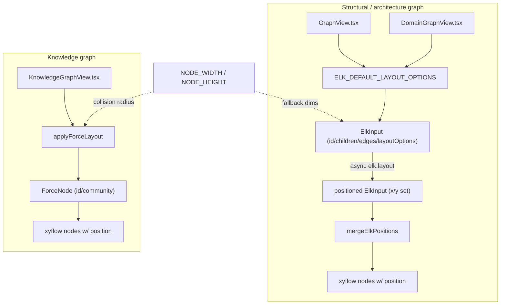

# Graph layout — positioning nodes so the code graph reads

`utils/layout.ts` is the dashboard's coordinate-assignment layer: given the *topology* that the analysis
pipeline produced (nodes + edges), it decides *where each node sits on the canvas* so the graph is
legible instead of a hairball. It is the visualization end of the comprehension story — the analyzer
extracts structure, and this module turns that structure into a picture a human can navigate.

## Overview
Understand-Anything renders two fundamentally different graphs, and this module carries two matching
layout philosophies. **Structural / architecture graphs** (files, classes, functions grouped into
containers and layers) want a *hierarchical* layout where direction encodes dependency — those go
through ELK's layered algorithm, seeded here by [`ELK_DEFAULT_LAYOUT_OPTIONS`](../catalog/understand-anything-plugin/packages/dashboard/src/utils/layout.ts.md#ELK_DEFAULT_LAYOUT_OPTIONS)
and the `nodesToElkInput` / [`mergeElkPositions`](../catalog/understand-anything-plugin/packages/dashboard/src/utils/layout.ts.md#mergeElkPositions)
adapter pair. **Knowledge graphs** (concepts, claims, entities) have no natural hierarchy, so they get a
d3 *force-directed* simulation, [`applyForceLayout`](../catalog/understand-anything-plugin/packages/dashboard/src/utils/layout.ts.md#applyForceLayout),
where physical clustering makes communities visible. A third path, `applyDagreLayout`, is the deprecated
synchronous predecessor of the ELK route, kept for one release as a fallback. The single unifying idea:
every algorithm speaks the same node-size vocabulary — [`NODE_WIDTH`](../catalog/understand-anything-plugin/packages/dashboard/src/utils/layout.ts.md#NODE_WIDTH)
and [`NODE_HEIGHT`](../catalog/understand-anything-plugin/packages/dashboard/src/utils/layout.ts.md#NODE_HEIGHT) —
so collision spacing stays consistent no matter which engine positions the graph.

## Diagram

## Design rationale (why it's built this way)
The load-bearing decision is **two layout engines, chosen by graph semantics, not by convenience.**
Layered layout (ELK / dagre) draws a DAG-shaped picture: rows of nodes with edges flowing one
direction, which is exactly what you want when the edges *mean* "depends on / contains" — the reader
learns the dependency order by reading top-to-bottom. [`ELK_DEFAULT_LAYOUT_OPTIONS`](../catalog/understand-anything-plugin/packages/dashboard/src/utils/layout.ts.md#ELK_DEFAULT_LAYOUT_OPTIONS)
bakes that in: `algorithm: "layered"`, `elk.direction: "DOWN"`, `elk.edgeRouting: "ORTHOGONAL"`, plus
between-layer and node-node spacing. A knowledge graph has no such order, so imposing rows would lie
about the data; [`applyForceLayout`](../catalog/understand-anything-plugin/packages/dashboard/src/utils/layout.ts.md#applyForceLayout)
instead lets a physics simulation find an arrangement where densely-connected nodes end up near each
other, so *proximity itself carries meaning*.

A second, subtler decision is the shared-dimension contract. `elk-layout.ts` deliberately re-imports
[`NODE_WIDTH`](../catalog/understand-anything-plugin/packages/dashboard/src/utils/layout.ts.md#NODE_WIDTH)
and [`NODE_HEIGHT`](../catalog/understand-anything-plugin/packages/dashboard/src/utils/layout.ts.md#NODE_HEIGHT)
as its default-dimension fallbacks, with a comment that they must stay "in lockstep … so layouts stay
collision-consistent during the migration." So the same 280×120 box governs dagre's fallback node size, ELK's default node dimensions,
*and* the force-collide radius — a node can't overlap in one view and not another.

`applyDagreLayout` carries an explicit `@deprecated` docstring: *"The dashboard's structural views all
use ELK now… This helper is kept for one release to allow a quick fallback if ELK has a regression."*
That is why its parameters ([`nodesep`](../catalog/understand-anything-plugin/packages/dashboard/src/utils/layout.ts.md#applyDagreLayout.spacingOverrides-typeLiteral13.nodesep) /
[`ranksep`](../catalog/understand-anything-plugin/packages/dashboard/src/utils/layout.ts.md#applyDagreLayout.spacingOverrides-typeLiteral13.ranksep))
still exist but no live view reaches them.

## Entry points
- [`applyForceLayout`](../catalog/understand-anything-plugin/packages/dashboard/src/utils/layout.ts.md#applyForceLayout) —
  the knowledge-graph layout. Reached from `KnowledgeGraphView.tsx`
  whenever the knowledge graph's topology or filters change, passing per-node dimensions and a
  [`communityMap`](../catalog/understand-anything-plugin/packages/dashboard/src/components/KnowledgeGraphView.tsx.md#computeLayout.typeLiteral15.communityMap)
  so nodes cluster by community. It is synchronous — it returns fully-positioned nodes in one call.
- [`mergeElkPositions`](../catalog/understand-anything-plugin/packages/dashboard/src/utils/layout.ts.md#mergeElkPositions) —
  the *back half* of the ELK path. After the async `elk.layout` call resolves, every structural view
  calls this to fold the computed coordinates onto the original xyflow nodes. It is the most-shared
  symbol here, hit from [`useLayerDetailTopology`](../catalog/understand-anything-plugin/packages/dashboard/src/components/GraphView.tsx.md#useLayerDetailTopology),
  [`useOverviewGraph`](../catalog/understand-anything-plugin/packages/dashboard/src/components/GraphView.tsx.md#useOverviewGraph),
  and [`DomainGraphViewInner`](../catalog/understand-anything-plugin/packages/dashboard/src/components/DomainGraphView.tsx.md#DomainGraphViewInner).
- [`ELK_DEFAULT_LAYOUT_OPTIONS`](../catalog/understand-anything-plugin/packages/dashboard/src/utils/layout.ts.md#ELK_DEFAULT_LAYOUT_OPTIONS) +
  `nodesToElkInput` — the *front half*: the constant supplies the layered-algorithm knobs and
  `nodesToElkInput` marshals xyflow nodes/edges plus a dims map into an [`ElkInput`](../catalog/understand-anything-plugin/packages/dashboard/src/utils/elk-layout.ts.md#ElkInput).
  Views merge per-call overrides (e.g. `DomainGraphView` passes `elk.direction: "RIGHT"` to preserve its
  old dagre LR orientation) over the defaults via [`layoutOptions`](../catalog/understand-anything-plugin/packages/dashboard/src/utils/elk-layout.ts.md#ElkInput.layoutOptions).

## Mechanism (step-by-step)
1. **Structural build → ElkInput.** A view memoizes its nodes/edges and a per-node dimension map, then
   `nodesToElkInput` turns them into the [`ElkInput`](../catalog/understand-anything-plugin/packages/dashboard/src/utils/elk-layout.ts.md#ElkInput)
   tree: `id: "root"`, merged [`layoutOptions`](../catalog/understand-anything-plugin/packages/dashboard/src/utils/elk-layout.ts.md#ElkInput.layoutOptions),
   one [`ElkChild`](../catalog/understand-anything-plugin/packages/dashboard/src/utils/elk-layout.ts.md#ElkChild)
   per node (each carrying its `width`/`height`, falling back to [`NODE_WIDTH`](../catalog/understand-anything-plugin/packages/dashboard/src/utils/layout.ts.md#NODE_WIDTH)/[`NODE_HEIGHT`](../catalog/understand-anything-plugin/packages/dashboard/src/utils/layout.ts.md#NODE_HEIGHT)),
   and an edge list. ELK sizes the layout from those declared boxes, so passing accurate dimensions is
   what keeps edges from crossing under nodes.
2. **ELK positions asynchronously, then merge back.** ELK (WASM) runs off-thread and returns a
   [`ElkInput`](../catalog/understand-anything-plugin/packages/dashboard/src/utils/elk-layout.ts.md#ElkInput)
   whose children now carry `x`/`y`. [`mergeElkPositions`](../catalog/understand-anything-plugin/packages/dashboard/src/utils/layout.ts.md#mergeElkPositions)
   indexes the positioned [`children`](../catalog/understand-anything-plugin/packages/dashboard/src/utils/elk-layout.ts.md#ElkInput.children)
   by `id` into a map of `{x, y, width, height}`, then rebuilds each xyflow node with
   `position: { x, y }`. Because ELK's `x`/`y` are top-left already (matching xyflow's origin), this is a
   direct copy — no center-offset correction. A node absent from the map keeps its previous
   `position ?? { x: 0, y: 0 }`, so an id ELK dropped never crashes the render.
3. **Container footprints propagate.** For container nodes, `mergeElkPositions` also copies back ELK's
   computed [`width`](../catalog/understand-anything-plugin/packages/dashboard/src/utils/elk-layout.ts.md#ElkChild.width)/[`height`](../catalog/understand-anything-plugin/packages/dashboard/src/utils/elk-layout.ts.md#ElkChild.height).
   The source comment explains why: a "tick-driven Stage 1 re-layout (Task 15) can resize the visible
   atom to match the actual Stage 2 footprint," and since ELK echoes the input size for leaf nodes, the
   copy is a no-op for them. This is how a collapsed container ends up sized to what its expanded
   contents *would* occupy.
4. **Force path: build a physics world.** [`applyForceLayout`](../catalog/understand-anything-plugin/packages/dashboard/src/utils/layout.ts.md#applyForceLayout)
   maps each node to a [`ForceNode`](../catalog/understand-anything-plugin/packages/dashboard/src/utils/layout.ts.md#ForceNode)
   with a random start position and its community index, then installs d3 forces: `link` (pulls
   connected nodes together), `charge` (many-body repulsion so nodes spread), `center` (gentle pull to
   origin), and `collide` whose radius is derived from each node's width so boxes never overlap. Force
   strengths scale with size — past 100 nodes the charge and link distance grow — so a large graph
   doesn't collapse into a blob.
5. **Community clustering shapes the force field.** When a communityMap with more than one community is
   supplied, [`applyForceLayout`](../catalog/understand-anything-plugin/packages/dashboard/src/utils/layout.ts.md#applyForceLayout)
   adds `forceX`/`forceY` that pull each node toward a *per-community anchor* placed on a circle
   (`communityAngle(c)` around a `clusterRadius` that grows with node count). The visual payoff is that
   the layout doesn't just avoid overlaps — it spatially separates communities into petals, so the
   reader sees the graph's macro-structure at a glance. The simulation is run to convergence
   synchronously via a bounded tick count (100–300 by node count), then positions are mapped back onto
   the xyflow nodes.

## Key data structures
- [`ElkInput`](../catalog/understand-anything-plugin/packages/dashboard/src/utils/elk-layout.ts.md#ElkInput) /
  [`ElkChild`](../catalog/understand-anything-plugin/packages/dashboard/src/utils/elk-layout.ts.md#ElkChild) /
  [`ElkEdge`](../catalog/understand-anything-plugin/packages/dashboard/src/utils/elk-layout.ts.md#ElkEdge) —
  the neutral wire format between the dashboard and the ELK engine. `ElkChild` carries optional nested
  [`children`](../catalog/understand-anything-plugin/packages/dashboard/src/utils/elk-layout.ts.md#ElkInput.children)
  (compound/container layout) and, crucially, optional [`x`](../catalog/understand-anything-plugin/packages/dashboard/src/utils/elk-layout.ts.md#ElkChild.x)/[`y`](../catalog/understand-anything-plugin/packages/dashboard/src/utils/elk-layout.ts.md#ElkChild.y)
  whose docstring states they are *"set by ELK after layout; absent on input. Downstream consumers must
  default"* — the input/output asymmetry that [`mergeElkPositions`](../catalog/understand-anything-plugin/packages/dashboard/src/utils/layout.ts.md#mergeElkPositions)
  handles with `?? 0`.
- [`ForceNode`](../catalog/understand-anything-plugin/packages/dashboard/src/utils/layout.ts.md#ForceNode) —
  the d3-force simulation datum: a node `id` plus an optional `community` number that the clustering
  forces read.
- [`NODE_WIDTH`](../catalog/understand-anything-plugin/packages/dashboard/src/utils/layout.ts.md#NODE_WIDTH) /
  [`NODE_HEIGHT`](../catalog/understand-anything-plugin/packages/dashboard/src/utils/layout.ts.md#NODE_HEIGHT) —
  the 280×120 default box that every engine (and `elk-layout.ts`'s repair pass) uses as the fallback
  dimension, the single source of collision consistency across views.

## Dynamics (design intent)
The ELK path is intentionally split into a **synchronous structural build and an asynchronous layout**:
consumers memoize the graph and build the [`ElkInput`](../catalog/understand-anything-plugin/packages/dashboard/src/utils/elk-layout.ts.md#ElkInput)
in a `useMemo`, then run `applyElkLayout` in an effect and call [`mergeElkPositions`](../catalog/understand-anything-plugin/packages/dashboard/src/utils/layout.ts.md#mergeElkPositions)
in the resolve callback (with a `cancelled` guard against stale results). The force path is the
opposite: [`applyForceLayout`](../catalog/understand-anything-plugin/packages/dashboard/src/utils/layout.ts.md#applyForceLayout)
runs the whole simulation to convergence inside one synchronous call and returns finished positions —
d3-force is CPU-only and fast enough to block, whereas ELK's WASM boundary is async.

## Edge cases
- **Empty graph.** [`applyForceLayout`](../catalog/understand-anything-plugin/packages/dashboard/src/utils/layout.ts.md#applyForceLayout)
  short-circuits and returns the inputs untouched when there are zero nodes, avoiding a degenerate
  simulation.
- **Edges to missing nodes.** The force path filters `simLinks` down to edges whose both endpoints exist
  in the node set before building the simulation, so a dangling [`edges`](../catalog/understand-anything-plugin/packages/dashboard/src/utils/layout.ts.md#applyDagreLayout.typeLiteral14.edges)
  entry can't corrupt the layout. (ELK's equivalent orphan-edge repair lives in `elk-layout.ts`.)
- **Coordinate-origin mismatch.** dagre and d3 produce *center* coordinates, so both subtract `w/2, h/2`
  to convert to xyflow's top-left origin; ELK already returns top-left, so [`mergeElkPositions`](../catalog/understand-anything-plugin/packages/dashboard/src/utils/layout.ts.md#mergeElkPositions)
  does no such correction. Mixing the two conventions is the classic way to get a whole graph shifted
  half a node off.

## Open questions
- `nodesToElkInput`, `applyDagreLayout`, and the ELK *invocation* itself (`applyElkLayout`,
  `repairElkInput`) are referenced throughout but are not citable symbols in this packet's subgraph, so
  their exact repair/marshalling behavior is described here from the read source rather than anchored to
  catalog entries — see the elk-layout sibling page for the authoritative treatment.

## See also
- [elk-layout](./understand-anything-plugin-packages-dashboard-src-utils-elk-layout.ts.md) — the ELK-based
  variant: input repair (`repairElkInput`) and the async `applyElkLayout` call this module feeds.
- [GraphView](./understand-anything-plugin-packages-dashboard-src-components-GraphView.tsx.md) — the
  structural view that consumes `nodesToElkInput` + `mergeElkPositions`.
- [graph-builder](./understand-anything-plugin-packages-core-src-analyzer-graph-builder.ts.md) — builds
  the structural graph whose topology this module positions.
