# merge-batch-graphs — deterministically reconciling per-batch LLM graph fragments into one canonical graph

<!-- connect:up:begin -->
> **Cross-repo concept:** part of [symbol-graph](../../../concepts/symbol-graph.md) across this wiki's repos.
<!-- connect:up:end -->
## Overview
Understand-Anything comprehends a codebase too large for one context window by **splitting it into
batches**: a fleet of `file-analyzer` LLM agents each read a slice of files and emit a partial
knowledge graph as `batch-*.json`. That scaling move is also the problem — every batch is an
*independent* LLM call, so the fragments disagree: the same file gets minted under three different
node-ID spellings, complexity is labelled `"high"` in one batch and `"complex"` in another, edges
point `"both"` ways, a `tested_by` edge runs test→production, and dangling edges reference nodes that
lived in some other batch. This script is the **deterministic reconciliation layer** that runs after
the LLM fan-out and before the LLM review pass: it concatenates every batch, then heals the
disagreements with pure Python string/path rules — no model in the loop — so the assembled graph is
already canonical when a human or a `graph-reviewer` agent looks at it.

The single key idea is a **normalize-then-merge** pipeline where identity is a repairable string
convention. [`merge_and_normalize`](../catalog/understand-anything-plugin/skills/understand/merge-batch-graphs.md#merge_and_normalize)
first rewrites every node ID into one canonical form, *then* uses those canonical IDs to deduplicate
nodes, rewrite edge endpoints, and drop edges whose endpoints no longer exist — the ordering matters,
because merging on un-normalized IDs would leave the same file as several distinct nodes.

## Diagram

```mermaid
flowchart TD
    main["main()<br/>load & sort batch-*.json"] --> mn["merge_and_normalize()"]
    mn -->|Step 2| nid["normalize_node_id()"]
    nid --> cif["classify_id_fix()"]
    mn -->|Step 3| ncx["normalize_complexity()"]
    mn -->|Step 5b| lt["link_tests()"]
    mn -->|Step 6| ndir["normalize_direction()"]
    lt --> itp["is_test_path()"]
    lt --> pc["production_candidates()"]
    lt --> swap["_swap_tested_by_in_place()"]
    lt --> tag["_ensure_tested_tag()"]
    pc --> strip["_strip_test_infix()"]
    pc --> sib["_js_ts_sibling_candidates()"]
    pc --> addu["_add_unique()"]
```

## Design rationale (why it's built this way)
The whole file exists because **LLM-produced graph fragments are not trustworthy as identity
carriers**, and Understand-Anything decided to *repair rather than reject* them. Three decisions make
that concrete:

- **Repair, don't discard.** Rather than failing a batch whose nodes have a `"file:file:..."` double
  prefix or a project-name prefix, [`normalize_node_id`](../catalog/understand-anything-plugin/skills/understand/merge-batch-graphs.md#normalize_node_id)
  rewrites it into the canonical shape and
  [`classify_id_fix`](../catalog/understand-anything-plugin/skills/understand/merge-batch-graphs.md#classify_id_fix)
  labels the correction for a grouped "Fixed" report. The philosophy is that the LLM's *content*
  (which file relates to which) is usually right even when its *formatting* is wrong, so throwing away
  a whole node over a spelling error loses real comprehension.
- **Determinism where the LLM is unreliable.** Edge direction and test↔production pairing are exactly
  the kind of thing LLMs invert. The module comment on `_DIRECTION_ALIASES` states the direction
  normalizer "Mirrors packages/core/src/schema.ts so the dashboard validator has nothing left to
  auto-correct" — i.e. the script's job is to leave the downstream TypeScript validator with zero
  work. The `tested_by` linker is likewise a two-pass *deterministic* algorithm precisely so the
  test-coverage view doesn't depend on the LLM getting edge direction right.
- **Detectability over silent merging.** When a `function`/`class` node arrives with no `filePath`,
  `normalize_node_id` deliberately mints `function:__nofilepath__:<name>` rather than
  `function:<name>` — the docstring-adjacent comment explains that a bare name "collides with every
  other function of the same name across the project," so the placeholder makes the collision
  *visible in the report* instead of silently fusing unrelated nodes.

> [!inferred]
> Placing this deterministic pass *before* the LLM "ASSEMBLE REVIEW" (Phase 3, per the module
> docstring) is a cost/reliability tradeoff: mechanical fixes that a script can do perfectly are done
> for free, so the expensive review model spends its budget only on semantic issues a script cannot
> catch.

## Entry points
- [`main`](../catalog/understand-anything-plugin/skills/understand/merge-batch-graphs.md#main) — the
  CLI entry, invoked as `python merge-batch-graphs.py <project-root>` at the end of Phase 2 of
  `/understand`. It discovers `batch-*.json` under `.understand-anything/intermediate/`, sorts them by
  *numeric* index (not lexicographic, so `batch-10` follows `batch-9`), and loudly warns about files
  whose names don't match the `batch-<N>` / `batch-<N>-part-<K>` pattern rather than silently dropping
  them. It then hands the parsed batches to `merge_and_normalize`.
- [`merge_and_normalize`](../catalog/understand-anything-plugin/skills/understand/merge-batch-graphs.md#merge_and_normalize)
  — the reconciliation core and the only function a caller other than the CLI would reach for. Given
  `list[dict]` batch payloads it returns `(assembled_graph, report_lines)`: the healed
  `{nodes, edges}` graph plus a human-readable audit of every correction made.

## Mechanism (step-by-step)
1. **Concatenate, then canonicalize IDs.** [`merge_and_normalize`](../catalog/understand-anything-plugin/skills/understand/merge-batch-graphs.md#merge_and_normalize)
   flattens every batch's `nodes`/`edges` into two flat lists (Step 1), then walks the nodes
   normalizing each ID via [`normalize_node_id`](../catalog/understand-anything-plugin/skills/understand/merge-batch-graphs.md#normalize_node_id).
   That function strips double prefixes (`file:file:` → `file:`), strips a leading project-name
   segment, canonicalizes the legacy `func:` prefix to `function:`, and — for bare paths — synthesizes
   the right prefix from `node.type` via [`TYPE_TO_PREFIX`](../catalog/understand-anything-plugin/skills/understand/merge-batch-graphs.md#TYPE_TO_PREFIX.TYPE_TO_PREFIX),
   validating against [`VALID_NODE_PREFIXES`](../catalog/understand-anything-plugin/skills/understand/merge-batch-graphs.md#VALID_NODE_PREFIXES).
   Each `original → corrected` mapping is remembered so edges can be rewritten in Step 4.
2. **Fold noisy complexity labels down to three buckets.** For every node,
   [`normalize_complexity`](../catalog/understand-anything-plugin/skills/understand/merge-batch-graphs.md#normalize_complexity)
   collapses the free-text values LLMs emit (`"high"`, `"medium"`, integers) into the schema's
   `{simple, moderate, complex}` (via [`COMPLEXITY_MAP`](../catalog/understand-anything-plugin/skills/understand/merge-batch-graphs.md#COMPLEXITY_MAP.COMPLEXITY_MAP)
   and [`VALID_COMPLEXITY`](../catalog/understand-anything-plugin/skills/understand/merge-batch-graphs.md#VALID_COMPLEXITY)).
   Crucially it returns a *status* — `valid`/`mapped`/`unknown` — so a confidently mapped alias goes to
   the "Fixed" report while an unrecognized value is defaulted to `moderate` **and** flagged into the
   "Could not fix" report, keeping the guess auditable.
3. **Rewrite edge endpoints against the ID map, then dedup nodes.** Using the `original → corrected`
   map built in Step 1, every edge's `source`/`target` is rewritten (Step 4), after which nodes are
   collapsed into a `dict` keyed by canonical ID with **keep-last** semantics (Step 5) — this is where
   the three spellings of one file finally become one node. Only now, on a settled node set, does the
   test linker run: [`link_tests`](../catalog/understand-anything-plugin/skills/understand/merge-batch-graphs.md#link_tests).
4. **Canonicalize test coverage in two passes.** Pass 1 of `link_tests` walks existing `tested_by`
   edges, classifying each endpoint as test or production with [`is_test_path`](../catalog/understand-anything-plugin/skills/understand/merge-batch-graphs.md#is_test_path)
   (routing to per-extension conventions in [`_TEST_NAME_PATTERNS`](../catalog/understand-anything-plugin/skills/understand/merge-batch-graphs.md#_TEST_NAME_PATTERNS._TEST_NAME_PATTERNS)
   and the JS/TS infix rule in [`_JS_TS_TEST_EXTS`](../catalog/understand-anything-plugin/skills/understand/merge-batch-graphs.md#_JS_TS_TEST_EXTS._JS_TS_TEST_EXTS));
   it keeps canonical production→test edges, **flips** inverted ones via
   [`_swap_tested_by_in_place`](../catalog/understand-anything-plugin/skills/understand/merge-batch-graphs.md#_swap_tested_by_in_place)
   (preserving the LLM's pairing evidence while fixing direction), and drops edges that can't classify
   cleanly. When a pair arrives twice, weights are compared with the string-tolerant
   [`_num`](../catalog/understand-anything-plugin/skills/understand/merge-batch-graphs.md#_num) so the
   heavier edge wins in place.
5. **Supplement missing coverage links by path convention.** Pass 2 of `link_tests` takes every test
   file the LLM *didn't* pair and asks [`production_candidates`](../catalog/understand-anything-plugin/skills/understand/merge-batch-graphs.md#production_candidates)
   for ordered guesses at its production counterpart: sibling de-infix (`foo.test.ts` → `foo.ts`),
   walk-out of a `__tests__`/`test`/`spec` subdir, and mirrored-tree resolution (`tests/foo/x.ts` →
   `src/foo/x.ts`) driven by [`_MIRROR_PRODUCTION_ROOTS`](../catalog/understand-anything-plugin/skills/understand/merge-batch-graphs.md#_MIRROR_PRODUCTION_ROOTS._MIRROR_PRODUCTION_ROOTS).
   The first candidate that resolves to a real production node gets a fresh `weight: 0.5`
   `tested_by` edge; every production node that ends up sourcing such an edge is marked with
   [`_ensure_tested_tag`](../catalog/understand-anything-plugin/skills/understand/merge-batch-graphs.md#_ensure_tested_tag).
6. **Dedup edges and drop danglers.** Back in `merge_and_normalize` (Step 6), each edge's direction is
   canonicalized by [`normalize_direction`](../catalog/understand-anything-plugin/skills/understand/merge-batch-graphs.md#normalize_direction)
   (`"both"`/`"mutual"` → `"bidirectional"`, unknown → `"forward"`), and edges are keyed by
   `(source, target, type, direction)` — direction is *part* of the key so a `forward` edge never
   silently overwrites a `bidirectional` one. Any edge whose endpoint is not in the final node set is
   dropped into the "Could not fix" report. The result is `{nodes, edges}` plus the report lines.

## Key data structures
- **The canonical node-ID string.** Identity is a prefixed path string —
  `file:src/x.ts`, `function:src/x.ts:foo` — validated against [`VALID_NODE_PREFIXES`](../catalog/understand-anything-plugin/skills/understand/merge-batch-graphs.md#VALID_NODE_PREFIXES)
  and derived from node type through [`TYPE_TO_PREFIX`](../catalog/understand-anything-plugin/skills/understand/merge-batch-graphs.md#TYPE_TO_PREFIX.TYPE_TO_PREFIX).
  This convention *is* the merge key; everything downstream (dedup, edge rewrite, dangling-edge
  detection) keys off it.
- **The `id_mapping` (`original → corrected`).** The bridge between node normalization and edge
  rewrite — built while normalizing nodes, consumed to repoint edges so a renamed node doesn't strand
  its edges.
- **`covered` / `pair_to_idx` in [`link_tests`](../catalog/understand-anything-plugin/skills/understand/merge-batch-graphs.md#link_tests).**
  The `(production_id, test_id)` set (and its index into the compacted edge list) is what lets Pass 1
  do weight-aware in-place replacement and lets Pass 2 avoid re-adding a pair already covered.
- **The report lines.** A parallel, human-readable audit stream (`Fixed` / `Tested-by linker` /
  `Could not fix` / output stats) returned alongside the graph — the comprehension artifact that makes
  every mechanical decision reviewable.

## Dynamics (design intent)
The pass ordering is load-bearing and stated in the code's step comments: **normalize IDs → rewrite
edges → dedup nodes → link tests → dedup edges**. Node dedup uses keep-last; edge dedup uses
weight-max within a direction-aware key. The `tested_by` linker's docstring is explicit that it
*mutates* both `nodes_by_id` (adds the `"tested"` tag) and `edges` (drops, swaps, appends) in place,
and that tagging happens exactly once per production node regardless of how the edge was obtained —
so counts in the report reflect the *final* output, not intermediate churn.

> [!inferred]
> As a scaling substrate this is the analogue of wikify-repo's SCIP index / graphify's god-node graph,
> but grounded differently: wikify grounds identity in a compiler-emitted moniker, whereas this script
> grounds it in a *repairable string convention* over LLM output. The upside is language-agnostic
> breadth and tolerance of partial/parallel analysis; the cost is that correctness rests on path
> conventions and heuristics rather than a type-checked symbol table.

## Edge cases
- **Missing `filePath` on a function/class** → `function:__nofilepath__:<name>` placeholder instead of
  a collision-prone bare `function:<name>`, per [`normalize_node_id`](../catalog/understand-anything-plugin/skills/understand/merge-batch-graphs.md#normalize_node_id).
- **Helpers inside test dirs.** [`is_test_path`](../catalog/understand-anything-plugin/skills/understand/merge-batch-graphs.md#is_test_path)
  classifies by *basename* convention, so `__tests__/helpers.ts` (no `.test`/`.spec` infix) is treated
  as production, not a test — avoiding spurious coverage links.
- **JS/TS double-extension stems.** A `.test.ts` file has ext `.ts` and stem `foo.test`, so the marker
  is an infix stripped by [`_strip_test_infix`](../catalog/understand-anything-plugin/skills/understand/merge-batch-graphs.md#_strip_test_infix);
  candidate siblings are generated across the whole family via [`_js_ts_sibling_candidates`](../catalog/understand-anything-plugin/skills/understand/merge-batch-graphs.md#_js_ts_sibling_candidates)
  and [`_JS_TS_EXTS`](../catalog/understand-anything-plugin/skills/understand/merge-batch-graphs.md#_JS_TS_EXTS._JS_TS_EXTS),
  with ordering preserved and duplicates suppressed by [`_add_unique`](../catalog/understand-anything-plugin/skills/understand/merge-batch-graphs.md#_add_unique).
- **A test that path-resolves to another test** is refused as a production match, so naming coincidence
  can't produce a test↔test `tested_by` edge (guarded inside [`link_tests`](../catalog/understand-anything-plugin/skills/understand/merge-batch-graphs.md#link_tests)).
- **Unknown node types / unrecognized complexity** are kept as-is / defaulted to `moderate` but always
  surfaced in the "Could not fix" report rather than dropped — visibility over silent loss.
- **Malformed `tags`** (missing, `None`, a string) are coerced to a fresh list by
  [`_ensure_tested_tag`](../catalog/understand-anything-plugin/skills/understand/merge-batch-graphs.md#_ensure_tested_tag)
  before the `"tested"` tag is appended.

## Open questions
- There is a further step, visible in the same module, that re-emits `imports` edges from the
  project-scanner's `importMap` (the scanner's deterministic resolved-import truth) because
  file-analyzer agents drop roughly a quarter of them. That recovery function is *not* in this
  packet's subgraph, so it isn't cited here; it belongs on its own page or in the overview as the
  bridge between the LLM graph and the scanner's structural ground truth.
- The batch-splitting/orchestration side (how files are grouped into batches, how `batch-<N>-part-<K>`
  multi-part outputs are produced) lives in the agent/orchestrator layer, not this script — this page
  only covers the *merge* half of the batch strategy.

## See also
- [`GraphBuilder — assembling the knowledge graph substrate`](./understand-anything-plugin-packages-core-src-analyzer-graph-builder.ts.md) — the TypeScript accumulator that mints the same `file:`/`function:` ID vocabulary from the structural (tree-sitter) path; this script reconciles the *LLM* path into that same shape.
- [`persistence`](./understand-anything-plugin-packages-core-src-persistence-index.ts.md) — where the assembled graph is loaded/validated downstream.
- Catalog home for this module: [`merge-batch-graphs` catalog](../catalog/understand-anything-plugin/skills/understand/merge-batch-graphs.md) — signatures, source lines, and uses-by for every symbol cited above.
</content>
</invoke>
