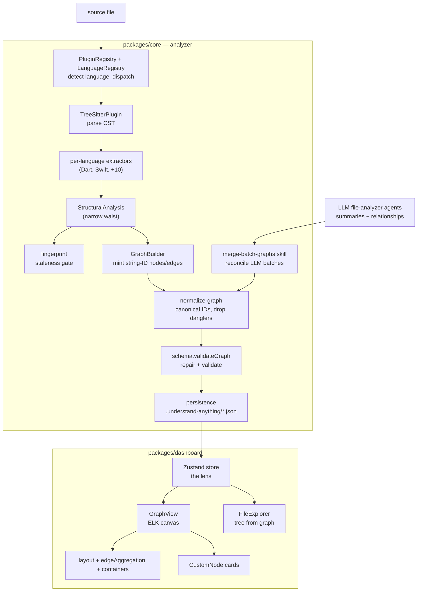

# understand-anything — what it is and how it fits together

## In one paragraph
Understand-Anything ingests a codebase and produces a single typed **knowledge graph** — files, functions, classes, plus architecture/domain entities — that a web dashboard renders as an interactive, progressively-abstracted map a human can actually read. Its defining design choice is its **grounding substrate**: instead of a compiler-grade symbol index (SCIP), it grounds on the **tree-sitter concrete syntax tree**, reduced per-file to one flat, language-neutral `StructuralAnalysis` shape by a registry of per-language extractors. That structural extraction is deliberately *shallow* (names + line ranges; call edges are name-based heuristics, never resolved cross-file), because the deep semantic layer — summaries, relationships, the graph itself — is authored by an **LLM** working over file batches. Everything downstream is built to make LLM output trustworthy: batch fragments are deterministically reconciled, node IDs canonicalized, complexity/edge vocabularies repaired, and dangling edges dropped, before a Zod schema validates the graph on load. The comprehension output is not prose but an ELK-laid-out React Flow canvas that groups nodes into containers, collapses edge hairballs into weighted aggregates, and lays out only what you expand — the "understand anything, at any scale" bet.

## Core architecture

## Main concepts

### The syntactic grounding substrate (tree-sitter, not SCIP)
Everything the tool reasons about starts as facts pulled from a tree-sitter concrete syntax tree. `TreeSitterPlugin` loads WASM grammars, parses each file, and hands the root node to a per-language extractor — no compiler, no type resolution. The consequence is deliberate: structural facts are shallow (names, line ranges), and a call "graph" is a per-file list of name-based edges, never resolved to a definition. That is exactly the depth-of-grounding axis on which UA differs from a SCIP-grounded tool. See [tree-sitter-plugin](concepts/understand-anything-plugin-packages-core-src-plugins-tree-sitter-plugin.ts.md) and its shared toolkit [base-extractor](concepts/understand-anything-plugin-packages-core-src-plugins-extractors-base-extractor.ts.md).

### The narrow waist: one StructuralAnalysis for every language
Twelve grammars produce twelve wildly different trees; everything downstream sees one flat shape — `functions`/`classes`/`imports`/`exports` (plus optional non-code arrays and a separate `CallGraphEntry[]`). Each language is one implementation of the tiny `LanguageExtractor` contract, invisibly interchangeable behind it, so adding a language is a new file plus a config, never a pipeline change. Representative implementations: [dart-extractor](concepts/understand-anything-plugin-packages-core-src-plugins-extractors-dart-extractor.ts.md) and [swift-extractor](concepts/understand-anything-plugin-packages-core-src-plugins-extractors-swift-extractor.ts.md). The contract and the code ontology live in [extractors-types](concepts/understand-anything-plugin-packages-core-src-plugins-extractors-types.ts.md) and [core types](concepts/understand-anything-plugin-packages-core-src-types.ts.md).

### Declarative languages + federated dispatch
"What a language is" is *data*, not code: a `LanguageConfig` (extensions, filenames, an optional grammar pointer, idiomatic concepts) validated by Zod. Detection (which language?) is kept separate from analysis (which extractor?) — code routes to the tree-sitter analyzer, config/doc formats route to lightweight regex parsers, all behind one `AnalyzerPlugin` interface. This is a federated grounding model (no single index) rather than SCIP's universal one. See [languages-types](concepts/understand-anything-plugin-packages-core-src-languages-types.ts.md) and [registry](concepts/understand-anything-plugin-packages-core-src-plugins-registry.ts.md).

### The knowledge graph and who owns identity
`GraphBuilder` accumulates per-file analysis into typed nodes and edges, minting deterministic human-readable string IDs (`file:src/x.ts`, `function:src/x.ts:foo`) and snapshotting an immutable `KnowledgeGraph`. Identity is a string convention, not a compiler moniker — trivial to author from any producer (code, LLM, or non-code parser), at the cost of scope-aware precision. This is the substrate that lets a SQL table and a TypeScript class be first-class peers. See [graph-builder](concepts/understand-anything-plugin-packages-core-src-analyzer-graph-builder.ts.md).

### Making LLM-authored graphs trustworthy
Because the graph's nodes and edges are *generated text*, three layers repair it rather than trust it. The [merge-batch-graphs](concepts/understand-anything-plugin-skills-understand-merge-batch-graphs.md) skill deterministically reconciles independent LLM batch fragments (canonicalize IDs → rewrite edges → dedup nodes → link tests → dedup edges). [normalize-graph](concepts/understand-anything-plugin-packages-core-src-analyzer-normalize-graph.ts.md) then enforces canonical `type:path` node IDs and drops edges that can't be grounded in two real nodes. Finally [schema](concepts/understand-anything-plugin-packages-core-src-schema.ts.md) runs a four-tier sanitize/normalize/autofix/validate pipeline that repairs or drops individually-broken items and records every change — the "citation linter" equivalent for an LLM-authored graph.

### Incremental reconcile via structural fingerprint
Not every edit matters. Each file is reduced to a fingerprint (SHA-256 content hash + signature-level structure) and diffed to one of three verdicts — `NONE`/`COSMETIC`/`STRUCTURAL` — so the expensive LLM re-analysis runs only on files that can actually move the graph. This is UA's homegrown, purely-static analogue of "rebuild only the delta." See [fingerprint](concepts/understand-anything-plugin-packages-core-src-fingerprint.ts.md), with the graph persisted (and re-read for prior state) by [persistence-index](concepts/understand-anything-plugin-packages-core-src-persistence-index.ts.md).

### The dashboard as comprehension surface
The graph *is* the product; the dashboard is the lens. A single Zustand [store](concepts/understand-anything-plugin-packages-dashboard-src-store.ts.md) holds all view state (active layer, selection, filters, view mode) with a load-bearing invariant that any visibility/layer change clears the layout caches. [GraphView](concepts/understand-anything-plugin-packages-dashboard-src-components-GraphView.tsx.md) turns the graph into a React Flow canvas that abstracts progressively — an overview of layers, then a drilled-in layer whose files are grouped into [containers](concepts/understand-anything-plugin-packages-dashboard-src-utils-containers.ts.md) (folder-based, with Louvain community fallback), whose cross-boundary edges are collapsed by [edgeAggregation](concepts/understand-anything-plugin-packages-dashboard-src-utils-edgeAggregation.ts.md), and whose positions come from [layout](concepts/understand-anything-plugin-packages-dashboard-src-utils-layout.ts.md) / [elk-layout](concepts/understand-anything-plugin-packages-dashboard-src-utils-elk-layout.ts.md). Individual nodes render as [CustomNode](concepts/understand-anything-plugin-packages-dashboard-src-components-CustomNode.tsx.md) cards, and [FileExplorer](concepts/understand-anything-plugin-packages-dashboard-src-components-FileExplorer.tsx.md) projects the flat graph back into a familiar folder tree.

## How a request flows
A single file's journey through the tool ties the concepts together in order. The [registry](concepts/understand-anything-plugin-packages-core-src-plugins-registry.ts.md) resolves the file's path to a `LanguageConfig` (filename-first, then extension) and dispatches to an analyzer; for code that is [tree-sitter-plugin](concepts/understand-anything-plugin-packages-core-src-plugins-tree-sitter-plugin.ts.md), which parses the CST and calls the language's [extractor](concepts/understand-anything-plugin-packages-core-src-plugins-extractors-types.ts.md) to emit a [`StructuralAnalysis`](concepts/understand-anything-plugin-packages-core-src-types.ts.md). That analysis forks: [fingerprint](concepts/understand-anything-plugin-packages-core-src-fingerprint.ts.md) decides whether the file even needs LLM re-analysis, while [graph-builder](concepts/understand-anything-plugin-packages-core-src-analyzer-graph-builder.ts.md) turns the structure (plus LLM summaries) into graph nodes/edges. LLM batch outputs are merged by the [merge-batch-graphs](concepts/understand-anything-plugin-skills-understand-merge-batch-graphs.md) skill, [normalized](concepts/understand-anything-plugin-packages-core-src-analyzer-normalize-graph.ts.md), and [validated](concepts/understand-anything-plugin-packages-core-src-schema.ts.md), then [persisted](concepts/understand-anything-plugin-packages-core-src-persistence-index.ts.md) as JSON. The dashboard [store](concepts/understand-anything-plugin-packages-dashboard-src-store.ts.md) loads it, and [GraphView](concepts/understand-anything-plugin-packages-dashboard-src-components-GraphView.tsx.md) derives containers, aggregates edges, runs ELK, and renders the interactive canvas.

## Code-comprehension surfaces
For the cross-tool survey, these are the axes on which Understand-Anything lines up against wikify-repo and graphify:

- **Grounding substrate — tree-sitter CST / syntactic, NOT SCIP.** UA stops at the parse tree; there is no symbol table, no type resolution. Call edges are **name-based heuristics** recovered from call sites, not resolved cross-file edges. This is the headline difference from wikify-repo's SCIP index and graphify's AST+SCIP fusion. See [tree-sitter-plugin](concepts/understand-anything-plugin-packages-core-src-plugins-tree-sitter-plugin.ts.md), [base-extractor](concepts/understand-anything-plugin-packages-core-src-plugins-extractors-base-extractor.ts.md).
- **Representation — an LLM-authored, then repaired, KnowledgeGraph.** The graph is generated text made trustworthy by deterministic reconciliation and schema repair, not a deterministically-derived index. See [graph-builder](concepts/understand-anything-plugin-packages-core-src-analyzer-graph-builder.ts.md), [schema](concepts/understand-anything-plugin-packages-core-src-schema.ts.md), [normalize-graph](concepts/understand-anything-plugin-packages-core-src-analyzer-normalize-graph.ts.md).
- **Multi-language extraction — per-language tree-sitter extractors behind one contract, routed by a declarative registry.** Twelve grammars converge on one `StructuralAnalysis`; adding a language is data + one file. See [extractors-types](concepts/understand-anything-plugin-packages-core-src-plugins-extractors-types.ts.md), [languages-types](concepts/understand-anything-plugin-packages-core-src-languages-types.ts.md), [registry](concepts/understand-anything-plugin-packages-core-src-plugins-registry.ts.md), [dart-extractor](concepts/understand-anything-plugin-packages-core-src-plugins-extractors-dart-extractor.ts.md), [swift-extractor](concepts/understand-anything-plugin-packages-core-src-plugins-extractors-swift-extractor.ts.md).
- **Incremental reconcile — a purely-static structural fingerprint.** Content+signature hashing classifies edits as NONE/COSMETIC/STRUCTURAL so only meaningful changes cost an LLM re-analysis — UA's answer to `ingest --ref` delta rebuilds. See [fingerprint](concepts/understand-anything-plugin-packages-core-src-fingerprint.ts.md), [persistence-index](concepts/understand-anything-plugin-packages-core-src-persistence-index.ts.md).
- **Scaling — batch analysis + deterministic merge.** A codebase too large for one context window is split across LLM agents into `batch-*.json` fragments, then healed into one canonical graph by pure string/path rules. See [merge-batch-graphs](concepts/understand-anything-plugin-skills-understand-merge-batch-graphs.md).
- **Comprehension output — an interactive graph dashboard.** The deliverable is a navigable ELK/React Flow canvas (progressive abstraction, container grouping, weighted edge aggregation, lazy interior layout), not a static wiki. See [store](concepts/understand-anything-plugin-packages-dashboard-src-store.ts.md), [GraphView](concepts/understand-anything-plugin-packages-dashboard-src-components-GraphView.tsx.md), [containers](concepts/understand-anything-plugin-packages-dashboard-src-utils-containers.ts.md), [edgeAggregation](concepts/understand-anything-plugin-packages-dashboard-src-utils-edgeAggregation.ts.md), [layout](concepts/understand-anything-plugin-packages-dashboard-src-utils-layout.ts.md), [elk-layout](concepts/understand-anything-plugin-packages-dashboard-src-utils-elk-layout.ts.md), [CustomNode](concepts/understand-anything-plugin-packages-dashboard-src-components-CustomNode.tsx.md), [FileExplorer](concepts/understand-anything-plugin-packages-dashboard-src-components-FileExplorer.tsx.md).

The dashboard also carries peripheral chrome — [I18nContext](concepts/understand-anything-plugin-packages-dashboard-src-contexts-I18nContext.tsx.md) (localization) and [themes-types](concepts/understand-anything-plugin-packages-dashboard-src-themes-types.ts.md) (accent theming) — which decorate the comprehension surface without touching the analysis.

## Map of the wiki
Which concept answers which question:
- *"How does UA get its facts — and why is the call graph fuzzy?"* → [tree-sitter-plugin](concepts/understand-anything-plugin-packages-core-src-plugins-tree-sitter-plugin.ts.md), [base-extractor](concepts/understand-anything-plugin-packages-core-src-plugins-extractors-base-extractor.ts.md).
- *"How does one tool cover a dozen languages?"* → [extractors-types](concepts/understand-anything-plugin-packages-core-src-plugins-extractors-types.ts.md), [languages-types](concepts/understand-anything-plugin-packages-core-src-languages-types.ts.md), [registry](concepts/understand-anything-plugin-packages-core-src-plugins-registry.ts.md); worked examples in [dart-extractor](concepts/understand-anything-plugin-packages-core-src-plugins-extractors-dart-extractor.ts.md) / [swift-extractor](concepts/understand-anything-plugin-packages-core-src-plugins-extractors-swift-extractor.ts.md).
- *"What is the graph, and how is its identity managed?"* → [core types](concepts/understand-anything-plugin-packages-core-src-types.ts.md), [graph-builder](concepts/understand-anything-plugin-packages-core-src-analyzer-graph-builder.ts.md).
- *"How is LLM output made reliable?"* → [merge-batch-graphs](concepts/understand-anything-plugin-skills-understand-merge-batch-graphs.md), [normalize-graph](concepts/understand-anything-plugin-packages-core-src-analyzer-normalize-graph.ts.md), [schema](concepts/understand-anything-plugin-packages-core-src-schema.ts.md).
- *"How does re-analysis stay cheap, and where does the graph live?"* → [fingerprint](concepts/understand-anything-plugin-packages-core-src-fingerprint.ts.md), [persistence-index](concepts/understand-anything-plugin-packages-core-src-persistence-index.ts.md).
- *"How does a human read the result?"* → [store](concepts/understand-anything-plugin-packages-dashboard-src-store.ts.md), [GraphView](concepts/understand-anything-plugin-packages-dashboard-src-components-GraphView.tsx.md), [FileExplorer](concepts/understand-anything-plugin-packages-dashboard-src-components-FileExplorer.tsx.md), [CustomNode](concepts/understand-anything-plugin-packages-dashboard-src-components-CustomNode.tsx.md), and the layout/grouping utilities [containers](concepts/understand-anything-plugin-packages-dashboard-src-utils-containers.ts.md) / [edgeAggregation](concepts/understand-anything-plugin-packages-dashboard-src-utils-edgeAggregation.ts.md) / [layout](concepts/understand-anything-plugin-packages-dashboard-src-utils-layout.ts.md) / [elk-layout](concepts/understand-anything-plugin-packages-dashboard-src-utils-elk-layout.ts.md).

For the exhaustive per-module symbol index (signatures, source lines, uses-by), see the `catalog/` directory. For the concept table and the rest of this wiki, see [`index.md`](../../index.md).
