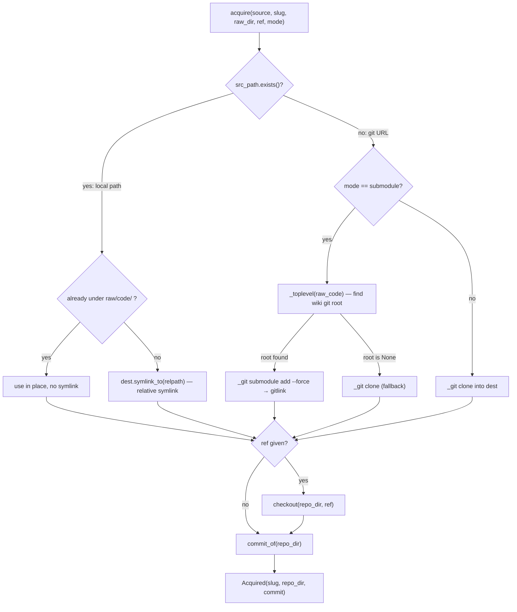

# wikify-acquire — Stage 0, pin the source at an exact commit

## Overview
`acquire` is the very first thing every wikify *pipeline* command (`prepare`, `finalize`, `plan`)
does, and it is the provenance
foundation the rest of the grounded wiki rests on. Its job is deceptively small: turn a
`source` string — a local path or a git URL — into an on-disk source tree at a *known,
recorded commit SHA*, returned as an [`Acquired`](../catalog/wikify/acquire.md#Acquired)
record. Everything downstream (SCIP indexing, the symbol graph, packet subgraphs, and every
`catalog/…#Symbol` citation link) is meaningful only because the tree it points into is
pinned: a citation to `raw/code/<slug>/foo.py:120` is stable *because* Stage 0 fixed the
commit. The single design idea is **acquire once, pin explicitly, record the SHA** — so that
the wiki is reproducible and citations never silently drift under a moving `HEAD`.

The interesting part is *how* the source lands under `raw/code/<slug>`. There are three
acquisition modes that all converge on the same `Acquired` shape but make very different
reproducibility tradeoffs: a plain **clone** (default), a git **submodule** (the pin becomes a
committed gitlink in the surrounding wiki repo), and a **local path used in place** (optionally
surfaced as a relative symlink). The mode is chosen by inspecting the source, not by a flag
alone.

## Diagram

## Design rationale (why it's built this way)
The module docstring states the frame directly: "Resolve a repo to an on-disk source tree and
records its pinned commit SHA … `raw/` holds immutable inputs." That immutability is the whole
point — `raw/` is treated as ground truth, so acquire must never mutate a source in place beyond
a checkout, and it deliberately guards every write behind a `not dest.exists()` check so a
re-run is a no-op rather than a re-clone. This idempotence is what lets `prepare`, `finalize`,
and `plan` each call [`acquire`](../catalog/wikify/acquire.md#acquire) independently without
tripping over one another.

The three modes exist because "pinning" means different things for different sources:

- **Clone** (the default in the code — `mode = (mode or "clone").lower()`) gets a working copy,
  but the pin lives only in wikify's own state file, not in the wiki's git history. Good for huge
  upstreams you don't want to entangle with the wiki repo.
- **Submodule** makes the pin a *committed gitlink*: the SHA is recorded in `.gitmodules` + the
  index of the surrounding wiki repo, so `git submodule update --init` reproduces the exact tree.
  The docstring calls this out: submodule mode "adds it as a git submodule of the surrounding
  wiki repo so the pin is the committed gitlink." This is the strongest reproducibility guarantee,
  which is why the project's `config/<slug>.md` defaults to it.
- **Local path in place** avoids copying at all, and only creates a *relative* symlink when the
  source lives outside `raw/code/`. The comment is explicit about why relative: an absolute
  symlink would be "non-portable" and break when the wiki repo is cloned elsewhere.

> [!inferred]
> The `mode` argument is only consulted on the git-URL branch. A local path that *exists* on disk
> is always used in place regardless of `mode` — the `elif mode == "submodule"` branch is only
> reached when `src_path.exists()` is false. So "submodule mode" is effectively "submodule mode
> *for URLs*"; pointing a submodule config at an already-checked-out local path silently gets the
> in-place/symlink behavior instead.

## Entry points
- [`acquire`](../catalog/wikify/acquire.md#acquire) is the sole public entry — the first call in
  every pipeline command. Its docstring is the contract: "Resolve `source` (local path or git URL)
  to a pinned source tree." Control reaches it at the top of
  [`prepare`](../catalog/wikify/cli.md#prepare) (Stage 0 of the acquire→index→graph→packets run),
  [`finalize`](../catalog/wikify/cli.md#finalize) (re-acquires to know the commit before updating
  reconcile state), [`plan`](../catalog/wikify/cli.md#plan) (dry-run reconcile — re-acquires but
  reuses the cached index), and [`_finalize_docs`](../catalog/wikify/cli.md#_finalize_docs) (the
  docs-mode variant). Each passes `mode=cfg.acquire` and `ref=cfg.ref`, so config drives which of
  the three acquisition strategies runs.

## Mechanism (step-by-step)
1. **Compute the destination and normalize the mode.** [`acquire`](../catalog/wikify/acquire.md#acquire)
   builds `raw_code = raw_dir/code`, `mkdir`s it, sets `dest = raw_code/slug`, and lowercases
   `mode` defaulting to `"clone"`. `dest` — `raw/code/<slug>` — is the canonical home every
   downstream citation path is relative to, so fixing it here is what makes catalog source links
   resolvable later.

2. **Local path → use in place (or relative symlink).** If `Path(source)` exists on disk,
   `repo_dir` becomes its resolved absolute path and *no clone happens*. The subtle decision is
   whether to surface it under `raw/code/<slug>`: acquire computes `already_in_place = repo_dir ==
   dest.resolve() or raw_code_abs in repo_dir.parents`, and only creates a symlink when the source
   lives *outside* `raw/code/`. The symlink is made **relative** via `os.relpath` for portability,
   and any `OSError` is swallowed so a filesystem that forbids symlinks doesn't abort acquisition.
   This is exactly what [`test_local_source_under_raw_code_makes_no_symlink`](../catalog/tests/test_acquire_submodule.md#test_local_source_under_raw_code_makes_no_symlink)
   and [`test_local_source_outside_raw_code_makes_relative_symlink`](../catalog/tests/test_acquire_submodule.md#test_local_source_outside_raw_code_makes_relative_symlink)
   pin: an in-`raw/code` source yields no redundant symlink and reuses the real dir, an outside
   source yields a symlink whose `readlink` is not absolute.

3. **Git URL + submodule mode → committed gitlink.** When the source is not a local path and
   `mode == "submodule"` and `dest` doesn't yet exist, acquire finds the surrounding wiki repo's
   root with [`_toplevel`](../catalog/wikify/acquire.md#_toplevel) (`git rev-parse --show-toplevel`,
   returning `None` if not in a repo). If a root is found it runs `git submodule add --force
   <source> <rel>` from that root — `--force` because "wikify owns raw/code/, so don't let a
   gitignore line block the add." The result is a staged gitlink;
   [`test_submodule_mode_adds_gitlink`](../catalog/tests/test_acquire_submodule.md#test_submodule_mode_adds_gitlink)
   verifies `.gitmodules` exists, the contents are checked out, and `git ls-files --stage` reports
   mode `160000` (git's gitlink type) for the path — the pin now lives *in the wiki's own history*.

4. **Fallback and plain clone.** If submodule mode is requested but [`_toplevel`](../catalog/wikify/acquire.md#_toplevel)
   returns `None` (raw/ is not inside a git repo), a submodule is impossible, so acquire degrades to
   a plain `git clone` — graceful rather than fatal. The default `else` branch does the same plain
   clone for URLs in clone mode, again guarded by `not dest.exists()`.
   [`test_clone_mode_is_default`](../catalog/tests/test_acquire_submodule.md#test_clone_mode_is_default)
   pins that passing no `mode` clones without creating `.gitmodules`.

5. **Pin to the requested ref, then record the SHA.** If `ref` is given, [`checkout`](../catalog/wikify/acquire.md#checkout)
   runs `git checkout <ref>` in `repo_dir`; in submodule mode acquire additionally re-stages the
   moved gitlink so the new pin is ready to commit. Finally, regardless of mode, it calls
   [`commit_of`](../catalog/wikify/acquire.md#commit_of) (`git rev-parse HEAD`) and returns
   [`Acquired`](../catalog/wikify/acquire.md#Acquired). Recording the *resolved* SHA — not the
   symbolic ref — is what makes the wiki reproducible: a tag or branch name can move, but the
   recorded `commit` cannot.

## Key data structures
[`Acquired`](../catalog/wikify/acquire.md#Acquired) is a three-field `@dataclass` and the entire
public output of this stage: [`slug`](../catalog/wikify/acquire.md#Acquired.slug) (the wiki
identity for this repo), [`repo_dir`](../catalog/wikify/acquire.md#Acquired.repo_dir) (the resolved
absolute path SCIP indexes and catalog source-links are computed against), and
[`commit`](../catalog/wikify/acquire.md#Acquired.commit) (the pinned SHA). Downstream, `prepare`
reads `acq.repo_dir` to run the indexer and `acq.commit` to print/pin; `finalize` writes
`acq.commit` into reconcile state. The small helper [`_git`](../catalog/wikify/acquire.md#_git) is
the shared subprocess wrapper — `subprocess.run` with `capture_output`, raising `RuntimeError` with
stderr on a nonzero exit — and every git operation ([`checkout`](../catalog/wikify/acquire.md#checkout),
[`commit_of`](../catalog/wikify/acquire.md#commit_of), [`_toplevel`](../catalog/wikify/acquire.md#_toplevel),
the clones and the submodule add) routes through it, so error handling is uniform.

## Dynamics (design intent)
Acquisition is a synchronous, single-threaded sequence of git subprocesses; there is no
concurrency here. The design intent visible in source is **convergence, not repetition**: every
write is behind `not dest.exists()`, so calling [`acquire`](../catalog/wikify/acquire.md#acquire)
repeatedly (as `prepare`, `plan`, and `finalize` all do within a single ingest) re-derives the same
`Acquired` without re-cloning — the idempotent-reconcile invariant applied at Stage 0. The tests in
`tests/test_acquire_submodule.py` are the behavioral spec: they assert the *filesystem shape* each
mode produces (gitlink mode `160000`, presence/absence of `.gitmodules`, relative-vs-absent
symlink) rather than internal calls, which is why they double as the readable contract for what
each mode guarantees.

## Edge cases
- **Double-nested clone path (real gotcha).** In the URL/clone branches, `dest` is built from the
  *relative* `raw_dir` (`Path(raw_dir)/"code"/slug`) but the clone runs with `cwd=raw_code`
  (`_git(["clone", source, str(dest)], cwd=raw_code)` inside [`acquire`](../catalog/wikify/acquire.md#acquire)).
  If `raw_dir` is passed as a relative path like `raw`, then `dest` is the relative `raw/code/<slug>`,
  and resolving that string *relative to the `cwd` of `raw/code`* would place the clone at
  `raw/code/raw/code/<slug>` — a double-nest. The submodule branch sidesteps this by resolving
  `dest` to an absolute path and computing `rel` against the wiki root; the plain-clone branch does
  not, so callers must pass an absolute or already-`cwd`-correct `raw_dir`. The pipeline callers pass
  `p.raw` (a resolved `Paths` field), which is why this doesn't bite in practice — but a bare relative
  `raw_dir` would. See Open questions.
- **Submodule requested outside a git repo.** [`_toplevel`](../catalog/wikify/acquire.md#_toplevel)
  returns `None` and acquire silently falls back to a plain clone — reproducibility drops from
  committed-gitlink to state-file pin, with no error.
- **Symlink creation fails.** For a local source outside `raw/code/`, an `OSError` from
  `dest.symlink_to` is caught and ignored; `repo_dir` still points at the real source, so
  acquisition succeeds without the traceability symlink.
- **`file://` submodule transport.** [`test_submodule_mode_adds_gitlink`](../catalog/tests/test_acquire_submodule.md#test_submodule_mode_adds_gitlink)
  has to set `protocol.file.allow=always` because git blocks `file://` submodule clones by default
  (a CVE mitigation); real `https://` URLs are unaffected. A subtlety only visible in tests.
- **No `ref`.** If `ref` is falsy, no checkout runs and acquire pins whatever `HEAD` the
  clone/submodule/local tree already points at — the recorded [`commit`](../catalog/wikify/acquire.md#Acquired.commit)
  is that ambient HEAD.

## Open questions
- Is the relative-`raw_dir` double-nest in the clone branch (Edge cases) an actual latent bug or is
  it structurally prevented by every caller passing an absolute `p.raw`? The subgraph shows
  `prepare`/`finalize`/`plan` all pass `p.raw`, but the source of `Paths.raw`'s absoluteness lives
  outside this packet (`wikify/config.py` / the `Paths` type), so I can't confirm it here.
- In submodule mode with a `ref`, acquire re-stages the gitlink but does **not** commit it — the
  docstring says it is "left staged for the agent/user to commit." Whether any later stage
  auto-commits the pin, or it relies on the human, isn't visible in this packet.

## See also
- [wikify-cli](wikify-cli.md) — `prepare` / `finalize` / `plan`, the commands that call `acquire` as Stage 0.
- [wikify-scip_index](wikify-scip_index.md) — Stage 1 indexer that runs against the pinned `repo_dir`.
- [wikify-state](wikify-state.md) — where the recorded commit SHA is stored for idempotent reconcile.
- [wikify-config](wikify-config.md) — supplies `cfg.acquire` (mode) and `cfg.ref` (pin).
- [wikify-diff](wikify-diff.md) — computes the reconcile delta between the pinned commit and prior state.
