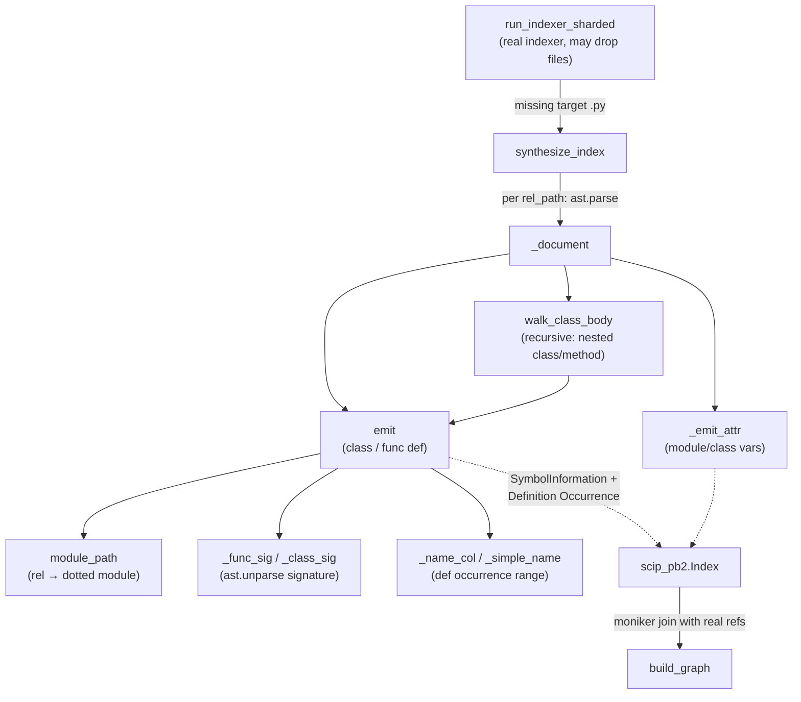

# AST fallback — the symbol-recovery floor

<!-- connect:up:begin -->
> **Cross-repo concept:** part of [multi-language-extraction](../../../concepts/multi-language-extraction.md) across this wiki's repos.
<!-- connect:up:end -->
The last line of defense for grounding coverage: when the real (type-aware) indexer fails to emit a symbol, wikify re-derives that symbol's *definition* deterministically from the Python AST, encoding it under the **exact same SCIP moniker scheme** so the recovered def re-unifies with references the real indexer already emitted elsewhere.

## Overview
wikify grounds its wiki on a SCIP symbol graph. But the SCIP producer (scip-python / pyright) is a type checker, and type checkers can crash on pathological files — the module docstring names the concrete failure: pyright's constraint solver hits `RangeError: Maximum call stack size exceeded` on very large / deeply-generic classes like `torch/_tensor.py`'s `Tensor` or `torch/overrides.py`. When that file is the `--target-only` shard, its index is **never emitted** and the symbol *vanishes from the graph entirely* — even though thousands of other files reference it. That is a grounding hole: a citable definition disappears while its inbound edges dangle.

The key idea is that recovery does **not** need types. A definition's SCIP moniker is a pure function of its lexical position (module path + nesting of class/func/attr names). So wikify parses the missing file with Python's `ast`, walks the tree, and re-emits each definition under a moniker computed to match scip-python's scheme *byte-for-byte*. Because SCIP monikers are global identifiers, the fabricated def and the pre-existing references **join by moniker** in `build_graph` — the hole closes without ever re-running the type checker. It is "enumeration, not traversal": crash-proof, deterministic, and it even preserves the author's docstrings.

This is a quality axis for comparing code-comprehension tools: what happens when the indexer is incomplete. A tool that trusts its indexer blindly silently drops the repo's most central types (the ones big enough to crash pyright). wikify degrades gracefully to a structural floor instead.

## Diagram

## Design rationale (why it's built this way)
The module docstring states the design contract directly: *"it parses each missing file with Python's ``ast`` and emits a synthetic SCIP index whose monikers match scip-python's scheme exactly, so the recovered definitions unify with the existing references (callers populate by moniker join)."* The whole approach hinges on **moniker fidelity** — the recovered index is worthless if its identifiers don't collide with what the real indexer already produced, so `module_path` and the name-path construction in [`_document`](../catalog/wikify/ast_fallback.md#_document) exist purely to reproduce scip-python's encoding rather than invent a nicer one.

The deliberate limitation, again from the docstring: *"no outbound edges (no type resolution), so these symbols have no callees of their own; but inbound references from pyright-indexed files connect."* This is the honest tradeoff. Without a type checker you cannot resolve what a method *calls* (that needs types to know which `x.foo()` binds where). But you don't need outbound edges for grounding — you need the definition to exist and be citable, and you need the inbound references (which the type-aware pass already resolved from the *other*, non-crashing files) to have something to point at. So the fallback recovers exactly the half of the edge set it can recover soundly and no more.

> [!inferred]
> The choice to key everything on lexical structure (not semantics) is what makes the layer *crash-proof*: `ast.parse` either succeeds on a syntactically valid file or raises, and enumeration of a parsed tree cannot infinite-loop the way a constraint solver can. The docstring's phrase "enumeration, not traversal" captures this — there is no fixed-point iteration to diverge.

## Entry points
- [`synthesize_index`](../catalog/wikify/ast_fallback.md#synthesize_index) — the public entry. Its docstring: *"Build a SCIP ``Index`` for ``rel_paths`` (repo-relative) via AST parsing."* Control reaches it from the sharded indexer when files pyright was asked to index never came back — [`run_indexer_sharded`](../catalog/wikify/scip_index.md#run_indexer_sharded) computes its missing-target set after merging shards and calls `synthesize_index` on the leftovers, so the recovered docs are appended to the same merged index. It is also the direct entry every unit test drives.

## Mechanism (step-by-step)
1. **Enumerate the missing files, parse each, skip what won't parse.** [`synthesize_index`](../catalog/wikify/ast_fallback.md#synthesize_index) builds the SCIP moniker `prefix` from `project_name`/`project_version`, then loops the repo-relative paths and does `ast.parse(f.read_text(...))` inside a `try` catching `OSError`, `SyntaxError`, and `ValueError`. A file that doesn't exist or doesn't parse is simply `continue`d — "best-effort recovery" per its docstring, and the reason `test_unparseable_file_skipped` gets an empty index rather than a crash. A parsed file is handed to `_document`, and its resulting document is appended *only if it produced symbols* (`if doc.symbols:`), so empty modules add nothing.

2. **Compute the module's SCIP base from its path.** [`module_path`](../catalog/wikify/ast_fallback.md#module_path) turns a repo-relative path into a dotted module — its docstring gives the contract: *"``torch/optim/adam.py`` → ``torch.optim.adam``; ``a/b/__init__.py`` → ``a.b``"* (a trailing `__init__` is dropped so the package, not the file, is the module). Inside [`_document`](../catalog/wikify/ast_fallback.md#_document) this becomes the per-document `base` = ``{prefix}`{mod}`/`` — every symbol in the file hangs off this base, and it is exactly this string that must match scip-python for the join to work.

3. **Walk the module's top level, dispatching on node kind.** [`_document`](../catalog/wikify/ast_fallback.md#_document) iterates `tree.body`: a `ClassDef` becomes a name-path `"{name}#"` (SCIP's class suffix) and then recurses into its body; a `FunctionDef`/`AsyncFunctionDef` becomes `"{name}()."` with kind Function; anything else is checked for assignment targets. This is the structural core — the SCIP name-path grammar (`#` for classes, `().` for callables, `.` for vars) is reproduced by string construction, not looked up.

4. **Recurse through class bodies to recover nested structure.** [`walk_class_body`](../catalog/wikify/ast_fallback.md#_document.walk_class_body) is the same dispatch applied one scope deeper, and it *calls itself* on nested `ClassDef`s, threading an accumulating `scope` prefix (`Outer#Inner#…`). Methods inside a class are emitted with kind Method (vs. top-level Function). `test_moniker_encoding_matches_scip_scheme` pins the full grammar this produces — module var `CONST.`, function `top_level().`, class `Outer#`, class attr `Outer#attr.`, method `Outer#method().`, nested class `Outer#Inner#`, nested method `Outer#Inner#inner_method().`

5. **Emit each definition as SymbolInformation + a Definition occurrence.** The nested [`emit`](../catalog/wikify/ast_fallback.md#_document.emit) builds the full moniker (`base + name_path`), attaches a `SymbolInformation` whose first documentation entry is the rendered signature and whose second (if present) is `ast.get_docstring(node)` — so the author's own docstring survives recovery. It then appends a `Definition` occurrence whose range spans the *name token*: line `node.lineno - 1` (SCIP is 0-based), start column from [`_name_col`](../catalog/wikify/ast_fallback.md#_name_col), width `len(_simple_name(node))`. `test_signature_and_docstring_captured` verifies both the `class Outer(Base, metaclass=Meta):` signature and the `"outer class."` docstring land.

6. **Render signatures and locate the name token deterministically.** [`_func_sig`](../catalog/wikify/ast_fallback.md#_func_sig) and [`_class_sig`](../catalog/wikify/ast_fallback.md#_class_sig) reconstruct human-readable signatures via `ast.unparse` (including base classes and keyword bases like `metaclass=`, and the `async def` prefix). [`_name_col`](../catalog/wikify/ast_fallback.md#_name_col) computes the name's column by adding the length of the leading keyword (`class `, `def `, or `async def `) to the node's `col_offset` — its docstring: *"Column of the name token after the ``class ``/``def ``/``async def `` keyword."* — while [`_simple_name`](../catalog/wikify/ast_fallback.md#_simple_name) safely reads `node.name`. Together these give the occurrence range without any type information.

7. **Emit module- and class-level variables as attributes.** Assignments are handled by [`_assign_targets`](../catalog/wikify/ast_fallback.md#_assign_targets) (docstring: *"Simple ``name =``/``name: T =`` target names (module/class-level vars)"* — plain `ast.Assign` names and single-name `ast.AnnAssign`) feeding [`_emit_attr`](../catalog/wikify/ast_fallback.md#_emit_attr), which appends a Variable `SymbolInformation` and a `Definition` occurrence anchored at the assignment's own `col_offset` (no keyword offset — a var has no `def`/`class` prefix). This is why constants and typed class fields survive, not just callables and classes.

8. **The recovered def joins the real graph by moniker — the payoff.** `test_recovered_symbol_joins_with_existing_references` is the load-bearing proof: it fabricates a *reference* document (as the real scip-python would emit) that mentions ``pkg.mod`/Outer#` with **no** SymbolInformation, runs [`synthesize_index`](../catalog/wikify/ast_fallback.md#synthesize_index) to recover the def, feeds both into `build_graph`, and asserts the caller shows up in `g.callers(outer)` and the def's `def_path` is set — *"A reference emitted by the 'real' indexer connects to the AST-recovered def."* This is the whole reason moniker fidelity matters: recovery is only useful if the fabricated identifier is indistinguishable from the real one.

## Key data structures
- **SCIP moniker** — the global string identity `scip-python python <proj> <ver> \`<module>\`/<name-path>`. The name-path grammar (`Cls#`, `fn().`, `var.`, nested by concatenation) is the contract; correctness *is* reproducing this exactly, since it is the join key against the real index.
- **`scip_pb2.Index` / `Document` / `SymbolInformation` / `Occurrence`** — the SCIP protobuf shapes the fallback populates. A `SymbolInformation` carries `kind` ([`_Kind`](../catalog/wikify/ast_fallback.md#_Kind), an alias of `scip_pb2.SymbolInformation.Kind`) and a `documentation` list (signature, then docstring). An `Occurrence` tagged [`_DEFINITION`](../catalog/wikify/ast_fallback.md#_DEFINITION) (`scip_pb2.SymbolRole.Definition`) with a `[line, start_col, end_col]` range marks where the def lives.
- **The `emit` closure's `base` / `scope` prefixes** — accumulated strings that encode lexical nesting; they *are* the recovered structure, since the fallback keeps no tree of its own beyond the `ast.Module` it walks.

## Dynamics (design intent)
Recovery is stateless and per-file: [`synthesize_index`](../catalog/wikify/ast_fallback.md#synthesize_index) processes each path independently and produces a fresh `Index`, so there is no ordering dependency between files and it can be run on just the delta of missing targets. The tool metadata is stamped `wikify-ast-fallback`, distinguishing recovered documents from real ones in the merged index. The design intent, per the module docstring, is a **floor** — "the symbol-recovery floor for the (rare) files a type checker chokes on" — invoked only for what the real pass dropped, never as the primary indexer.

## Edge cases
- **Unparseable or missing files** are silently skipped (the `try/except (OSError, SyntaxError, ValueError)` in [`synthesize_index`](../catalog/wikify/ast_fallback.md#synthesize_index)), by design — a corrupt file must not sink the run; `test_unparseable_file_skipped` pins this.
- **Empty documents are dropped** (`if doc.symbols:`), so a file with only imports/executable statements contributes nothing rather than an empty shell.
- **No outbound edges.** Recovered symbols have no callees — type resolution is exactly what was skipped. Only inbound references connect. This is stated as a limitation, not a bug.
- **Only simple assignment targets** are captured by [`_assign_targets`](../catalog/wikify/ast_fallback.md#_assign_targets): tuple-unpacking (`a, b = …`), subscript/attribute targets, and augmented assignments are not emitted as variable symbols.
- **`__init__.py`** collapses to the package module via [`module_path`](../catalog/wikify/ast_fallback.md#module_path), matching scip-python; a file placed at the wrong path would produce non-joining monikers.

## Open questions
- Precise divergence points from scip-python's real moniker encoding for exotic constructs (overloaded defs, properties, `TypeVar`s, decorators altering identity) aren't visible in this packet's subgraph — the tests pin the common grammar but not every corner. Where the schemes differ, the join silently fails and the recovered def would appear as an orphan.
- How `run_indexer_sharded` computes its missing-target set (`_missing_target_files`) and merges the fallback documents into the real index is out of subgraph here; see the scip_index page.

## See also
- [wikify-scip_index](wikify-scip_index.md) — the real (type-aware) sharded indexer that this layer backstops, and where the fallback is invoked.
- [wikify-graph](wikify-graph.md) — `build_graph`, where recovered defs unify with existing references by moniker join.
- [wikify-monikers](wikify-monikers.md) — the SCIP moniker scheme this layer must reproduce exactly.
