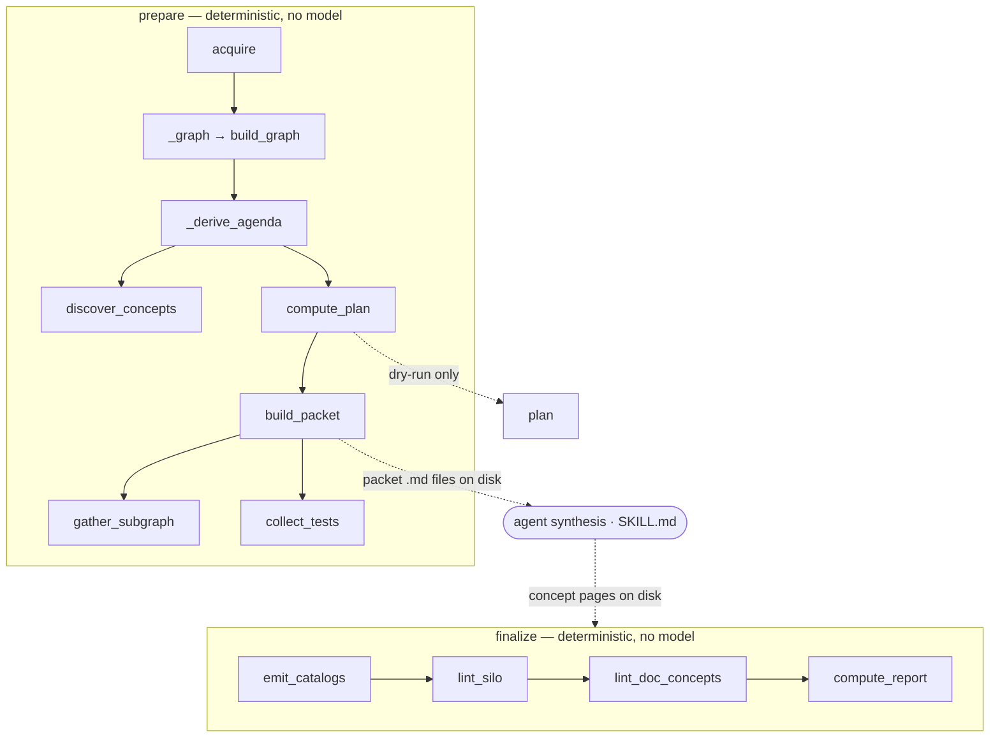

# wikify CLI — the operator's control surface

## Overview
`wikify/cli.py` is the Typer front end that turns a repo into a grounded wiki. Its
single organizing idea is a **hard split around one LLM step**: everything
deterministic (acquire, SCIP-index, build the symbol graph, rank an agenda, diff
against prior state, emit packets, lint, coverage, assemble) is pure Python and runs
in *two* commands — [`prepare`](../catalog/wikify/cli.md#prepare) and
[`finalize`](../catalog/wikify/cli.md#finalize) — that hand off to each other **through
files on disk**. In between, an agent (driven by `SKILL.md`, not by this code) reads
each packet and writes one concept page. So the CLI is not a pipeline that *calls* a
model; it is the scaffolding that brackets the model, doing all the grounding before
synthesis and all the gating after it. The module docstring states the contract
directly: "The deterministic half never calls a model; the agent half never parses
protobuf." [`plan`](../catalog/wikify/cli.md#plan) is a no-side-effect dry-run of the
same reconcile, and `lint`/`coverage`/`verify`/`connect` are narrower re-entries into
individual deterministic stages.

## Diagram

## Design rationale (why it's built this way)
The whole file is shaped by one non-negotiable invariant: the **Python/LLM boundary
is a file boundary**. Rather than a monolithic `ingest` that streams the graph into a
prompt and parses the reply, wikify cuts the operation exactly where trust changes
hands. [`prepare`](../catalog/wikify/cli.md#prepare) produces packets — self-contained
grounding bundles — and stops; the agent writes prose; then
[`finalize`](../catalog/wikify/cli.md#finalize) re-derives the graph from scratch and
*checks* that prose against it. This gives three properties a single call cannot:
the deterministic stages are unit-testable without a model, the synthesis step is
swappable (any agent that honors `SKILL.md` works), and a human can inspect the
packets and the written pages between the two halves.

A second decision is that the **agenda is derived, not authored**.
[`_derive_agenda`](../catalog/wikify/cli.md#_derive_agenda) runs
[`discover_concepts`](../catalog/wikify/discover.md#discover_concepts) to rank modules
by centrality and auto-seed concepts, then lets config concepts
([`concepts`](../catalog/wikify/config.md#RepoConfig.concepts)) override or extend on
slug collision. The docstring pins the intent — "discovery ranks modules by centrality
and auto-seeds concepts; config concepts override/extend on slug collision" — and,
critically, `_derive_agenda` is shared by `prepare` and `plan` "so the dry-run models
the real run." The operator never hand-maintains a concern list.

Third, **`prepare` and `finalize` each branch on `source_type` at their very top** into
the docs track ([`_prepare_docs`](../catalog/wikify/cli.md#_prepare_docs) /
[`_finalize_docs`](../catalog/wikify/cli.md#_finalize_docs)), which skips SCIP entirely
and swaps the grounding anchor from a symbol to a document `#section`. The command
surface is identical; only the resolver differs. This is why prose and code feed one
wiki through one pair of commands.

> [!inferred]
> The reason `finalize` rebuilds the graph rather than reusing an object from `prepare`
> is the file-handoff design itself: the two commands are separate process
> invocations with an agent in between, so there is no live object to pass — state
> survives only as the cached `.scip` index and the concept pages on disk.

## Entry points
- [`prepare`](../catalog/wikify/cli.md#prepare) — the first half. Control reaches it
  when the operator runs `wikify prepare <slug>` (Stages 0–4). It acquires and pins the
  source via [`acquire`](../catalog/wikify/acquire.md#acquire), indexes with
  scip-python (and optionally scip-clang / on-demand indexers per
  [`detect_languages`](../catalog/wikify/languages.md#detect_languages) and
  [`ensure_indexer`](../catalog/wikify/languages.md#ensure_indexer)), builds the graph,
  computes the reconcile delta, and emits one packet per to-do concept — then stops at
  the model boundary.
- [`finalize`](../catalog/wikify/cli.md#finalize) — the second half, run after the
  agent has written pages. It re-derives the graph, emits the module catalogs that are
  the citation homes, gates the pages through the linter, and assembles the index +
  reconcile state. A non-`docs` run refuses to proceed without a SCIP index, forcing
  `prepare` to have run first.
- [`plan`](../catalog/wikify/cli.md#plan) — the dry-run entry. It reuses the *cached*
  SCIP index (never re-indexes), derives the same agenda as `prepare`, and prints the
  [`compute_plan`](../catalog/wikify/diff.md#compute_plan) delta without emitting
  anything — the operator's "what would change?" before committing to synthesis.
- Both `prepare` and `finalize` begin at [`_load`](../catalog/wikify/cli.md#_load),
  which parses `config/<slug>.md` via [`load_config`](../catalog/wikify/config.md#load_config)
  and fixes the on-disk layout ([`wiki_slug`](../catalog/wikify/cli.md#Paths.wiki_slug),
  [`cache`](../catalog/wikify/cli.md#Paths.cache)) — the shared preamble for every per-repo command.
- [`app`](../catalog/wikify/cli.md#app) — the Typer application object; each `@app.command()`
  decorator registers one subcommand, so `app` is the dispatch table the shell talks to.

## Mechanism (step-by-step)
1. **Load config and pin the source.** Every per-repo command opens with
   [`_load`](../catalog/wikify/cli.md#_load) → [`load_config`](../catalog/wikify/config.md#load_config),
   which parses and validates the config frontmatter into a
   [`RepoConfig`](../catalog/wikify/config.md#RepoConfig) and sets the wiki subdir. Then
   [`acquire`](../catalog/wikify/acquire.md#acquire) resolves the repo (local path or git
   URL) to a pinned tree, yielding a [`commit`](../catalog/wikify/acquire.md#Acquired.commit)
   and [`repo_dir`](../catalog/wikify/acquire.md#Acquired.repo_dir). The pinned commit is the
   axis everything downstream reconciles against, so pinning happens before any indexing.

2. **Index and build the symbol graph.** In `prepare`, scip-python (or, for other
   languages detected by [`detect_languages`](../catalog/wikify/languages.md#detect_languages)
   / gated by [`ensure_indexer`](../catalog/wikify/languages.md#ensure_indexer), the C++,
   TS, Go, Rust indexers) writes a `.scip` file into the cache. Then
   [`_graph`](../catalog/wikify/cli.md#_graph) parses every `.scip` present and
   [`build_graph`](../catalog/wikify/scip_index.md#build_graph) *unions* them into one
   [`SymbolGraph`](../catalog/wikify/graph.md#SymbolGraph) — language-neutral because SCIP
   monikers keep symbols distinct across languages. This graph is the grounding substrate:
   the citable namespace synthesis is later held to.

3. **Derive the agenda and compute the reconcile delta.**
   [`_derive_agenda`](../catalog/wikify/cli.md#_derive_agenda) ranks modules with
   [`discover_concepts`](../catalog/wikify/discover.md#discover_concepts) and merges in any
   config [`concepts`](../catalog/wikify/config.md#RepoConfig.concepts). Against the loaded
   state and the [`current_hashes`](../catalog/wikify/diff.md#current_hashes) of the graph,
   [`compute_plan`](../catalog/wikify/diff.md#compute_plan) produces a `Plan` whose
   `todo` set is exactly the concepts that are new or whose symbols moved — this is the
   idempotency mechanism, so a re-run with nothing changed builds zero packets.

4. **Emit one packet per to-do concept — the handoff to the model.** For each concept in
   the plan's `todo`, [`build_packet`](../catalog/wikify/packet.md#build_packet) assembles
   a grounding bundle: [`gather_subgraph`](../catalog/wikify/packet.md#gather_subgraph)
   selects a relevance-bounded set of citable symbols around the seeds, and
   [`collect_tests`](../catalog/wikify/evidence.md#collect_tests) attaches the tests that
   exercise them. The packet's subgraph is the *exact* whitelist of symbols the agent may
   cite; the CLI writes it to disk and prints the plan, then returns. This is the model
   boundary — no LLM has been called, and none will be by this process.

5. **(External) agent synthesis.** Between the two commands, an agent reads each packet
   produced by [`build_packet`](../catalog/wikify/packet.md#build_packet) and writes one
   concept page per packet under `wiki/code/<slug>/concepts/`. This step is intentionally
   *outside* `cli.py` — it is the only LLM stage, driven by `SKILL.md`, and communicates
   with the CLI purely through the packet files in and the page files out.

6. **Emit catalogs, then lint the written pages.** `finalize` first calls
   [`emit_catalogs`](../catalog/wikify/coverage.md#emit_catalogs) —
   ordered *before* linting because citations resolve against each catalog's frontmatter
   symbol map, so the homes must exist first. Then
   [`lint_silo`](../catalog/wikify/lint.md#lint_silo) (or
   [`fix_silo`](../catalog/wikify/fix.md#fix_silo) under `--fix`) runs
   [`lint_page`](../catalog/wikify/lint.md#lint_page) on every concept page, and
   [`lint_doc_concepts`](../catalog/wikify/lint.md#lint_doc_concepts) applies a lighter
   gate to doc-derived pages. The combined [`errors`](../catalog/wikify/lint.md#LintReport.errors)
   decide the [`ok`](../catalog/wikify/lint.md#LintReport.ok) property; if any citation fails
   to resolve, `finalize` exits non-zero. The gate is code, never a prompt.

7. **Coverage floor, then assemble.** With lint green, `finalize` runs
   [`compute_report`](../catalog/wikify/coverage.md#compute_report), which classifies every
   [`documentable_symbols`](../catalog/wikify/coverage.md#documentable_symbols) entry as
   covered / catalog-only / unrepresented — the set-difference that guarantees no module is
   silently dropped by selective synthesis. It records reconcile state from the pages
   actually on disk (via [`current_hashes`](../catalog/wikify/diff.md#current_hashes)) and
   writes the repo + top indexes. The [`render`](../catalog/wikify/coverage.md#CoverageReport.render)
   output is echoed so the operator sees the coverage number.

8. **Docs-mode variant.** When `source_type == docs`,
   [`_prepare_docs`](../catalog/wikify/cli.md#_prepare_docs) builds a doc anchor map with
   [`build_doc_map`](../catalog/wikify/docs.md#build_doc_map) instead of a SCIP graph, and
   [`_finalize_docs`](../catalog/wikify/cli.md#_finalize_docs) gates `src:` citations with
   [`lint_docs`](../catalog/wikify/docs.md#lint_docs) and measures
   [`docs_coverage`](../catalog/wikify/docs.md#docs_coverage). Same two-command shape, same
   file handoff, grounding anchor swapped from symbol to document section.

## Key data structures
- **`Paths`** — the layout resolver built in [`_load`](../catalog/wikify/cli.md#_load).
  Its fields ([`slug`](../catalog/wikify/cli.md#Paths.slug),
  [`cache`](../catalog/wikify/cli.md#Paths.cache),
  [`wiki_slug`](../catalog/wikify/cli.md#Paths.wiki_slug)) are the single source of where
  the `.scip` index, packets, state, and wiki pages live — so the two commands agree on
  the file-handoff locations without passing anything in memory.
- **[`RepoConfig`](../catalog/wikify/config.md#RepoConfig)** — the parsed, authored ingest
  input (languages, ref, acquire mode, source_type, synthesis_focus,
  [`concepts`](../catalog/wikify/config.md#RepoConfig.concepts)). It is the *only* place
  the operator's intent enters; the docstring calls it "an authored ingest input, not a
  product."
- **[`SymbolGraph`](../catalog/wikify/graph.md#SymbolGraph)** — the in-memory citable
  namespace, rebuilt from the cached SCIP index by
  [`build_graph`](../catalog/wikify/scip_index.md#build_graph) in every command that needs
  grounding. Not persisted; the `.scip` file is the persistent form.
- **`Plan`** (from [`compute_plan`](../catalog/wikify/diff.md#compute_plan)) — the delta
  whose `todo` list drives which packets get built; its
  [`render`](../catalog/wikify/diff.md#Plan.render) is what `plan` prints as the dry-run.

## Dynamics (design intent)
The ordering constraints are load-bearing and explicit in comments. Within `finalize`,
[`emit_catalogs`](../catalog/wikify/coverage.md#emit_catalogs) *must* precede
[`lint_silo`](../catalog/wikify/lint.md#lint_silo) because the linter resolves citations
against catalog frontmatter — the source comment reads "catalogs must exist before lint."
Across commands, `prepare` owns indexing and `plan` deliberately does not: `plan`'s
docstring says it "reuses the cached SCIP index — a dry-run never triggers indexing," so
the expensive step happens exactly once regardless of how many dry-runs precede it.
Idempotency is realized by rebuilding state from the pages actually on disk at the end of
`finalize` (the loop over `concepts/*.md` recording each page's citations), so re-running
converges instead of duplicating.

## Edge cases
- **No SCIP index yet.** Both `finalize` and `plan` check for an index and exit with code
  2, pointing the operator at `wikify prepare` — the two halves cannot be run out of order.
- **Nothing to build.** If [`compute_plan`](../catalog/wikify/diff.md#compute_plan) yields
  an empty `todo`, `prepare` prints "nothing to build (converged)" and emits no packets;
  the reconcile is a no-op.
- **A language indexer is missing.** [`ensure_indexer`](../catalog/wikify/languages.md#ensure_indexer)
  asks before installing and, if declined, that language is skipped rather than aborting the
  others — one language failing does not sink the ingest.
- **Lint failure.** Any unresolved citation makes
  [`ok`](../catalog/wikify/lint.md#LintReport.ok) false and `finalize` exits 1 before
  writing indexes, so a broken wiki is never assembled.

## Open questions
- The synthesis step itself is external to this module, so the CLI cannot enforce that the
  agent actually read the source (vs. paraphrasing the packet); the only guarantee is the
  post-hoc citation gate. How much comprehension quality that leaves unchecked is not
  visible from `cli.py`.
- `connect` (Stage 7) operates on the whole `wiki/` tree rather than a single slug and is
  invoked separately; its scheduling relative to per-repo `finalize` runs is a workflow
  convention, not enforced by the command code shown here.

## See also
- [wikify-diff](wikify-diff.md) — the reconcile delta (`compute_plan`, `current_hashes`) the CLI sequences.
- [wikify-discover](wikify-discover.md) — centrality-ranked agenda derivation behind `_derive_agenda`.
- [wikify-lint](wikify-lint.md) — the citation gate `finalize` runs after synthesis.
- [wikify-coverage](wikify-coverage.md) — catalogs + the set-difference coverage floor.
- [wikify-acquire](wikify-acquire.md) — how the source is pinned before indexing.
- [wikify-scip_index](wikify-scip_index.md) — SCIP parse + `build_graph` that produces the citable graph.
- [wikify-docs](wikify-docs.md) — the docs-mode track the commands branch into.
