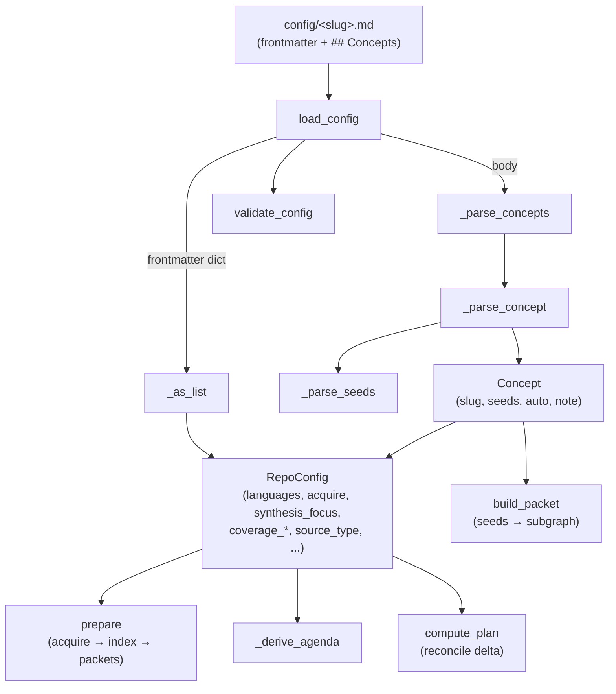

# wikify config — the authored ingest input

## Overview
`config/<slug>.md` is the **one thing a human authors** in a wikify run — and it is
deliberately not a settings file. It is a wiki page: YAML frontmatter carrying typed
scalars, plus a `## Concepts` markdown list that doubles as the wiki's table of contents.
The config layer parses that page into two dataclasses — [`RepoConfig`](../catalog/wikify/config.md#RepoConfig)
(the repo-wide knobs) and a list of [`Concept`](../catalog/wikify/config.md#Concept) (per-topic
seeds) — and everything downstream in the pipeline reads *only* those objects, never the raw
markdown. The single design idea: the config is the **comprehension contract**. Its knobs decide
*how a repo gets understood* — which languages get SCIP-indexed, how the source is pinned, what
lens the synthesis is angled through, which modules are trimmed from coverage, and which concepts
seed the deep mechanism pages. It is a pure-Python, zero-model-call layer: the strictness of TOML,
recovered with the linter tooling already in the build.

## Diagram

## Design rationale (why it's built this way)
The module docstring states the choice outright: the config is **markdown with YAML frontmatter —
the same shape as a wiki page, so the agent edits it with no second syntax**, and the body's
`## Concepts` list *is* the wiki's table of contents. This is why [`load_config`](../catalog/wikify/config.md#load_config)
is pure Python with no model call — parsing and structural validation give "the strict parse TOML
would give, recovered with the linter tooling already in the build." Config errors surface at parse
time, not three stages deep into an expensive SCIP run.

Two decisions are worth calling out. First, the frontmatter is **closed by allow-list**:
[`load_config`](../catalog/wikify/config.md#load_config) computes `set(fm) - _ALLOWED_KEYS` and
raises on any unknown key ([`_ALLOWED_KEYS`](../catalog/wikify/config.md#_ALLOWED_KEYS)). A typo like
`language:` is a loud error, not a silently-ignored field — important because a dropped `languages`
or `coverage_exclude` would quietly change what the wiki comprehends. Second, the split between
`RepoConfig` (the authored input) and the *derived agenda* is intentional. `RepoConfig.concepts`
holds only what the human wrote; [`_derive_agenda`](../catalog/wikify/cli.md#_derive_agenda) later
*adds* centrality-discovered concepts to it. The docstring on `RepoConfig` — "an authored ingest
input, not a product" — marks the boundary: config is the hand-written seed, the agenda is computed.

> [!inferred]
> Making every list-valued knob tolerate a scalar (via [`_as_list`](../catalog/wikify/config.md#_as_list))
> is a usability choice: `languages: python` and `languages: [python]` both parse, so the author
> never has to remember which fields are lists.

## Entry points
- [`load_config`](../catalog/wikify/config.md#load_config) — the sole public entry. Given a path to
  `config/<slug>.md` it returns a fully-populated, validated [`RepoConfig`](../catalog/wikify/config.md#RepoConfig).
  Control reaches it through [`_load`](../catalog/wikify/cli.md#_load), the CLI helper every command
  calls first; `_load` also applies `cfg.wiki_subdir` to the `Paths` object so the wiki lands under
  `wiki/<wiki_subdir>/<slug>`. From there the parsed config flows into [`prepare`](../catalog/wikify/cli.md#prepare)
  (acquire/index/emit-packets) and [`plan`](../catalog/wikify/cli.md#plan) (dry-run reconcile).
- [`_parse_concepts`](../catalog/wikify/config.md#_parse_concepts) — the body parser reached from
  inside `load_config`. It scans the markdown for the `## Concepts` (or legacy `## Concerns`) heading
  and turns each `- ` bullet into a [`Concept`](../catalog/wikify/config.md#Concept), giving the run
  its list of deep-dive topics.

## Mechanism (step-by-step)
1. **Split and load the frontmatter.** [`load_config`](../catalog/wikify/config.md#load_config) reads
   the file, separates the leading `---`-fenced YAML from the markdown body, and `yaml.safe_load`s the
   frontmatter into a dict. A non-mapping frontmatter is rejected immediately.
2. **Validate the key space, then require `slug`.** `load_config` subtracts
   [`_ALLOWED_KEYS`](../catalog/wikify/config.md#_ALLOWED_KEYS) from the frontmatter keys and raises
   listing both the offending and the allowed keys; it then insists on a non-empty
   [`slug`](../catalog/wikify/config.md#RepoConfig.slug), the one required field and the identity of
   the whole run (index filename, wiki directory, state key).
3. **Materialize the typed knobs into `RepoConfig`.** Each optional scalar is coerced (`None`-or-`str`),
   each list field passes through [`_as_list`](../catalog/wikify/config.md#_as_list) so a bare scalar
   becomes a one-element list, and defaults are filled — `wiki_subdir` and
   [`source_type`](../catalog/wikify/config.md#RepoConfig.source_type) default to `"code"`,
   [`synthesis_focus`](../catalog/wikify/config.md#RepoConfig.synthesis_focus) to `""`. This is where
   the comprehension knobs get their values: [`languages`](../catalog/wikify/config.md#RepoConfig.languages)
   (which indexers run), [`acquire`](../catalog/wikify/config.md#RepoConfig.acquire) (clone vs submodule
   pinning), [`coverage_collapse`](../catalog/wikify/config.md#RepoConfig.coverage_collapse) /
   [`coverage_exclude`](../catalog/wikify/config.md#RepoConfig.coverage_exclude) (what gets trimmed),
   and [`doc_globs`](../catalog/wikify/config.md#RepoConfig.doc_globs) (docs-mode selection).
4. **Parse the `## Concepts` body into concepts.** [`_parse_concepts`](../catalog/wikify/config.md#_parse_concepts)
   finds the heading, then reads every `- ` bullet until the next `## ` section, handing each line to
   [`_parse_concept`](../catalog/wikify/config.md#_parse_concept). A missing `## Concepts` section is a
   hard error — the wiki has no table of contents without it.
5. **Extract slug, seeds, auto-flag and note per concept.** [`_parse_concept`](../catalog/wikify/config.md#_parse_concept)
   strips any `<!-- ... -->` comment (keeping its text as a fallback note), matches the bullet with
   `_CONCEPT_RE` to pull the `**bold**` slug (or first word), and locates a `— seeds:` clause with
   `_SEEDS_RE`. The clause goes to [`_parse_seeds`](../catalog/wikify/config.md#_parse_seeds), which
   returns `(seeds, auto, note)`: `(auto)` or `(discover: …)` yields `auto=True` with empty
   [`seeds`](../catalog/wikify/config.md#Concept.seeds); otherwise the backtick-quoted tokens become the
   seed symbols and any leftover text is the [`note`](../catalog/wikify/config.md#Concept.note).
6. **Validate and return.** [`validate_config`](../catalog/wikify/config.md#validate_config) re-checks
   the invariant (non-empty slug) and `load_config` returns the `RepoConfig`. Downstream, the concepts
   drive both synthesis — [`build_packet`](../catalog/wikify/packet.md#build_packet) turns a concept's
   [`seeds`](../catalog/wikify/config.md#Concept.seeds) into a citeable subgraph — and reconcile —
   [`compute_plan`](../catalog/wikify/diff.md#compute_plan) walks `config.concepts` to decide which
   pages to build, rebuild, or leave.

## Key data structures
- [`RepoConfig`](../catalog/wikify/config.md#RepoConfig) — the repo-wide contract. Beyond identity
  ([`slug`](../catalog/wikify/config.md#RepoConfig.slug), [`ref`](../catalog/wikify/config.md#RepoConfig.ref),
  [`repo`](../catalog/wikify/config.md#RepoConfig.repo)) its fields are the comprehension knobs:
  [`languages`](../catalog/wikify/config.md#RepoConfig.languages) and the C++ pair
  [`compile_commands`](../catalog/wikify/config.md#RepoConfig.compile_commands) /
  [`bazel_targets`](../catalog/wikify/config.md#RepoConfig.bazel_targets) select indexers;
  [`index_shards`](../catalog/wikify/config.md#RepoConfig.index_shards) bounds indexer memory on huge
  repos; [`acquire`](../catalog/wikify/config.md#RepoConfig.acquire) picks clone vs submodule pinning;
  [`source_type`](../catalog/wikify/config.md#RepoConfig.source_type) +
  [`doc_globs`](../catalog/wikify/config.md#RepoConfig.doc_globs) switch to the prose track;
  [`synthesis_focus`](../catalog/wikify/config.md#RepoConfig.synthesis_focus) is the lens threaded into
  every packet; [`coverage_collapse`](../catalog/wikify/config.md#RepoConfig.coverage_collapse) /
  [`coverage_exclude`](../catalog/wikify/config.md#RepoConfig.coverage_exclude) trim the coverage floor;
  [`source_url`](../catalog/wikify/config.md#RepoConfig.source_url) chooses catalog link style; and
  [`tests`](../catalog/wikify/config.md#RepoConfig.tests) / [`docs`](../catalog/wikify/config.md#RepoConfig.docs) /
  [`build`](../catalog/wikify/config.md#RepoConfig.build) / [`wiki_subdir`](../catalog/wikify/config.md#RepoConfig.wiki_subdir)
  round it out.
- [`Concept`](../catalog/wikify/config.md#Concept) — one architectural topic. Its docstring is the key
  to reading the pipeline: [`seeds`](../catalog/wikify/config.md#Concept.seeds) are backtick-quoted
  symbol tokens, "empty when the seeds clause was `(auto)` or `(discover: …)`, in which case
  [`auto`](../catalog/wikify/config.md#Concept.auto) is True (Stage 5 discovers entry points instead)."
  The [`note`](../catalog/wikify/config.md#Concept.note) carries human intent forward into the packet.

## Dynamics (design intent)
The parse is a single synchronous, deterministic pass — no concurrency, no I/O beyond the one file
read. Its behavior is pinned by a dense test suite: [`test_frontmatter_parsed`](../catalog/tests/test_config.md#test_frontmatter_parsed)
locks the typed-scalar mapping, [`test_concept_slugs`](../catalog/tests/test_config.md#test_concept_slugs)
the concept ordering, [`test_auto_seeds`](../catalog/tests/test_config.md#test_auto_seeds) and
[`test_discover_treated_as_auto`](../catalog/tests/test_config.md#test_discover_treated_as_auto) the
`(auto)`/`(discover:)` → `auto=True` collapse, and the knobs each have a pinning test —
[`test_config_parses_acquire_field`](../catalog/tests/test_acquire_submodule.md#test_config_parses_acquire_field),
[`test_config_parses_trim_keys`](../catalog/tests/test_coverage_trim.md#test_config_parses_trim_keys),
[`test_config_source_type_and_doc_globs`](../catalog/tests/test_docs.md#test_config_source_type_and_doc_globs),
[`test_wiki_subdir_defaults_to_code_and_is_configurable`](../catalog/tests/test_acquire_submodule.md#test_wiki_subdir_defaults_to_code_and_is_configurable).
The important dynamic is *downstream*: the parsed config is read again on every reconcile.
[`plan`](../catalog/wikify/cli.md#plan) and [`prepare`](../catalog/wikify/cli.md#prepare) both feed
`cfg` through [`_derive_agenda`](../catalog/wikify/cli.md#_derive_agenda), which merges discovered
concepts with the authored ones on slug collision (config wins), and
[`compute_plan`](../catalog/wikify/diff.md#compute_plan) diffs the resulting concept set against saved
state to build only the delta — so editing the config and re-running converges rather than rebuilds.

## Edge cases
- **Unknown frontmatter key → hard error**, not a warning; guarded by
  [`test_unknown_frontmatter_key_raises`](../catalog/tests/test_config.md#test_unknown_frontmatter_key_raises).
  Empty/missing list fields default to `[]`, verified by
  [`test_missing_frontmatter_lists_default_empty`](../catalog/tests/test_config.md#test_missing_frontmatter_lists_default_empty).
- **Missing `slug` or missing `## Concepts`** each raise `ValueError` —
  [`test_missing_slug_raises`](../catalog/tests/test_config.md#test_missing_slug_raises),
  [`test_missing_concepts_section_raises`](../catalog/tests/test_config.md#test_missing_concepts_section_raises).
  A concept bullet with no `**bold**` name falls back to the first word
  ([`test_concept_without_bold_uses_first_word`](../catalog/tests/test_config.md#test_concept_without_bold_uses_first_word)).
- **Authoring-format tolerance.** Backticks are stripped from seed tokens
  ([`test_seeds_backticks_stripped`](../catalog/tests/test_config.md#test_seeds_backticks_stripped)),
  a plain hyphen separator is accepted alongside the em-dash
  ([`test_hyphen_separator_tolerated`](../catalog/tests/test_config.md#test_hyphen_separator_tolerated)),
  and an HTML comment on a concept line is stripped from the seeds yet retained as a note fallback
  ([`test_html_comment_stripped_from_note`](../catalog/tests/test_config.md#test_html_comment_stripped_from_note)).
- **`Concept` defaults** — a bare `Concept(slug=…)` has empty seeds, `auto=False`, empty note
  ([`test_concept_dataclass_defaults`](../catalog/tests/test_config.md#test_concept_dataclass_defaults)).

## Open questions
- [`validate_config`](../catalog/wikify/config.md#validate_config) only re-checks the slug; the richer
  semantic checks (e.g. `acquire ∈ {clone, submodule}`, `source_type ∈ {code, docs, auto}`) are not
  enforced here — an invalid value coerces to a string and presumably fails later in acquire/index.
  Whether that is intentional (defer to the stage that uses the knob) is not settled by this module.
- The `## Concerns` back-compat alias in [`_parse_concepts`](../catalog/wikify/config.md#_parse_concepts)
  hints at an older schema; the migration history is out of scope for the source read here.

## See also
- [wikify-cli](wikify-cli.md) — [`_load`](../catalog/wikify/cli.md#_load),
  [`prepare`](../catalog/wikify/cli.md#prepare), [`plan`](../catalog/wikify/cli.md#plan) and
  [`_derive_agenda`](../catalog/wikify/cli.md#_derive_agenda): where the parsed config is consumed.
- [wikify-discover](wikify-discover.md) — the centrality-based auto-agenda that merges with the
  authored `concepts` when a concept's seeds are `(auto)`/`(discover:)`.
- [wikify-diff](wikify-diff.md) — [`compute_plan`](../catalog/wikify/diff.md#compute_plan): how
  `config.concepts` drives idempotent reconcile.
- [wikify-acquire](wikify-acquire.md) — consumer of `acquire`/`ref`/`repo` for source pinning.
- [wikify-coverage](wikify-coverage.md) — consumer of `coverage_collapse`/`coverage_exclude`.
- [wikify-docs](wikify-docs.md) — the `source_type: docs` / `doc_globs` prose track.
