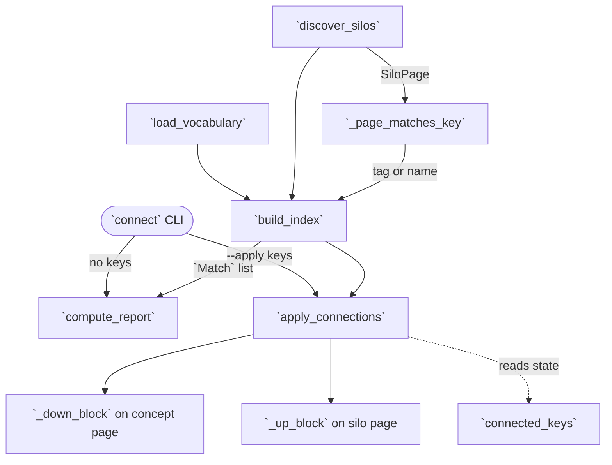

# wikify connect — cross-repo concept connection

## Overview
A single ingest produces a **silo** — one repo's `overview.md` + `concepts/` + `catalog/`. `wikify connect` (Stage 7) supplies the *cross-repo* view: given several silos in one wiki, it answers "**which repos implement the same concept**" (splash attention, remat, sharding). The key design idea is that this cross-cut is materialized **inline, as ordinary wiki markdown** — not a side-table, not a new page type. Each host-level concept page `wiki/concepts/<key>.md` gets a generated `## In this wiki's repos` block linking **down** to every repo's implementation; each silo page gets a one-line **up-link** back. The whole module is pure Python with **no model call** — matching is a deterministic tag/token heuristic, so the LLM is spent on synthesis elsewhere, never here. It runs in two beats: **propose** ([`compute_report`](../catalog/wikify/connect.md#compute_report)) — print which concepts *could* connect — and **apply** ([`apply_connections`](../catalog/wikify/connect.md#apply_connections)) — wire the ones a human selected.

## Diagram

## Design rationale (why it's built this way)
The module docstring states the thesis directly: connect wires the cross-repo view "**inline, as a normal wiki** — no side-table, no new page type — through the concept pages the host wiki already curates." Two decisions follow from that and are worth internalizing:

- **Selective by design.** *Which* concepts to connect is a **human decision**, not automatic. The docstring is explicit that "connecting everything to everything drowns the pages," so [`build_index`](../catalog/wikify/connect.md#build_index) only *proposes* candidates and writes nothing; a person then names keys for `--apply`. This is why the module splits cleanly into a read-only proposal path and a mutating apply path.

- **The pages are the database.** There is no `_connect/` directory or manifest recording what has been connected. Instead [`connected_keys`](../catalog/wikify/connect.md#connected_keys) *reads* the connection state back out of the wiki — a key is "connected" iff its concept page contains a down-block marker. Its docstring: "the connection state (the wiki pages themselves; no side-file), so a re-ingest can `--refresh` exactly what a human previously chose to connect." State-in-the-artifact is what makes the operation idempotent and re-runnable without a separate bookkeeping file to drift.

> [!inferred]
> The controlled vocabulary being the *host wiki's* `wiki/concepts/*.md` filenames (per [`load_vocabulary`](../catalog/wikify/connect.md#load_vocabulary)) — rather than a list wikify ships — means the connection axis is whatever concepts the curator has chosen to name. connect never invents a concept; it can only link silos to a page the human already created.

## Entry points
- [`connect`](../catalog/wikify/cli.md#connect) — the `wikify connect` CLI command (Stage 7). With no options it prints the proposal via [`compute_report`](../catalog/wikify/connect.md#compute_report); with `--apply <keys>` it wires those concepts via [`apply_connections`](../catalog/wikify/connect.md#apply_connections); `--refresh` first unions the requested keys with [`connected_keys`](../catalog/wikify/connect.md#connected_keys) so a re-ingest regenerates exactly the previously-chosen set. Control reaches it at the tail of an ingest (from the second repo on) or on explicit user request.
- [`compute_report`](../catalog/wikify/connect.md#compute_report) — the read-only proposal. It runs the full discovery→index pipeline and returns a one-screen listing of every vocabulary concept with candidate implementations (most-implemented first), marking those already connected. It writes nothing; it is the "what could I connect?" query.
- [`apply_connections`](../catalog/wikify/connect.md#apply_connections) — the mutating path. Given chosen keys, it writes down-blocks on concept pages and regenerates up-blocks on silo pages, returning per-key link counts. This is the only function in the module that edits files.

## Mechanism (step-by-step)
1. **Load the concept vocabulary.** [`load_vocabulary`](../catalog/wikify/connect.md#load_vocabulary) reads the stems of `wiki/concepts/*.md` (skipping `index` and `_`-prefixed housekeeping pages) as the controlled set of concept keys. This is the *host wiki's* curated vocabulary — the axis along which silos will be compared. An empty or absent directory yields no vocabulary, and connect degrades to a no-op proposal.

2. **Discover the silos.** [`discover_silos`](../catalog/wikify/connect.md#discover_silos) walks the wiki for every `overview.md`, treating its parent as a silo if it also has a `concepts/` subdir — layout-agnostic across `wiki/code/<slug>` and `wiki/codebases/<slug>`. Crucially it **excludes the curated vocabulary dir itself** (`concepts/` at the top level has no sibling `overview.md`, and the resolved-path check guards the case where it does), so the vocabulary is never mistaken for a silo. Each concept page becomes a [`SiloPage`](../catalog/wikify/connect.md#SiloPage) carrying its repo slug, its explicit `concepts:` frontmatter [`tags`](../catalog/wikify/connect.md#SiloPage.tags), and a bag of name/id [`tokens`](../catalog/wikify/connect.md#SiloPage.tokens) drawn from the page stem, `concept:` id, and title via [`_tokens`](../catalog/wikify/connect.md#_tokens).

3. **Score correspondence, tag before name.** For each (vocabulary key × silo page) pair, [`_page_matches_key`](../catalog/wikify/connect.md#_page_matches_key) returns a confidence or `None`. An explicit `concepts:` frontmatter entry equal to the key wins as `"tag"` (authoritative — this is the same key a synthesis page emits when it recognizes its mechanism *is an instance of* a shared concept). Failing that, it falls back to `"name"` if *all* of the key's significant tokens appear in the page's tokens, where [`_token_matches`](../catalog/wikify/connect.md#_token_matches) accepts an exact token or a prefix-share of at least [`_MIN_PREFIX`](../catalog/wikify/connect.md#_MIN_PREFIX) (4) characters — so `remat` matches `rematerialization`, `shard` matches `sharding`.

4. **Invert into the proposal index.** [`build_index`](../catalog/wikify/connect.md#build_index) turns (vocab × silos) into `concept key → [Match]`, keeping only keys with at least one candidate and sorting each key's [`Match`](../catalog/wikify/connect.md#Match) list **tag-first, then by repo/path** so authoritative correspondences rank above heuristic guesses. Its docstring underlines the boundary: "This is the *proposal* — nothing is written until a human picks which keys to connect." [`compute_report`](../catalog/wikify/connect.md#compute_report) formats this index for stdout, and stops here.

5. **Write the down-blocks (concept → repos).** In the apply path, for each chosen key [`apply_connections`](../catalog/wikify/connect.md#apply_connections) filters out any `exclude`d `repo/rel_from_wiki` matches, then builds a `## In this wiki's repos` block with [`_down_block`](../catalog/wikify/connect.md#_down_block) — grouping implementations by repo, most-cited repos first, each a relative link down to the silo page. If the concept page already carries a `connect:auto` block it is swapped in place; otherwise the block is appended. Hand-written prose above the block (e.g. a "how they differ" synthesis) is never touched.

6. **Regenerate the up-blocks (repo → concept), from the whole connected set.** The second loop in [`apply_connections`](../catalog/wikify/connect.md#apply_connections) computes `connected = chosen ∪ connected_keys(...)` and rewrites **every** silo page's up-block from that full set — so a page belonging to several connected concepts lists them all, and a page that no longer matches any *loses* its block. [`_up_block`](../catalog/wikify/connect.md#_up_block) emits the one-line `> **Cross-repo concept:** part of …` up-link, inserted after the frontmatter and first H1 by [`_insert_after_frontmatter_h1`](../catalog/wikify/connect.md#_insert_after_frontmatter_h1) so it sits at the top of the readable body.

7. **Idempotent block replacement.** All in-place edits go through [`_replace_block`](../catalog/wikify/connect.md#_replace_block), which finds the `begin…end` delimiters ([`_DOWN_BEGIN`](../catalog/wikify/connect.md#_DOWN_BEGIN)/[`_DOWN_END`](../catalog/wikify/connect.md#_DOWN_END), [`_UP_BEGIN`](../catalog/wikify/connect.md#_UP_BEGIN)/[`_UP_END`](../catalog/wikify/connect.md#_UP_END)) and swaps the content, deliberately **swallowing one trailing newline** after the end marker "to avoid blank accumulation." Passing `block=None` deletes the block. This is what `test_apply_is_idempotent_and_reflects_connection_state` pins: re-running produces byte-identical output — no churn, no duplication.

## Key data structures
- [`SiloPage`](../catalog/wikify/connect.md#SiloPage) — "one silo concept page — the grounding target a vocabulary key resolves to." Holds the [`repo`](../catalog/wikify/connect.md#SiloPage.repo) slug, absolute [`path`](../catalog/wikify/connect.md#SiloPage.path), [`rel_from_wiki`](../catalog/wikify/connect.md#SiloPage.rel_from_wiki) for link construction, [`title`](../catalog/wikify/connect.md#SiloPage.title), the authoritative [`tags`](../catalog/wikify/connect.md#SiloPage.tags) (explicit `concepts:` frontmatter), and heuristic [`tokens`](../catalog/wikify/connect.md#SiloPage.tokens).
- [`Match`](../catalog/wikify/connect.md#Match) — a resolved candidate: [`repo`](../catalog/wikify/connect.md#Match.repo), [`path`](../catalog/wikify/connect.md#Match.path), [`rel_from_wiki`](../catalog/wikify/connect.md#Match.rel_from_wiki), [`title`](../catalog/wikify/connect.md#Match.title), and a [`confidence`](../catalog/wikify/connect.md#Match.confidence) that is `"tag"` (explicit) or `"name"` (heuristic). The `confidence != "tag"` sort key is what puts authoritative matches first.
- The four marker constants ([`_DOWN_BEGIN`](../catalog/wikify/connect.md#_DOWN_BEGIN)/[`_DOWN_END`](../catalog/wikify/connect.md#_DOWN_END), [`_UP_BEGIN`](../catalog/wikify/connect.md#_UP_BEGIN)/[`_UP_END`](../catalog/wikify/connect.md#_UP_END)) — the `connect:auto` / `connect:up` HTML comments that delimit regenerable regions and double as the persisted connection state.
- [`_STOP`](../catalog/wikify/connect.md#_STOP) and [`_MIN_PREFIX`](../catalog/wikify/connect.md#_MIN_PREFIX) — the two tuning knobs of the matcher: a stopword set stripping tokens "too generic to carry correspondence signal" (`common`, `utils`, `core`, `impl`, …) and the minimum prefix length for fuzzy token overlap.

## Dynamics (design intent)
Connection is a batch, whole-wiki regeneration, not an incremental patch. `test_apply_writes_inline_bidirectional_links` confirms the intended shape: applying `splash-attention` across two silos yields a down-block on the concept page linking to **both** silo pages, an up-link on each silo page pointing back, and — the negative assertion — **no `_connect/` side-table** and no block on a concept the human did not pick. `test_curated_vocab_dir_is_not_a_silo` pins that [`discover_silos`](../catalog/wikify/connect.md#discover_silos) never treats `wiki/concepts/` as a silo. Because connect only ever rewrites text inside its own delimiters, it composes safely with the citation-linted silo prose it links to — it links *into* that prose but never rewrites it.

## Edge cases
- **Concept page missing.** In [`apply_connections`](../catalog/wikify/connect.md#apply_connections), if `wiki/<vocab>/<key>.md` does not exist the down-block write is skipped for that key (the count is still recorded) — connect will not create the concept page for you.
- **A page that stops matching.** On `--refresh`, a silo page previously in a connected set but no longer matching any key has its up-block *removed* (the `_up_block(...) if keys_here else None` branch), keeping the wiki honest after a rename or a changed `concepts:` tag.
- **`--refresh` with no explicit keys.** [`connect`](../catalog/wikify/cli.md#connect) unions the empty apply set with [`connected_keys`](../catalog/wikify/connect.md#connected_keys), so refresh regenerates exactly the already-connected set after a new ingest — and if nothing is connected yet, falls through to the proposal report.
- **Empty vocabulary.** With no `wiki/concepts/*.md`, [`load_vocabulary`](../catalog/wikify/connect.md#load_vocabulary) returns `[]` and the report advises creating concept pages; nothing is written.
- **Over-eager name matches.** The `"name"` heuristic requires *all* key tokens present but allows 4-char prefix overlap, so short or generic keys can produce false candidates — which is precisely why apply is human-gated and `exclude` exists to drop specific `repo/rel-path` matches.

## Open questions
- The `title` used in a down-block link comes from the [`SiloPage`](../catalog/wikify/connect.md#SiloPage) frontmatter; how ties are broken *within* a repo when multiple pages match one key (order of the inner `by_repo` list) is only the input `hits` order — not separately re-sorted in [`_down_block`](../catalog/wikify/connect.md#_down_block) beyond the repo grouping.
- Whether the "how they differ" hub prose the module docstring mentions is authored by a human or a later LLM pass is outside this module — connect only guarantees it sits *above* the auto block and is preserved.

## See also
- [wikify-cli](wikify-cli.md) — the command surface that dispatches `connect` (Stage 7) alongside `prepare`/`finalize`.
- [wikify-coverage](wikify-coverage.md) — the other regenerable-block writer (coverage catalogs); coverage represents every module, connect cross-links concepts across modules and repos.
- [wikify-lint](wikify-lint.md) — the citation gate on the silo prose that connect links into but never rewrites.
- [wikify-discover](wikify-discover.md) — how the per-silo concept agenda (the pages connect later matches on) is derived.
