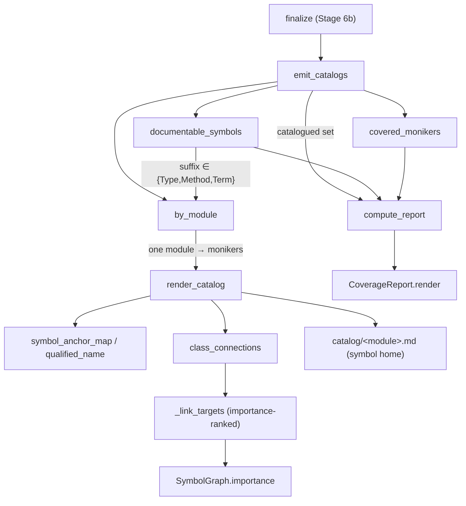

# Coverage — the whole-repo guarantee (Stage 6b)

## Overview
Concept synthesis (Stage 5) is deliberately selective — it documents only the
concepts an agent was handed, buying *depth* at the cost of silently dropping
whole subsystems a query never touched. Coverage is the deterministic floor under
that: it emits one generated **catalog page per module** so every documentable
symbol in the repo has a home, then classifies each as *deep* (cited by a concept
page), *catalog-only*, or *unrepresented*. The load-bearing design choice is that
coverage is a **set-difference over the SCIP symbol table, not a graph walk** — it
enumerates what SCIP already found rather than trying to *reach* code by
traversal. This is what makes wikify's coverage story different from tools that
only document what a query happened to touch: the catalog is the citation
resolution target and the anti-hallucination backbone — the linter resolves every
concept-page citation against a catalog's symbol map, and nothing outside the
enumerated set can be cited.

## Diagram

## Design rationale (why it's built this way)
The module docstring states the problem plainly: concept synthesis "only documents
the concepts it is given… on its own it silently drops whole subsystems." The
first real ingest (torchtitan) covered three hand-authored `Trainer` concerns and
**missed every model** — the essence of the repo.

The tempting fix is a call-graph walk from the entry points, documenting whatever
you reach. It does not work, and the reason is central to wikify's whole thesis:
the architecturally load-bearing edges are *dynamic by design*. A model is invoked
as `model_parts[0](inputs)` through `nn.Module.__call__`, leaving **no static call
edge**; traversal dies at that seam, and a per-file "is this connected?" check
false-flags the model files as dead code — the exact blind spot that makes
name-based call graphs wrong.

So coverage sidesteps connectivity entirely. SCIP already *enumerated* every
symbol during indexing, so [`documentable_symbols`](../catalog/wikify/coverage.md#documentable_symbols)
never relies on reachability to *find* code — it filters the graph's node set. The
whole-repo guarantee falls out of enumeration, not graph analysis. The counterpart
of this is honest scoping: coverage ≠ connection. Catalogs represent each module
and connect it *internally* (intra-module edges are real static calls), but they
do **not** invent the trainer→model edge or unify the N separate `Attention`
classes — those are separate, optional operations (devirtualization,
concept-correspondence), not prerequisites for coverage.

A second rationale is the deterministic/LLM split. Everything here is pure Python —
zero model calls. [`render_catalog`](../catalog/wikify/coverage.md#render_catalog)'s
own docstring says "no synthesis": the page is assembled from the graph's extracted
facts (signatures, docstrings, edges), so catalogs cannot hallucinate. That makes
them a trustworthy citation target: the linter resolves a concept page's
`../catalog/<module>.md#Anchor` link against the catalog's frontmatter symbol map,
and the anchor format is a pure function of the moniker so the packet (what to
cite) and the catalog (what resolves) always agree.

## Entry points
- [`finalize`](../catalog/wikify/cli.md#finalize) — Stage 6 of `ingest`. Its
  docstring: "lint the agent-written pages, assemble the index, update state." It
  runs coverage **first** ("Stage 6b FIRST — emit module catalogs (the symbol
  homes). Citations resolve against their frontmatter `symbols` map, so catalogs
  must exist before lint"), calling [`emit_catalogs`](../catalog/wikify/coverage.md#emit_catalogs)
  and then [`compute_report`](../catalog/wikify/coverage.md#compute_report). This
  ordering is the whole point: the anti-hallucination gate depends on the catalogs
  already being on disk.
- [`coverage`](../catalog/wikify/cli.md#coverage) — the standalone
  `wikify coverage <slug>` command, "Report whole-repo coverage (set-difference
  over the SCIP symbol table)." With `--emit` it (re)writes catalogs via
  [`emit_catalogs`](../catalog/wikify/coverage.md#emit_catalogs); otherwise it just
  prints a [`compute_report`](../catalog/wikify/coverage.md#compute_report) — the
  inspection surface for "did any subsystem get dropped?"

## Mechanism (step-by-step)
1. **Enumerate the documentable set.** [`documentable_symbols`](../catalog/wikify/coverage.md#documentable_symbols)
   scans every node in the graph and keeps those with a `def_path` (in-repo) whose
   descriptor `suffix` is one of `Type`/`Method`/`Term` — class, function/method,
   or module-level value. This is the "set," and its docstring names the guarantee:
   "Every in-repo symbol worth representing in the wiki." Because it reads the
   node set rather than following edges, a class only ever reached via dynamic
   dispatch is still in it.

2. **Group by module.** [`by_module`](../catalog/wikify/coverage.md#by_module)
   buckets the documentable monikers by their `def_path`, so each catalog page
   corresponds to exactly one source file. [`catalog_rel_path`](../catalog/wikify/coverage.md#catalog_rel_path)
   maps that file to its page path (`foo/bar.py` → `foo/bar.md`), mirroring the
   source tree so a reader navigates catalogs the way they navigate the repo.

3. **Find what concept pages already cover.** [`covered_monikers`](../catalog/wikify/coverage.md#covered_monikers)
   scans the concept pages and, for each `../catalog/<module>.md#anchor` link,
   resolves it back to a moniker via a reverse index keyed by
   `(catalog_rel_path, qualified_name)`. Crucially it resolves against the **graph**,
   not the catalog files — so it works *while* catalogs are being generated (the
   chicken-and-egg the finalize ordering would otherwise create). The result maps a
   moniker to the concept slug that made it "deep."

4. **Render one page per module — the symbol home.** For each module,
   [`render_catalog`](../catalog/wikify/coverage.md#render_catalog) partitions the
   monikers into classes, their members, and module-level defs, then emits YAML
   frontmatter whose `symbols` map (anchor → moniker) is *the linter's resolution
   table*. The anchors come from [`symbol_anchor_map`](../catalog/wikify/coverage.md#symbol_anchor_map),
   which keys each symbol by [`qualified_name`](../catalog/wikify/coverage.md#qualified_name) —
   a pure, link-safe function of the moniker (descriptor names joined by `.`,
   unsafe chars scrubbed so C++ `$`/space monikers still make a valid `#anchor`).
   Same function on both sides means packet-and-catalog anchors never drift.

5. **Fill each symbol's detail deterministically.** [`_detail`](../catalog/wikify/coverage.md#render_catalog._detail)
   builds a `name(params) — Lnnn — docstring summary` bullet, drawing the summary
   from the author's own words via [`doc_summary`](../catalog/wikify/graph.md#Symbol.doc_summary)
   (prefer docstrings over synthesis — ground truth at zero model cost). Members
   are split public-first: public/documented symbols get full detail, undocumented
   dunder/private fold to a terse-but-present, linked list — nothing is dropped, and
   there are no caps because a module's own contents are its deterministic content.

6. **Attach importance-ranked uses-by.** [`class_connections`](../catalog/wikify/coverage.md#class_connections)
   rolls each member's edges up to the owning class (so `self.attention =
   Attention(...)` counts as the class using `Attention`), yielding true
   class-to-class `uses`/`used_by`. [`_link_targets`](../catalog/wikify/coverage.md#render_catalog._link_targets)
   then renders them ranked by [`importance`](../catalog/wikify/graph.md#SymbolGraph.importance)
   (`outbound*5 + ref_count*2`), filtering test/example noise and reporting hidden
   counts — so the cap keeps the load-bearing callers, not an alphabetical slice.

7. **Classify and report.** [`compute_report`](../catalog/wikify/coverage.md#compute_report)
   does the actual set-difference: each documentable symbol is `covered` if a
   concept page cites it, else `catalog_only` if it landed on a catalog page, else
   `unrepresented`. It also tallies class representation and samples up to ten
   uncovered names. [`emit_catalogs`](../catalog/wikify/coverage.md#emit_catalogs)
   returns exactly the documentable set as `catalogued`, so after a normal finalize
   the unrepresented list is empty — the guarantee, verified.

## Key data structures
- **`CoverageReport`** — the tallies: `total`, [`covered`](../catalog/wikify/coverage.md#CoverageReport.covered)
  (deep, cited by a concept page), [`catalog_only`](../catalog/wikify/coverage.md#CoverageReport.catalog_only)
  (shallow, catalog page only), plus [`represented`](../catalog/wikify/coverage.md#CoverageReport.represented)
  (`covered + catalog_only`), `pct_deep`/`pct_represented`, and
  [`uncovered_examples`](../catalog/wikify/coverage.md#CoverageReport.uncovered_examples).
  [`render`](../catalog/wikify/coverage.md#CoverageReport.render) formats these into
  the human-readable console report. The `covered` vs `catalog_only` distinction is
  the depth gradient made measurable.
- **The catalog page frontmatter** — written by [`render_catalog`](../catalog/wikify/coverage.md#render_catalog):
  `symbol_base` (the common moniker prefix, factored out once) + `symbols`
  (anchor → moniker-suffix). This map, not the prose, is what the linter reads to
  resolve a citation; it is the single home for each symbol (there is no per-symbol
  stub directory).
- **`SymbolGraph`** — the input to everything here: [`SymbolGraph`](../catalog/wikify/graph.md#SymbolGraph)'s
  node set is the enumeration source and its reference-derived edges feed the
  uses-by lists. Coverage reads it but never mutates it.

## Dynamics (design intent)
`test_report_classifies_covered_vs_catalog` pins the contract: after
`emit_catalogs`, `catalogued == documentable_symbols(g)`, and with one concept-cited
symbol the report shows `covered == 1`, `catalog_only == 3`, `represented == 4`,
`uncovered_examples == []` — the whole-repo guarantee as an assertion. The
docstring-fidelity chain is pinned by `test_docstring_extracted_into_catalog` (the
author's `documentation`, not an invented summary, reaches the page) and
`test_member_detail_promotes_documented_and_folds_plumbing` (public/documented
promoted, undocumented plumbing folded but present). `test_catalog_pages_mirror_source_tree`
fixes the source-tree layout, and `test_used_by_excludes_tests_and_ranks_by_importance`
fixes that uses-by ranks by centrality (`AHi` before `BLo`) and drops test
fixtures while noting the omission. These are deterministic pin tests — no runtime
behavior beyond what the functions statically produce.

## Edge cases
- **Source links, relative vs absolute.** [`emit_catalogs`](../catalog/wikify/coverage.md#emit_catalogs)
  prefers a `source_url` base (a pinned github `…/blob/<commit>` permalink); with a
  local `repo_dir` it computes a path **relative to each catalog page** — never
  absolute, because a leading `/` in markdown means repo-root, i.e. a broken link
  (`test_emit_uses_relative_source_path_never_absolute`). `source_url=""` disables
  links entirely.
- **`exclude` vs `collapse`.** Both use [`_glob_any`](../catalog/wikify/coverage.md#_glob_any)
  (its `*` spans `/`). `exclude` drops a module's page entirely — safe **only** for
  uncited noise (tests/vendored), since a dropped symbol can no longer be cited and
  falls out of `catalogued`. `collapse` keeps the frontmatter symbol map (citations
  still resolve) but omits the member body — for model-zoo / boilerplate bulk.
- **Signature decorators.** [`render_catalog`](../catalog/wikify/coverage.md#render_catalog)
  strips leading `@decorator` lines (scip-python stores the signature as a
  multi-line fenced block whose first line is often the decorator), so a catalog
  shows `class C(Base):`, not `@final`.
- **Anchor collisions.** [`symbol_anchor_map`](../catalog/wikify/coverage.md#symbol_anchor_map)
  keeps the higher-[`importance`](../catalog/wikify/graph.md#SymbolGraph.importance)
  moniker when two symbols share a qualified name in one module — deterministic, so
  resolution stays valid.

## Open questions
- The module docstring mentions a mid-tier "purpose blurb" band for undocumented
  modules as the one remaining unimplemented tier; coverage today has only the two
  extremes (deep concept page vs structural catalog). Where that blurb would be
  computed and cited is not settled in this packet.
- `compute_report` counts classes separately (`classes_total`/`classes_represented`)
  but the subgraph does not expose why classes get their own tally versus other
  documentable kinds — likely because classes are the concept-correspondence unit,
  but that is not stated in source here.

## See also
- [wikify-lint](wikify-lint.md) — the build gate that resolves concept-page
  citations against the catalog symbol maps coverage emits.
- [wikify-graph](wikify-graph.md) — the `SymbolGraph`, `importance`, and
  reference-derived edges that coverage enumerates and ranks over.
- [wikify-monikers](wikify-monikers.md) — `parse_symbol` and descriptors, the basis
  for `qualified_name` anchors.
- [wikify-discover](wikify-discover.md) — the derived, centrality-ranked agenda that
  decides which symbols get *deep* concept pages (the other half of the two-tier
  coverage model).
- [wikify-cli](wikify-cli.md) — `finalize` and `coverage`, the commands that drive
  this stage.
</content>
</invoke>
