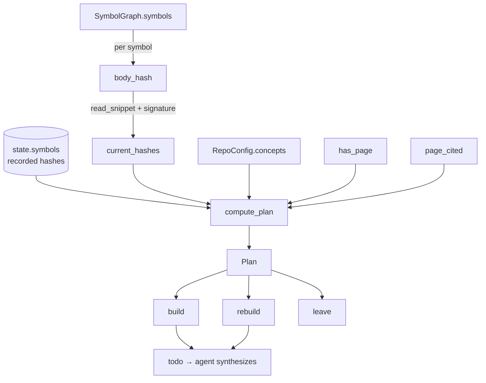

# wikify-diff — the incremental reconcile engine

<!-- connect:up:begin -->
> **Cross-repo concept:** part of [incremental-reconcile](../../../concepts/incremental-reconcile.md) across this wiki's repos.
<!-- connect:up:end -->
## Overview
`wikify-diff` is the small, pure-Python core that makes the wiki *cheap to keep current*
rather than expensive to re-derive. Its one idea: hash each in-repo symbol's
(signature + body), remember which symbols every concept page cited, and on the next run
diff the fresh hashes against the recorded ledger. A page is stale **only** if a symbol it
actually cited changed or was removed; everything else is left untouched. This turns
"understand the repo" from a per-query RAG reconstruction into a **delta-only rebuild**:
first build writes every page, a no-source-change re-run is a proven no-op, and a one-symbol
edit rebuilds exactly the handful of pages that depended on it. The whole decision is made
by [`compute_plan`](../catalog/wikify/diff.md#compute_plan), which folds the symbol diff and
the reconcile state into a [`Plan`](../catalog/wikify/diff.md#Plan) of three disjoint
buckets — build, rebuild, leave.

## Diagram

## Design rationale (why it's built this way)
The module docstring states the contract directly: *"Hash each symbol's (signature + body)
and compare to the recorded state to find changed monikers; any page citing a changed symbol
is stale... Pure Python, drives idempotent reconcile"* ([`compute_plan`](../catalog/wikify/diff.md#compute_plan)).
Three deliberate choices make this trustworthy:

- **Content hashing, not timestamps or git blame.** Staleness is defined by *what the symbol
  is*, not when a file was touched. [`body_hash`](../catalog/wikify/source.md#body_hash) hashes
  the signature concatenated with the definition body, so re-indexing an unchanged repo yields
  identical hashes and a converged no-op — line moves elsewhere in the file that don't change a
  symbol's own body never invalidate it. This is why re-running `ingest` is safe and free.

- **Citation-scoped invalidation.** A changed symbol only invalidates the pages that *cited it*.
  The reconcile ledger records, per concept, the exact monikers each page cited
  ([`page_cited`](../catalog/wikify/state.md#page_cited)); [`compute_plan`](../catalog/wikify/diff.md#compute_plan)
  intersects that set with the invalidating set. Editing an obscure helper no page cites rebuilds
  nothing. This is the differentiator from re-derive-per-query tools: work is proportional to the
  *cited* delta, not the repo size or the query count.

- **Plan is a pure value; synthesis happens elsewhere.** [`compute_plan`](../catalog/wikify/diff.md#compute_plan)
  calls no model and writes no file — it returns a [`Plan`](../catalog/wikify/diff.md#Plan) the
  CLI renders and the agent acts on. This enforces the project's hard Python/LLM split: the
  *decision* of what to rebuild is deterministic and testable; only the actual page writing is LLM.

> [!inferred]
> Hashing (signature + body) rather than the raw byte range means a pure whitespace/comment
> reflow *outside* a symbol's captured body span leaves the hash unchanged, while a real edit to
> the body flips it. This is the intended behavior implied by the "stable hash... for reconcile
> diffing" docstring, but the exact reflow boundary depends on how SCIP draws the enclosing range.

## Entry points
- [`compute_plan`](../catalog/wikify/diff.md#compute_plan) — the engine's single decision function.
  Reached from every reconcile-aware command: [`prepare`](../catalog/wikify/cli.md#prepare) calls it
  to print the plan at the end of Stages 0–4, and [`plan`](../catalog/wikify/cli.md#plan) calls it as a
  pure dry-run against the derived agenda that emits nothing. It takes the fresh
  [`SymbolGraph`](../catalog/wikify/graph.md#SymbolGraph), the loaded `state` dict, the
  [`RepoConfig`](../catalog/wikify/config.md#RepoConfig) (for its concept list), and optionally
  precomputed hashes; it returns the [`Plan`](../catalog/wikify/diff.md#Plan).
- [`current_hashes`](../catalog/wikify/diff.md#current_hashes) — the hashing sweep. Control reaches it
  either implicitly inside [`compute_plan`](../catalog/wikify/diff.md#compute_plan) when no hashes are
  passed, or explicitly from [`finalize`](../catalog/wikify/cli.md#finalize), which recomputes the full
  moniker→hash map after a successful lint and writes it back as the new ledger baseline. It maps every
  entry of [`SymbolGraph.symbols`](../catalog/wikify/graph.md#SymbolGraph.symbols) through
  [`body_hash`](../catalog/wikify/source.md#body_hash).
- [`render`](../catalog/wikify/diff.md#Plan.render) — the human-facing view of a plan, printed by both
  [`prepare`](../catalog/wikify/cli.md#prepare) and [`plan`](../catalog/wikify/cli.md#plan) so a
  maintainer sees the build/rebuild/leave breakdown and the changed/removed symbol counts before any
  synthesis runs.

## Mechanism (step-by-step)
1. **Snapshot the current repo as hashes.** [`current_hashes`](../catalog/wikify/diff.md#current_hashes)
   iterates every symbol in [`SymbolGraph.symbols`](../catalog/wikify/graph.md#SymbolGraph.symbols) and
   computes a [`body_hash`](../catalog/wikify/source.md#body_hash) for each. `body_hash` reads the
   definition text via [`read_snippet`](../catalog/wikify/source.md#read_snippet) (capped at 10,000 lines
   so even large defs are captured whole), prepends the symbol's
   [`signature`](../catalog/wikify/graph.md#Symbol.signature), and returns the first 16 hex chars of a
   SHA-256. The result is a `dict[moniker → hash]` that is the fingerprint of "the repo as it is now."

2. **Diff against the recorded ledger.** [`compute_plan`](../catalog/wikify/diff.md#compute_plan) reads
   the previous `state["symbols"]` map and computes two sets: `changed` (monikers whose stored hash
   differs from the fresh one — this also catches brand-new symbols, since a missing old hash never
   equals the new one) and `removed` (monikers present in the old ledger but absent now). Their union is
   `invalidating` — the symbols whose change could make a page wrong. On a first-ever build the old map
   is empty, so every present symbol is "changed" and everything downstream must be built.

3. **Bucket each concept in the agenda.** For every [`Concept`](../catalog/wikify/config.md#Concept) in
   [`RepoConfig.concepts`](../catalog/wikify/config.md#RepoConfig.concepts), keyed by its
   [`slug`](../catalog/wikify/config.md#Concept.slug), `compute_plan` asks
   [`has_page`](../catalog/wikify/state.md#has_page): if the ledger has no page recorded for this concept
   it goes in `Plan.`[`build`](../catalog/wikify/diff.md#Plan.build) and the loop moves on. This is how a
   *newly added* concept (config edit, no source change) is handled by the exact same code path as a first
   build — the reconcile is one operation, not three.

4. **Decide stale vs. fresh by citation intersection.** For a concept that *does* have a page,
   `compute_plan` fetches its recorded citations via [`page_cited`](../catalog/wikify/state.md#page_cited)
   and intersects them with `invalidating`. A non-empty intersection means the page cited a symbol that
   changed or vanished, so it lands in `Plan.`[`rebuild`](../catalog/wikify/diff.md#Plan.rebuild); an
   empty intersection means every symbol the page depended on is byte-identical, so it lands in
   `Plan.`[`leave`](../catalog/wikify/diff.md#Plan.leave) and is never re-synthesized. This citation-scoped
   test is the crux of delta-only cost.

5. **Expose the work and the convergence signal.** The finished
   [`Plan`](../catalog/wikify/diff.md#Plan) carries
   [`changed_symbols`](../catalog/wikify/diff.md#Plan.changed_symbols) and
   [`removed_symbols`](../catalog/wikify/diff.md#Plan.removed_symbols) counts for reporting. The agent
   consumes `Plan.todo` (= build + rebuild concatenated) as its synthesis worklist, while
   `Plan.is_noop` (true when both build and rebuild are empty) is the "converged" flag —
   [`render`](../catalog/wikify/diff.md#Plan.render) prints `=> no-op (converged)` in that case, which is
   the visible proof that a re-run did zero model work.

6. **Commit the new baseline after lint passes.** The loop only closes when
   [`finalize`](../catalog/wikify/cli.md#finalize), after linting succeeds, calls
   [`current_hashes`](../catalog/wikify/diff.md#current_hashes) again and writes the result back as the
   ledger's `symbols` map (alongside the pinned commit). The next run therefore diffs against the state
   of the repo *as of the last successful build*, so an aborted or failed run does not poison the baseline.

## Key data structures
- **[`Plan`](../catalog/wikify/diff.md#Plan)** — the reconcile verdict as a dataclass of three disjoint
  concept-slug lists ([`build`](../catalog/wikify/diff.md#Plan.build),
  [`rebuild`](../catalog/wikify/diff.md#Plan.rebuild), [`leave`](../catalog/wikify/diff.md#Plan.leave))
  plus two integer counts. `todo` (build + rebuild) and `is_noop` are derived properties, so there is one
  source of truth for "what to do" and "is there anything to do."
- **The reconcile ledger (`state` dict)** — `{ref, symbols, pages}`. `symbols` is the moniker→body-hash
  map that step 2 diffs against ([`has_page`](../catalog/wikify/state.md#has_page) and
  [`page_cited`](../catalog/wikify/state.md#page_cited) read the `pages` sub-map). It is the entire memory
  that lets the engine be incremental; without it every run would be a full rebuild.
- **The hash unit** — [`body_hash`](../catalog/wikify/source.md#body_hash) over
  [`signature`](../catalog/wikify/graph.md#Symbol.signature) + body. The body span comes from the symbol's
  SCIP [`enclosing`](../catalog/wikify/graph.md#Symbol.enclosing) range (via
  [`body_span`](../catalog/wikify/source.md#body_span)), falling back to the single
  [`def_line`](../catalog/wikify/graph.md#Symbol.def_line) when no enclosing range exists. This choice of
  unit is what defines "changed" for the whole engine.

## Dynamics (design intent)
The state module's docstring frames the intent precisely: the ledger persists `{ref, symbols, pages}`
so `ingest` *"converges to {pinned commit × concept set}: re-running with no source/config change is a
no-op, and a change rebuilds only the delta"* ([`has_page`](../catalog/wikify/state.md#has_page)). The
diff is deterministic and side-effect-free: [`compute_plan`](../catalog/wikify/diff.md#compute_plan)
reads a graph and a dict and returns a value, which is why [`plan`](../catalog/wikify/cli.md#plan) can be
a true dry-run that "emits nothing." The state module's own docstring underscores that this layer touches
no model — it is "pure bookkeeping." The tests pin the ledger contract directly:
`test_has_page`, `test_record_page_then_page_cited`, and `test_page_cited_absent_is_empty` exercise
[`has_page`](../catalog/wikify/state.md#has_page) and
[`page_cited`](../catalog/wikify/state.md#page_cited), confirming that an unrecorded concept reads back as
"no page / empty citations" — the precondition step 3 relies on to route new concepts into `build`.

## Edge cases
- **First build / added concept.** Empty `state["symbols"]` makes every symbol "changed," and
  [`has_page`](../catalog/wikify/state.md#has_page) returning false routes concepts straight to
  [`build`](../catalog/wikify/diff.md#Plan.build) — the same path a newly configured concept takes on an
  otherwise-converged repo.
- **Unreadable or missing source.** [`read_snippet`](../catalog/wikify/source.md#read_snippet) returns
  `""` when [`def_path`](../catalog/wikify/graph.md#Symbol.def_path) is `None`, the file can't be read, or
  [`body_span`](../catalog/wikify/source.md#body_span) yields nothing; the symbol still gets a stable
  (empty-body) hash rather than crashing the sweep.
- **Removed symbols invalidate too.** A page can go stale not because a cited symbol *changed* but because
  it was *deleted* — `removed` is folded into `invalidating`, so a page citing a now-gone moniker is
  rebuilt, not left silently pointing at nothing.
- **Uncited change is free.** A symbol that changed but that no page's
  [`page_cited`](../catalog/wikify/state.md#page_cited) set names produces no rebuild — it bumps the
  `changed_symbols` count but touches nothing, which is the intended (and easy-to-misread) behavior.
- **Coverage catalogs are out of scope here.** `compute_plan` reconciles *concept pages* only; whole-repo
  representation is a separate deterministic coverage pass in `finalize`. A changed symbol that no concept
  cites is still enumerated in its catalog even though this engine leaves every page.

## Open questions
- The plan is scoped to concept pages; whether (and how) a symbol change forces a catalog-page rebuild in
  `finalize` is not decided in this subgraph — the coverage/catalog symbols are not present here.
- Hash collisions are theoretically possible with a 16-hex-char (64-bit) truncated SHA-256; the code
  accepts this truncation but the subgraph does not reveal any collision-handling, so the practical risk
  bound is unresolved from here alone.

## See also
- [wikify-state](wikify-state.md) — the `{ref, symbols, pages}` ledger this engine reads and writes.
- [wikify-cli](wikify-cli.md) — `prepare` / `plan` / `finalize` orchestration around `compute_plan`.
- [wikify-graph](wikify-graph.md) — the `SymbolGraph` and `Symbol` whose bodies get hashed.
