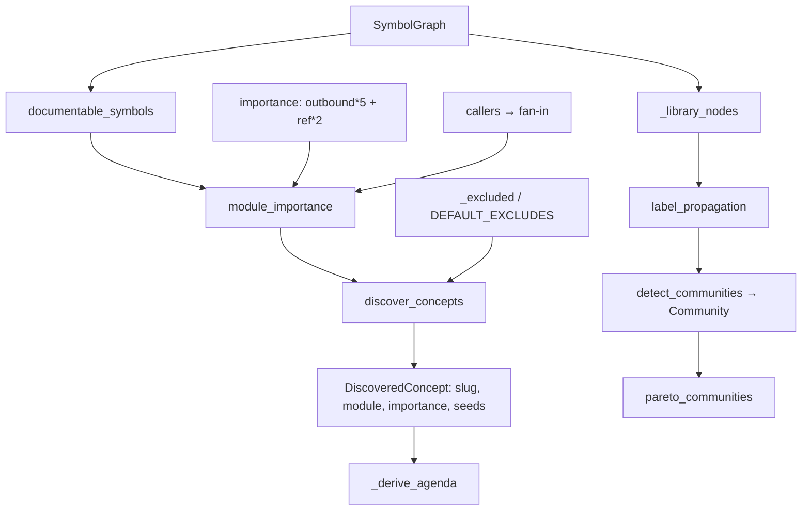

# Discover — the derived, centrality-ranked concept agenda

## Overview
`discover` answers the question every code-comprehension tool must answer before it can
explain anything: *what is worth explaining?* Instead of a human hand-listing "concerns,"
wikify **computes the agenda from the code's own topology**. The unit of comprehension is a
*module* (a def file); its worth is the aggregate inbound fan-in (centrality) of the symbols
defined in it; the "deep" tier is simply the top modules by that score, minus the
test/example/vendor tail; and each chosen concept is **auto-seeded** from its own
highest-centrality symbols so synthesis knows where to start reading. The module's own
docstring states the thesis: the agenda is *"computed from the code's own structure, not
authored,"* and the whole pass is *"Pure Python, no model: this only selects and seeds"* —
the LLM later writes the pages, but never decides *which* pages exist. A second, parallel
lens ([`detect_communities`](../catalog/wikify/discover.md#detect_communities)) clusters the
same graph to describe how the picked concepts group and interact.

## Diagram

## Design rationale (why it's built this way)
The central bet is that **centrality is a good proxy for conceptual importance**, and that a
tool which derives its own agenda is more comprehensive than one fed a human list — a human
forgets subsystems, a fan-in count does not. This is the fix for the failure recorded in the
project memory: an early ingest documented three hand-authored concerns and *missed every
model class*. Deriving the agenda from topology removes the human as the bottleneck on
coverage.

Two deliberate scoping choices make the ranking trustworthy:

- **Fan-in, not size.** [`module_importance`](../catalog/wikify/discover.md#module_importance)
  scores a module by the number of *callers* of its symbols
  ([`callers`](../catalog/wikify/graph.md#SymbolGraph.callers)), i.e. how much the rest of the
  repo depends on it — not by line or symbol count. A large but peripheral file does not
  outrank a small, heavily-used core module.
- **Exclude the tail before ranking, not after.**
  [`DEFAULT_EXCLUDES`](../catalog/wikify/discover.md#DEFAULT_EXCLUDES) drops tests, examples,
  scripts, benchmarks, and vendored `third_party/` paths. The docstring is explicit about the
  vendored case: *"catalog it … but never elevate it to a concept — a deep page about bundled
  {fmt} is noise."* Excluded code is still represented by the coverage catalog; it just never
  competes for a *deep* page.

> [!inferred]
> The `importance` weighting `outbound*5 + ref_count*2`
> ([`importance`](../catalog/wikify/graph.md#SymbolGraph.importance), labelled
> "context-sherpa rank") ranks *symbols within* a module (to pick seeds), while module-level
> ranking uses raw fan-in. The two coexist: fan-in decides *which modules*, the sherpa rank
> decides *which symbols inside them* to hand synthesis as seeds. That split is my reading of
> how the two scores are used together, not stated in one place.

## Entry points
- [`discover_concepts`](../catalog/wikify/discover.md#discover_concepts) — the agenda builder,
  reached from the `prepare`/`plan` path via
  [`_derive_agenda`](../catalog/wikify/cli.md#_derive_agenda). Given the
  [`SymbolGraph`](../catalog/wikify/graph.md#SymbolGraph) it returns the deterministic list of
  [`DiscoveredConcept`](../catalog/wikify/discover.md#DiscoveredConcept) specs that becomes the
  synthesis to-do list. Its docstring is the one-line contract: *"Top modules by centrality →
  deep concept specs, auto-seeded. Deterministic."*
- [`module_importance`](../catalog/wikify/discover.md#module_importance) — the scoring pass
  `discover_concepts` calls first; it aggregates every documentable symbol into per-module
  stats (fan-in, symbol/class counts, and a ranked list of members for seeding).
- [`detect_communities`](../catalog/wikify/discover.md#detect_communities) — the parallel
  clustering entry point (used by [`pareto_communities`](../catalog/wikify/discover.md#pareto_communities)
  and the overview) that groups the graph into [`Community`](../catalog/wikify/discover.md#Community)
  summaries rather than picking individual concepts.

## Mechanism (step-by-step)
1. **Enumerate what can be documented.**
   [`module_importance`](../catalog/wikify/discover.md#module_importance) begins by asking
   [`documentable_symbols`](../catalog/wikify/coverage.md#documentable_symbols) for every
   in-repo symbol that has a definition and a citable suffix. This is an *enumeration over the
   SCIP symbol table*, not a call-graph walk — the same principle that lets coverage sidestep
   dynamic dispatch. Nothing gets ranked that couldn't also be catalogued.
2. **Aggregate per module into a centrality score.** For each symbol,
   [`module_importance`](../catalog/wikify/discover.md#module_importance) buckets it by its
   [`def_path`](../catalog/wikify/graph.md#Symbol.def_path) and adds its fan-in
   (`len(graph.callers(m))`, via [`callers`](../catalog/wikify/graph.md#SymbolGraph.callers)) into
   the module's `fanin` total. It also counts symbols, counts classes (symbols whose
   [`suffix`](../catalog/wikify/graph.md#Symbol.suffix) is `Type`), and appends
   `(importance, fanin, moniker)` to a per-module `ranked` list — the raw material for both
   ordering and seeding.
3. **Filter, then rank the modules.**
   [`discover_concepts`](../catalog/wikify/discover.md#discover_concepts) walks the module
   stats and drops any module that is [`_excluded`](../catalog/wikify/discover.md#_excluded)
   (matches [`DEFAULT_EXCLUDES`](../catalog/wikify/discover.md#DEFAULT_EXCLUDES)) or whose
   `fanin` is below `min_importance` (default 25). Survivors become the deep tier; the final
   list is sorted by descending `importance` so the most-depended-on module leads. The pinning
   test [`test_excludes_tests_and_low_importance`](../catalog/tests/test_discover.md#test_excludes_tests_and_low_importance)
   locks in that a `tests/` module never appears.
4. **Auto-seed each concept from its most central symbols.** Still inside
   [`discover_concepts`](../catalog/wikify/discover.md#discover_concepts), the module's `ranked`
   list is sorted descending and the top `seeds_per_concept` (default 4) monikers become the
   concept's [`seeds`](../catalog/wikify/discover.md#DiscoveredConcept.seeds). This is why no
   human seeds are needed: the packet builder later grows a subgraph out from these seeds.
   [`test_central_module_ranked_first_and_seeded`](../catalog/tests/test_discover.md#test_central_module_ranked_first_and_seeded)
   asserts the highest-centrality symbol lands in the top concept's seeds.
5. **Emit stable, unique slugs and cap the tier.** Each concept gets a readable
   [`slug`](../catalog/wikify/discover.md#DiscoveredConcept.slug) via `_concept_slug` (drop the
   umbrella package + extension), and collisions are de-duplicated with a numeric suffix before
   the list is truncated to `max_deep` (24). Stability matters for idempotent reconcile — the
   same repo yields the same slugs. [`test_slugs_are_unique_and_readable`](../catalog/tests/test_discover.md#test_slugs_are_unique_and_readable)
   pins uniqueness.
6. **Hand the derived agenda to the pipeline.**
   [`_derive_agenda`](../catalog/wikify/cli.md#_derive_agenda) calls
   [`discover_concepts`](../catalog/wikify/discover.md#discover_concepts), turns the result into
   a seedmap keyed by [`slug`](../catalog/wikify/discover.md#DiscoveredConcept.slug), and merges
   with any config-authored concepts (config extends/overrides on slug collision). Its docstring
   names this "the DERIVED agenda (decision 8)." Shared by `prepare` and `plan` so a dry-run
   models the real run exactly.
7. **(Parallel view) Cluster the library for structure.**
   [`detect_communities`](../catalog/wikify/discover.md#detect_communities) restricts the graph
   to [`_library_nodes`](../catalog/wikify/discover.md#_library_nodes) (test/example nodes removed
   *before* clustering so a test driver can't pull library symbols into a test-labelled group),
   runs [`label_propagation`](../catalog/wikify/discover.md#label_propagation), and summarises each
   cluster as a [`Community`](../catalog/wikify/discover.md#Community) (internal/boundary edges,
   top members by centrality, modules, neighbour clusters). Communities are sorted by
   [`interactions`](../catalog/wikify/discover.md#Community.interactions), and
   [`pareto_communities`](../catalog/wikify/discover.md#pareto_communities) returns the smallest
   prefix covering 80% of all interactions.

## Key data structures
- [`DiscoveredConcept`](../catalog/wikify/discover.md#DiscoveredConcept) — one deep-tier concept:
  its [`slug`](../catalog/wikify/discover.md#DiscoveredConcept.slug),
  [`module`](../catalog/wikify/discover.md#DiscoveredConcept.module) (def file),
  [`importance`](../catalog/wikify/discover.md#DiscoveredConcept.importance) (fan-in),
  auto [`seeds`](../catalog/wikify/discover.md#DiscoveredConcept.seeds), and
  [`symbol_count`](../catalog/wikify/discover.md#DiscoveredConcept.symbol_count) /
  [`class_count`](../catalog/wikify/discover.md#DiscoveredConcept.class_count). This is the whole
  output contract of discovery.
- [`SymbolGraph`](../catalog/wikify/graph.md#SymbolGraph) — the substrate: nodes are
  [`Symbol`](../catalog/wikify/graph.md#Symbol) records keyed in
  [`symbols`](../catalog/wikify/graph.md#SymbolGraph.symbols), edges are reference-derived
  ([`_callees`](../catalog/wikify/graph.md#SymbolGraph._callees) /
  [`_callers`](../catalog/wikify/graph.md#SymbolGraph._callers), with
  [`ref_count`](../catalog/wikify/graph.md#SymbolGraph.ref_count) feeding
  [`importance`](../catalog/wikify/graph.md#SymbolGraph.importance)). Discovery only *reads* it,
  through [`callers`](../catalog/wikify/graph.md#SymbolGraph.callers) and
  [`callees`](../catalog/wikify/graph.md#SymbolGraph.callees).
- [`Community`](../catalog/wikify/discover.md#Community) — a cluster summary:
  [`label`](../catalog/wikify/discover.md#Community.label),
  [`members`](../catalog/wikify/discover.md#Community.members),
  [`internal_edges`](../catalog/wikify/discover.md#Community.internal_edges) /
  [`boundary_edges`](../catalog/wikify/discover.md#Community.boundary_edges) (summed by
  [`interactions`](../catalog/wikify/discover.md#Community.interactions)),
  [`top_members`](../catalog/wikify/discover.md#Community.top_members),
  [`modules`](../catalog/wikify/discover.md#Community.modules), and
  [`neighbors`](../catalog/wikify/discover.md#Community.neighbors).

## Dynamics (design intent)
The pass is **deterministic by construction** — the docstrings say so ("Deterministic")
and [`label_propagation`](../catalog/wikify/discover.md#label_propagation) is written to
guarantee it: fixed sorted node iteration order, ties broken toward the smallest label. That
matters for the tool's idempotent-reconcile invariant — re-running discovery on the same pinned
commit must yield the same slugs and seeds so the wiki converges rather than churns. The
[`_undirected_adj`](../catalog/wikify/discover.md#_undirected_adj) helper symmetrises the
directed ref graph for clustering, and the `allowed` set threaded through it and
`label_propagation` is how test/example nodes are excluded *before* labels form. No concurrency,
no model calls in this stage — the LLM boundary is downstream at synthesis.

## Edge cases
- **Everything below threshold.** A repo whose modules all have `fanin < min_importance`
  yields an empty deep tier; the tests deliberately pass `min_importance=1` to force concepts
  out of the tiny fixture ([`test_central_module_ranked_first_and_seeded`](../catalog/tests/test_discover.md#test_central_module_ranked_first_and_seeded)).
- **Slug collisions.** Distinct modules can collapse to the same
  [`slug`](../catalog/wikify/discover.md#DiscoveredConcept.slug); `discover_concepts` appends
  `-2`, `-3`, … so the agenda keys stay unique.
- **The `max_deep` cap.** Only the top 24 concepts survive; a genuinely important module ranked
  25th gets no deep page and falls back to the coverage catalog — a deliberate depth/breadth
  trade in [`discover_concepts`](../catalog/wikify/discover.md#discover_concepts).
- **Substring excludes.** [`_excluded`](../catalog/wikify/discover.md#_excluded) matches any
  [`DEFAULT_EXCLUDES`](../catalog/wikify/discover.md#DEFAULT_EXCLUDES) fragment as a substring of
  the path, so an unlucky legitimate path containing e.g. `test/` would also be demoted.

## Open questions
- The `ranked` tuple `(graph.importance(m), fanin, m)` mixes the sherpa
  [`importance`](../catalog/wikify/graph.md#SymbolGraph.importance) with raw fan-in for seed
  ordering, but module *ranking* uses summed fan-in alone. Why seeds use the composite rank while
  modules use pure fan-in isn't spelled out in the subgraph — the intent is inferred above.
- How the community/`pareto` view feeds the final wiki (overview diagrams vs. the concept agenda)
  is not visible from this packet; the consumers of
  [`pareto_communities`](../catalog/wikify/discover.md#pareto_communities) are outside the subgraph.

## See also
- [wikify-graph](wikify-graph.md) — the `SymbolGraph` this pass ranks over, including the
  reference-derived edges and the `importance` rank.
- [wikify-coverage](wikify-coverage.md) — the set-difference floor that catalogs every module
  discovery does *not* elevate to a deep concept.
- [wikify-diff](wikify-diff.md) — the delta path that makes re-ranking after a commit bump
  incremental.
