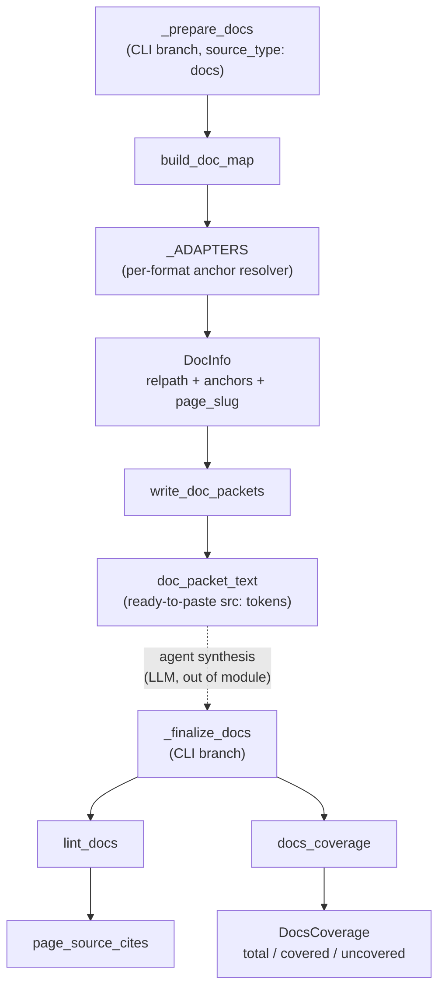

# Docs mode — prose ingestion grounded on document sections

## Overview
Docs mode is wikify's second source type: it ingests a repo's prose (READMEs, design
docs, guides, notebooks-as-markdown) into the same wiki as code, using the **same
pipeline shape** — `prepare` → agent synthesis → `finalize` — but with the grounding
anchor swapped. Where code mode pins every claim to a SCIP symbol, docs mode pins it to
a **source document + `#section`**. The module's whole job is the *deterministic half*
of Karpathy-style synthesis: enumerate the docs, resolve each doc's section anchors into
a [`DocInfo`](../catalog/wikify/docs.md#DocInfo) table, hand the agent one packet per
doc, then gate the agent's `src:` citations against that table and guarantee every doc is
represented. The synthesis itself (read doc → write topic/source pages → cite → cross-link)
is still the LLM's job; this module never summarizes — it only makes the grounding checkable.

The one idea that makes this work as a *drop-in* alongside code: only the anchor resolver
is format-sensitive, so it lives behind a tiny per-format adapter table
([`_ADAPTERS`](../catalog/wikify/docs.md#_ADAPTERS)). Enumeration, the citation gate, and
the coverage floor are all format-agnostic and structurally identical to their code-mode
counterparts.

## Diagram


## Design rationale (why it's built this way)
The module docstring states the thesis directly: *"wikify's identity is Karpathy synthesis
wrapped in a deterministic shell — a grounding gate + a coverage floor. Code mode anchors
that shell to SCIP symbols; docs mode anchors it to a source document + section."* The
design payoff is that a whole new source type costs almost no new machinery: the LLM step,
the `prepare`/`finalize` handoff-via-files, the lint-as-build-gate, and the enumeration
coverage floor are all reused. Only the *grounding vocabulary* changes.

The second decision worth calling out is why the anchor resolver is an adapter rather than a
single parser. Different doc formats expose sections differently — markdown/rst use heading
lines, HTML uses `<h1..h6>` tags and explicit `id=`/`name=` attributes, plain text has no
structure at all. So [`_ADAPTERS`](../catalog/wikify/docs.md#_ADAPTERS) maps file extension →
extractor, and its `.get(suffix, lambda _t: set())` default means an *unknown* format
degrades gracefully to whole-file grounding (an empty anchor set) instead of crashing or
being dropped. [`_html_anchors`](../catalog/wikify/docs.md#_html_anchors) makes the same
safety choice explicitly: it swallows parser exceptions so *"grounding degrades, never
crashes"*.

Third, the citation gate is deliberately **asymmetric** with code mode.
[`lint_docs`](../catalog/wikify/docs.md#lint_docs) documents it: *"Prose may state freely
(no subgraph/uncited gate) — it just may not cite a section that doesn't exist."* Code
synthesis forbids *any* uncited mechanism claim; prose synthesis lets the agent write freely
and only rejects a citation that points at a doc or `#section` that isn't real. That fits the
nature of prose — a summary legitimately synthesizes across a document — while still making
every explicit citation falsifiable.

## Entry points
- [`_prepare_docs`](../catalog/wikify/cli.md#_prepare_docs) — the docs-mode branch of
  `wikify prepare`, reached when `source_type: docs`. Its docstring: *"Docs-mode prepare: no
  SCIP — enumerate docs, build the anchor map, emit one packet per doc."* It enumerates docs,
  calls [`build_doc_map`](../catalog/wikify/docs.md#build_doc_map),
  [`write_doc_packets`](../catalog/wikify/docs.md#write_doc_packets), and persists the doc map
  as JSON so `finalize` can resolve citations against the identical anchor table later.
- [`_finalize_docs`](../catalog/wikify/cli.md#_finalize_docs) — the docs-mode branch of
  `wikify finalize`, reached after the agent has written the `topics/` and `sources/` pages.
  It reloads (or re-derives) the doc map, runs the [`lint_docs`](../catalog/wikify/docs.md#lint_docs)
  gate, computes [`docs_coverage`](../catalog/wikify/docs.md#docs_coverage), records the commit,
  and assembles the docs index. A failing lint raises and stops the build.

## Mechanism (step-by-step)
1. **Resolve every doc's sections into an anchor table.** For each enumerated doc,
   [`build_doc_map`](../catalog/wikify/docs.md#build_doc_map) reads the file, picks the
   extractor for its extension from [`_ADAPTERS`](../catalog/wikify/docs.md#_ADAPTERS), and
   records a [`DocInfo`](../catalog/wikify/docs.md#DocInfo) with `relpath`, the resolved
   [`anchors`](../catalog/wikify/docs.md#DocInfo.anchors) set, and a
   [`lines`](../catalog/wikify/docs.md#DocInfo.lines) count. For markdown/rst,
   [`_markdown_anchors`](../catalog/wikify/docs.md#_markdown_anchors) walks the text tracking
   ```` ``` ```` fences (so headings inside code blocks are ignored), matching ATX headings via
   [`_ATX`](../catalog/wikify/docs.md#_ATX) and setext underlines via
   [`_SETEXT`](../catalog/wikify/docs.md#_SETEXT), running each heading through
   [`slugify`](../catalog/wikify/docs.md#slugify) — the GitHub-flavoured *lowercase, drop
   punctuation, spaces→hyphens* rule ([`_SLUG_STRIP`](../catalog/wikify/docs.md#_SLUG_STRIP)).
   The resulting `doc_map` is the prose analog of code mode's SCIP symbol table.
2. **Emit one packet per doc.** [`write_doc_packets`](../catalog/wikify/docs.md#write_doc_packets)
   iterates the doc map and writes `doc__<page_slug>.md` per doc, where
   [`page_slug`](../catalog/wikify/docs.md#DocInfo.page_slug) is the filename-safe slug used for
   both the packet name and the doc's future `sources/<page_slug>.md` landing page.
   [`doc_packet_text`](../catalog/wikify/docs.md#doc_packet_text) builds each packet:
   provenance (immutable `raw/code/<slug>/…` path), the doc body (truncated at `max_lines`
   with an explicit *"READ THE REAL FILE"* note), the sibling docs it links to, and — crucially —
   a **ready-to-paste list of valid `src:` citation tokens**, one per anchor. This mirrors how a
   code packet hands over `cite:` catalog anchors: the packet, not the agent, defines the legal
   citation surface.
3. **The agent synthesizes prose pages (LLM, outside this module).** Guided by the doc packet's
   `src:` token list, the agent writes `topics/` and `sources/` pages citing sections verbatim.
   The packet emitted by [`doc_packet_text`](../catalog/wikify/docs.md#doc_packet_text) is the
   only contract between the deterministic and LLM halves; whole-file docs (empty
   [`anchors`](../catalog/wikify/docs.md#DocInfo.anchors)) are handed a single whole-file token
   instead of per-section tokens.
4. **Gate every citation at finalize.** [`lint_docs`](../catalog/wikify/docs.md#lint_docs)
   scans the wiki's `topics/`, `sources/`, `concepts/`, and `doc-concepts/` pages; for each page
   [`page_source_cites`](../catalog/wikify/docs.md#page_source_cites) extracts `(doc, anchor, line)`
   triples using the [`_SRC_CITE`](../catalog/wikify/docs.md#_SRC_CITE) regex. Each citation must
   resolve: an unknown doc yields a *"no such doc"* [`LintError`](../catalog/wikify/lint.md#LintError);
   a `#section` absent from that doc's anchors yields *"no such section"*. All errors collect into a
   [`LintReport`](../catalog/wikify/lint.md#LintReport), and [`_finalize_docs`](../catalog/wikify/cli.md#_finalize_docs)
   exits non-zero if it is not clean — the gate is a build failure, not a warning.
5. **Enforce the coverage floor.** [`docs_coverage`](../catalog/wikify/docs.md#docs_coverage)
   computes representation as a **set-difference over the doc file set** — enumeration, not
   reachability. A doc is [`covered`](../catalog/wikify/docs.md#DocsCoverage.covered) if it has a
   `sources/<page_slug>.md` page *or* is cited anywhere; [`uncovered`](../catalog/wikify/docs.md#DocsCoverage.uncovered)
   is the sorted remainder, and [`total`](../catalog/wikify/docs.md#DocsCoverage.total) is the doc
   count. The result is a [`DocsCoverage`](../catalog/wikify/docs.md#DocsCoverage) whose `render()`
   reports a percentage and lists dropped docs — the prose equivalent of code mode's per-module
   catalog floor, guaranteeing no document is silently skipped by selective synthesis.
6. **Record the pin and assemble the index.** [`_finalize_docs`](../catalog/wikify/cli.md#_finalize_docs)
   writes the resolved commit into state and assembles the docs index (overview + topics + sources)
   so the wiki is reproducible at that exact document snapshot.

## Key data structures
- [`DocInfo`](../catalog/wikify/docs.md#DocInfo) — the per-doc grounding record and the prose
  analog of a SCIP symbol-table entry. Holds `relpath` (repo-relative id),
  [`anchors`](../catalog/wikify/docs.md#DocInfo.anchors) (the resolvable `#section` set — empty
  means whole-file grounding), [`lines`](../catalog/wikify/docs.md#DocInfo.lines), and the derived
  [`page_slug`](../catalog/wikify/docs.md#DocInfo.page_slug). `doc_map: dict[str, DocInfo]` keyed
  by relpath is the table everything else resolves against.
- [`_ADAPTERS`](../catalog/wikify/docs.md#_ADAPTERS) — extension → anchor-extractor map
  ([`_markdown_anchors`](../catalog/wikify/docs.md#_markdown_anchors) /
  [`_html_anchors`](../catalog/wikify/docs.md#_html_anchors) / whole-file). The single point of
  format sensitivity in the whole module.
- [`DocsCoverage`](../catalog/wikify/docs.md#DocsCoverage) — `total`, `covered`, `uncovered`; the
  coverage-floor report.
- [`LintReport`](../catalog/wikify/lint.md#LintReport) / [`LintError`](../catalog/wikify/lint.md#LintError)
  — shared with code mode; `ok` is true iff there are no errors, which is exactly what makes the
  gate reusable across source types.

## Dynamics (design intent)
The tests pin the two invariants the gate depends on.
[`test_enumerate_and_build_doc_map`](../catalog/tests/test_docs.md#test_enumerate_and_build_doc_map)
asserts vendored paths are skipped, markdown headings resolve to
[`anchors`](../catalog/wikify/docs.md#DocInfo.anchors) (`{"readme","usage"}`), and nested docs get a
hyphenated [`page_slug`](../catalog/wikify/docs.md#DocInfo.page_slug) (`docs/guide.md` → `docs-guide`).
[`test_lint_docs_passes_and_fails`](../catalog/tests/test_docs.md#test_lint_docs_passes_and_fails)
pins both branches of [`lint_docs`](../catalog/wikify/docs.md#lint_docs): a page citing real sections
passes, and one citing a missing doc *and* a missing anchor produces both *"no such doc"* and *"no such
section"* errors. [`test_docs_coverage_set_difference`](../catalog/tests/test_docs.md#test_docs_coverage_set_difference)
pins the representation rule: a doc with a `sources/` page is
[`covered`](../catalog/wikify/docs.md#DocsCoverage.covered), a doc merely cited elsewhere is covered,
and a doc that is neither lands in [`uncovered`](../catalog/wikify/docs.md#DocsCoverage.uncovered) —
the set-difference over [`total`](../catalog/wikify/docs.md#DocsCoverage.total).

## Edge cases
- **Whole-file docs.** When a doc's [`anchors`](../catalog/wikify/docs.md#DocInfo.anchors) set is
  empty (`.txt`, or any unknown extension), [`lint_docs`](../catalog/wikify/docs.md#lint_docs)
  only enforces `elif anchor and info.anchors and …` — so a `#section` on a whole-file doc is *not*
  validated. Whole-file grounding trusts the citation's doc but cannot check its section, by design.
- **Malformed HTML.** [`_html_anchors`](../catalog/wikify/docs.md#_html_anchors) catches all parser
  exceptions and returns whatever anchors it collected — a broken doc yields degraded grounding, not
  a failed build.
- **Headings inside fenced code.** [`_markdown_anchors`](../catalog/wikify/docs.md#_markdown_anchors)
  tracks ```` ``` ```` fences so a `# comment` line inside a code block is not mistaken for a section
  anchor.
- **Unreadable files.** [`build_doc_map`](../catalog/wikify/docs.md#build_doc_map) skips docs it
  cannot read (`OSError`) rather than aborting the map.
- **Coverage vs. lint are different failures.** A lint-clean wiki can still have low coverage (a doc
  that is real and never cited): [`docs_coverage`](../catalog/wikify/docs.md#docs_coverage) reports it,
  but only [`lint_docs`](../catalog/wikify/docs.md#lint_docs) hard-fails the build.

## Open questions
- `enumerate_docs` and `assemble_docs_index` are referenced by the CLI branches but are **not in this
  packet's subgraph**, so their exact glob/skip and index-layout behavior is described here only from
  the calls in [`_prepare_docs`](../catalog/wikify/cli.md#_prepare_docs) /
  [`_finalize_docs`](../catalog/wikify/cli.md#_finalize_docs); see their own catalog entries for detail.
- The `doc-concepts/` page type appears in the lint/coverage scan lists but has no dedicated symbol in
  this subgraph — how doc-derived concept pages are authored (vs. `topics/`/`sources/`) is out of scope
  for this page.

## See also
- [wikify-coverage](wikify-coverage.md) — the code-mode set-difference coverage floor this module mirrors for docs.
- [wikify-lint](wikify-lint.md) — the shared `LintError`/`LintReport` and the code citation gate `lint_docs` is the prose analog of.
- [wikify-cli](wikify-cli.md) — how `prepare`/`finalize` branch on `source_type` to reach `_prepare_docs`/`_finalize_docs`.
- [wikify-scip_index](wikify-scip_index.md) — the symbol-grounding path docs mode swaps for document-section grounding.
- [wikify-connect](wikify-connect.md) — cross-repo concept linking that consumes both code and doc concept pages.
