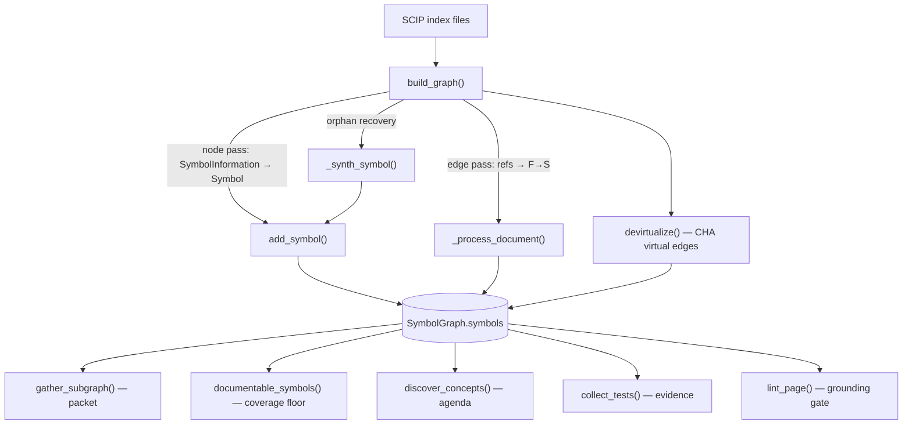

# SymbolGraph — the citation namespace

<!-- connect:up:begin -->
> **Cross-repo concept:** part of [symbol-graph](../../../concepts/symbol-graph.md) across this wiki's repos.
<!-- connect:up:end -->
## Overview
`SymbolGraph` is wikify's **L1 grounding model**: the single, in-memory table of every
global symbol in a repo, keyed by its stable SCIP moniker, plus reference-derived edges
between those symbols. It is the substrate the whole tool stands on — a wiki page may only
cite a symbol that lives here, and the linter resolves every citation back against it, so the
graph *is* the boundary between "grounded claim" and "hallucination." The key design choice
is that the graph is assembled deterministically from a language-neutral SCIP index
([`build_graph`](../catalog/wikify/scip_index.md#build_graph)) with **zero model calls**;
comprehension (which symbols matter, what to explain) is *derived* from this graph's topology
downstream, never authored into it. Two things make it more than a call graph: edges are an
honest **reference-scoping heuristic** (SCIP has no "call" role), and a Class-Hierarchy-Analysis
pass ([`devirtualize`](../catalog/wikify/graph.md#devirtualize)) adds the dynamic-dispatch edges
a static reference graph structurally cannot see.

## Diagram

## Design rationale (why it's built this way)
The module docstring states the intent bluntly: this is *"the citation namespace: every symbol
here has a stable SCIP moniker that wiki pages cite and the linter resolves against… nothing here
calls a model."* That framing drives every decision below.

**The moniker is the identity, not the name.** A [`Symbol`](../catalog/wikify/graph.md#Symbol) is
keyed by its full SCIP moniker string (an authoritative id), while its short
[`name`](../catalog/wikify/graph.md#Symbol.name) is only the terminal descriptor. This is what
lets two indexes — a scip-python index and a scip-clang index for a mixed C++/Python repo —
**union** into one graph without collisions: SCIP monikers keep symbols distinct across languages,
so [`build_graph`](../catalog/wikify/scip_index.md#build_graph) takes `*indexes` and merges them
uniformly (pinned by test `test_merge_cpp_and_python`). The comprehension tool is therefore
language-agnostic *at the graph layer* — a new language is a new indexer, not new graph code.

**Edges are a documented approximation, and the code is honest about it.** The `SymbolGraph`
docstring defines an edge `F → S` as *"the body of F contains a reference to in-repo symbol S (an
approximation of a call)"*, and the module header warns that stubs say "calls/refs", not "calls",
because *"SCIP has no 'call' role."* Rather than fake precise call resolution, wikify records what
it can actually observe — references scoped to their enclosing definition — and labels it truthfully.

> [!inferred]
> This honesty is a deliberate contrast with name-matching call-graph tools: a reference-scoped
> edge can over- or under-count vs. a true call, but it never invents an edge from a bare name
> collision, and the separate `virtual_edges` set (below) makes every *recovered* edge auditable.

**Dynamic dispatch is a first-class, separately-tracked concern.** The single hardest problem for
any code-comprehension tool on OO/framework code is that the real work happens through overrides
reached by dispatch (`model_parts[0](x)` → `nn.Module.__call__` → the base `forward`, never the
`Transformer.forward` override). A static reference graph dies at that seam.
[`devirtualize`](../catalog/wikify/graph.md#devirtualize) crosses it with Class Hierarchy Analysis:
it reads SCIP's `is_implementation` relationships and adds a `base → override` edge, marked
`virtual` so it can be labelled `(virtual)` and audited separately from real references. Its
docstring names this *"the connection op that coverage (a set-difference) deliberately leaves undone."*

## Entry points
- [`build_graph`](../catalog/wikify/scip_index.md#build_graph) — the constructor of the whole model.
  Control reaches it once per ingest, after the SCIP index has been produced/parsed; it walks every
  document of every index and returns a populated `SymbolGraph`. The end-to-end wrapper
  [`index_repo`](../catalog/wikify/scip_index.md#index_repo) (run the indexer → parse → build) is the
  outermost door the `prepare` stage comes through.
- [`devirtualize`](../catalog/wikify/graph.md#devirtualize) — the post-construction pass. It runs
  once, after nodes and reference edges exist, to augment the graph with CHA (base→override) edges;
  everything downstream that traverses the graph benefits without knowing dispatch happened.
- [`find`](../catalog/wikify/graph.md#SymbolGraph.find) — the by-name lookup into the namespace
  (monikers whose terminal `name` matches). It is how seed tokens and tests locate a symbol when they
  only know its short name, e.g. inside [`resolve_seeds`](../catalog/wikify/packet.md#resolve_seeds).

## Mechanism (step-by-step)
1. **Node pass — every global symbol becomes a citable node.**
   [`build_graph`](../catalog/wikify/scip_index.md#build_graph) iterates every `SymbolInformation`
   across all documents of all indexes and constructs one [`Symbol`](../catalog/wikify/graph.md#Symbol)
   per global symbol, registering it with [`add_symbol`](../catalog/wikify/graph.md#SymbolGraph.add_symbol)
   (which also seeds the empty adjacency/ref-count entries in
   [`symbols`](../catalog/wikify/graph.md#SymbolGraph.symbols)). Function-locals — parameters,
   type-parameters, meta descriptors — are dropped by suffix so they never become citable "mechanism"
   symbols. This is the pruning that keeps the citation namespace to symbols a reader would actually
   name.

2. **Orphan recovery — resilience to partial type-checking.** pyright drops the `SymbolInformation`
   for a symbol it fails to fully type (e.g. a `RangeError` on a huge class like `nn.Module`), yet still
   emits its *definition occurrence*. [`build_graph`](../catalog/wikify/scip_index.md#build_graph)'s
   second sub-pass catches these and calls [`_synth_symbol`](../catalog/wikify/scip_index.md#_synth_symbol),
   which fabricates a minimal `Symbol` from the moniker alone (name/suffix parsed from the moniker; kind
   inferred; docstring/signature empty). This runs *before* the edge pass so cross-document references to
   the orphan still resolve — the pinning test `test_recovered_symbol_joins_with_existing_references`
   asserts a reference from a "real" document connects to the AST/orphan-recovered def. The comprehension
   payoff: no subsystem silently vanishes from the wiki because one file blew up the type-checker.

3. **Edge pass — reference-scoping, per document.**
   [`_process_document`](../catalog/wikify/scip_index.md#_process_document) collects each definition's
   body span (preferring SCIP's enclosing range, else `[def-start, next-def-start)`), then for every
   *reference* occurrence finds the **innermost enclosing definition** `F` and records the edge `F → S`,
   bumping `S`'s reference count. Import occurrences are counted but excluded from edges (an import is not
   a call). This scoping — attributing a reference to the definition whose body physically contains it —
   is the heuristic that stands in for a call graph, and the whole `wiki` grounding rests on the
   [`def_path`](../catalog/wikify/graph.md#Symbol.def_path) / def-line these occurrences pin onto each node
   (the source-link target every catalog entry uses).

4. **Devirtualize — recover the dispatch edges.** With reference edges in place,
   [`devirtualize`](../catalog/wikify/graph.md#devirtualize) scans each symbol's `is_implementation`
   relationships and adds a `base → override` virtual edge whenever one is missing, returning the count
   added. Test `test_devirtualize_connects_a_caller_through_the_base` shows the payoff end-to-end: a
   trainer that references the *base* `forward` now reaches the real override once devirtualize has run,
   so a packet gathered from the trainer includes the override. Without this step the most important code
   in a framework repo would be unreachable from its entry points.

5. **Downstream consumption — one graph, many derived views.** Nothing re-parses source after this; every
   later stage reads the finished `SymbolGraph`. [`gather_subgraph`](../catalog/wikify/packet.md#gather_subgraph)
   carves a relevance-bounded neighbourhood around seeds for each synthesis packet;
   [`documentable_symbols`](../catalog/wikify/coverage.md#documentable_symbols) enumerates the whole-repo
   coverage floor (in-repo symbols with a `def_path`); [`discover_concepts`](../catalog/wikify/discover.md#discover_concepts)
   derives the ingest agenda from module centrality; [`collect_tests`](../catalog/wikify/evidence.md#collect_tests)
   attaches test evidence; and [`lint_page`](../catalog/wikify/lint.md#lint_page) uses the graph as the
   authority that decides whether a citation is real. The graph is compiled once and reused, not re-derived
   per query.

## Key data structures
- [`Symbol`](../catalog/wikify/graph.md#Symbol) — a dataclass, one node. The load-bearing fields are the
  `moniker` (authoritative id), the short [`name`](../catalog/wikify/graph.md#Symbol.name),
  [`def_path`](../catalog/wikify/graph.md#Symbol.def_path) + `def_line` (the pinned source location every
  citation links to), and `relationships` (the `is_implementation` / `is_type_definition` pairs
  `devirtualize` consumes). Two computed properties do real comprehension work: `docstring` strips
  scip-python's leading signature code-fence to keep only the author's prose (L2 "authored evidence" —
  wikify prefers the author's own words over LLM re-derivation), and `doc_summary` takes its first line.
- [`SymbolGraph`](../catalog/wikify/graph.md#SymbolGraph) — the container. Public state:
  [`symbols`](../catalog/wikify/graph.md#SymbolGraph.symbols) (moniker → `Symbol`), the `_callees`/`_callers`
  adjacency views, `ref_count` (reference occurrences, feeding the importance rank), `refs` (the actual
  reference sites), and the separately-kept `virtual_edges` set that flags CHA edges so they can be
  labelled and audited apart from real references. Its `importance` score (`outbound*5 + ref_count*2`) is
  the single ranking signal shared by discovery, subgraph selection, and catalog "uses-by" ordering.

## Dynamics (design intent)
The construction order is load-bearing and enforced by tests, not by runtime observation. Node creation
(including orphan recovery) must complete before the edge pass so cross-document references resolve —
`test_recovered_symbol_joins_with_existing_references` pins exactly that. Reference edges must exist before
[`devirtualize`](../catalog/wikify/graph.md#devirtualize), whose unit tests
(`test_devirtualize_adds_base_to_override_edge`) assert the base→override edge is added *and* marked virtual.
Multi-index merge is order-independent by construction (monikers are globally unique), pinned by
`test_merge_cpp_and_python`. The graph itself is a plain in-memory structure with no concurrency machinery;
all "dynamics" here are the deterministic ordering of the build, which is what makes
[`compute_plan`](../catalog/wikify/diff.md#compute_plan) able to reconcile idempotently against
[`current_hashes`](../catalog/wikify/diff.md#current_hashes) of the same symbols on a later commit.

## Edge cases
- **`local ` symbols and locals-by-suffix are excluded** at node build, and imports are excluded from edges —
  so the graph deliberately under-represents "everything that appears in the file" in favour of citable,
  meaningful symbols ([`build_graph`](../catalog/wikify/scip_index.md#build_graph),
  [`_process_document`](../catalog/wikify/scip_index.md#_process_document)).
- **External symbols with no `def_path`** exist as nodes but are filtered out of the documentable set, so
  they can be edge targets without becoming wiki pages ([`documentable_symbols`](../catalog/wikify/coverage.md#documentable_symbols)).
- **Orphan-recovered nodes carry empty docstring/signature** — the source *had* them; pyright just didn't
  emit them ([`_synth_symbol`](../catalog/wikify/scip_index.md#_synth_symbol)). A reader seeing a bare
  catalog entry should drop to the pinned source rather than assume the symbol is undocumented.
- **A `virtual` edge is not a call.** It is a *potential* dynamic dispatch recovered by CHA; consumers that
  care (packet rendering) surface it tagged, and it should be read as "this override could be the real
  target," not "this line calls that" ([`devirtualize`](../catalog/wikify/graph.md#devirtualize)).

## Open questions
- The reference-scoping edge model attributes a reference to its innermost enclosing definition; the exact
  handling of references that fall *outside* any definition span (module-level code) is in
  [`_process_document`](../catalog/wikify/scip_index.md#_process_document) beyond the truncated snippet and
  worth reading in full before relying on module-level edges.
- The `importance` score and `add_edge`/`callees`/`callers` accessors on
  [`SymbolGraph`](../catalog/wikify/graph.md#SymbolGraph) are central to ranking but are not separately
  broken out as cited symbols in this packet's subgraph; their exact weighting is quoted from source here
  but a dedicated ranking page would settle how ties and hubs are treated.

## See also
- [wikify-scip-index](wikify-scip-index.md) — how the raw SCIP index is parsed and how edges are derived
  (the producer of this graph).
- [wikify-coverage](wikify-coverage.md) — the whole-repo set-difference over this graph's documentable symbols.
- [wikify-discover](wikify-discover.md) — the centrality-ranked agenda derived from the graph's topology.
- [wikify-diff](wikify-diff.md) — idempotent reconcile over per-symbol body hashes of the same nodes.
- [wikify-ast-fallback](wikify-ast-fallback.md) — the AST/orphan recovery path that keeps the graph complete.
