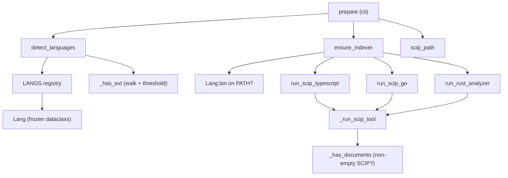

# Language detection & on-demand indexer selection

<!-- connect:up:begin -->
> **Cross-repo concept:** part of [multi-language-extraction](../../../concepts/multi-language-extraction.md) across this wiki's repos.
<!-- connect:up:end -->
## Overview
This subsystem is wikify's *breadth axis* — how a Python-first grounding pipeline stretches to
Go, Rust, TypeScript/JavaScript and C++ without touching anything downstream. The whole trick
rests on one architectural bet stated in the module docstring: **wikify grounds on SCIP, which is
language-neutral**, so the graph, monikers, catalogs, coverage and lint all read a SCIP symbol
table, never a per-language AST. Adding a language therefore collapses to two small edits — one
row in a registry ([`LANGS`](../catalog/wikify/languages.md#LANGS.LANGS)) plus a thin `run_*`
wrapper in `scip_index` — rather than a new front-end. The module's three jobs are: **detect**
which languages a repo contains ([`detect_languages`](../catalog/wikify/languages.md#detect_languages)),
**locate** where each language's index should be written
([`scip_path`](../catalog/wikify/languages.md#scip_path)), and **ensure** the right indexer
binary is actually on PATH before running it
([`ensure_indexer`](../catalog/wikify/languages.md#ensure_indexer)) — and, crucially, to *not*
install it silently.

## Diagram

## Design rationale (why it's built this way)
The load-bearing decision is captured in the module docstring: because every consumer reads SCIP,
"adding a language is one entry here plus a thin `run_*` in `scip_index`." That is why the
[`Lang`](../catalog/wikify/languages.md#Lang) dataclass exists at all — it is a *frozen*,
declarative record (`exts`, `markers`, `bin`, `install`, `scip_suffix`, `run`) so a new language
is data, not code. The registry deliberately splits the world into three tiers. Python
(scip-python) and C++ (scip-clang) are bundled with the base install; the docstring notes the
**TS/JS, Go, Rust indexers are NOT installed by default**. This keeps the base footprint light
while still claiming multi-language support — you pay for an indexer only when a repo actually
needs it.

The second deliberate choice is that detection *never* installs anything on its own.
[`ensure_indexer`](../catalog/wikify/languages.md#ensure_indexer)'s own docstring — "Never
installs silently" — is enforced: it prints copy-pasteable guidance and only offers to install
when `sys.stdin.isatty()`. This is the difference between a tool that surprises a CI job with a
network `npm i` and one that degrades to a clear message. The behavior is pinned by
[`test_ensure_indexer_missing_noninteractive_skips`](../catalog/tests/test_languages.md#test_ensure_indexer_missing_noninteractive_skips),
which asserts a non-tty run *did NOT* auto-install and instead printed instructions.

> [!inferred]
> Comparing wikify to other code-comprehension tools on breadth: because grounding is SCIP and
> indexer choice is a registry lookup, the *marginal cost of a new language is a data row plus a
> subprocess wrapper*, whereas AST-native tools must write a new parser/visitor per language. The
> registry's `run` callable being `None` for Python and C++ (they have bespoke sharding /
> compile-DB paths in `cli`) shows the registry is the uniform path, with two special-cased
> exceptions rather than the reverse.

## Entry points
- [`prepare`](../catalog/wikify/cli.md#prepare) — the CLI's Stages 0–4 command and the only
  caller that drives this module in production. After acquiring the repo it computes
  `langs = cfg.languages or (detect_languages(...) or ["python"])` — explicit config wins,
  otherwise detection runs, otherwise it defaults to Python so existing Python repos are
  unaffected. It then consults [`LANGS`](../catalog/wikify/languages.md#LANGS.LANGS),
  [`scip_path`](../catalog/wikify/languages.md#scip_path) and
  [`ensure_indexer`](../catalog/wikify/languages.md#ensure_indexer) to index each detected
  language.
- [`detect_languages`](../catalog/wikify/languages.md#detect_languages) — the detection entry
  reached whenever languages are not pinned in config. Its docstring states the rule exactly:
  "Languages present in the repo — a root marker file, or ≥ `_MIN_FILES` source files."

## Mechanism (step-by-step)
1. **Detect what's present.** [`detect_languages`](../catalog/wikify/languages.md#detect_languages)
   iterates the [`LANGS`](../catalog/wikify/languages.md#LANGS.LANGS) registry and includes a
   language if *either* an unambiguous root
   [`markers`](../catalog/wikify/languages.md#Lang.markers) file exists (e.g. `go.mod`,
   `Cargo.toml`, `package.json`) *or* enough source files of its
   [`exts`](../catalog/wikify/languages.md#Lang.exts) are found. Markers are the fast, precise
   signal — [`test_detect_by_marker_file`](../catalog/tests/test_languages.md#test_detect_by_marker_file)
   pins that a single `go.mod`/`Cargo.toml`/`package.json` is enough — while the extension path is
   the fallback for repos with no manifest.
2. **Count files with a bounded, vendor-aware walk.** The extension fallback is
   [`_has_ext`](../catalog/wikify/languages.md#_has_ext), which walks the tree pruning
   [`_SKIP_DIRS`](../catalog/wikify/languages.md#_SKIP_DIRS) (`node_modules`, `vendor`, `target`,
   `dist`, `.venv`, …) and dot-directories in place, so vendored third-party code cannot make a
   repo *look* like it's written in a language it merely depends on —
   [`test_detect_skips_vendor_dirs`](../catalog/tests/test_languages.md#test_detect_skips_vendor_dirs)
   pins that five `.rs` files under `node_modules/` do not register Rust. It returns `True` as soon
   as [`_MIN_FILES`](../catalog/wikify/languages.md#_MIN_FILES) (3) matching files are seen, and
   bails out at [`_WALK_CAP`](../catalog/wikify/languages.md#_WALK_CAP) (20 000 files scanned) so
   detection stays cheap on huge repos.
   [`test_detect_by_extension_threshold`](../catalog/tests/test_languages.md#test_detect_by_extension_threshold)
   pins the threshold: 3 `.go` files count, a lone `.rs` does not.
3. **Resolve where the index goes.** For each language,
   [`scip_path`](../catalog/wikify/languages.md#scip_path) builds
   `.cache/scip/<slug><scip_suffix>` from the per-language
   [`scip_suffix`](../catalog/wikify/languages.md#Lang.scip_suffix) — Python is the bare `.scip`,
   others are namespaced (`.go.scip`, `.ts.scip`, `.rust.scip`, `.cpp.scip`). This is what lets
   multiple language indexes for one repo coexist in the cache and later be merged;
   [`test_scip_path_naming`](../catalog/tests/test_languages.md#test_scip_path_naming) pins the
   naming scheme.
4. **Ensure the indexer exists — asking, never assuming.**
   [`ensure_indexer`](../catalog/wikify/languages.md#ensure_indexer) checks
   `shutil.which(lang.bin)` for the language's [`bin`](../catalog/wikify/languages.md#Lang.bin). If
   present it returns `True` immediately. If missing it echoes the
   [`label`](../catalog/wikify/languages.md#Lang.label) and the copy-pasteable
   [`install`](../catalog/wikify/languages.md#Lang.install) command, and *only* when
   `sys.stdin.isatty()` prompts to install now; a declined or non-interactive run returns `False`
   and the language is skipped.
   [`test_ensure_indexer_present`](../catalog/tests/test_languages.md#test_ensure_indexer_present)
   pins the happy path (binary on PATH → `True`).
5. **Run the language's indexer through one shared runner.** The registry's `run` callable dispatches
   to the thin per-language wrappers —
   [`run_scip_typescript`](../catalog/wikify/scip_index.md#run_scip_typescript),
   [`run_scip_go`](../catalog/wikify/scip_index.md#run_scip_go),
   [`run_rust_analyzer`](../catalog/wikify/scip_index.md#run_rust_analyzer) — each of which just
   assembles the tool's argv and defers to
   [`_run_scip_tool`](../catalog/wikify/scip_index.md#_run_scip_tool). That single runner handles
   the awkward per-tool details uniformly: it makes the output dir, runs the subprocess, and for
   tools that write a fixed filename in cwd (rust-analyzer emits `index.scip`) *relocates* the
   result to the wanted path. The registry's contract that these three languages are uniform
   "detect → ensure → run" (and each carries a real runner, `bin` and `install`) is pinned by
   [`test_registry_autorun_langs_have_runners`](../catalog/tests/test_languages.md#test_registry_autorun_langs_have_runners).
6. **Validate the index is non-empty.** [`_run_scip_tool`](../catalog/wikify/scip_index.md#_run_scip_tool)
   does not trust an exit code alone — it calls
   [`_has_documents`](../catalog/wikify/scip_index.md#_has_documents), which
   [`parse_index`](../catalog/wikify/scip_index.md#parse_index)-es the output and checks it has
   at least one document, raising a `RuntimeError` with captured stdout/stderr otherwise. A tool
   that "succeeds" but emits an empty index (a misconfigured project, no toolchain) is caught here
   rather than surfacing as a mysteriously empty wiki.

## Key data structures
- [`Lang`](../catalog/wikify/languages.md#Lang) — a `@dataclass(frozen=True)` that *is* the
  per-language plugin contract: `key`, [`label`](../catalog/wikify/languages.md#Lang.label),
  [`exts`](../catalog/wikify/languages.md#Lang.exts),
  [`markers`](../catalog/wikify/languages.md#Lang.markers),
  [`bin`](../catalog/wikify/languages.md#Lang.bin),
  [`install`](../catalog/wikify/languages.md#Lang.install),
  [`scip_suffix`](../catalog/wikify/languages.md#Lang.scip_suffix), and a `run` callable
  (`None` for the specially-handled Python and C++ paths).
- [`LANGS`](../catalog/wikify/languages.md#LANGS.LANGS) — the registry dict keyed by language slug;
  the single source of truth for what wikify can index and the one place a new language is added.
- Detection tuning constants — [`_MIN_FILES`](../catalog/wikify/languages.md#_MIN_FILES) (extension
  threshold), [`_SKIP_DIRS`](../catalog/wikify/languages.md#_SKIP_DIRS) (vendor/build dirs pruned),
  and [`_WALK_CAP`](../catalog/wikify/languages.md#_WALK_CAP) (max files scanned) — the knobs that
  keep detection precise and bounded.

## Dynamics (design intent)
Detection is intentionally cheap-first: markers are an O(1) `exists()` check per language, and only
when they miss does the bounded walk run — the [`_WALK_CAP`](../catalog/wikify/languages.md#_WALK_CAP)
comment says as much ("markers catch the common case first"). The interactive-only install policy is
the module's most deliberate dynamic: the tests
[`test_ensure_indexer_present`](../catalog/tests/test_languages.md#test_ensure_indexer_present) and
[`test_ensure_indexer_missing_noninteractive_skips`](../catalog/tests/test_languages.md#test_ensure_indexer_missing_noninteractive_skips)
together fix behavior across the present / interactive / non-interactive axes. Post-index,
[`_run_scip_tool`](../catalog/wikify/scip_index.md#_run_scip_tool) enforces a "fail loud on empty"
contract via [`_has_documents`](../catalog/wikify/scip_index.md#_has_documents) so a silent
zero-document index never propagates downstream.

## Edge cases
- **No language detected.** [`detect_languages`](../catalog/wikify/languages.md#detect_languages)
  returns an empty list for a repo matching nothing; [`prepare`](../catalog/wikify/cli.md#prepare)
  defaults to `["python"]` so the pipeline still runs.
- **Vendored code masquerading as source.** Pruned by
  [`_SKIP_DIRS`](../catalog/wikify/languages.md#_SKIP_DIRS) in
  [`_has_ext`](../catalog/wikify/languages.md#_has_ext); markers of a language present *only* in a
  vendored subtree are still not counted because markers are checked at repo root only (see
  [`detect_languages`](../catalog/wikify/languages.md#detect_languages)).
- **Below-threshold sprinkles.** A single stray file of a language stays below
  [`_MIN_FILES`](../catalog/wikify/languages.md#_MIN_FILES) and is ignored unless it also has a
  root marker.
- **Indexer missing in CI.** Non-tty runs never install; the language is skipped with guidance
  rather than the build blocking or auto-fetching
  ([`ensure_indexer`](../catalog/wikify/languages.md#ensure_indexer)).
- **Tool exits 0 but produces nothing.** Caught by
  [`_has_documents`](../catalog/wikify/scip_index.md#_has_documents) inside
  [`_run_scip_tool`](../catalog/wikify/scip_index.md#_run_scip_tool), which raises instead of
  returning an empty index.

## Open questions
- The registry's `run` field and the `AUTO_RUN` set (the three uniform "detect → ensure → run"
  languages) are referenced in [`prepare`](../catalog/wikify/cli.md#prepare) and
  [`test_registry_autorun_langs_have_runners`](../catalog/tests/test_languages.md#test_registry_autorun_langs_have_runners),
  but the exact loop in `cli` that iterates them and calls each `Lang.run` is outside this packet's
  subgraph — see the `prepare` catalog entry for the C++/sharded-Python branches that sit alongside it.
- How the several per-language `.cache/scip/<slug>.<lang>.scip` files are merged into one graph is
  handled downstream (the `_graph` step), not in this module.

## See also
- [wikify-scip_index](wikify-scip_index.md) — the SCIP runners (`run_scip_go`, `run_rust_analyzer`,
  `run_scip_typescript`, `_run_scip_tool`) and index parsing this module dispatches into.
- [wikify-acquire](wikify-acquire.md) — the acquire step that lands the repo before detection runs.
