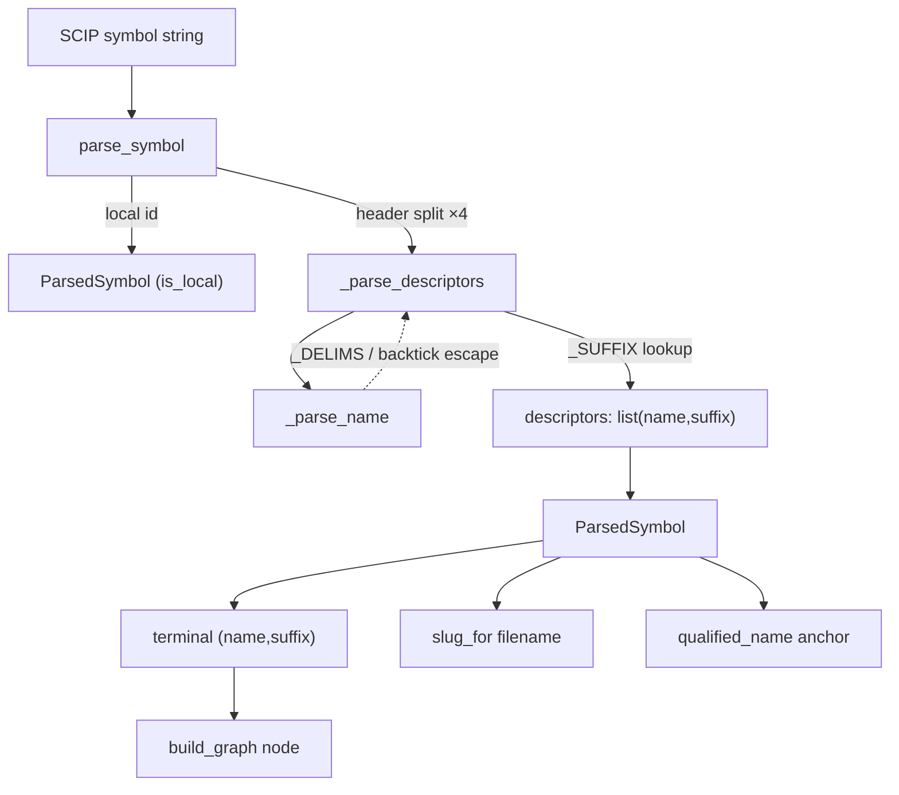

# Monikers — parsing SCIP symbol strings into stable citation anchors

<!-- connect:up:begin -->
> **Cross-repo concept:** part of [scip-grounding](../../../concepts/scip-grounding.md) across this wiki's repos.
<!-- connect:up:end -->
## Overview
A moniker is wikify-repo's *canonical symbol identity*: the SCIP symbol string
(`scip-python python wikify-repo 0.0.0 `wikify.monikers`/parse_symbol().`) that
uniquely names one definition across an entire index — even across languages and
across commits. This module is the one place that *understands* that string. It
does exactly two things: split the fixed scheme/manager/package/version header off
the front, then walk the descriptor tail character-by-character into a list of
`(name, suffix)` pairs. Everything downstream — the human-readable filename
([`slug_for`](../catalog/wikify/slug.md#slug_for)), the catalog anchor a citation
resolves against ([`qualified_name`](../catalog/wikify/coverage.md#qualified_name)),
and the graph node itself ([`build_graph`](../catalog/wikify/scip_index.md#build_graph))
— is a *pure function of the parse*. That is the whole point: because the slug, the
anchor, and the node all derive from the same [`parse_symbol`](../catalog/wikify/monikers.md#parse_symbol),
the packet's "what to cite" and the catalog's "what resolves" can never drift apart.
The moniker is the addressing scheme; every other tool in a code-comprehension
pipeline needs an equivalent of it.

## Diagram

## Design rationale (why it's built this way)
The module docstring states the grammar it targets: `<scheme> <manager> <name>
<version> (<descriptor>)+`, or the special form `local <id>`, with descriptor
suffix chars encoding kind (`/` namespace, `#` type, `.` term, `(disambig).`
method, `:` meta, `!` macro, `[name]` type-parameter, `(name)` parameter) and
backtick-escaped names. Two design choices follow from that grammar and are worth
calling out.

First, **the parser is hand-rolled, not a regex.** SCIP descriptor names can be
backtick-escaped and can themselves *contain* escaped backticks (`` `` `` → a
literal `` ` ``), and method disambiguators are parenthesized and can nest. A
regex cannot balance nested parens or handle the doubled-backtick escape cleanly,
so [`_parse_descriptors`](../catalog/wikify/monikers.md#_parse_descriptors) is an
explicit index-walking state machine and
[`_parse_name`](../catalog/wikify/monikers.md#_parse_name) is a small escaped-string
reader. The delimiter set [`_DELIMS`](../catalog/wikify/monikers.md#_DELIMS) and
the suffix map [`_SUFFIX`](../catalog/wikify/monikers.md#_SUFFIX) are the only two
tables the walker consults.

Second, **`ParsedSymbol` is a dumb value object and the parse is pure.** The
docstring on [`qualified_name`](../catalog/wikify/coverage.md#qualified_name) makes
the invariant explicit — the anchor is a "Pure function of the moniker, so packet
citations and catalog frontmatter always agree." That agreement is the load-bearing
property of the whole wiki: the packet tells the synthesizer *which anchor to cite*,
the catalog's frontmatter maps *which anchor resolves to which moniker*, and the
linter checks the two match. If parsing were stateful or order-dependent, that
guarantee would evaporate. So the parser is deliberately side-effect-free.

## Entry points
- [`parse_symbol`](../catalog/wikify/monikers.md#parse_symbol) — the single public
  door. Every consumer that needs to reason about a symbol's identity — the graph
  builder folding SymbolInformation into nodes, the orphan-recovery synthesizer, the
  slug allocator, the coverage anchor and owner-class logic — calls it first. It is
  reached during index ingestion (once per global symbol in
  [`build_graph`](../catalog/wikify/scip_index.md#build_graph)) and again at
  presentation time when [`slug_for`](../catalog/wikify/slug.md#slug_for) and
  [`qualified_name`](../catalog/wikify/coverage.md#qualified_name) turn a moniker
  into a filename and an anchor.
- [`terminal`](../catalog/wikify/monikers.md#ParsedSymbol.terminal) — the property
  most consumers actually want after parsing: the `(name, suffix)` of the *last*
  descriptor, which is the symbol's own name and kind (a `Method`, `Type`, `Term`,
  …). It is what [`build_graph`](../catalog/wikify/scip_index.md#build_graph),
  [`_synth_symbol`](../catalog/wikify/scip_index.md#_synth_symbol) and
  [`_rel_names`](../catalog/wikify/coverage.md#_rel_names) read to name a node
  without re-implementing descriptor parsing.

## Mechanism (step-by-step)
1. **Header split.** [`parse_symbol`](../catalog/wikify/monikers.md#parse_symbol)
   first checks for the `local ` prefix; a function-local symbol has no global
   grammar, so it short-circuits to a `ParsedSymbol` carrying only
   [`is_local`](../catalog/wikify/monikers.md#ParsedSymbol.is_local) and
   [`local_id`](../catalog/wikify/monikers.md#ParsedSymbol.local_id). Otherwise it
   does `symbol.split(" ", 4)` — exactly four splits — to peel off
   [`scheme`](../catalog/wikify/monikers.md#ParsedSymbol.scheme),
   [`manager`](../catalog/wikify/monikers.md#ParsedSymbol.manager),
   [`package`](../catalog/wikify/monikers.md#ParsedSymbol.package) and
   [`version`](../catalog/wikify/monikers.md#ParsedSymbol.version), leaving the
   whole descriptor tail as the fifth part. Capping the split at 4 is deliberate:
   descriptor text may itself contain spaces, so only the *first four* spaces are
   structural. A malformed symbol with fewer than five parts degrades gracefully to
   a `ParsedSymbol` holding just the scheme rather than raising.
2. **Descriptor walk.** The tail goes to
   [`_parse_descriptors`](../catalog/wikify/monikers.md#_parse_descriptors), which
   scans left to right maintaining an index `i`. A leading `[` or `(` is a
   type-parameter or parameter (name wrapped in brackets); otherwise it reads a
   name and then *looks at the delimiter that follows* to decide the kind. This
   "read name, then classify by trailing delimiter" order is why the suffix, not a
   position, encodes kind.
3. **Name reading with escapes.** Each name is read by
   [`_parse_name`](../catalog/wikify/monikers.md#_parse_name). If the name starts
   with a backtick it is an escaped identifier: characters are accumulated until a
   closing backtick, with a doubled `` `` `` collapsing to one literal backtick.
   Unescaped names simply run until the next character in
   [`_DELIMS`](../catalog/wikify/monikers.md#_DELIMS) (`/#.:!([`). This is what lets
   a namespace like `` `wikify.monikers` `` — which contains dots — survive as one
   descriptor instead of being shredded at every `.`.
4. **Kind classification.** After the name, a `(` opens a *method* disambiguator:
   the walker counts paren depth to skip a possibly-nested `(...)`, then consumes a
   trailing `.`, and records suffix `Method`. Any other delimiter is a simple
   trailing suffix looked up in [`_SUFFIX`](../catalog/wikify/monikers.md#_SUFFIX)
   (`/`→Namespace, `#`→Type, `.`→Term, `:`→Meta, `!`→Macro). A name that reaches
   end-of-string with no delimiter is recorded as a `Term`, and any unexpected
   character advances `i` by one so the loop can never hang. The result is the
   [`descriptors`](../catalog/wikify/monikers.md#ParsedSymbol.descriptors) list.
5. **Terminal extraction and node naming.** Consumers read
   [`terminal`](../catalog/wikify/monikers.md#ParsedSymbol.terminal) to get the
   symbol's own `(name, suffix)`.
   [`build_graph`](../catalog/wikify/scip_index.md#build_graph) uses it to name and
   kind every node and to *drop* localish suffixes (parameters/type-parameters/meta)
   as non-citable; [`_synth_symbol`](../catalog/wikify/scip_index.md#_synth_symbol)
   uses the identical parse+terminal to synthesize a minimal node for an orphan
   definition pyright failed to fully type — resilience that works precisely because
   the moniker alone carries name and kind.
6. **Address derivation.** The same parse feeds the two addressing functions.
   [`slug_for`](../catalog/wikify/slug.md#slug_for) joins the descriptor names with
   `-` (prefixed by manager-or-scheme and package) into a deterministic filename
   stem, and [`qualified_name`](../catalog/wikify/coverage.md#qualified_name) joins
   the non-namespace descriptor names with `.` (then sanitizes unsafe chars) into
   the catalog `#anchor`. Because both are pure functions of
   [`parse_symbol`](../catalog/wikify/monikers.md#parse_symbol), the citation the
   packet emits and the anchor the catalog exposes are guaranteed to line up.

## Key data structures
- [`ParsedSymbol`](../catalog/wikify/monikers.md#ParsedSymbol) — the value object
  the whole module produces. Its header fields
  ([`scheme`](../catalog/wikify/monikers.md#ParsedSymbol.scheme),
  [`manager`](../catalog/wikify/monikers.md#ParsedSymbol.manager),
  [`package`](../catalog/wikify/monikers.md#ParsedSymbol.package),
  [`version`](../catalog/wikify/monikers.md#ParsedSymbol.version)) locate the symbol
  in a package universe; [`is_local`](../catalog/wikify/monikers.md#ParsedSymbol.is_local)
  / [`local_id`](../catalog/wikify/monikers.md#ParsedSymbol.local_id) mark
  function-local symbols; and
  [`descriptors`](../catalog/wikify/monikers.md#ParsedSymbol.descriptors) — an
  ordered `list[(name, suffix)]` — is the path from package root down to the symbol.
  Order matters: the *last* entry is the symbol itself, earlier entries are its
  enclosing namespaces/types.
- [`_SUFFIX`](../catalog/wikify/monikers.md#_SUFFIX) and
  [`_DELIMS`](../catalog/wikify/monikers.md#_DELIMS) — the two lookup tables that
  are the entire grammar the walker knows: the delimiter set bounds a name, the
  suffix map turns a trailing delimiter into a kind label.

## Dynamics (design intent)
The slug tests pin the addressing contract:
`test_deterministic`, `test_clean_and_readable`,
`test_compute_descriptor_path_readable`, `test_case_preserved`,
`test_fallback_to_scheme_when_no_manager`, and `test_local_symbol` all exercise
[`slug_for`](../catalog/wikify/slug.md#slug_for) — i.e. they exercise the parse
underneath it — asserting that the same moniker always yields the same readable
stem, that case is preserved, and that a missing manager falls back to the scheme.
`test_allocator_disambiguates_collision` confirms that *collision resolution is not
this module's job* (the docstring on `slug_for` says as much) — the parser stays a
pure function and the allocator layered above handles uniqueness. On the graph side,
`build_graph` is exercised by cross-language and merge tests
(`test_cpp_symbols_and_kinds`, `test_merge_cpp_and_python`,
`test_merged_index_builds_a_correct_graph`,
`test_recovered_symbol_joins_with_existing_references`), which is why the parser has
to be language-neutral: the same `parse_symbol` must handle scip-python and
scip-clang monikers so both index kinds union into one graph.

## Edge cases
- **Names containing delimiters.** A namespace like `` `wikify.monikers` `` has dots
  inside it; only backtick-escaped reading in
  [`_parse_name`](../catalog/wikify/monikers.md#_parse_name) keeps it intact. The
  doubled-backtick escape (`` `` `` → `` ` ``) is the corner case within that corner
  case.
- **Malformed / short symbols.**
  [`parse_symbol`](../catalog/wikify/monikers.md#parse_symbol) returns a partial
  `ParsedSymbol` (scheme only) rather than raising when the header has fewer than
  five space-separated parts, so a garbled index entry can't crash ingestion.
- **Unexpected characters.**
  [`_parse_descriptors`](../catalog/wikify/monikers.md#_parse_descriptors) advances
  the index by one on any char it doesn't recognize — an explicit
  infinite-loop guard, meaning an unknown suffix is silently skipped rather than
  parsed.
- **Localish symbols get dropped later, not here.** The parser faithfully records
  `Parameter`/`TypeParameter`/`Meta` descriptors; it is
  [`build_graph`](../catalog/wikify/scip_index.md#build_graph) /
  [`_synth_symbol`](../catalog/wikify/scip_index.md#_synth_symbol) that decide via
  [`terminal`](../catalog/wikify/monikers.md#ParsedSymbol.terminal) that those
  suffixes are non-citable and exclude them.

> [!inferred]
> The `.` character is overloaded in the grammar: it is both the `Term` suffix and
> the trailing dot of a `Method` descriptor. The walker disambiguates by order —
> it treats a `(` after a name as a method (consuming the following `.`) before it
> ever consults [`_SUFFIX`](../catalog/wikify/monikers.md#_SUFFIX) for a bare `.`.
> The source supports this reading but does not state the overload explicitly.

## Open questions
- The subgraph does not expose the slug allocator that
  [`slug_for`](../catalog/wikify/slug.md#slug_for)'s docstring defers collision
  handling to, so the exact disambiguation strategy (numeric suffixes? hash?) is
  not visible from this packet; `test_allocator_disambiguates_collision` confirms
  one exists but the mechanism lives outside these symbols.
- How C++/scip-clang monikers that "can contain `$`/spaces" (per
  [`qualified_name`](../catalog/wikify/coverage.md#qualified_name)'s docstring) flow
  through the same space-capped header split in
  [`parse_symbol`](../catalog/wikify/monikers.md#parse_symbol) is not settled by
  this packet's source alone.

## See also
- [wikify-scip_index](wikify-scip_index.md) — where `build_graph` and
  `_synth_symbol` consume the parse to build and repair graph nodes.
- [wikify-coverage](wikify-coverage.md) — `qualified_name`, `_owner_class` and
  `_rel_names` turn monikers into catalog anchors and enclosing-class labels.
- [wikify-graph](wikify-graph.md) — the symbol graph the parsed monikers key.
- [wikify-lint](wikify-lint.md) — the build gate that checks packet citations
  resolve to the catalog anchors derived here.
