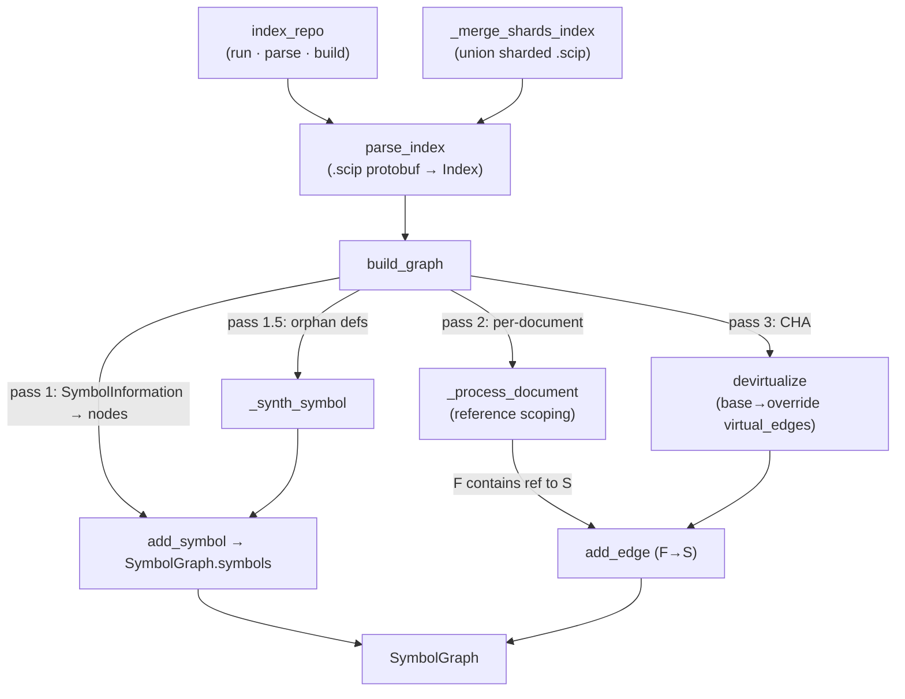

# SCIP indexing — turning a repo into a citable symbol graph

<!-- connect:up:begin -->
> **Cross-repo concept:** part of [scip-grounding](../../../concepts/scip-grounding.md), [symbol-graph](../../../concepts/symbol-graph.md) across this wiki's repos.
<!-- connect:up:end -->
## Overview
This is Stage 1 of wikify-repo's ingest pipeline and the foundation the entire wiki
stands on: it runs a real language indexer over the repo, parses the resulting SCIP
index, and folds it into an in-memory [`SymbolGraph`](../catalog/wikify/graph.md#SymbolGraph)
of globally-named nodes plus edges. The single key idea is *grounding by delegation*:
wikify does not write its own parser or heuristic name-matcher. It shells out to a
compiler-grade frontend (scip-python/pyright, scip-clang, scip-typescript, scip-go,
rust-analyzer) that has already bound every identifier to the exact symbol it resolves
to, and consumes the frontend's stable **monikers** as authoritative IDs. Everything
downstream — packets, citations, catalogs, coverage — cites those monikers, so the
grounding is only ever as good as this stage. The one place wikify must be clever is
edges: SCIP has no "call" role, so [`build_graph`](../catalog/wikify/scip_index.md#build_graph)
approximates the call graph by *reference scoping* over occurrence ranges, and repairs
the two places a frontend leaves gaps — dropped symbols and dynamic dispatch.

## Diagram

## Design rationale (why it's built this way)
The module docstring states the central design bet plainly: *"SCIP has no 'call'
role, so callers/callees are approximated by reference scoping — a reference to
in-repo symbol S occurring inside the body (enclosing range) of definition F yields
the edge F → S. Symbol-accurate (the frontend bound the name to the right symbol)
but reference-based, not true call resolution."* This is the honest tradeoff of the
whole tool. Because the frontend did the binding, `Foo.bar` never gets confused with
an unrelated `bar` elsewhere (unlike a regex/name-matching call graph); but because
an *occurrence* is not a *call*, an edge means "F's body mentions S," which over-
approximates (a reference in a docstring-adjacent position or a stored function
reference counts) and under-approximates (dynamic dispatch is invisible). wikify
accepts that and patches the under-approximation explicitly in
[`devirtualize`](../catalog/wikify/graph.md#devirtualize).

Two design choices make the grounding *robust* rather than merely *correct on the
happy path*. First, the pipeline treats a nonzero indexer exit as non-fatal: pyright
returns nonzero on any type-check error anywhere in the dependency graph, yet still
emits a complete index for the target, so success is defined as "a non-empty index
was written," checked by [`_has_documents`](../catalog/wikify/scip_index.md#_has_documents),
not by exit code. Second, pyright sometimes drops the `SymbolInformation` record for
a symbol it failed to fully type (a `RangeError` on a huge class like `nn.Module`)
while still recording the definition *occurrence*. Rather than lose that symbol from
the citation namespace, [`build_graph`](../catalog/wikify/scip_index.md#build_graph)
runs a recovery pass that synthesizes a minimal node via
[`_synth_symbol`](../catalog/wikify/scip_index.md#_synth_symbol). The design goal is
that *ingestion of any real repo cannot silently drop a subsystem because the type
checker choked* — the same philosophy that makes coverage a set-difference rather
than a graph walk.

> [!inferred]
> Compared to name-based code-comprehension tools (e.g. graph-of-symbols built from
> AST identifier matching, or dead-code detectors that flag anything with no inbound
> name reference), wikify's advantage is that its nodes are *frontend-resolved*
> monikers, so cross-file and cross-language identity is exact and multi-language
> repos union cleanly. Its weakness is the same as any static tool: reference-scoped
> edges are an approximation of calls, and devirtualization only recovers dispatch
> that SCIP recorded as an `is_implementation` relationship. This reading follows
> from the module docstring and the CHA docstring, not from any single symbol.

## Entry points
- [`index_repo`](../catalog/wikify/scip_index.md#index_repo) — the end-to-end
  convenience path ("run the indexer, parse, build the graph"). Control reaches it
  in tests and simple single-language runs; it invokes the external indexer, then
  hands the written `.scip` to `parse_index` and `build_graph`. The real CLI uses a
  finer-grained variant that merges every language's index in the cache (see
  [`_graph`](../catalog/wikify/cli.md#_graph)), but `index_repo` is the canonical
  shape of the stage.
- [`_graph`](../catalog/wikify/cli.md#_graph) — the CLI's graph builder: it parses
  every per-language `.scip` present in the cache and passes them all to
  `build_graph` as one union. This is where a mixed Python/C++ repo becomes a single
  graph, because the merge happens by variadic union, not by re-indexing.
- [`build_graph`](../catalog/wikify/scip_index.md#build_graph) — the deterministic
  core: given one or more parsed indexes it produces the finished
  [`SymbolGraph`](../catalog/wikify/graph.md#SymbolGraph). Everything comprehension-
  related downstream reads what this function built.
- [`parse_index`](../catalog/wikify/scip_index.md#parse_index) — the thin protobuf
  boundary: it deserializes a `.scip` file into an `Index` message. Every path in
  and out of this stage flows through it, which is why it appears as a dependency of
  nearly every test.

## Mechanism (step-by-step)
1. **Run a compiler-grade indexer over the repo.**
   [`index_repo`](../catalog/wikify/scip_index.md#index_repo) shells out to the
   language's SCIP indexer (scip-python/pyright for Python, scip-clang for C++, and
   on-demand scip-typescript/scip-go/rust-analyzer) and requires only that a
   non-empty index landed — [`_has_documents`](../catalog/wikify/scip_index.md#_has_documents)
   gates success so a pyright type error deep in a dependency doesn't sink an
   otherwise-complete run. This is the delegation that gives every later citation
   its accuracy: the frontend, not wikify, decides what `Foo` binds to.
2. **For repos too large for one process, index in shards and union them.** Each
   shard indexes one subtree (still analyzing the rest for correct global monikers)
   and [`_merge_shards_index`](../catalog/wikify/scip_index.md#_merge_shards_index)
   unions the shard `.scip` files into one `Index`. Because SCIP monikers are
   *global*, the union is exact; the merge only has to repair each document's
   `relative_path` (emitted relative to the shard target) back to repo-relative and,
   where a dependency file spills across shards partially, keep the copy with the
   most symbols so occurrence/ref counts aren't double-tallied. The merged bytes are
   then read back through [`parse_index`](../catalog/wikify/scip_index.md#parse_index).
3. **Parse the SCIP protobuf.**
   [`parse_index`](../catalog/wikify/scip_index.md#parse_index) deserializes the
   `.scip` file into a `scip_pb2.Index` — a list of documents, each with
   `SymbolInformation` records and `Occurrence` records. This is a pure boundary
   step with no interpretation; all meaning is assigned in the passes below.
4. **Pass 1 — build a node per global symbol.**
   [`build_graph`](../catalog/wikify/scip_index.md#build_graph) walks every
   document's `SymbolInformation`, skips `local ` symbols, and parses each moniker
   with [`parse_symbol`](../catalog/wikify/monikers.md#parse_symbol), taking its
   [`terminal`](../catalog/wikify/monikers.md#ParsedSymbol.terminal) `(name, suffix)`.
   Symbols whose suffix is in
   [`_LOCALISH_SUFFIXES`](../catalog/wikify/scip_index.md#_LOCALISH_SUFFIXES)
   (parameters, type-parameters, meta) are dropped as non-citable, and the rest
   become a [`Symbol`](../catalog/wikify/graph.md#Symbol) — carrying moniker, kind,
   name, extracted [`documentation`](../catalog/wikify/graph.md#Symbol.documentation),
   [`signature`](../catalog/wikify/graph.md#Symbol.signature) and any
   `is_implementation`/`is_type_definition`
   [`relationships`](../catalog/wikify/graph.md#Symbol.relationships) — registered
   via [`add_symbol`](../catalog/wikify/graph.md#SymbolGraph.add_symbol). Doing this
   across all indexes first means a C++ and a Python index simply co-populate the
   same [`symbols`](../catalog/wikify/graph.md#SymbolGraph.symbols) map.
5. **Pass 1.5 — recover orphan definitions.** A second sweep looks for occurrences
   carrying the [`_DEFINITION`](../catalog/wikify/scip_index.md#_DEFINITION) role
   whose symbol has *no* `SymbolInformation` node yet, and synthesizes one with
   [`_synth_symbol`](../catalog/wikify/scip_index.md#_synth_symbol) — a minimal
   [`Symbol`](../catalog/wikify/graph.md#Symbol) with authoritative moniker/name and
   a suffix-inferred kind, empty docs/signature. This runs *before* the edge pass so
   that later references to these symbols still resolve to a real node. It is the
   concrete mechanism behind "partial type-check failure must not drop a symbol."
6. **Pass 2 — derive definition locations and reference edges per document.**
   [`_process_document`](../catalog/wikify/scip_index.md#_process_document) splits a
   document's occurrences into definitions and references using
   [`_occ_range`](../catalog/wikify/scip_index.md#_occ_range) /
   [`_occ_enclosing`](../catalog/wikify/scip_index.md#_occ_enclosing) (which tolerate
   both the typed-oneof and legacy packed-int [`Range`](../catalog/wikify/scip_index.md#Range)
   encodings). Each definition records its
   [`def_path`](../catalog/wikify/graph.md#Symbol.def_path) /
   [`def_line`](../catalog/wikify/graph.md#Symbol.def_line) /
   [`enclosing`](../catalog/wikify/graph.md#Symbol.enclosing) on its node (first
   occurrence wins) and gets a body span — the SCIP enclosing range if present, else
   `[this def start, next def start)` in document order. Every reference bumps
   [`ref_count`](../catalog/wikify/graph.md#SymbolGraph.ref_count) and appends to
   [`refs`](../catalog/wikify/graph.md#SymbolGraph.refs); then, skipping imports, the
   reference point is matched against the *innermost* enclosing definition span
   (chosen by smallest [`_span_size`](../catalog/wikify/scip_index.md#_span_size) via
   [`_contains`](../catalog/wikify/scip_index.md#_contains)) and that F→S edge is
   recorded with [`add_edge`](../catalog/wikify/graph.md#SymbolGraph.add_edge). This
   innermost-wins rule is what attributes a reference to the actual enclosing
   function rather than to the class or module around it.
7. **Pass 3 — devirtualize across the dynamic-dispatch seam.**
   [`devirtualize`](../catalog/wikify/graph.md#devirtualize) performs Class Hierarchy
   Analysis: for every `is_implementation`
   [`relationships`](../catalog/wikify/graph.md#Symbol.relationships) edge SCIP
   recorded (override S implements base T), it adds a `T → S` edge via
   [`add_edge`](../catalog/wikify/graph.md#SymbolGraph.add_edge) with `virtual=True`,
   tracked in [`virtual_edges`](../catalog/wikify/graph.md#SymbolGraph.virtual_edges).
   This is the deliberate answer to the problem that a call like `model_parts[0](x)`
   reaches only the *base* `forward` through `nn.Module.__call__`, so a pure
   reference graph would dead-end before the real override. The edges are kept
   separate precisely so they can be labelled "(virtual)" and audited rather than
   silently mixed with static references.

## Key data structures
- [`SymbolGraph`](../catalog/wikify/graph.md#SymbolGraph) — the product of the stage:
  a [`symbols`](../catalog/wikify/graph.md#SymbolGraph.symbols) map (moniker →
  node), the two adjacency views behind
  [`callees`](../catalog/wikify/graph.md#SymbolGraph.callees) /
  [`_callees`](../catalog/wikify/graph.md#SymbolGraph._callees) and
  [`_callers`](../catalog/wikify/graph.md#SymbolGraph._callers),
  [`ref_count`](../catalog/wikify/graph.md#SymbolGraph.ref_count) +
  [`refs`](../catalog/wikify/graph.md#SymbolGraph.refs) for the importance rank, and
  [`virtual_edges`](../catalog/wikify/graph.md#SymbolGraph.virtual_edges) kept apart
  from static edges.
- [`Symbol`](../catalog/wikify/graph.md#Symbol) — one node in the citation
  namespace. Its [`moniker`](../catalog/wikify/graph.md#Symbol.moniker) is the
  authoritative ID; [`name`](../catalog/wikify/graph.md#Symbol.name),
  [`kind`](../catalog/wikify/graph.md#Symbol.kind),
  [`suffix`](../catalog/wikify/graph.md#Symbol.suffix), def location, docstring, and
  signature are the payload every catalog entry and packet renders.
- [`ParsedSymbol`](../catalog/wikify/monikers.md#ParsedSymbol) — the structured form
  of a moniker (scheme/manager/package/version + descriptor list). The
  [`terminal`](../catalog/wikify/monikers.md#ParsedSymbol.terminal) `(name, suffix)`
  is what pass 1 and `_synth_symbol` use to name and classify a node.
- [`Range`](../catalog/wikify/scip_index.md#Range) — the `(start_line, start_char,
  end_line, end_char)` tuple that every span helper normalizes to, insulating the
  edge logic from SCIP's multiple positional encodings.

## Dynamics (design intent)
The stage is deterministic and makes zero model calls — a hard invariant of the
project (grounding must be reproducible). The order of the three build passes is
load-bearing and asserted by tests:
[`test_merged_index_builds_a_correct_graph`](../catalog/tests/test_sharded_index.md#test_merged_index_builds_a_correct_graph)
proves a merged/sharded index still yields correct global monikers through
[`build_graph`](../catalog/wikify/scip_index.md#build_graph);
[`test_recovered_symbol_joins_with_existing_references`](../catalog/tests/test_ast_fallback.md#test_recovered_symbol_joins_with_existing_references)
proves a reference emitted by the real indexer connects to an orphan/recovered
definition by moniker; and the C++ suite
([`test_cpp_call_structure`](../catalog/tests/test_cpp_ingestion.md#test_cpp_call_structure),
[`test_merge_cpp_and_python`](../catalog/tests/test_cpp_ingestion.md#test_merge_cpp_and_python))
proves the same reference-scoping and union path work unchanged on a C++ index and
across a mixed-language union. The merge is intentionally per-path most-complete-doc-
wins, verified by
[`test_merge_keeps_repo_relative_spillover_and_prefers_complete`](../catalog/tests/test_sharded_index.md#test_merge_keeps_repo_relative_spillover_and_prefers_complete)
and
[`test_merge_repairs_target_relative_paths`](../catalog/tests/test_sharded_index.md#test_merge_repairs_target_relative_paths).

## Edge cases
- **Nonzero indexer exit with a usable index.** Accepted as success via
  [`_has_documents`](../catalog/wikify/scip_index.md#_has_documents); only an empty
  index is a hard failure.
- **Symbol with a definition occurrence but no `SymbolInformation`.** Recovered by
  [`_synth_symbol`](../catalog/wikify/scip_index.md#_synth_symbol) with empty
  doc/signature and a suffix-inferred kind — citable but shallow.
- **Definitions with no SCIP enclosing range.**
  [`_process_document`](../catalog/wikify/scip_index.md#_process_document) falls back
  to `[def start, next def start)`, and the last definition in a document gets a
  sentinel end (`def_line + 1_000_000`), so its body span runs to end-of-file.
- **Imports.** Counted in [`refs`](../catalog/wikify/graph.md#SymbolGraph.refs)/
  [`ref_count`](../catalog/wikify/graph.md#SymbolGraph.ref_count) but never turned
  into call edges — an import is a reference, not a call.
- **Overlapping enclosing spans.** The innermost (smallest
  [`_span_size`](../catalog/wikify/scip_index.md#_span_size)) wins, so a reference is
  attributed to the tightest enclosing definition, not an outer class/module.

## Open questions
- The runner functions that actually invoke each external indexer (and the sharded /
  clang / additional-language runners) are outside this packet's subgraph, so they
  are described here only through [`index_repo`](../catalog/wikify/scip_index.md#index_repo)
  and [`_merge_shards_index`](../catalog/wikify/scip_index.md#_merge_shards_index).
  Their exact CLI flags (heap ceiling, `--target-only`, IPC/timeout tuning) live in
  the source but are not citable from this page.
- The AST-fallback path that recovers files the indexer never emitted is a sibling
  mechanism; how it interacts with orphan recovery here is only partially visible
  from this subgraph (the test proves the join, not the full handoff).

## See also
- [wikify-graph](wikify-graph.md) — the `SymbolGraph`/`Symbol` types, importance
  ranking, and `devirtualize` (CHA) documented in full.
- [wikify-monikers](wikify-monikers.md) — how a SCIP moniker string is parsed into a
  `ParsedSymbol` (the identity scheme this stage relies on).
- [wikify-languages](wikify-languages.md) — the pluggable, on-demand indexers that
  feed additional-language `.scip` files into this stage.
- [wikify-ast_fallback](wikify-ast_fallback.md) — deterministic source recovery for
  files an indexer dropped, unioned into the same graph.
- [wikify-coverage](wikify-coverage.md) — the set-difference over this stage's symbol
  table that guarantees whole-repo representation.
