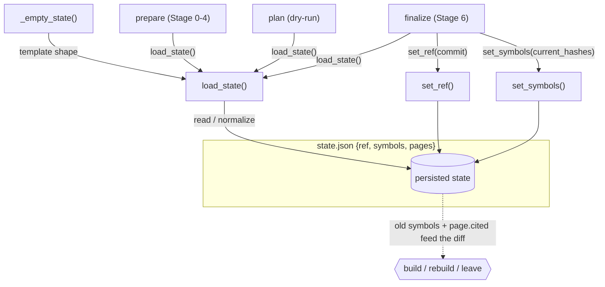

# Reconcile state — the idempotency ledger

<!-- connect:up:begin -->
> **Cross-repo concept:** part of [incremental-reconcile](../../../concepts/incremental-reconcile.md) across this wiki's repos.
<!-- connect:up:end -->
## Overview
`wikify/state.py` is the persisted memory that makes the wiki *incrementally* maintainable rather than rebuilt-from-scratch on every run. It is a tiny, model-free module that reads and writes one JSON file per repo — `.cache/state/<slug>.json` — holding exactly three keys: the **pinned commit** the wiki corresponds to, a **moniker → body-hash** map of every symbol as it was last seen, and a **per-page record** of which monikers each concept page cited and at which ref it was built. The single design idea: by remembering *what was true last time* — the exact bytes behind each symbol and the exact citations behind each page — the next run can compute a delta instead of regenerating everything. State is the difference between a RAG-shaped tool that re-derives the answer every query and a compounding wiki that only touches what moved. Everything in this module is pure bookkeeping; the module docstring is explicit that "nothing here calls a model."

## Diagram

## Design rationale (why it's built this way)
The module docstring names its own role — "Reconcile state — the idempotency ledger" — and ties it to invariant 4 of the project: `ingest` converges to `{pinned commit × concept set}` so that a re-run with no change is a no-op and a change rebuilds only the delta. Two representational choices make that possible, and both are deliberate.

First, **symbols are stored as `moniker → body-sha`, not as source text.** A hash is a cheap, stable fingerprint of "signature + body"; comparing the recorded map against a freshly computed one yields precisely the set of monikers whose *content* changed, independent of line moves or reformatting elsewhere in the file. This is what lets the reconcile decide rebuild-vs-leave per symbol rather than per file.

Second, **pages record their `cited` monikers plus a `built_ref`.** Because a page knows which symbols it leaned on, staleness becomes a set intersection: a page is stale exactly when its cited set meets the changed-symbol set. Without this, the tool could only rebuild everything on any change. `set_symbols`'s docstring — "Replace the moniker → body-sha map" — signals the other half of the intent: the symbol map is *replaced wholesale* each finalize, so it is always a faithful snapshot of the last-built commit, never a merge of stale entries.

> [!inferred]
> The choice of a single small JSON file (rather than SQLite or a graph DB) is consistent with the project's "markdown/plaintext, gitignored `.cache/`" invariant: state is an ephemeral build artifact that must be trivially inspectable and diffable, not a durable database. `save_state` (out of this packet's subgraph) writing sorted, indented JSON reinforces that intent — stable diffs — as asserted by `test_save_creates_valid_indented_json`.

## Entry points
- [`load_state`](../catalog/wikify/state.md#load_state) — the read side, hit at the top of every pipeline command that needs to know what was built before. Its docstring guarantees "All three top-level keys (`ref`, `symbols`, `pages`) are guaranteed present even if the on-disk file is partial," which is why every downstream consumer can index into `state["symbols"]` / `state["pages"]` without defensive checks.
- [`prepare`](../catalog/wikify/cli.md#prepare) — Stages 0-4 (acquire, index, build graph, emit packets, print the plan); it loads state so the plan it prints reflects what already exists on disk versus what the fresh index now shows.
- [`plan`](../catalog/wikify/cli.md#plan) — the dry-run entry point: it loads state and computes the reconcile delta against the derived agenda, emitting nothing. This is the pure read-only view of what a real run *would* build/rebuild/leave.
- [`finalize`](../catalog/wikify/cli.md#finalize) — Stage 6, the write side: after lint passes it loads state, stamps it with the new commit via [`set_ref`](../catalog/wikify/state.md#set_ref) and the fresh hashes via [`set_symbols`](../catalog/wikify/state.md#set_symbols), then persists it — advancing the ledger to the just-built commit.
- [`_finalize_docs`](../catalog/wikify/cli.md#_finalize_docs) — the docs-mode counterpart of finalize; it loads state and calls `set_ref` too, so the prose track shares the same ref-pinning ledger even though it has no symbol map to update.

## Mechanism (step-by-step)
1. **Establish the shape once.** [`_empty_state`](../catalog/wikify/state.md#_empty_state) returns the canonical never-built value `{"ref": None, "symbols": {}, "pages": {}}` — "a fresh, never-built state with all top-level keys present." Every other path funnels through this so the in-memory dict always has the same three keys, and `test_load_missing_returns_empty_shape` pins that exact shape.

2. **Load, tolerating partial or hand-edited files.** [`load_state`](../catalog/wikify/state.md#load_state) returns `_empty_state()` outright when the file is absent (first ever run), and otherwise reads the JSON, then does `state = _empty_state(); state.update(data)` so any key missing from the file is backfilled from the template. It then explicitly rewrites `symbols`/`pages` to `{}` if the on-disk value was `null` — a guard against a partial or hand-edited file, exercised by `test_load_partial_fills_missing_keys`. The upshot for reconcile: consumers never see a `KeyError` or a `None` where they expect a dict.

3. **A command reads the prior ledger.** At the start of a run, [`prepare`](../catalog/wikify/cli.md#prepare) and [`plan`](../catalog/wikify/cli.md#plan) call `load_state` to recover the last-built `ref`, symbol hashes, and page citations. This recovered state is what the diff stage compares the freshly computed hashes against; without it there is no notion of "changed" and every page would be a build.

4. **Compute the delta against the loaded state.** [`plan`](../catalog/wikify/cli.md#plan) pairs the loaded state with freshly computed hashes to render the reconcile plan (build / rebuild / leave). Concretely, the loaded `state["symbols"]` is the "old" side of the comparison and each page's recorded `cited` set decides staleness — a page whose citations intersect the changed monikers is rebuilt, all others are left. (The diff engine that does this comparison lives outside this packet's subgraph; see Open questions.)

5. **After a successful build, advance the ledger.** [`finalize`](../catalog/wikify/cli.md#finalize) runs only after lint passes ("every citation resolves"), then loads state and stamps it: [`set_ref`](../catalog/wikify/state.md#set_ref) records the just-acquired commit ("Record the pinned commit the state corresponds to") and [`set_symbols`](../catalog/wikify/state.md#set_symbols) replaces the whole moniker→hash map with the current index's hashes. Ordering matters — state is only advanced *past the gate*, so a failed lint leaves the prior ledger intact and the next run still sees the old symbols as the baseline.

6. **Docs mode shares the ref ledger.** [`_finalize_docs`](../catalog/wikify/cli.md#_finalize_docs) loads state and calls `set_ref` (but not `set_symbols`, since a doc corpus has no symbol table), so the prose track records the commit it was built against using the same file and the same primitives — one ledger format across both source types.

## Key data structures
The entire contract is one dict with three keys, seeded by [`_empty_state`](../catalog/wikify/state.md#_empty_state):
- **`ref`** — the pinned commit the wiki corresponds to; written by [`set_ref`](../catalog/wikify/state.md#set_ref). This is the "as-of" marker the whole reconcile is relative to.
- **`symbols`** — a flat `moniker → body-sha` map, written wholesale by [`set_symbols`](../catalog/wikify/state.md#set_symbols) ("Replace the moniker → body-sha map"). Diffing this against a fresh index is the sole source of "which symbols changed."
- **`pages`** — `concept → {cited: [...], built_ref: ...}`. Each page's deduped, sorted `cited` monikers are what make staleness a per-page set-intersection rather than a global rebuild. (`record_page` / `page_cited` / `has_page`, the writers/readers of this key, are outside this packet's subgraph, though `test_record_page_then_page_cited` and `test_has_page` exercise them.)

## Dynamics (design intent)
The tests read as an executable spec of the ledger's invariants. `test_round_trip_preserves_data` asserts that a state built with [`_empty_state`](../catalog/wikify/state.md#_empty_state), [`set_ref`](../catalog/wikify/state.md#set_ref), [`set_symbols`](../catalog/wikify/state.md#set_symbols) (plus `record_page`) survives a save/`load_state` cycle unchanged (`loaded == s`) — i.e. persistence is lossless, which is the precondition for a re-run being a true no-op. `test_set_symbols_replaces` pins the *replace, not merge* semantics: after two `set_symbols` calls only the second map remains, so the ledger can never accumulate stale monikers. `test_set_ref` confirms `set_ref` simply overwrites `state["ref"]`. `test_load_missing_returns_empty_shape` and `test_load_partial_fills_missing_keys` together pin the tolerance behavior — a missing file and a partial file both normalize to the full three-key shape.

## Edge cases
- **First run / missing file.** [`load_state`](../catalog/wikify/state.md#load_state) returns `_empty_state()` — every concept is a build, nothing is a rebuild.
- **Partial or hand-edited state.** Missing keys are backfilled from [`_empty_state`](../catalog/wikify/state.md#_empty_state); explicit `null` values for `symbols`/`pages` are coerced back to `{}` so downstream indexing never breaks.
- **Failed finalize.** Because [`finalize`](../catalog/wikify/cli.md#finalize) only stamps state after the lint gate passes, a lint failure leaves the ledger at the previous commit — the next run re-attempts the same delta rather than silently marking a broken build as done.
- **Wholesale symbol replacement.** [`set_symbols`](../catalog/wikify/state.md#set_symbols) copies via `dict(symbols)` and replaces the key entirely; a symbol deleted upstream disappears from the map, which is what lets the diff detect *removed* symbols (an old moniker absent from the fresh hashes).

## Open questions
- The staleness computation itself (`compute_plan`, `current_hashes`) and the page-record primitives (`record_page`, `page_cited`, `has_page`, `save_state`) are the direct consumers/writers of this state but fall outside this packet's subgraph, so they are described here only from their call sites in [`finalize`](../catalog/wikify/cli.md#finalize) and [`plan`](../catalog/wikify/cli.md#plan). The exact set-intersection logic lives in the diff module (see [wikify-diff](wikify-diff.md)).
- Whether concurrent `finalize` runs on the same slug could race on the single JSON file is not addressed in this module; the code assumes a single-writer pipeline.

## See also
- [wikify-diff](wikify-diff.md) — consumes this state to compute the build/rebuild/leave plan.
- [wikify-cli](wikify-cli.md) — `prepare`, `plan`, `finalize` are the commands that load and advance the ledger.
- [wikify-coverage](wikify-coverage.md) — the whole-repo catalog floor that runs alongside the reconcile in `finalize`.
