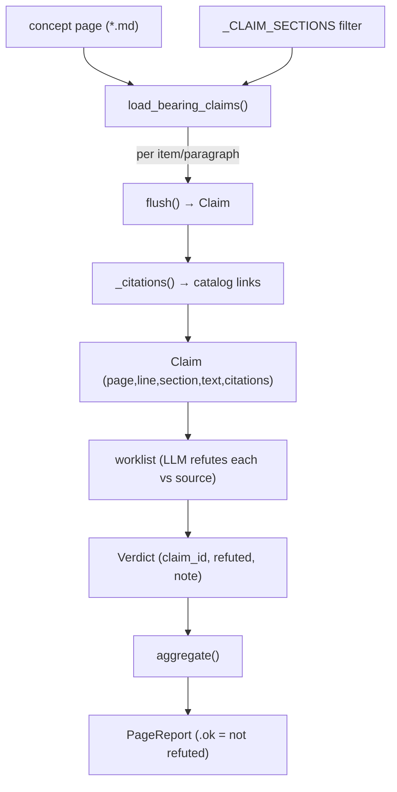

# wikify verify — adversarial claim verification (the correctness floor)

## Overview
The citation linter proves every claim on a wiki page *cites a real symbol*; it does **not** prove the claim is *true* — a page can be fully cited and still describe the mechanism backwards. `wikify verify` is the second, higher tier of trust: it extracts the load-bearing, falsifiable claims from a concept page as a flat worklist ([`load_bearing_claims`](../catalog/wikify/verify.md#load_bearing_claims)), hands that worklist to a skeptical LLM whose sole job is to *refute* each claim against the real source, then folds the returned verdicts into a pass/fail page report ([`aggregate`](../catalog/wikify/verify.md#aggregate)). The deliberate design idea is a **Python/LLM split**: the extraction and the tally are pure, reproducible Python (no model, no graph), while the one genuinely judgemental step — "is this sentence actually true?" — is the only part that calls a model. The module is intentionally tiny; its value is not an algorithm but a *contract* that makes "cited" and "correct" two separately enforceable gates.

## Diagram


## Design rationale (why it's built this way)
The whole module hangs on one sentence from its own header docstring: *"The citation linter proves every claim cites a real symbol; it does NOT prove the claim is true. A page can be fully cited and still describe the mechanism wrong."* That is the two-tier trust model made concrete — grounding (lint) is necessary but not sufficient; correctness (verify) is a separate, adversarial pass on top. Because the two gates are independent, a page can pass lint yet fail verify, which is exactly the failure mode the author wanted to surface.

The second decision is where to draw the human/machine line. Refutation *requires* reading source and reasoning about intent, so it is left to the LLM. But everything around it — *which* sentences are checkable, and *whether* the page passed — is made deterministic so the worklist and the tally are reproducible run-to-run. Hence [`load_bearing_claims`](../catalog/wikify/verify.md#load_bearing_claims) and [`aggregate`](../catalog/wikify/verify.md#aggregate) are plain string/list Python with no model call, matching the repo-wide invariant that "the Python/LLM split is hard."

A third, subtle choice: only some sections carry falsifiable claims. [`_CLAIM_SECTIONS`](../catalog/wikify/verify.md#_CLAIM_SECTIONS) is exactly `("Overview", "Design rationale", "Entry points", "Mechanism")` — the sections that assert *how the code works*. "Key data structures", "See also", etc. are skipped because they are structural, not falsifiable. And `> [!inferred]` blocks are excluded on principle: the [`load_bearing_claims`](../catalog/wikify/verify.md#load_bearing_claims) docstring calls them "the page's own hedged reading, not asserted fact, so there is nothing to refute." Verifying a hedge would be a category error.

> [!inferred]
> The section match uses `str.startswith(_CLAIM_SECTIONS)`, so a heading like "Mechanism (step-by-step)" matches on the "Mechanism" prefix. This tolerance for heading suffixes appears intentional (the tests use exactly that heading), but the source does not comment on it.

## Entry points
- [`verify`](../catalog/wikify/cli.md#verify) — the `wikify verify <slug>` CLI command, reached when a maintainer wants the adversarial worklist for a repo's wiki. It globs the silo's `concepts/*.md`, calls [`load_bearing_claims`](../catalog/wikify/verify.md#load_bearing_claims) on each, and echoes a per-page claim count (and, with `--page`, each claim's line, section, citation count, and truncated text). Its docstring states the intent plainly: *"List the load-bearing claims to adversarially verify (worklist for the verifier agent)… Deterministic; runs no model."* This is only the extraction half — the refutation is done by the separate `verify.md` skill agent, and [`aggregate`](../catalog/wikify/verify.md#aggregate) tallies its verdicts.
- [`load_bearing_claims`](../catalog/wikify/verify.md#load_bearing_claims) — the library entry point that turns one page file into an ordered `list[`[`Claim`](../catalog/wikify/verify.md#Claim)`]`. Every test in the suite drives it, and the CLI calls it per page. It is the single place that decides what counts as a checkable assertion.

## Mechanism (step-by-step)
1. **Scan the page line by line, tracking the current section.** [`load_bearing_claims`](../catalog/wikify/verify.md#load_bearing_claims) reads the file, splits into lines, and on each `## ` heading flushes any open block and records the new section name. If that section name does not start with one of [`_CLAIM_SECTIONS`](../catalog/wikify/verify.md#_CLAIM_SECTIONS), every line under it is skipped — this is how "Key data structures" and other structural sections contribute zero claims (asserted by `test_extracts_claims_from_claim_sections_only`).

2. **Drop hedged `> [!inferred]` blocks.** Still inside [`load_bearing_claims`](../catalog/wikify/verify.md#load_bearing_claims), a line containing `[!inferred]` sets an `in_inferred` flag; subsequent blockquote lines (`>` prefix) are flushed-and-skipped, and the flag clears on the first non-quote, non-blank line. Inference blocks are exempt by construction — there is nothing to refute in a hedge (`test_inferred_block_excluded`).

3. **Segment claims: one list item, or one prose paragraph.** A line matching [`_LIST_ITEM`](../catalog/wikify/lint.md#_LIST_ITEM) (a `-`, `*`, or `N.` bullet) starts a fresh claim; a blank line or a `#`/```` ``` ````/`|` line ends the current block; any other line is appended to the open block as a continuation. So a numbered Mechanism step folds its wrapped continuation lines into one claim (`test_mechanism_item_absorbs_continuation_line`), and two consecutive Overview lines with no blank between them become a single paragraph-claim (`test_overview_split_into_paragraphs_and_carries_citation`).

4. **Materialize each block into a `Claim` via the inner [`flush`](../catalog/wikify/verify.md#load_bearing_claims.flush) closure.** [`flush`](../catalog/wikify/verify.md#load_bearing_claims.flush) joins the accumulated block lines into one whitespace-normalized string, and — only if non-empty — appends a [`Claim`](../catalog/wikify/verify.md#Claim) carrying the [`page`](../catalog/wikify/verify.md#Claim.page) name, the 1-based start [`line`](../catalog/wikify/verify.md#Claim.line), the section, the text, and its extracted citations. Because it is a closure over `block`/`block_start` (via `nonlocal`), the segmentation loop can call it at every boundary without threading state through arguments. A final trailing `flush()` after the loop closes the last block.

5. **Extract the catalog citations each claim carries.** [`flush`](../catalog/wikify/verify.md#load_bearing_claims.flush) passes the claim text through [`_citations`](../catalog/wikify/verify.md#_citations), which runs the shared markdown-link regex [`_LINK`](../catalog/wikify/lint.md#_LINK) and keeps only targets that [`_is_symbol_link`](../catalog/wikify/lint.md#_is_symbol_link) accepts — i.e. a link into `catalog/…​.md` with a `#anchor`. Reusing the linter's own predicates means "what verify treats as a citation" is byte-for-byte the same as "what lint checks," so the two tiers never disagree about what a citation is.

6. **Give each claim a stable identity.** The [`id`](../catalog/wikify/verify.md#Claim.id) property returns `f"{page}:{line}"` — page name plus start line. This is the join key: the LLM verifier reports a [`Verdict`](../catalog/wikify/verify.md#Verdict) keyed by `claim_id`, and the tally matches verdicts back to claims by it (both aggregate tests construct `Verdict(claim.id, …)`).

7. **Fold verdicts into a page report.** [`aggregate`](../catalog/wikify/verify.md#aggregate) takes the page name, the claim list, and the LLM's verdicts, filters the verdicts down to those with [`refuted`](../catalog/wikify/verify.md#Verdict.refuted)`== True`, and returns a [`PageReport`](../catalog/wikify/verify.md#PageReport) with [`total`](../catalog/wikify/verify.md#PageReport.total)`= len(claims)` and that refuted list. The report's `ok` is simply `not self.refuted` — **any single refutation fails the whole page** (`test_aggregate_fails_page_on_any_refutation`; the clean case in `test_aggregate_passes_when_nothing_refuted`).

## Key data structures
- [`Claim`](../catalog/wikify/verify.md#Claim) — one falsifiable assertion: [`page`](../catalog/wikify/verify.md#Claim.page), [`line`](../catalog/wikify/verify.md#Claim.line), `section`, `text`, and `citations` (the catalog links it makes). Its [`id`](../catalog/wikify/verify.md#Claim.id) (`page:line`) is the correlation key against verdicts.
- [`Verdict`](../catalog/wikify/verify.md#Verdict) — the LLM's ruling on one claim: `claim_id`, [`refuted`](../catalog/wikify/verify.md#Verdict.refuted) (bool), and a free-text `note` (used to record the contradicting source `file:line`).
- [`PageReport`](../catalog/wikify/verify.md#PageReport) — the per-page rollup: `page`, [`total`](../catalog/wikify/verify.md#PageReport.total) claim count, and the [`refuted`](../catalog/wikify/verify.md#PageReport.refuted) verdict list, with `ok` derived as "nothing refuted."
- [`_CLAIM_SECTIONS`](../catalog/wikify/verify.md#_CLAIM_SECTIONS) — the tuple of section-name prefixes (`Overview`, `Design rationale`, `Entry points`, `Mechanism`) that gate which page regions produce claims at all.

## Dynamics (design intent)
The extraction is a single deterministic left-to-right pass with no lookahead: section state, an `in_inferred` flag, and one accumulating `block` are the entire machine, and the [`flush`](../catalog/wikify/verify.md#load_bearing_claims.flush) closure is invoked at every boundary. Ordering is preserved — claims come out in document order, so the CLI worklist reads top-to-bottom like the page. The refutation step between extraction and [`aggregate`](../catalog/wikify/verify.md#aggregate) is the LLM's; this module never calls a model, which is why the verdict-folding tests can construct `Verdict` objects by hand and assert an exact `PageReport`. The `verify.md` skill documents the contract on the model side: a claim is refuted "only if the source positively contradicts it," so verify is tuned to avoid false alarms and reserve failure for genuine errors.

## Edge cases
- **Heading-prefix matching.** [`_CLAIM_SECTIONS`](../catalog/wikify/verify.md#_CLAIM_SECTIONS) is matched with `startswith`, so "Mechanism (step-by-step)" counts but a section merely *containing* one of those words mid-string would not (the check is prefix-anchored on the section name).
- **Empty blocks never become claims.** [`flush`](../catalog/wikify/verify.md#load_bearing_claims.flush) appends a [`Claim`](../catalog/wikify/verify.md#Claim) only when the joined text is non-empty, so blank runs and boundary-only flushes are silently dropped.
- **Fences, tables, and sub-headings terminate a block.** A line starting with `#`, ```` ``` ````, or `|` flushes the current block, so a code fence or table inside a claim section ends the surrounding prose claim rather than being swallowed into it.
- **Uncited claims are still claims.** [`_citations`](../catalog/wikify/verify.md#_citations) may return an empty list; a claim with zero citations still enters the worklist (the CLI shows no `[N cite]` tag for it). Verify does not itself require citations — that is the linter's separate gate.
- **Verdicts for unknown claim_ids.** [`aggregate`](../catalog/wikify/verify.md#aggregate) filters verdicts purely on [`refuted`](../catalog/wikify/verify.md#Verdict.refuted); it does not check that each `claim_id` corresponds to a claim in the list, and [`total`](../catalog/wikify/verify.md#PageReport.total) is `len(claims)`, not `len(verdicts)`. A stray or duplicate refuting verdict would still fail the page.

## Open questions
- The `note` field on [`Verdict`](../catalog/wikify/verify.md#Verdict) is meant to carry the contradicting `file:line`, but nothing in this module parses or validates it — how (or whether) a downstream step surfaces those notes to the maintainer is outside the subgraph.
- Where [`aggregate`](../catalog/wikify/verify.md#aggregate) is actually invoked in the pipeline (the CLI `verify` command shown here only *extracts* the worklist) is not visible in this packet — the wiring from the skill agent's JSON verdicts back into [`aggregate`](../catalog/wikify/verify.md#aggregate)/[`PageReport`](../catalog/wikify/verify.md#PageReport) lives elsewhere.

## See also
- [wikify-lint](wikify-lint.md) — the *grounding* tier below this one (every claim must cite a real symbol); verify reuses its [`_LINK`](../catalog/wikify/lint.md#_LINK), [`_LIST_ITEM`](../catalog/wikify/lint.md#_LIST_ITEM), and [`_is_symbol_link`](../catalog/wikify/lint.md#_is_symbol_link) predicates.
- [wikify-coverage](wikify-coverage.md) — the *breadth* floor (set-difference over the symbol table so no module is dropped); coverage, lint, and verify are the three deterministic gates around LLM synthesis.
- [wikify-synthesis](wikify-synthesis.md) — the LLM step that *writes* the concept pages verify later tries to refute.
