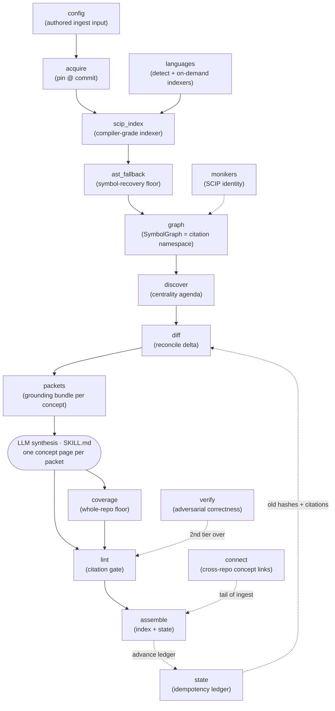
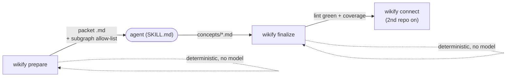

# wikify-repo — what it is and how it fits together

## In one paragraph
wikify-repo turns a code repository into a grounded, lint-clean markdown wiki that an
agent can answer internals questions from. Its central idea is a **hard split around one
LLM step**: everything before and after synthesis is deterministic, model-free Python, and
the model is *bracketed* rather than trusted. First the deterministic half pins the source
at an exact commit, runs a compiler-grade SCIP indexer, and folds the result into a
language-neutral **symbol graph** — the citation namespace every claim must resolve
against. It then *derives its own agenda* from the code's own centrality (no human concern
list), emits one self-contained grounding **packet** per concept, and stops. An agent reads
each packet and writes one concept page. The deterministic half then re-derives the graph
and *checks* the prose against it: a **citation linter** rejects any claim that cites a
symbol the packet didn't contain (the hallucination floor), a **coverage** pass guarantees
every module has a home (the breadth floor), and reconcile **state** makes the whole thing
incremental — a re-run with no source change is a proven no-op. The result is a wiki that is
compiled once and kept current, not re-derived per query.

## Core architecture
The ingest pipeline is a straight deterministic spine with exactly one LLM step in the
middle; four subsystems (config, state, verify, connect) cut across it.

The single organizing invariant, visible in the diagram, is the **Python/LLM boundary is a
file boundary**: `prepare` writes packet files and stops; the agent writes page files;
`finalize` reads the pages back and gates them. Two processes, an agent between, communicating
only through disk — which is why the deterministic stages are unit-testable without a model and
the synthesis step is swappable.

## Main concepts

### Pinned source + language-neutral SCIP grounding
Every command begins by resolving a repo URL or path to an on-disk tree at a *recorded commit
SHA* — the pin that makes every later `catalog/…#Symbol` citation stable rather than drifting
under a moving `HEAD` (submodule mode records the pin as a committed gitlink). A compiler-grade
frontend (scip-python, scip-clang, and on-demand scip-typescript/go/rust) then binds every
identifier to the exact symbol it resolves to; wikify writes no parser of its own. Because SCIP
monikers are global and language-neutral, multiple indexes *union* into one graph, so a new
language is a registry row plus a thin runner, not new graph code. See
[wikify-acquire](concepts/wikify-acquire.md), [wikify-scip_index](concepts/wikify-scip_index.md),
[wikify-languages](concepts/wikify-languages.md), and the identity scheme in
[wikify-monikers](concepts/wikify-monikers.md).

### The SymbolGraph — the citation namespace
The SymbolGraph is the substrate the whole tool stands on: one in-memory table of every global
symbol keyed by its stable moniker, plus reference-derived edges, assembled deterministically
with zero model calls. A page may only cite a symbol that lives here, and the linter resolves
every citation back against it — so the graph *is* the boundary between grounded claim and
hallucination. It is honest about its edges (a reference-scoping heuristic, since SCIP has no
"call" role) and crosses the hardest seam in OO/framework code — dynamic dispatch — with a
Class-Hierarchy-Analysis pass that adds separately-tracked `base → override` virtual edges. See
[wikify-graph](concepts/wikify-graph.md).

### Resilient completeness — orphan and AST recovery
A type checker can crash on the repo's most central types (pyright's `RangeError` on a huge
class like `Tensor`), which would silently drop a symbol *and* dangle every reference to it.
wikify closes the hole two ways: `build_graph` synthesizes a minimal node for any definition
occurrence whose `SymbolInformation` was dropped, and a deterministic AST pass re-derives a
missing file's definitions under the *exact same moniker scheme* so they re-unify by join. The
principle — enumeration, not traversal — is what makes ingestion of any real repo unable to lose
a subsystem to a choking indexer. See [wikify-ast_fallback](concepts/wikify-ast_fallback.md).

### Derived agenda — centrality decides what's worth explaining
Instead of a human hand-listing concerns, wikify computes the deep-page agenda from the code's
own topology: modules ranked by inbound fan-in, minus the test/vendor tail, each auto-seeded
from its own most-central symbols. This fixes the recorded failure where an early ingest
documented three hand-authored concerns and missed every model class. The pass is pure Python —
it selects and seeds; the LLM later writes, but never decides *which* pages exist. See
[wikify-discover](concepts/wikify-discover.md).

### The packet-bracketed CLI — grounding before synthesis, gating after
`wikify/cli.py` is the Typer front end that cuts the operation exactly where trust changes
hands. `prepare` does all the grounding (acquire, index, graph, agenda, diff) and emits one
packet — a relevance-bounded subgraph that is the *exact whitelist* of symbols the agent may
cite — then stops at the model boundary. `finalize` re-derives the graph and checks the written
pages. The only human-authored input is `config/<slug>.md`, itself a wiki page (YAML frontmatter
+ a `## Concepts` list) whose knobs decide *how a repo gets understood*. See
[wikify-cli](concepts/wikify-cli.md) and [wikify-config](concepts/wikify-config.md).

### Idempotent reconcile — delta-only, not re-derive-per-query
wikify hashes each symbol's (signature + body) and remembers which monikers every page cited. On
the next run it diffs fresh hashes against the recorded ledger: a page is stale *only* if a
symbol it actually cited changed or vanished. First build writes every page; a no-source-change
re-run is a proven no-op; a one-symbol edit rebuilds exactly the handful of pages that depended
on it. The ledger (`{ref, symbols, pages}`) is a single small JSON file, advanced only *past* the
lint gate so a failed build never poisons the baseline. See [wikify-diff](concepts/wikify-diff.md)
and [wikify-state](concepts/wikify-state.md).

### The citation linter — the hallucination floor
The linter is the deterministic build gate that makes the wiki trustworthy rather than merely
plausible. It enforces three rules without any NLP: every symbol citation must resolve through a
catalog's frontmatter map to a real moniker; every list item in the load-bearing sections
(`Entry points`, `Mechanism`) must carry a citation; and no page may cite a symbol outside the
packet it was synthesized from — the mechanism that catches an *invented* symbol. A grounding rule
that lived in the prompt would share the failure mode it prevents, so verification is pure code.
`finalize` refuses to assemble the wiki if any error remains. See
[wikify-lint](concepts/wikify-lint.md).

### The whole-repo coverage floor
Concept synthesis is deliberately selective (depth at the cost of dropping untouched subsystems);
coverage is the deterministic floor under it. It emits one catalog page per module — the single
citable home for every symbol — then classifies each as *deep* (cited by a concept page),
*catalog-only*, or *unrepresented*. Crucially it is a **set-difference over the SCIP symbol
table, not a graph walk**: it enumerates what SCIP already found rather than trying to *reach*
code by traversal (which dies at the dynamic-dispatch seam). The catalogs are also the linter's
resolution target, so coverage and lint are two sides of one anti-hallucination story. See
[wikify-coverage](concepts/wikify-coverage.md).

### Higher tiers — adversarial verify and cross-repo connect
Two optional passes sit above the per-repo build. `verify` is the correctness tier: lint proves a
claim *cites* a real symbol but not that it is *true*, so verify extracts each falsifiable claim
and hands it to a skeptical LLM whose only job is to refute it against the source. `connect` is
the cross-repo tier: given several silos, it answers "which repos implement the same concept" —
materialized inline as ordinary wiki markdown (a down-block on the host concept page, an up-link
on each silo page), human-selected, with the pages themselves as the connection state. See
[wikify-verify](concepts/wikify-verify.md) and [wikify-connect](concepts/wikify-connect.md).
(A parallel [wikify-docs](concepts/wikify-docs.md) track ingests prose through the same
`prepare`→synthesize→`finalize` shape, swapping the grounding anchor from a SCIP symbol to a
document `#section`.)

## How a request flows
The ingest spine is four commands with one agent step in the middle.

1. **`prepare` (Stages 0–4, deterministic).** [`acquire`](concepts/wikify-acquire.md) pins the
   source at a commit; [`scip_index`](concepts/wikify-scip_index.md) runs the right indexers
   (chosen by [`languages`](concepts/wikify-languages.md)) and, with
   [`ast_fallback`](concepts/wikify-ast_fallback.md), folds everything into the
   [`graph`](concepts/wikify-graph.md); [`discover`](concepts/wikify-discover.md) derives the
   centrality agenda; [`diff`](concepts/wikify-diff.md) computes the build/rebuild/leave delta
   against [`state`](concepts/wikify-state.md); and one grounding **packet** is written per to-do
   concept. No model has been called.
2. **Agent synthesis (the one LLM step).** Guided by `SKILL.md`, the agent reads each packet and
   writes one concept page under `concepts/`, citing only symbols in the packet's subgraph.
3. **`finalize` (Stage 6, deterministic).** [`coverage`](concepts/wikify-coverage.md) emits the
   module catalogs *first* (the symbol homes citations resolve against), then
   [`lint`](concepts/wikify-lint.md) gates every page and `finalize` refuses to assemble on any
   error. On green it records the fresh hashes and pin into [`state`](concepts/wikify-state.md)
   and writes the indexes.
4. **`connect` (Stage 7, from the second repo on).** [`connect`](concepts/wikify-connect.md)
   proposes which concepts have implementations across silos; a human picks which to wire, and it
   writes the inline cross-repo links. `verify` may be run any time as an adversarial correctness
   pass over the linted pages.

Re-running the whole spine *converges*: `diff` + `state` make a no-change run a no-op and rebuild
only the delta after a commit bump.

## Map of the wiki
Route by what you're asking:

- **"How is a claim kept honest / what stops hallucination?"** →
  [wikify-lint](concepts/wikify-lint.md) (what's *said*) and
  [wikify-coverage](concepts/wikify-coverage.md) (what's *represented*);
  [wikify-verify](concepts/wikify-verify.md) for correctness beyond grounding.
- **"How does grounding work / what is a symbol's identity?"** →
  [wikify-graph](concepts/wikify-graph.md), [wikify-scip_index](concepts/wikify-scip_index.md),
  [wikify-monikers](concepts/wikify-monikers.md).
- **"What happens when the indexer fails / for other languages?"** →
  [wikify-ast_fallback](concepts/wikify-ast_fallback.md),
  [wikify-languages](concepts/wikify-languages.md).
- **"How does it decide what to document, and stay cheap to update?"** →
  [wikify-discover](concepts/wikify-discover.md), [wikify-diff](concepts/wikify-diff.md),
  [wikify-state](concepts/wikify-state.md).
- **"What do I run, and how is a repo configured/pinned?"** →
  [wikify-cli](concepts/wikify-cli.md), [wikify-config](concepts/wikify-config.md),
  [wikify-acquire](concepts/wikify-acquire.md).
- **"How are repos cross-linked / how is prose ingested?"** →
  [wikify-connect](concepts/wikify-connect.md), [wikify-docs](concepts/wikify-docs.md).

For the exhaustive per-module symbol index (signatures, source-line links, importance-ranked
uses-by), see [`catalog/`](catalog/). For the full concept table and the other silos in this
survey, start at the top-level [`index.md`](../../index.md).

## Code-comprehension surfaces
This is the survey's lens: the parts that make wikify-repo a *code-comprehension* tool, and the
axes on which it would be compared to graphify / understand-anything.

- **Symbol-graph + SCIP grounding.** Nodes are frontend-resolved monikers, not name matches, so
  cross-file and cross-language identity is exact and multi-language repos union cleanly — versus
  AST/name-matching graphs that confuse `Foo.bar` with an unrelated `bar`.
  [wikify-graph](concepts/wikify-graph.md), [wikify-scip_index](concepts/wikify-scip_index.md),
  [wikify-monikers](concepts/wikify-monikers.md).
- **The citation-lint gate (anti-hallucination).** A claim that cannot be tied to an indexed
  symbol is *rejected at build time* — a binary, offline gate, not a lower-confidence annotation.
  [wikify-lint](concepts/wikify-lint.md).
- **Whole-repo coverage floor.** Representation is a set-difference over the symbol table, so no
  subsystem is silently dropped by selective synthesis — the axis where query-driven tools that
  only document what they touched fall short. [wikify-coverage](concepts/wikify-coverage.md).
- **Dynamic-dispatch recovery.** CHA virtual edges cross the `nn.Module.__call__` → override seam
  that dead-code and static call-graph tools structurally miss.
  [wikify-graph](concepts/wikify-graph.md).
- **Graceful indexer failure.** Orphan/AST recovery keeps the repo's *most central* types (the
  ones big enough to crash a type checker) in the wiki instead of dropping them.
  [wikify-ast_fallback](concepts/wikify-ast_fallback.md).
- **Incremental reconcile.** Work is proportional to the *cited* delta, not repo size or query
  count. [wikify-diff](concepts/wikify-diff.md), [wikify-state](concepts/wikify-state.md).
- **Adversarial verify.** A separate correctness tier on top of grounding — cited ≠ correct.
  [wikify-verify](concepts/wikify-verify.md).
- **Cross-repo connect.** Comprehension that spans repos: "who implements X" as inline,
  human-curated wiki links. [wikify-connect](concepts/wikify-connect.md).
